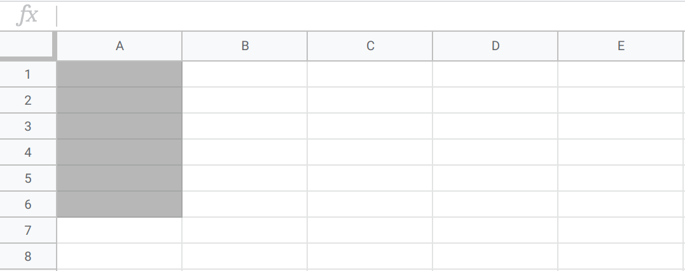
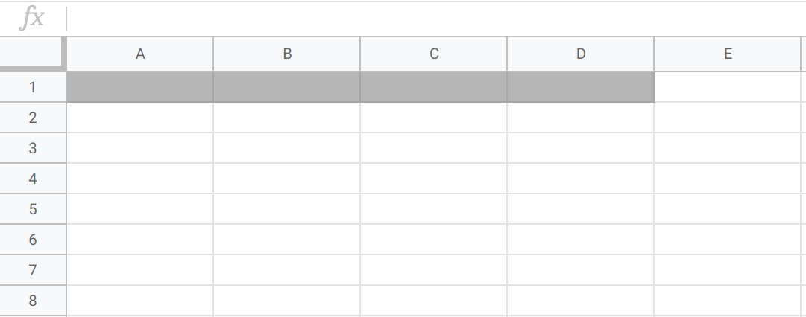

.. Copyright (C)  Google, Runestone Interactive LLC
   This work is licensed under the Creative Commons Attribution-ShareAlike 4.0
   International License. To view a copy of this license, visit
   http://creativecommons.org/licenses/by-sa/4.0/.

Count and Sum
=============

Two of the most basic but most used statistics are the count and sum of a
dataset.

.. admonition:: Count Definitions

   The **count** of a dataset is the number of observations in the dataset. This
   applies to all variables.

.. admonition:: Sum Definition

   The **sum** of a dataset is the addition of all values in the dataset. This
   applies only to quantitative variables.

The reason that the count is so important is that it can be an indication of how
useful the dataset is. For example, suppose you’re trying to find the average
height of students at your college of 800 people, so you conduct a survey
collecting students’ heights. If your survey contains only 2 heights, then using
these results to calculate an average won’t be very useful, since this summary
statistic is only representative of 2 students. If, however, your survey
contains 600 heights, calculating an average from these results will be more
reliable, since this statistic represents 600 of the 800 students.

Another place where you could use count is when planning a homework party. 
You are throwing a homework party and asked your friends to RSVP if they are 
attending and submit their food preferences through a survey. Knowing how many 
people will be attending would be very helpful to you when you go grocery 
shopping for snacks! In this case, taking the *count* of the spreadsheet created 
from the survey would give you this useful information.

As for sum, let's consider a scenario in which you are the owner of a small, 
local coffee shop. As a small business owner, daily sales are really important 
to you so you know how your business is doing, and if there has been growth! 
You have a spreadsheet of all of the sales for a specific day. You can use *sum* 
on this data to get the total amount of money you made that day in sales! 
You can also use *count* to get the number of sales (which is basically the 
number of customers you got that day), to see if your business is doing well.

Calculating these statistics in Sheets is fairly straightforward. For these and
other statistics, you’ll need to know **cell range notation**. To refer to a
range of cells in Sheets, type the first cell in the range and the last cell in
the range, separated by a colon. For example:

-   “A1” refers to cell A1

.. https://screenshot.googleplex.com/F0X547QtW1Y

.. image:: figures/cell_A1.png
   :align: center
   :alt: Spreadsheet with cell A1 (column A, row 1) highlighted

-   “A1:A6” means all cells in the A column from rows 1 through 6

.. https://screenshot.googleplex.com/f9Vqz8V3u7d

-   “A1:D1” means all cells in the 1 row from columns A through D

.. https://screenshot.googleplex.com/bHAPFd3DC4O

-   “A1:D6” means all cells in rows 1 through 6 and columns A through D

.. https://screenshot.googleplex.com/7Eni7pw80hL

.. image:: figures/cells_A1_D6.png
   :align: center
   :alt: Spreadsheet with cells in rows 1 through 6 and columns A through D 
         highlighted

.. admonition:: Count and Sum Sheets Syntax

   -   The ``COUNT`` function returns the number of non-empty cells in a range.
       The syntax is ``=COUNT(cell range)``.

   -   The ``SUM`` function returns the addition of a cell range. The syntax is
       ``=SUM(cell range)``.

Example: Spotify Premium
------------------------

You and your roommates have been wanting to get `Spotify Premium on a family
plan`_ for quite a while. There are five of you, and you know that the plan
allows up to six accounts for $15 per month. However, you are all on a very
tight college-student budget, and have very little cash to spare. You have each
gone through your expenses and have narrowed down exactly how much money you
each have to spare per month. Now you want to know, if you pool your money
together, whether you will have enough for Spotify Premium!

You could use a calculator, but you prefer storing the data in a sheet, because
if any values were to change in the future, you could easily update the sheet.
First, you input all of your spare money into the sheet. (Note you can click the
“$” symbol to format the numbers as currency.)

.. TODO(raskutti): Embed
   https://docs.google.com/spreadsheets/d/17ve2CvqFOhyMUGO13S69duQEExW47bWBLtme4pONiWY/edit#gid=2040847965

First, use the ``COUNT`` function to verify that there are five rows in this
dataset, one for each person on the plan.

Now, use the ``SUM`` function to add up all the values.

Alas, you and your roommates are agonizingly short of the required $15 per
month! You’ll have to keep trying to save just 90 cents more per month to have
enough for Spotify Premium.

.. TODO(raskutti): Embed screencast.

.. fillintheblank:: check_if_enough_for_spotify_premium

   Your roommate who could previously contribute only $1 has had some luck! Her
   brother has decided to pay more of the Netflix family membership (since he
   watches more anyway), so she can now contribute $2.50. How much money can you
   all pool together now? |blank|

   - :\$15.60: Correct
     :\$15.6: Remember to use two decimal places.
     :15.6: Remember to include the “$” symbol.
     :15.60: Remember to include the “$” symbol.
     :x: Incorrect

.. fillintheblank:: print_if_enough_for_spotify_premium

   Suppose cell B1 contains the amount of money between you and your friends.
   Write a formula to check if this amount is enough for Spotify Premium. If it
   is enough, the result should evaluate ``TRUE``, otherwise ``FALSE``.

   - :=IF\(B1>=15, TRUE, FALSE\): Correct
     :=IF\(B1>15, TRUE, FALSE\): Incorrect: Remember to print ``TRUE`` if B1=15.
     :IF\(B1>=15, TRUE, FALSE\): Incorrect: Formulas must start with ``=``.
     :x: Incorrect

Overview
========
Count and sum are just two of many useful basic descriptive statistics, and 
could be helpful in understanding a dataset. Use these two statistics when 
you want to get a general idea of your dataset quickly!

.. _Spotify Premium on a family plan: https://www.spotify.com/us/family/
