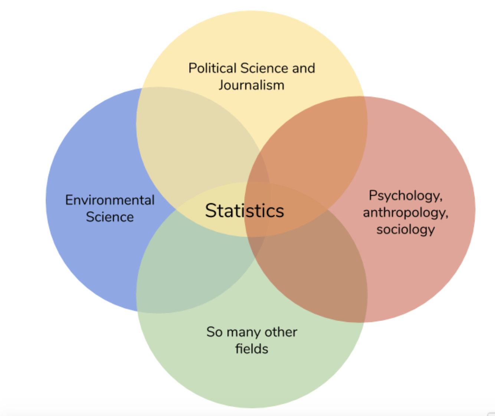

.. Copyright (C)  Google, Runestone Interactive LLC
   This work is licensed under the Creative Commons Attribution-ShareAlike 4.0
   International License. To view a copy of this license, visit
   http://creativecommons.org/licenses/by-sa/4.0/.

Introduction
============

Statistics are everywhere: in news articles, sports, government reports, 
research papers, just to name a few. Using statistics is so popular because
they make claims sound more credible. Consider the following two sentences.

1. “Americans are spending a lot of time watching TV.” 
2. “Adult Americans are spending five hours and four minutes on average watching TV.” 

Although both sentences make the same point, the statistic used in sentence 2
makes it a more powerful statement. That statistic happens to be true (source), 
but the media and other sources will often misinterpret data to support the claim
they’re trying to make. Since the claims they make often impact the decisions we
make, it’s important for us to be able to critically assess those statistics. And
on top of that, being able to perform statistical analyses gives us the powerful 
ability to create data-driven statistics that support our own claims or drive our
own decision-making in any field of work or study!

Here’s just a few examples of how a variety of fields use statistics:

   -  Journalists use data to substantiate their reporting.
   -  Political leaders use data to inform their decisions.
   -  Sports teams and businesses lean heavily on statistical algorithms for their actions.
   -  Psychologists use statistics to give meaning to the data they collected.
   -  So many other fields use statistics with so many other uses!

This next chapter explains the basics of statistics, and how to use them in Sheets.
