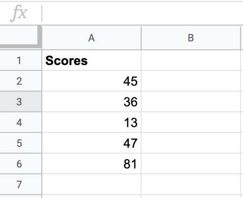
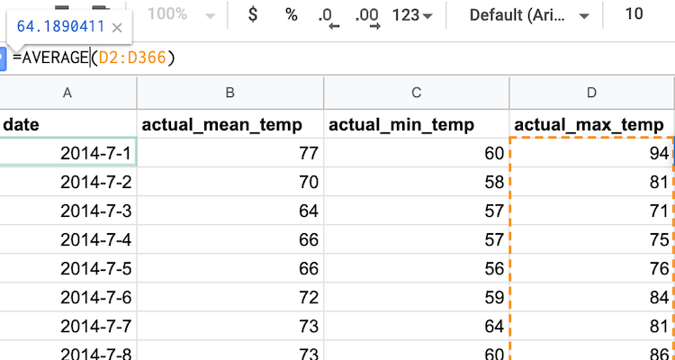

.. Copyright (C)  Google, Runestone Interactive LLC
   This work is licensed under the Creative Commons Attribution-ShareAlike 4.0
   International License. To view a copy of this license, visit
   http://creativecommons.org/licenses/by-sa/4.0/.

.. _measures_of_center:

Measures of Center
==================

Some of the most widely used statistics are “measures of center” which
describe where the data is centered. This type of statistic is
extremely useful, as it allows you to summarize all the data with one
number/category. (Statistics like this are called **summary statistics**.)

You can think of a measure of center as a “best guess”. For example, if you had
one guess at the value of a new observation (e.g. the height of a new student
who joins the class), what would you guess?

.. admonition:: The Three Measures of Center

   The **mean** is the standard form of averaging.

   -   The mean is calculated by adding up all the values in the data, and
       dividing by the number of data points.
   -   The mean is only defined for quantitative variables.

   The **median** is the middle value.

   -   If you order all the data points from lowest to highest, the median is
       the value that sits directly in the middle.
   -   If there are two “middle values” (which occurs when there is an even
       number of data points), the median is halfway between the two values.
   -   The median is only defined for quantitative variables.

   The **mode** is the most commonly occurring value in the data.

   -   If you count the number of times each category occurs, the mode is the
       category with the highest count.
   -   Sometimes the mode is referred to simply as the most common value.
   -   A dataset can have multiple modes - if multiple categories have the same
       count, and this count is higher than those of the other categories.
   -   The mode is only defined for categorical variables.

When handling different types of data, different measures of center can tell
you more useful information than others can. Whenever you have a categorical
variable, the mode is your only choice for a measure of center. However, with
quantitative variables, either the mean or median can be used to describe the
“best guess”. You can begin building intuition about which of the three measures
of center is most appropriate through some examples:

.. mchoice:: new_student_birth_country

   You have a dataset on the birth country of all of your students. A new
   student joins your class, and you want to take a “best guess” at where she
   comes from. What measure of center would you use?

   - Mean

     - Incorrect: What kind of variable is birth country?

   - Median

     - Incorrect: What kind of variable is birth country?

   - Mode

     + Correct

.. image:: figures/sea.JPG
  :align: center

.. shortanswer:: cost_of_living_seattle_new_york

   You want to do a study on whether it is more expensive to rent an apartment
   in Seattle or in New York City. What data would you try to collect to answer
   this question and what summary statistics would be useful?

The mean, median, and mode functions in Sheets all have the exact same syntax as
the ``MIN`` and ``MAX`` functions, defined earlier
:ref:`here<minimum_and_maximum_dice_roll>`. You can either input all relevant
values into the function separated by commas, or you can define a cell range.
The latter is far more convenient in most cases.

.. admonition:: Measures of Center in Sheets

   **The AVERAGE function returns the mean of a set of values.** You can either
   input several values separated by a comma (e.g.
   ``=AVERAGE(value1, value2, value3)``), or you can input a range of cells of
   which you want to know the mean (e.g. ``=AVERAGE(A1:A10)``).

   Note that mean is called AVERAGE in Sheets. It is nevertheless recommended to
   use the term “mean” to describe this measure of center wherever possible
   (e.g. in reports and articles), to disambiguate different measures of center.
   `See here for a longer discussion.`_

   **The MEDIAN function returns the median of a set of values.** You can either
   input several values separated by a comma (e.g.
   ``=MEDIAN(value1, value2, value3)``), or you can input a range of cells of
   which you want to know the median (e.g. ``=MEDIAN(A1:A10)``).

   **The MODE function returns the mode of a set of values.** You can either
   input several values separated by a comma (e.g.
   ``=MODE(value1, value2, value3)``), or you can input a range of cells of
   which you want to know the mode (e.g. ``=MODE(A1:A10)``).

Now that you know the functions for calculating mean, median, and mode in
sheets, put your newfound knowledge to the test. Say you are helping
grade for a class and your professor has given you a list of student scores
for the last exam. How would you calculate the median and mode in sheets?

Example: Test Scores
--------------------

.. TODO(raskutti): Embed
   https://docs.google.com/spreadsheets/d/17ve2CvqFOhyMUGO13S69duQEExW47bWBLtme4pONiWY/edit#gid=1025947509

.. fillintheblank:: mean_test_scores

   Given the sheet above, write a formula for the mean of the test scores.
   |blank|

   - :=MEAN\(A1\:A6\): Correct
     :MEAN\(A1\:A6\): Incorrect: Remember formulas must start with ``=``.
     :x: Incorrect

.. fillintheblank:: median_test_scores

   Given the sheet above, write a formula for the median of the test scores.
   |blank|

   - :=MEDIAN\(A1\:A6\): Correct
     :MEDIAN\(A1\:A6\): Incorrect: Remember formulas must start with ``=``.
     :x: Incorrect

Now that you have some practice with creating formulas to calculate median and
mean, you can start to build some intuition as to what the difference between
these measures of center may be. Say someone asked you for your advice about
where they wanted to move after graduation and that weather was a major concern
for them. You want to give them a summary statistic to accurately summarize the
data. Would the mean or median make more sense? You will walk through an example
to find out.

.. _measures_of_center_weather:

Example: Weather
----------------

First, calculate and compare the mean maximum daily temperature in Seattle
and New York City (NYC). The data for the two cities’ temperatures are in two
different sheets.

.. _Temperature Spreadsheet.: https://docs.google.com/spreadsheets/d/17ve2CvqFOhyMUGO13S69duQEExW47bWBLtme4pONiWY/edit#gid=0
.. TODO(raskutti):
   https://docs.google.com/spreadsheets/d/17ve2CvqFOhyMUGO13S69duQEExW47bWBLtme4pONiWY/edit#gid=0

The “actual_max_temp” is in column D, and tells you the maximum daily
temperature. Calculating the mean of that is as simple as using the ``AVERAGE``
function on that cell range as shown in the image below. From this, you can see
that the mean maximum temperature in Seattle is 64.2 degrees.

You can now switch to the NYC sheet and use the exact same formula.

.. fillintheblank:: nyc_mean_max_temp

   What is the mean maximum temperature in NYC? (Use 1 decimal point.) |blank|

   - :61.7: Correct
     :x: Incorrect

This example indicates that on average, over the course of twelve months,
Seattle and NYC have fairly similar temperatures. Does this seem right to you?
In reality, for a given time of year, the temperatures of Seattle and NYC
usually differ significantly. NYC winters are considerably colder than Seattle
winters, and NYC summers tend to be warmer than Seattle summers. When averaged
over twelve months, however, these effects “cancelled out”, and, when looking
just at the mean, it may look as if Seattle and NYC have similar temperatures
all year round. Sometimes summary statistics can over-summarize the data. We
will learn more about how to take this into account in the
:ref:`section below on measures of spread<measures_of_spread>` section. In the
meantime, you can look closer into investigating the median of this data.

.. shortanswer:: nyc_and_seattle_median_temperatures

   Calculate the median maximum temperatures for Seattle and NYC.
   Do these statistics tell a different story? Why?

Right now, the mean and median may not seem all that different. However,
there are cases where the median is more useful than the mean. The next section
on outliers will explain this difference through an example on family income.

.. _See here for a longer discussion.: https://www.quora.com/What-is-difference-between-the-mean-and-the-average
