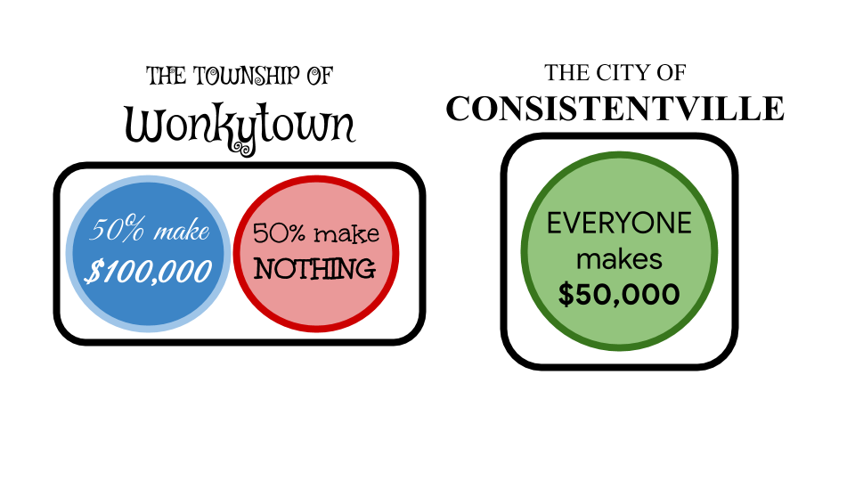
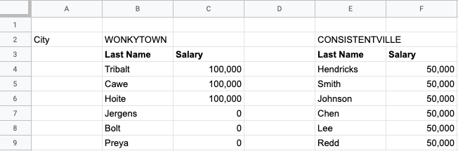
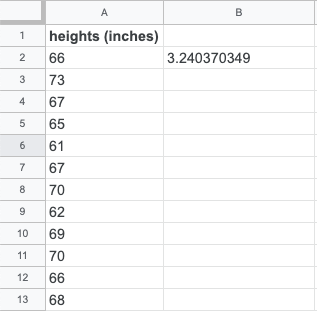

.. Copyright (C)  Google, Runestone Interactive LLC
   This work is licensed under the Creative Commons Attribution-ShareAlike 4.0
   International License. To view a copy of this license, visit
   http://creativecommons.org/licenses/by-sa/4.0/.

.. _measures_of_spread:

Measures of Spread
==================

Measures of center are very useful for giving you a “best guess” at a variable.
But how useful are those guesses?

In this section, you will learn about **standard deviation** and **variance**.
These are the most common "measures of spread" statistics, since they indicate 
how spread out a dataset is. These statistics are also used to inform how
useful other statistics (such as the mean) are for making predictions.

Trying to guess the value of a variable that doesn’t change much is a lot easier 
than trying to guess the value of a variable that can change drastically. To 
take an extreme example, suppose there are two very different cities next to 
each other. In “Consistentville”, everyone has the same yearly salary of 
$50,000. In “Wonkytown” exactly half the people have a yearly salary of 
$100,000, and the other half are unemployed.

.. https://docs.google.com/presentation/d/11O5DHFz8OJn2cIiDnSHd0hfAmY1HDaFQKtGBd3HYCmQ/edit?usp=sharing

.. https://docs.google.com/presentation/d/11O5DHFz8OJn2cIiDnSHd0hfAmY1HDaFQKtGBd3HYCmQ/edit?usp=sharing

Above is an example dataset for 6 people in each of the towns and their 
salaries.

.. fillintheblank:: mean_salary_in_consistentville

   What is the mean salary in Consistentville? (Give your answer in dollars.)
   |blank|

   - :(\$|)50(,|)000: Correct
     :x: Incorrect

.. fillintheblank:: mean_salary_in_wonkytown

   What is the mean salary in Wonkytown? (Give your answer in dollars.) |blank|

   - :(\$|)50(,|)000: Correct
     :x: Incorrect

Since all residents of Consistentville make the same salary of $50,000, the mean
salary is simply $50,000. Now since exactly half the residents of Wonkytown make
$100,000 and the other half make $0, it should make some intuitive sense that
the mean salary in Wonkytown is also $50,000. So “on average,” residents of
Consistentville and Wonkytown make the same salary.

.. shortanswer:: random_resident_salary

   If you take a random resident of Consistentville, what would you guess their
   salary to be? Do you expect to be correct? What about in Wonkytown?

If you take a random resident of Consistentville and guess their salary to be
the mean of $50,000, you would be right every single time. However, if you did
the same in Wonkytown, you would be wrong every single time! Not only would your
guess be wrong, it would be either $50,000 below or $50,000 above their true
salary, both of which are way off! So in this case, while the mean was an
extremely effective “best guess” in Consistentville, it was not so useful in
Wonkytown.

In a city like Wonkytown, it is pretty hard to form a “best guess”. That’s where
measures of spread come in. A measure of spread statistic doesn’t refine a
measure of center, but it can tell you how useful that measure of center is. The
most common measure of spread is called the standard deviation.

.. admonition:: Standard Deviation Definition

   **The standard deviation is a measure of how spread out data points in a
   dataset are.** A low standard deviation means the data points in the dataset
   are generally close together. A high standard deviation means the data points
   in the dataset are generally far apart.

By itself, the standard deviation can help you estimate how good your “best
guess” is. It is even more useful when comparing two different datasets, as it
can tell you which dataset is more spread out. In the case of comparing
Consistentville and Wonkytown, knowing the standard deviation alone would tell
you that in Consistentville everyone makes the same salary, while in Wonkytown
the salaries differ from the mean on average by $50,000. If you were guessing
salaries, knowing the standard deviation would help you make a much more
informed guess!

Standard Deviation in a Histogram
---------------------------------

Look at the side-by-side histogram below. It contains two variables (one in red
and one in blue) with the same mean, but one with a much higher standard
deviation than the other.

.. https://docs.google.com/spreadsheets/d/17ve2CvqFOhyMUGO13S69duQEExW47bWBLtme4pONiWY/edit#gid=1702521484

.. image:: figures/standard_deviation_in_histograms.png
   :align: center
   :alt: A histogram of two variables. Variable two is concentrated in a smaller range across the horizontal axis with high values, while variable one is spread out across the horizontal axis with lower vertical axis values.

.. mchoice:: standard_deviation_in_histograms

   Which variable do you think has a higher standard deviation?

   - Red

     - Incorrect: The red values are all clustered close together around 0.

   - Blue

     + Correct. The blue values are spread out over a wide range.

.. _measures_of_spread_weather:

Example: Weather
----------------

Returning to the comparison of weather in Seattle and NYC, this example shows
you how to calculate the standard deviation of a dataset in Sheets. Again, you
will use the daily maximum temperature column.

.. admonition:: Standard Deviation in Sheets

   **The STDEVP function calculates the standard deviation of a dataset.** As
   with previous summary statistic functions, you can either input several
   values separated by a comma (e.g. ``=STDEVP(value1, value2, value3)``), or
   you can input a range of cells of which you want to know the mean (e.g.
   ``=STDEVP(A1:A10)``).

Note that there are several variants of the ``STDEVP`` function in Sheets. In
this section, you can always use the ``STDEVP`` function. If you are interested
in the difference between the different variants, `this thread goes into some
detail on the practical differences`_, and `this thread goes into the
mathematical theory behind the difference`_. In practice, there is not much
numeric difference between the different functions.

Finding the standard deviation of the maximum daily weather for Seattle is
almost the same as finding the average, except you use the ``STDEVP`` function.
This tells you that the standard deviation of the maximum daily temperature in
Seattle is 12.9 degrees.

.. TODO(raskutti): Embed screencast.

.. fillintheblank:: standard_deviation_seattle_max_temp

   What is the standard deviation of the maximum daily temperature of NYC? (Use
   1 decimal point in your answer.) |blank|

   - :19.4: Correct
     :x: Incorrect

You have already seen :ref:`earlier<measures_of_center_weather>` the mean
temperatures for Seattle and NYC differ only by 3 degrees. The standard
deviation shows you that the variability of the maximum daily temperature is
almost 7 degrees (more than 50%) higher in NYC compared to Seattle.

This example should illustrate that knowing the mean sometimes isn’t enough.
Just using the mean, you may have believed that Seattle and NYC have very
similar temperature all year round. Knowing the standard deviation alongside the
average, however, tells you that while Seattle and NYC have similar mean
temperatures, there is much higher year-round variability in NYC. If you then
add in the knowledge of the maximum and minimum temperatures of both cities, you
would have a pretty good idea of the year-round temperature seasonality of both
cities.

Extension: Variance
-------------------

This material is intended as a reference for those who are curious. It
describes, with more theory and mathematics, why variance is a crucial concept
for mathematicians and statistics.

While standard deviation is more widely used, it is actually derived from
another measure of spread, called the variance. More precisely, **the standard
deviation is the square root of the variance**. Many `probability
distributions`_ are defined in terms of mean and variance (not standard
deviation). You can find another detailed explanation in `this article`_.

.. admonition:: Variance Definition

   The variance is the mean of the squared deviation (or squared difference)
   from the variable to its mean.

That is a lot of words. A better way to understand it is to outline the
procedure for calculating the variance of a dataset, call it dataset A.

1.  Calculate the mean of dataset A.
2.  Find the difference between the mean of dataset A and each value in dataset
    A. These values form a new dataset, dataset B.
3.  Square all the values in dataset B. These values form a new dataset, dataset
    C.
4.  The mean of dataset C is the variance of dataset A.

More intuitively, dataset B shows you how far points in dataset A are from the
center of dataset A. Squaring the values in dataset B is a way to make the
differences all positive (to make sure values above and below the mean are
equally “far”). Then the mean of the squared differences in dataset C tells you
“on average” how far the points in A are from the mean.

.. admonition:: Variance in Sheets

   **The VARP function calculates the variance of a dataset.** As with previous
   summary statistic functions, you can either input several values separated by
   a comma (e.g. ``=VARP(value1, value2, value3)``), or you can input a range of
   cells of which you want to know the mean (e.g. ``=VARP(A1:A10)``). (Note:
   :ref:`the same caveat<measures_of_spread_weather>` as with ``STDEVP`` applies
   to ``VARP``.)

In Consistentville, every salary is $50,000 and the mean is $50,000. Therefore,
all values in dataset B are zero, so all values in dataset C are zero. The mean
of this all-zero dataset is zero, so the variance of salary in Consistentville
is zero. (This happens if and only if all values in the dataset are the same.)

In Wonkytown, every salary is $50,000 away from the mean (either above or
below). Therefore, all values in dataset B are $50,000 so all values in dataset
C are the square of that, 2,500,000,000, in units of dollars squared. The mean
of dataset C, and therefore the variance of salary in Wonkytown, is this same
value.

One downside of the variance is its unit of measure. Since it involves squaring
the values of dataset B, the unit of measure of the variance is always the
squared unit of measure of the initial dataset (dataset A). For example, if
considering the salaries of Consistentville or Wonkytown, the variance would be
in squared dollars. This might not be very useful, and this is how the standard
deviation (square root of the variance) came to be widely used. The purpose of
the standard deviation is to express the variance but in the same unit as the
data. The standard deviations of the salaries in Consistentville and Wonkytown
are measured in dollars.

In Consistentville, the variance is zero, so the standard deviation is the
square root of zero, which is also zero. In Wonkytown, the variance is
2,500,000,000 dollars squared, so the standard deviation is the square root of
this, which is (you may have guessed it) $50,000. Both of these findings tell
you just how far you can expect your guess to be from the mean: $0 in
Consistentville, $50,000 in Wonkytown.

Note that it is not always possible to calculate the variance and standard
deviation manually. Usually, you will have to use a tool such as Sheets.

Example: Student Heights
------------------------

Suppose you have this dataset containing the heights of students in a class.

First, use the method of calculating variance (above) to calculate the variance
and standard deviation of this dataset. Then, you can confirm your answers 
using ``VARP`` and ``STDEVP``.

.. fillintheblank:: variance_of_students_heights

   What is the variance of the heights among these students? (Use 1 decimal
   point in your answer). |blank|

   - :10.5: Correct
     :x: Incorrect

.. fillintheblank:: standard_deviation_of_students_heights

   What is the standard deviation of the heights among these students? (Use 1
   decimal point in your answer). |blank|

   - :3.2: Correct
     :x: Incorrect

Further Application
--------------------

There are real-world applications that these measures of center can be used for.
`This exercise`_ explores the salaries of professional athletes with measures of
spread as well as other statistics. Try this on your own in Sheets if you are
interested in getting more experience with any of the previously learned
statistics.

.. _this thread goes into some detail on the practical differences: https://www.quora.com/What-is-the-difference-between-sample-standard-deviation-and-population-standard-deviation
.. _this thread goes into the mathematical theory behind the difference: https://math.stackexchange.com/questions/15098/sample-standard-deviation-vs-population-standard-deviation
.. _probability distributions: https://en.wikipedia.org/wiki/Probability_distribution
.. _this article: https://www.mathsisfun.com/data/standard-deviation.html
.. _This exercise: https://www.ck12.org/statistics/Applications-of-Variance-and-Standard-Deviation/rwa/Variance-of-a-Data-Set/
