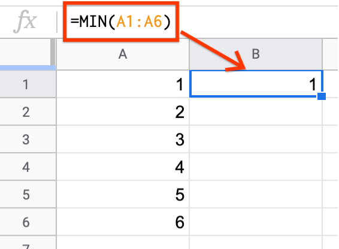
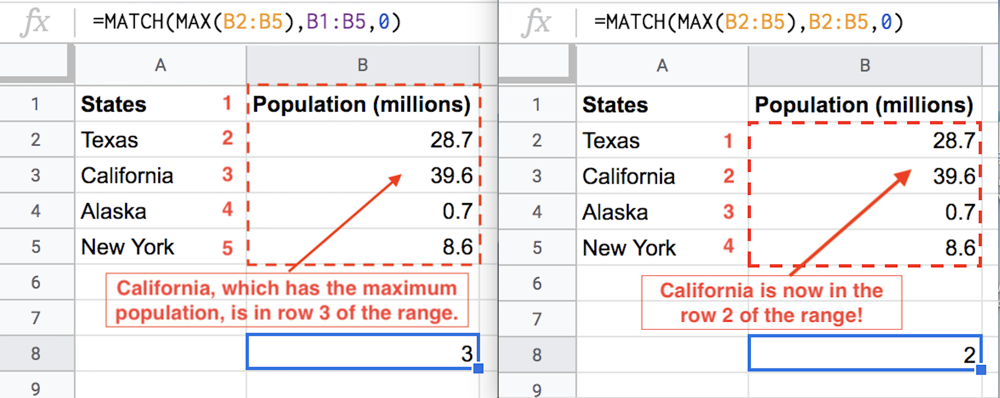

.. Copyright (C)  Google, Runestone Interactive LLC
   This work is licensed under the Creative Commons Attribution-ShareAlike 4.0
   International License. To view a copy of this license, visit
   http://creativecommons.org/licenses/by-sa/4.0/.

Minimum and Maximum
===================

The minimum and maximum of a dataset can be very useful statistics, and are
relatively simple to calculate. These statistics only apply to quantitative
variables.

.. admonition:: Minimum Definition

   The **minimum** value is the smallest value in the dataset, or the value that
   all other values in the dataset are greater than or equal to.

.. admonition:: Maximum Definition

   The **maximum** value is the largest value in the dataset, or the value that
   all other values in the dataset are less than or equal to.

The minimum or maximum value is sometimes the only value you need to know. For
example, suppose your university has organized a field trip for your class to a
concert, but the event is at a 21+ venue so people under the age of 21 are not
allowed in. In this case, knowing that the minimum age of the students in your
class is 21 is sufficient, as that tells you that everyone in the class is at
least 21 and that all members of the class can go on the field trip.

.. _minimum_and_maximum_dice_roll:

Example: Dice Roll
------------------

Consider rolling a standard dice.

-   There are six faces.
-   Each face is equally likely to land face up.
-   The faces are labelled as follows: 1, 2, 3, 4, 5, 6.

It might seem unnecessary to use Sheets to calculate the minimum and maximum
possible results of a dice roll, but when there are thousands of values instead
of six, using Sheets or some other tool will be a necessity.

You can calculate the minimum and maximum value in Sheets using the ``MIN`` and
``MAX`` functions respectively.

.. admonition:: Minimum and Maximum in Sheets

   **The MIN function returns the minimum value of a set of values.** You can
   either input several values separated by a comma (e.g.
   ``=MIN(value1, value2, value3)``), or you can input a range of cells of which
   you want to know the minimum (e.g. ``=MIN(A1:A10)``).

   **The MAX function returns the maximum value of a set of values.** You can
   either input several values separated by a comma (e.g.
   ``=MAX(value1, value2, value3)``), or you can input a range of cells for
   which you want to know the maximum (e.g. ``=MAX(A1:A10)``).

This example illustrates how to calculate the minimum value of a dice roll using
``MIN``, but the exact same logic and syntax applies to calculating the maximum
using ``MAX``. As stated above, there are two ways to calculate the minimum
value of a dice roll.

In the first way, each value is input into the ``MIN`` function, separated by a
comma.

.. https://screenshot.googleplex.com/wv9iEUPFF

.. image:: figures/minimum_using_values.png
   :align: center

Alternately, you can specify all the values in different cells, and input the
cell range into the ``MIN`` function.

.. https://screenshot.googleplex.com/NkogVUC3prp

In future examples, you will see that specifying a cell range is the more
efficient way to use ``MIN``, ``MAX``, and other statistical functions.

Example: Weather
----------------

Suppose you want to know the minimum and maximum temperature that New York City
(NYC) generally experiences in a year.

The weather dataset previously seen :ref:`here<variables_weather>` has the field
“actual_min_temp” which records the coldest temperature every day, and a field
“actual_max_temp” which records the highest temperature every day. (For this
example, only NYC weather is considered so the “city” column is removed, and the
month is not relevant so the “month_text” column is removed.)

.. fillintheblank:: nyc_coldest_temp

   What is the coldest minimum temperature reached in NYC for the twelve months?
   |blank|

   - :2: Correct
     :11: Incorrect: Look at the minimum of the “actual_min_temp” column.
     :x: Incorrect

.. fillintheblank:: nyc_warmest_temp

   What is the warmest maximum temperature reached in NYC for the twelve months?
   |blank|

   - :92: Correct
     :85: Incorrect: Look at the maximum of the “actual_max_temp” column.
     :x: Incorrect

This dataset for twelve months contains just 365 data points. It would be
time-consuming but not impossible to scan each column visually and find the
minimum and maximum values. But imagine if this dataset covered every day for
one-hundred years! Sheets would be able to find the minimum and maximum just as
quickly as it did for twelve months. Doing this manually, however, is
error-prone and would not be fun.

Optional: Match
---------------

Knowing how to find the minimum and maximum values in a spreadsheet is useful 
for many situations, but sometimes it can be even more useful to know which row 
the minimum or maximum came from. 

To find the row of the minimum or maximum, we can use the ``MATCH`` function. 
The ``MATCH`` function has three inputs and looks like this: 
``MATCH(search_key, range, [search_type])``.

-   ``search_key``: the value to search for
-   ``range``: the values of the column that you want to search (ex. A1:A5)
-   ``search_type``: The manner in which to search

    * 1 causes ``MATCH`` to assume that the range is sorted in ascending order
      and return the largest value less than or equal to search_key
    * 0 indicates exact match, and is required when the range is not sorted
    * -1 causes ``MATCH`` to assume that the range is sorted in descending 
      order and return the smallest value greater than or equal to ``search_key``

To practice using ``MATCH``, suppose a company called CandyData handed you the 
:ref:`here<halloween_candy>` dataset with information about various Halloween 
candies and asks you to find out which of the candies is most expensive. You 
know that you need to find the row with the highest value in the Price Percent 
column, so you can use the ``MATCH`` function! 

Now we must start filling in the inputs for ``MATCH``. The first input is the 
value you’re searching for. You’re looking for the maximum value in the column, 
and you know that to find the maximum value in a column you can use the ``MAX`` 
function ``(MAX(C2:C86))``. So now you can fill in the first part of the 
``MATCH`` function: ``MATCH(MAX(C2:C86), something, something)``. 

The second input is the range of the values of the column that you want to 
search. Since you want to find the value in the column called Price Percent, 
you fill in the next part of the MATCH function: ``MATCH(MAX(C2:C86), C1:C86, 
something)``. 

Notice that if you use C2:C86 instead of C1:C86 instead, the row value returned 
by the function will be shifted up by one, so the answer will be 53 instead of 
54. This is because the returned value is equal to how far down the value is in 
the range, so when you omit the first row in the range (C1), the returned value 
will be one less than the row number because it’s counting the rows starting at 
C2.

This is what that bug would look like if you were using a smaller dataset and 
trying to find the state with the largest population:

The last input is the manner in which you want to search. Since the values in 
Price Percent aren’t sorted, you use 0. The final function is 
``=MATCH(MAX(C2:C86), C1:C86, 0)``. The returned value is 46, meaning the most 
expensive candy is in row 46. You can now go back CandyData and tell them that 
Nik L Nip is the most expensive candy on the dataset.

Practice using the ``MATCH``, ``MAX``, and ``MIN`` functions to answer the 
following questions:

.. fillintheblank:: halloween_candy

   Which is the least expensive Halloween candy?
   |blank|

   - :Tootsie Roll Midgies: Correct
     :Tootsie Roll Juniors: Incorrect: Include the first row in the range.
     :x: Incorrect

.. fillintheblank:: halloween_candy

   Which Halloween candy has the highest sugar percentage?
   |blank|

   - :Reeses stuffed with pieces: Correct
     :x: Incorrect
   
   
.. fillintheblank:: halloween_candy

   What is the most popular Halloween candy?
   |blank|

   - :Reeses Peanut Butter Cup: Correct
     :x: Incorrect

.. fillintheblank:: halloween_candy

   What is the least popular Halloween candy?
   |blank|

   - :Nik L Nip: Correct
     :x: Incorrect
