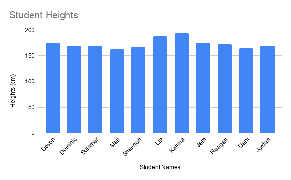
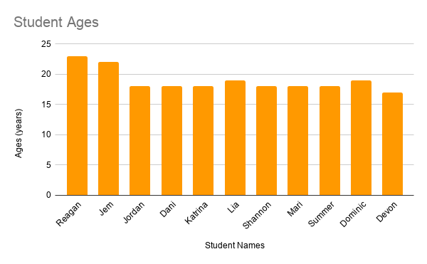
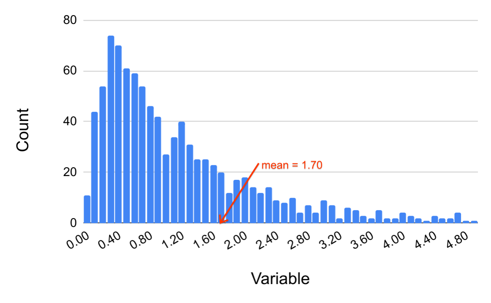
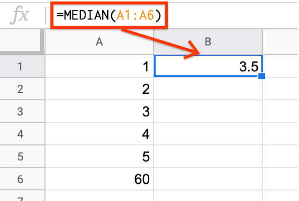

.. Copyright (C)  Google, Runestone Interactive LLC
   This work is licensed under the Creative Commons Attribution-ShareAlike 4.0
   International License. To view a copy of this license, visit
   http://creativecommons.org/licenses/by-sa/4.0/.

.. _outliers_and_skew:

Outliers and Skew
=================

What would happen if you drastically altered one of the data points in a
dataset? For example, if you rolled a dice where the value of 6 is replaced by
60? How does adding such a value, called an outlier, affect the different
measures of center?

.. admonition:: Outlier Definition

   **An outlier is a data point that is significantly far away from most other
   data points.** For example, if everyone in your classroom is of average
   height with the exception of two basketball players that are significantly
   taller than the rest of the class, these two data points would be considered
   outliers.

Outliers in a Histogram
-------------------

Consider the histogram of student heights below.

.. https://screenshot.googleplex.com/CDZJYuvheh1

In this example, we can see that there are two students whose heights are much greater than the rest of the students. As a result, taking the average of the class' height would result in 168.45 centimeters (cm). In an extreme case, think about what could happen if a school wanted to decide on what size jump ropes to purchase for P.E. classes or how high the student desks needed to be. 

.. admonition:: Skew Definition

   **Skewness is a measure of asymmetry of a dataset.** If there are values far
   away from the mean on one side (either above or below), but no values the
   same distance from the mean on the other side, this is an example of skew. A
   **positive skew** occurs when the dataset contains values much greater than
   the mean but not much less than the mean. A **negative skew** occurs when the
   dataset contains values much less than the mean but not much greater than the
   mean.

Outliers and skew only pertain to quantitative variables. (For categorical
variables, there is no notion of “distance” between different categories.)

Skew in a Histogram
-------------------

Consider the histogram of student ages below.

.. https://screenshot.googleplex.com/CDZJYuvheh1

This is an example of a positive skew. We can take the mean and find that it is 18.9. 
A majority of the students are of the age of the mean or younger (7 students). At the same time
there are students whose age is much higher.

We can see an example of the opposite, called a negative skew when there are a majority of students
whose ages are older...

Skew in a Histogram
-------------------

Consider the histogram of a variable below.

.. https://screenshot.googleplex.com/CDZJYuvheh1

This is an example of a positive skew, since, while most of the data lies in the
interval between 0 and 1.5, there are values in the dataset that are much higher
(but none that are below 0). This large group of values above the mean is called
a **right tail**, and as such a positive skew is often called a **right skew**.
(An example of a real dataset that might look like the histogram above is
:ref:`outlined below<outliers_and_skew_income>`.) Similarly, a dataset with a
negative skew looks like a mirror image of the histogram above, with a **left
tail** and a **left skew**.

.. shortanswer:: variables_with_right_skew

   What real-world variable do you think could have the histogram above?

.. shortanswer:: questions_on_right_skew

   In the histogram above, do you think more of the values are above or below
   the mean? How does that compare to the median? Will the median be greater or
   less than the mean in this case?

.. shortanswer:: questions_on_left_skew

   Find some examples of variables with left skew. Are there more data points
   above or below the mean? How does the mean compare to the median?

Example: Dice Roll
------------------

Outliers have different effects on different statistics. For example, if you
change the 6 on a dice to 60, the minimum value of the roll is still 1, while
the maximum value is now 60.

Outliers also have different effects on different measures of center. See what
happens to the mean and median for the dice roll when the 6 is changed to a 60.

.. https://screenshot.googleplex.com/CFU6x5845z2

.. image:: figures/uneven_dice_mean.png
   :align: center

The mean of the dice roll is now 12.5! Only one value was changed, yet the mean
changed drastically.

.. https://screenshot.googleplex.com/5Jy8HGAhgXd

In contrast, the median does not change at all. The median is considered more
“robust to outliers” than the mean. This means that as extreme values become
more extreme or as outliers are introduced into the dataset, the median is less
likely than the mean to be substantially affected.

.. shortanswer:: changing_value_of_dice

   What would happen to the mean and median if you change the 1 of a standard
   dice to -10? What about if you change the 3 to 300?

.. _outliers_and_skew_income:

Example: Income
---------------

Medians are especially useful when a dataset tends to lean towards higher/lower
values. This is called a **skew**. Consider the example of income that has
:ref:`already been explored<measures_of_center>`. Income is an extremely skewed
dataset. `You can read more about the income distribution here.`_

The following is an excerpt from the `US census report on income from 2003`_.

*“The distribution of wealth in the United States has a large positive skew,
with relatively few households holding a large proportion of the wealth. For
this type of distribution, the median is the preferred measure of central
tendency because it is less sensitive than the average (mean) to extreme
observations. The median is also considerably lower than the average, and
provides a more accurate representation of the wealth and asset holdings of the
typical household. For example, more households have a net worth near the median
of $55,000 than near the average of $182,381.”*

Since there are some households that earn extremely high incomes, just these few
values can affect the mean too much (in the same way that changing 6 to 60
affected the mean for the dice roll). The median is preferred in such contexts.

.. _You can read more about the income distribution here.: https://dqydj.com/income-percentile-calculator/
.. _US census report on income from 2003: https://www.census.gov/prod/2003pubs/p70-88.pdf
