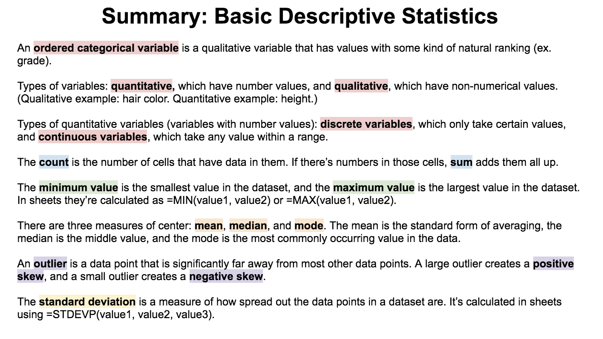

.. Copyright (C)  Google, Runestone Interactive LLC
   This work is licensed under the Creative Commons Attribution-ShareAlike 4.0
   International License. To view a copy of this license, visit
   http://creativecommons.org/licenses/by-sa/4.0/.

that have data in them. If there's numbers in those cells, sum adds them all up. The minimum value is the smallest value in the dataset, and the maximum value is the largest value in the dataset. In sheets they're calculated as =MIN(value1, value2) or =MAX(value1, value2). There are three measures of center: mean, median, and mode. The mean is the standard form of averaging, the median is the middle value, and the mode is the most commonly occurring value in the data. An outlier is a data point that is significantly far away from most other data points. A large outlier creates a positive skew, and a small outlier creates a negative skew. The standard deviation is a measure of how spread out data points in a dataset are. It's calculated in sheets using =STDEVP(value1, value2, value3).
