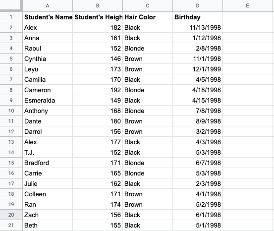

.. Copyright (C)  Google, Runestone Interactive LLC
   This work is licensed under the Creative Commons Attribution-ShareAlike 4.0
   International License. To view a copy of this license, visit
   http://creativecommons.org/licenses/by-sa/4.0/.

.. _variables:

Variables
=========

.. admonition:: Variable Definition

   **A variable is something that changes from one observation to another.** A
   dataset typically has one or more variables.

In the example above about heights of students, there is one variable: height.
Each observation is related to a different student in the class. In general,
datasets can have more than one variable. For example, the classroom dataset
could also contain the variables age, hair color, and shoe size.

As we begin looking at specific statistics, it’s important to note what
statistics mean for different types of variables. The type of variable
determines what statistics you can calculate and what questions you can answer.

There are two types of variables.

-   A **quantitative variable** or “numeric” variable can only take on number
    values. Examples are:

    -   height
    -   age
    -   years of education

-   A **categorical variable** can only take on certain non-numeric values.
    Examples are:

    -   hair color: some categories are “black”, “brown”, “blond”, etc.
    -   handedness: some categories are “left-handed”, “right-handed”,
        “ambidextrous”
    -   preferred mode of transportation: some categories are “train”, “car”,
        “bicycle”, etc.

All variables can be described as quantitative or categorical. Because some
concepts in statistics apply to only one type of variable, however, it is 
always important to classify the variables in your dataset as quantitative or
categorical. For example, it doesn’t make much sense to calculate the average
city in a set of cities. In contrast, calculating the average temperature makes
complete sense. Also, when plotting counts of a variable, histograms are used
for quantitative variables and bar charts are used for categorical variables.
(More on this distinction can be found in
:ref:`the section on histograms and bar charts<histograms_and_bar_charts>`.)

Knowing a variable’s type can also help with identifying missing or incorrect
data. For example, suppose you have a dataset of students’ heights, and one of
the values is “California”. Height is a quantitative variable but “California”
is a categorical response, so it is likely this was entered incorrectly.

.. mchoice:: quantitative_vs_categorical_variables

   Which of the following are categorical variables?

   - US state

     + Correct

   - Shoe size

     - Incorrect

   - Undergraduate college

     + Correct

   - Annual income

     - Incorrect

   - Population of Europe

     - Incorrect

.. _variables_weather:

Example: Student Data 
---------------------
To illustrate the difference between quantitative and categorical variable, 
consider the following example concerning data of students in a class.

The dataset contains, for a 20 student class, the name, height, hair color, 
and birthday of students in the class. 

Column B has a numeric value, so it is a quantitative variable. Columns A, C, 
and D are categorical. 

The “Name” and “Hair Color” variables can only be a fixed set of non-numeric
values. 

Example: Weather
----------------

In this and all following
examples using this dataset, the temperature is reported in degrees Fahrenheit.

.. TODO(raskutti): Embed
   https://docs.google.com/spreadsheets/d/17bkoB97dUdR0MBuaBXsWLR0VjkEYhJydXJUYV0tcWjw/edit#gid=419330429

The dataset contains, for several US cities, the average (mean), minimum, and
maximum temperatures for each day from July 1, 2014 to June 30, 2015. It should
be relatively clear, just by looking at the values of the variables, which
variables are quantitative and which are categorical.

Columns D, E, and F have numeric values, and are quantitative variables. 
Columns B and C are categorical.

The “month_text” can only be one of 12 words (January through December), 
and the “city” must be a US city. (Since there is a natural ordering to months, 
the “month_text” variable is an example of an
:ref:`ordered categorical variable<ordered_categorical_variables>`. The “city”
variable is a standard unordered categorical variable.)

The “date” variable in Column A is a little trickier, and could be considered
either quantitative or categorical. You could encode each new day as a whole
number (for example, 2014-7-1 maps to 1, 2014-7-2 maps to 2, 2015-6-30 maps to
365), in which case “date” would be quantitative. (It would be a
:ref:`discrete quantitative variable<discrete_and_continuous_variables>`.)
However, you could also argue that, given that the timeframe of this dataset is
July 2014 to June 2015, each day is a new category of the possible 365
categories. (This would then be an ordered categorical variable.)

How you choose to consider this variable depends on how you want to use this
data. For example, if you want to graph the daily temperature over time, you
would need to have date as a quantitative variable (so it can be used as the
x-axis). In contrast, if you want to subset the data and look at temperatures
only for all of the Mondays, it makes sense to think of date as a categorical
variable (so “Monday” is its own overarching category in which each day either
falls or does not fall).

.. _discrete_and_continuous_variables:

Extension: Discrete and Continuous Variables
--------------------------------------------

Under the umbrella of quantitative variables, there are two important distinct
types.

-   A **discrete variable** is a quantitative variable that can only take
    certain values. The most common examples are variables that can only be a
    whole number (e.g. number of stairs in a building, number of children).
    Another example would be shoe size, which can be whole numbers or half
    numbers.
    
-   A **continuous variable** is a quantitative variable that can take any 
    value within a range. Examples of this are numeric variables that can be
    expressed to as many decimal places as necessary.

In general, it is always a good idea to know what the possible values that a
variable can take. This includes whether the variable is discrete or 
continuous, as well as what the range of possible values is. 
(This `range of values`_ is called the **support**.) This can help with finding 
missing or wrong data. For example, if you have a dataset on height and one of 
the values is zero, you might assume that datapoint is missing, since you know 
height must be positive. (Moreover if one of the values is negative, you can 
assume that datapoint was incorrectly recorded.)

To illustrate the difference between a discrete and continuous variable,
consider the example of height. In general, a person’s height can be expressed
to as many decimal places as necessary, for example 172.9532145 centimeters. So
it is a continuous variable. However, height is *usually* rounded to the 
nearest feet and inches (5ft 8in) or to the nearest centimeter (173cm). In 
these cases, it is a discrete variable, as it can only take certain values. 
In contrast, shoe size is always a discrete variable. (A shoe size of 7.234 
does not exist.)

.. _ordered_categorical_variables:

Extension: Ordered Categorical Variables
----------------------------------------

Categorical variables are usually unordered. This means that there is no 
typical ranking to the categories. For the variable “eye color”, there is no 
obvious ordering to the values. You couldn’t say that in general, brown eyes 
is more or less than blue eyes.

However, some categorical variables have a natural ordering to them. For
example, consider the variable “highest level of education” where the values
are:

1.  No high school diploma
2.  High school diploma
3.  Undergraduate degree
4.  Masters degree
5.  Doctoral or equivalent professional degree

While this is clearly a categorical variable since the values are non-numeric,
there is a typical ordering of the values (e.g. getting a Masters degree
requires more schooling beyond an undergraduate degree). This type of variable
is called an **ordinal variable** (or **ordered categorical variable**).

In more advanced statistics, there are models that work with `ordinal
variables`_. However, this is well beyond the scope of this course.

.. shortanswer:: categorical_variable_example

   Think of a different example of an ordered categorical variable.

.. _range of values: https://en.wikipedia.org/wiki/Support_(mathematics)
.. _define the probability distribution random variable: https://en.wikipedia.org/wiki/Random_variable#Examples
.. _ordinal variables: https://en.wikipedia.org/wiki/Ordinal_data
