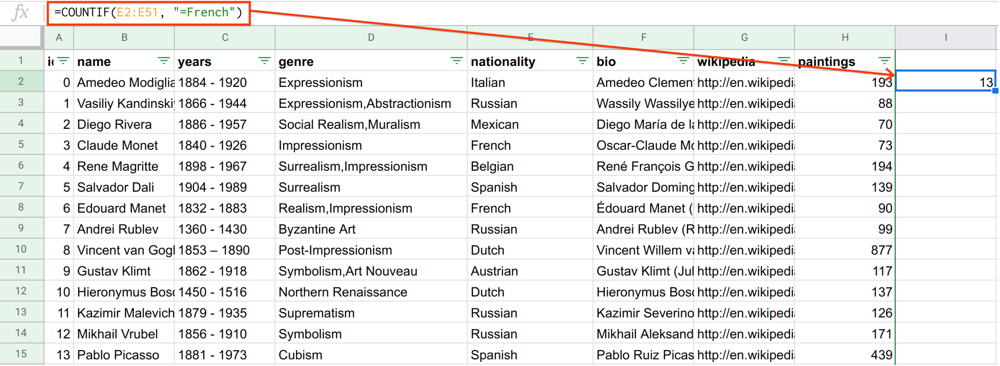
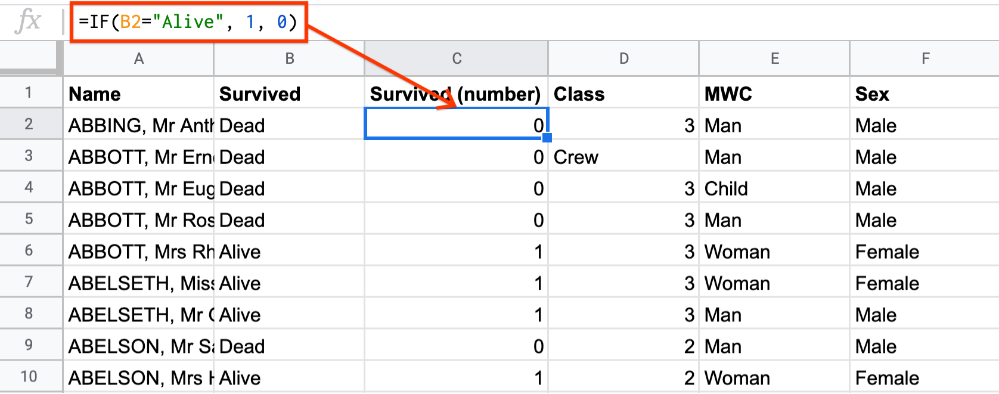
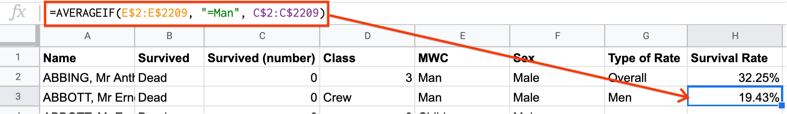

Grouping Data
=============

Filtering data allows you to subset data to a set of rows based on some
conditions. This allows for analysis on that subset of data. Finding summary
statistics for a specific group of observations is called **grouping**. For
example, if you have income data for the entire USA but want to find the mean
income just for California, you would group the data by state.

Grouping can be done in Sheets using one of three “conditional summary”
functions.

.. admonition:: Grouping Functions in Sheets

   **The COUNTIF function counts the number of cells that satisfy a condition.**
   The syntax looks like ``=COUNTIF(cell range to be filtered, filter
   condition)``.

   For example, consider the formula ``=COUNTIF(A1:A10, “=violin”)``. This
   counts the number of cells in the range A1:A10 that match the word “violin”.
   The **cell range to be filtered** is ``A1:A10``, and the **filter condition**
   is ``“=violin”``.

   **The SUMIF function sums the values of cells that satisfy a condition.** The
   syntax looks like ``=SUMIF(cell range to be filtered, filter condition, cell
   range to be summed)``.

   For example, consider the formula ``=SUMIF(A1:A10, “=violin”, B1:B10)``. This
   sums the values in the cells B1:B10, but only using rows for which the cell
   in that row in column A matches the word “violin”. The **cell range to be
   filtered** is ``A1:A10``, the **filter condition** is ``“=violin”``, and the
   **cell range to be summed** is ``B1:B10``.

   **The AVERAGEIF function finds the mean of cells that satisfy a condition.**
   The syntax looks like ``=AVERAGEIF(cell range to be filtered, filter
   condition, cell range to be averaged)``.

   For example, consider the formula ``=AVERAGEIF(A1:A10, “=violin”, B1:B10)``.
   This finds the mean of cells in the range B1:B10, but only using rows for
   which the cell in that row in column A matches the word “violin”. The **cell
   range to be filtered** is ``A1:A10``, the **filter condition** is
   ``“=violin”``, and the **cell range to be averaged** is ``B1:B10``.

.. TODO(raskutti): Add a screencast showing the above functions.

Note that for ``SUMIF`` and ``AVERAGEIF``, if you want to sum or average the
rows in column A themselves, you can enter A1:A10 as the third argument or leave
the third argument empty.)

Example: Painters
-----------------

Grouping functions are most useful when finding summary statistics for a
specific group. Consider the painters dataset, one last time. Suppose you want
to count the number of French painters in this dataset, and find the total
number of paintings made by those painters. This can be done using filtering or
using grouping.

Create a filter to limit the dataset to only French painters. (For this example,
assume “French” means the only nationality is French.) Copy the filtered table
to a new sheet.

.. fillintheblank:: number_of_french_painters

   Use ``COUNT`` on the filtered table to find the number of French painters.
   |blank|

   - :13: Correct
     :15: Incorrect: In this example, “French” means exclusively French.
     :x: Incorrect

.. fillintheblank:: number_of_paintings_by_french_painters

   Use ``SUM`` on the filtered table to find the number of paintings by French
   painters. |blank|

   - :2120: Correct
     :2618: Incorrect: In this example, “French” means exclusively French.
     :x: Incorrect

**Why was it necessary to copy-paste the filtered data to new rows?** Cell
ranges do not behave well in filtered tables. This is best illustrated via an
example. Consider the filter applied above, to limit the painters dataset to
French painters.

.. https://screenshot.googleplex.com/UbHcOGy0exS

.. image:: figures/filtered_index.png
   :align: center

Notice that when trying to count the number of rows, selecting the cells selects
all cells between the first and the last, not just the filtered cells. Note that
the selected range is H5:H48. While there are only 13 filtered rows, the range
selects all rows between 5 and 48. This returns a count of 44 French artists,
which is incorrect. The same is true for cell ranges when using ``SUM`` and
``AVERAGE``.

Instead of copy-pasting the filtered table to a new sheet and then using summary
functions, you can just use grouping functions. For example, to count the number
of French painters, you can use ``COUNTIF``. The range to be counted is the
“nationality” column, and the column condition checks whether the value is
“French”.

.. https://screenshot.googleplex.com/934CkQgWm8q

.. fillintheblank:: number_of_paintings_by_french_painters_using_countif

   Use ``SUMIF`` to find the number of paintings by French painters. |blank|

   - :2120: Correct
     :x: Incorrect

Note that if you wanted to use the more general definition of “French” (any
painter who has French as one of their nationalities), you would need to use a
different filter condition. In general, the filter condition for checking if
"word" appears anywhere in the text looks like ``"*word*"``. `This forum
discussion goes into more detail.`_ This can apply to any grouping function.

Use grouping functions (``COUNTIF``, ``SUMIF``, ``AVERAGEIF``) when answering
the following questions.

.. fillintheblank:: number_of_italian_painters

   How many Italian (only nationality is Italian) painters are in the list?
   |blank|

   - :8: Correct
     :x: Incorrect

.. fillintheblank:: mean_number_of_paintings_by_italian_painters

   What is the mean number of paintings by Italian painters? (Round your answer
   to the nearest whole number.) |blank|

   - :136: Correct
     :x: Incorrect

.. mchoice:: impressionism_vs_romanticism

   Which genre produced more paintings: impressionism or romanticism? (You may
   simplify this by only looking at painters whose only genre is impressionism
   or romanticism.)

   - Impressionism

     + Correct

   - Romanticism

     - Incorrect

.. fillintheblank:: painters_with_multiple_genres

   How many painters were associated with multiple genres? (Hint: Look for
   painters whose "genre" field contains a comma.) |blank|

   - :12: Correct
     :x: Incorrect

Example: Titanic
----------------

The `Titanic`_ was a passenger ship that sank on its journey from Southampton
(England) to New York (USA) in 1912, `killing over 1,500 people`_. This example
uses passenger data from the tragedy. Each row records a passenger on the ship.

.. TODO(raskutti): Embed
   https://docs.google.com/spreadsheets/d/1KsjcplW-ooOEfrYsCRT5lJ4W9LVIzxXPU5V_9F7JE1w/edit#gid=1839270122

The purpose of this example is to find out whether some groups, for example,
women and children who had priority access to life rafts in case of emergency,
had a higher survival rate than others. For example, did women and children have
a higher survival rate than men? This can be done very conveniently using
grouping functions.

In its raw state, the survival of each passenger is encoded as “Dead” or “Alive”
in column B. These words are hard to deal with numerically, so you should
probably first transform these values to numbers. For example, the following
formula maps “Dead” to 0 and “Alive” to 1. (The example is for cell B2, but it
can be copy-pasted for the other rows.) You can insert a column on the left of
column C and use this column for the formula.

.. code-block:: none

   =IF(B2=“Alive”, 1, 0)

.. https://screenshot.googleplex.com/HC8dHA4hZmo

.. fillintheblank:: titanic_survival_rate

   What is the survival rate on the Titanic? (Give your answers as a
   percentage, to two decimal places.) |blank| %

   - :32.25: Correct
     :0.32: Remember to give your answer as a percentage.
     :x: Incorrect

This survival rate you just calculated is the overall survival rate for all
passengers. What if you want to know the survival rate just for men, or just for
women, or just for children?

To calculate the survival rate just for men, you need to find the mean of column
C, but only if column E is equal to “Man”. This is a perfect use case for
``AVERAGEIF``.

.. code-block:: none

   =AVERAGEIF(E$2:E$2209, "=Man", C$2:C$2209)

.. https://screenshot.googleplex.com/qUe8Y6LLH0a

.. fillintheblank:: titanic_women_survival_rate

   What is the survival rate for women? (Give your answers as a percentage, to
   two decimal places.) |blank| %

   - :75.69: Correct
     :0.76: Remember to give your answer as a percentage.
     :x: Incorrect

.. fillintheblank:: titanic_children_survival_rate

   What is the survival rate for children? (Give your answers as a percentage,
   to two decimal places.) |blank| %

   - :51.61: Correct
     :0.52: Remember to give your answer as a percentage.
     :x: Incorrect

.. shortanswer:: titanic_survival_rate_by_class

   Compare the survival rate across the classes: Crew, Class 3, Class 2, Class
   1. Is this in line with what you expected?

.. _This forum discussion goes into more detail.: https://stackoverflow.com/questions/17152704/google-spreadsheet-count-if-contains-a-string
.. _Titanic: https://en.wikipedia.org/wiki/RMS_Titanic
.. _killing over 1,500 people: https://en.wikipedia.org/wiki/Passengers_of_the_RMS_Titanic