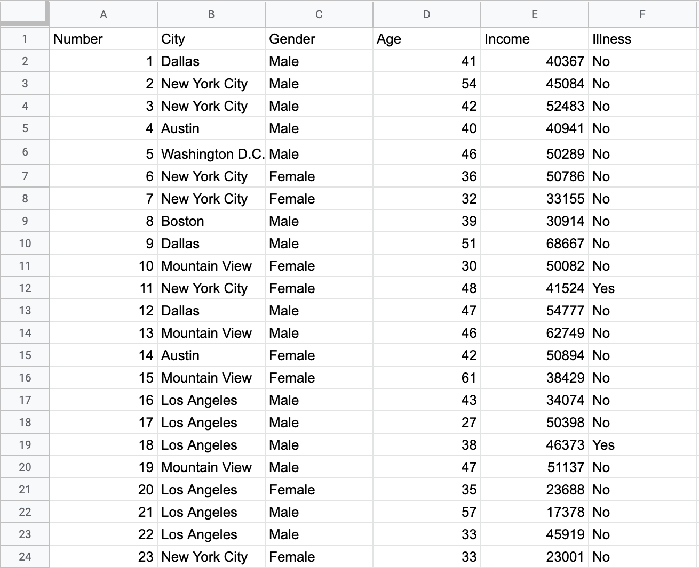
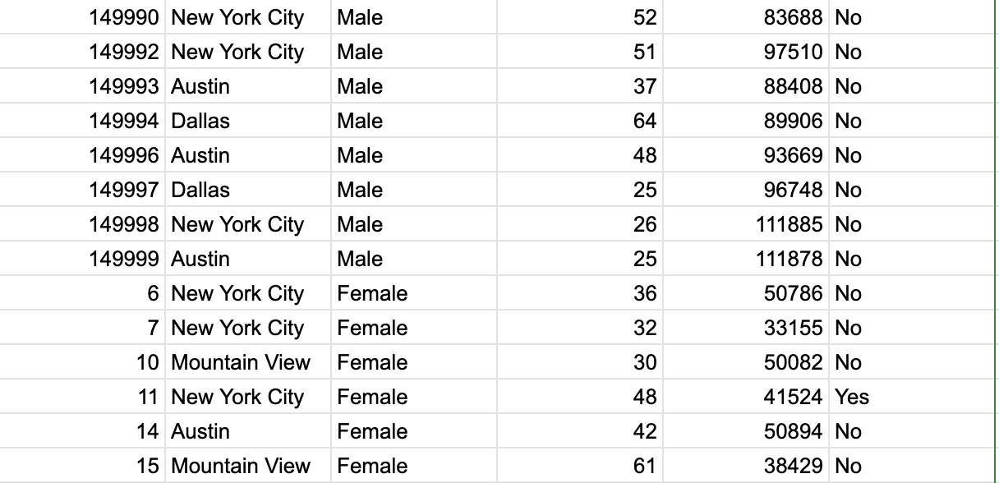

.. Copyright (C)  Google, Runestone Interactive LLC
   This work is licensed under the Creative Commons Attribution-ShareAlike 4.0
   International License. To view a copy of this license, visit
   http://creativecommons.org/licenses/by-sa/4.0/.

Introduction
============

Now that Sheets is more familiar so that you can put data there, you will
learn how Sheets can also be used to organize that data more easily. 
Sheets has functions that allow you to **filter** as well as **group**
data. For example, if you had the table below you could use filtering and
grouping to more easily display certain data. 

Can you guess what kind of filter was used on the table?

.. image::
   :align: center
   :alt: The same table after applying grouping. 

Can you guess what kind of grouping was used on the table? 