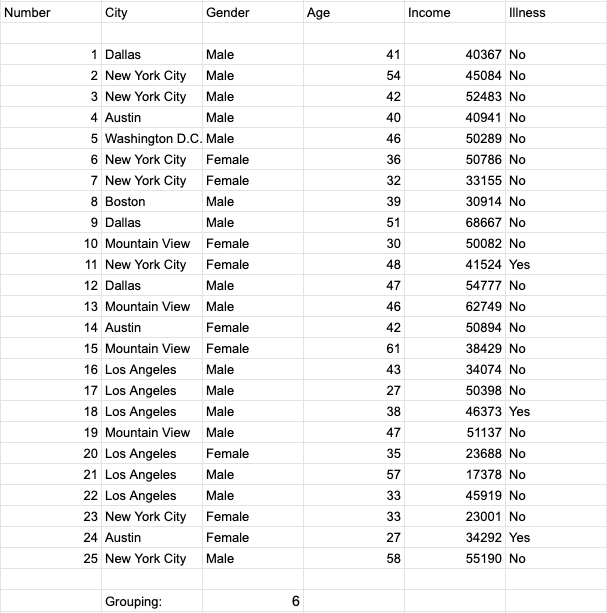

.. Copyright (C)  Google, Runestone Interactive LLC
   This work is licensed under the Creative Commons Attribution-ShareAlike 4.0
   International License. To view a copy of this license, visit
   http://creativecommons.org/licenses/by-sa/4.0/.

Introduction
============

Now that Sheets is more familiar and you know how it can hold data, you will
learn how Sheets can also be used to organize that data. Sheets has functions
that allow you to **filter** as well as **group** data. For example, if you had
the table below you could use filtering and grouping to more easily display 
certain data. 

.. image:: figures/table_data_example.png
   :align: center
   :alt: Table of data.

Above is a table with some standard information collected from a group of 
people. Below is the same data from the table before after filtering and 
grouping is separately applied.

.. image:: figures/table_filter_example.png
   :align: center
   :alt: The same table of data after applying a filter.

**Can you guess what kind of filter was used on the table?** 
(Answer at the bottom of the page)

**Can you guess what kind of grouping was used on the table?** 
(Answer at the bottom of the page)

Don't worry if that was difficult. This exercise was to help get you more 
familiar with potential uses for filtering and grouping on a data set.

Answers:

- The first table was filtered in the gender column, alphabetically from Z to A.

- The second table was grouped using the ``COUNTIF`` function to count how many 
people came from Los Angeles.