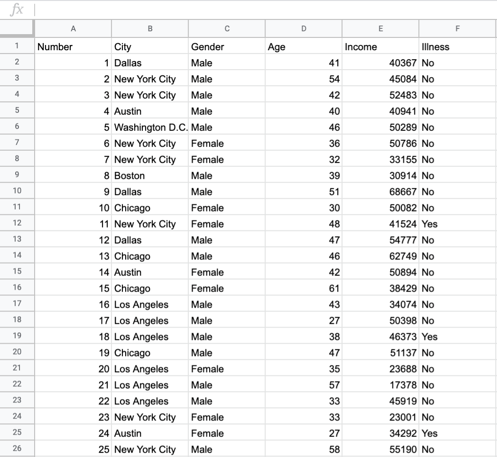

.. Copyright (C)  Google, Runestone Interactive LLC
   This work is licensed under the Creative Commons Attribution-ShareAlike 4.0
   International License. To view a copy of this license, visit
   http://creativecommons.org/licenses/by-sa/4.0/.

Introduction
============

Now that Sheets is more familiar and you know how it can hold data, you will
learn how Sheets can also be used to organize that data. Sheets has functions
that allow you to **filter** as well as **group** data. For example, if you had
the table below you could use filtering and grouping to more easily display
certain data.

Above is a table with some standard information collected from a group of 23
people. This data is fictional. Below is the same data from this table after
filtering and grouping are separately applied.

.. image:: figures/table_filter_example.png
   :align: center
   :alt: The same table after applying a filter.

This is an example of **filtering** the data to only see rows of people whose
city is Los Angeles.

.. image:: figures/table_group_example.png
   :align: center
   :alt: The same table after applying grouping.

This is an example of **grouping** the data to count the number of people in
this dataset who are from Los Angeles.

Don't worry if this is confusing. These examples are meant to help you become
more familiar with applications of filtering and grouping on a data set.
