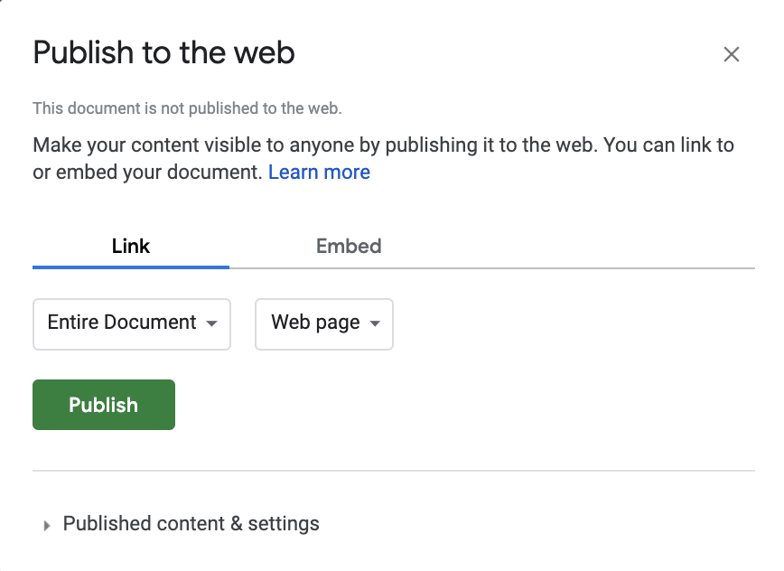

.. Copyright (C)  Google, Runestone Interactive LLC
    This work is licensed under the Creative Commons Attribution-ShareAlike 4.0
    International License. To view a copy of this license, visit
    http://creativecommons.org/licenses/by-sa/4.0/.

.. importing_and_exporting_data:

Exporting Data {#exporting-data}
~~~~~~~~~~~~~~~~~~~~~~~~~~~~~~~~

Exporting data is even easier than importing data. If you have a file
sheet that is ready for export, you can just click “File > Download”,
and choose which format you need to export to. The format options are:

-  .xlsx (compatible with Microsoft Excel)
-  .ods (compatible with Linux LibreOffice)
-  .pdf (readable on any system but non-editable)
-  .csv (the most common format for data storage)
-  .tsv (also widely used, but less so than csv)

Another useful tool in Sheets allows you to publish your data online. If
you click “File > Publish to the web”, you can publish your entire file
or a specified sheet as a web page, or as any of the downloadable file
formats above. This is a useful way to share data that will be continually 
updated.

This image is an example of what it looks like to publish a spreadsheet from 
Sheets. On the left selection pane, choose how much of the file to publish. On
the right selection pane, choose which file type to publish as.

Always be careful to ensure no private information is present in a dataset that
you publish. There may be instances where your dataset holds sensitive 
information. It is important to know when that is, and to understand the `laws 
and regulations on information privacy.`_ On the other hand, there are plenty of
publicly available datasets with important information. `Here are some of the 
most popular published datasets from 2018.`_

For more help on publishing data from Sheets, `check out this guide`_

.. _laws and regulations on information privacy.: https://en.wikipedia.org/wiki/Information_privacy
.. _Here are some of the most popular published datasets from 2018.: https://data.world/blog/top-10-datasets-2018/
.. _check out this guide: https://support.google.com/docs/answer/183965?co=GENIE.Platform%3DDesktop&hl=en