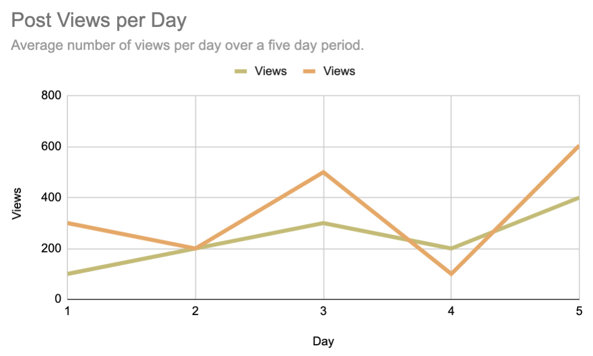
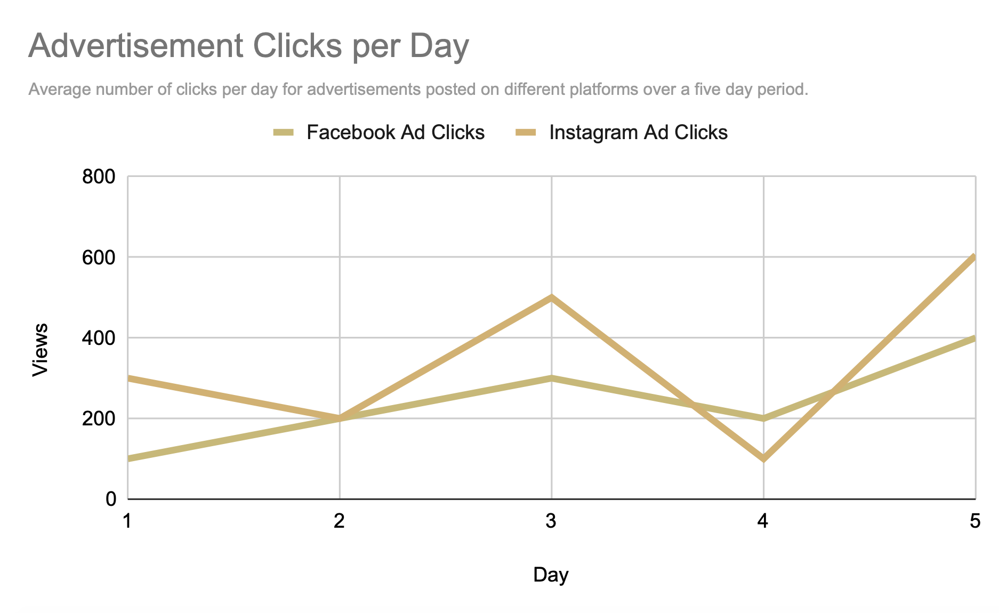
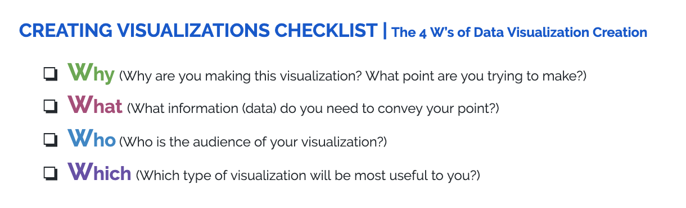

.. Copyright (C)  Google, Runestone Interactive LLC
   This work is licensed under the Creative Commons Attribution-ShareAlike 4.0
   International License. To view a copy of this license, visit
   http://creativecommons.org/licenses/by-sa/4.0/.

.. _creating_visualization_checklist:

Checklist for Creating Visualizations
=====================================

Making Accessible Visualizations
--------------------------------

When creating visualizations, it is important to create content that is both
**physically accessible** and **understandable** to all.
`More than 1 billion people have some form of disability`_, so you need to
ensure that you are not excluding anyone when creating a visualization.

For example, look at the following example of a chart.

However, someone who is color-blind may see the graph as shown below, which has
been `generated using this color-blindness simulator`_. As you can see, it is
more difficult to read.

How might you ensure that a color-blind person can understand your
visualization. How about if a person was dyslexic? `This article identifies
some key considerations for accessible data visualizations.`_

In addition, some other aspects of visualization to think about include
language, color, size. Look at your choices and ask:

-   Is this the simplest way to express this information?
-   How simple/complicated should your visualization be, depending on the
    technical understanding of your audience?

Keep these questions in mind so that your visualizations are clear for all.

What should I keep in mind when creating a visualization?
---------------------------------------------------------

Now that you have been able to examine some existing visualizations, it's time
for you to make your own! There are several choices for you to consider when
making visualizations that are accessible for viewers. Here is a checklist for
you to reference when making a visualization. More details are listed below the
checklist.

1.  **Why** are you making this visualization? What **point** do you intend to
    make with the visualization?

    -   It is important to keep in mind what facts and/or opinions you are
        trying to convey with your visualization.

2.  **What** is the **content** of the visualization?

    -   What data will you need?
    -   What aspects of the data will you need to showcase?

3.  **Who** is the **audience** of the visualization?

    -   The audience of your visualization will impact everything in the
        visualization, from the type of graphic to the style of language used.
    -   It is also crucial to know how data-competent your audience is. You want
        everyone who sees this visualization to understand it.

4.  **Which types** of visualization do you plan to use?

    -   The “type” of visualization indicates the format, e.g. Is it a table? Is
        it a pie chart?
    -   Try out different formats of charts. How do you know a specific type of
        visualization is the best unless you try others?

.. _generated using this color-blindness simulator: https://www.color-blindness.com/coblis-color-blindness-simulator/
.. _More than 1 billion people have some form of disability: https://www.who.int/en/news-room/fact-sheets/detail/disability-and-health
.. _This article identifies some key considerations for accessible data visualizations.: http://www.storytellingwithdata.com/blog/2018/6/26/accessible-data-viz-is-better-data-viz
