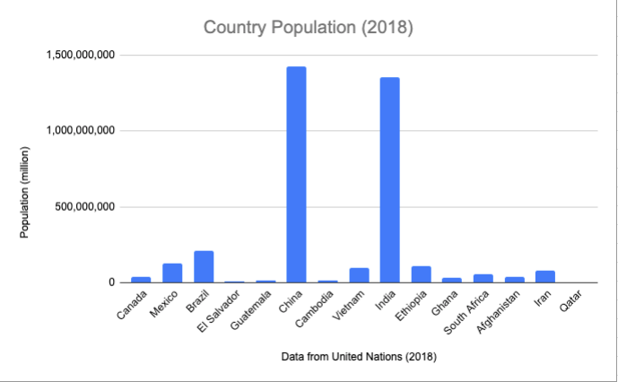
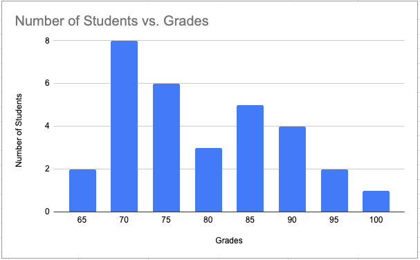
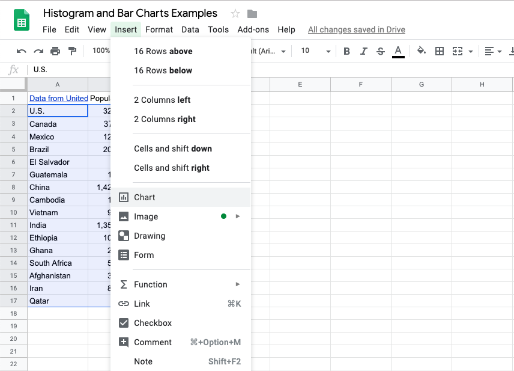

.. Copyright (C)  Google, Runestone Interactive LLC
   This work is licensed under the Creative Commons Attribution-ShareAlike 4.0
   International License. To view a copy of this license, visit
   http://creativecommons.org/licenses/by-sa/4.0/.

.. _histograms_and_bar_charts:

Histograms and Bar Charts
=========================

Some of the most commonly used visualizations are histograms and bar charts.
These are the types of graphs with vertical bars of different heights. An
example of each is below. (The histogram is the first, the bar chart is the
second.)

.. image:: figures/train_arrivals.png

.. image:: figures/favorite_ice_cream.png

Histograms and bar charts are generally used for counting, that is, to display
and compare how many things exist or happen. For example, such a chart could
show:

1.  The human population in different countries (counting people)

2.  The number of people who get different grades in a class (counting students)

3.  The frequency of train arrivals at different stations (counting trains per
    unit time), which is shown as the first example above

Note that sometimes bar charts with vertical bars are called column charts.
Choosing between horizontal and vertical bars is largely an aesthetic choice.
`This article goes into more detail about when you might like to choose one over
the other.`_ This textbook will always use vertical bars for consistency. As
such, the terms “column chart” and “bar chart” will be used interchangeably, and
will always refer to a vertical bar chart.

**What is the difference between a histogram and a bar chart?** There is
actually not a whole lot that is different, and in principle you can consider
them to be the same. Both are used to compare counts or frequencies of an event
or occurrence for different values of a variable. Some textbooks and industries,
however, do distinguish between the two. To understand the full nuance of the
difference, it is first important to understand different types of variables.
The nuance of this difference will be more clear after you learn the different
types of variables in :ref:`this section<variables>`.

In some cases, the x-axis (horizontal axis) of the graph represents different
**categories**. Each category is a distinct group. Examples of this are:

-   countries (as in example 1 above)
-   letter grades (as in example 2 above)
-   hair color

In this case, plotting counts or frequencies for the different categories is
called a bar chart. There is always a gap between the vertical bars, to indicate
that the different categories are distinct.

In other cases, the x-axis (horizontal axis) of the graph represents **bins of
numbers**. Each bin represents a specific interval of a number (for example, one
bin might include a range of values between 0 and 10). Examples of this are:

-   time between train arrivals (as in example 3 above)
-   heights
-   SAT scores

In this case, plotting counts or frequencies for each bin is called a histogram.
There is never a gap between the vertical bars, to indicate that the value of
each bin is directly above or below the value of its neighbors.

For the two graphs presented earlier in this section:

-   The bar chart is graphing students’ favorite ice cream shops.

    -   The variable on the x-axis is “ice cream shop”, which is a category, not
        a number.
    -   There are gaps between the bars.

-   The histogram is graphing time between train arrivals.

    -   The variable on the x-axis is in “minutes”, which is a number, not a
        category.
    -   There are no gaps between the bars.

.. mchoice:: histogram_vs_bar_chart

   For which of the following variables would you prefer a histogram over a bar
   chart?

   - Marathon completion times

     + Correct: Time is always a numeric variable.

   - Undergraduate major

     - Incorrect: This is a categorical variable.

   - Income

     + Correct: Income is a numeric variable.

   - Income bracket

     - Incorrect: While “income” is a numeric variable, once it is discretized
       into buckets, it becomes categorical (or more precisely,
       `ordinal`_).

Using Sheets
------------

Sheets makes it fairly straightforward to create graphs. The hard part is
choosing the right graph and customizing it to best display your data.

You can make graphs in Sheets by highlighting the data you want to visualize,
then clicking “Insert > Chart”.

You can then customize this chart in numerous different ways. Below are just a
few important things to keep in mind when creating graphs.

-   Make all text (main title, axis titles, axis labels) big enough to read.
    (There are no hard and fast rules here, but always
    have :ref:`accessibility<creating_visualization_checklist>` at the forefront
    of your mind when creating visualizations.)
-   Choose descriptive titles for the horizontal and vertical axes.
-   Choose the right bin size (width) for histograms.

Sheets distinguishes between column charts, bar charts, and histograms. Based on
the above, be sure to choose the correct graph for your use case. (It is also
recommended to use column charts over bar charts.)

-   The “column chart” option has vertical bars with gap.
-   The “bar chart” option has horizontal bars with gaps. Avoid using this one.
-   The “histogram” option has vertical bars with no gaps.

.. shortanswer:: appropriate_graph

   What is the appropriate graph for this data? Create the graph in Sheets.

.. TODO(raskutti): Embed
   https://docs.google.com/spreadsheets/d/1OOvRY_UX-A_tkSDRW60SoEMOkym-kO0B1uZIcED-btE/edit#gid=1373560111_

.. _This article goes into more detail about when you might like to choose one over the other.: https://www.fusioncharts.com/blog/bar-charts-or-column-charts/
.. _ordinal: https://en.wikipedia.org/wiki/Ordinal_data
