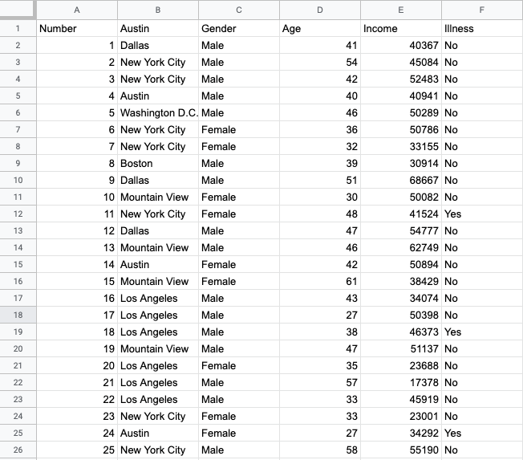
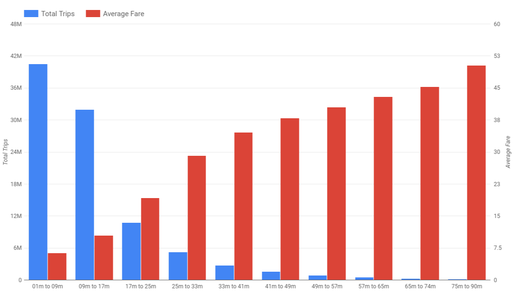

.. Copyright (C)  Google, Runestone Interactive LLC
   This work is licensed under the Creative Commons Attribution-ShareAlike 4.0
   International License. To view a copy of this license, visit
   http://creativecommons.org/licenses/by-sa/4.0/.

Introduction
============

People often find it easier to learn visually. Colors and patterns can be easier
to interpret than words and numbers. Have you ever read an article that does not
include some form of picture, or graphic, or map? Visualizations make data easy
to access, make articles easy to read, and make findings easy to interpret.

**A data visualization is any visual representation of data.** Examples include:

-   Tables
-   Line graphs
-   Maps
-   Pie charts
-   Infographics

In this chapter, you will learn more about when to use different visualizations
and how to ensure that they effectively communicate your data to its audience.
To start, take a look at the visualizations on this page. While reviewing them,
keep in mind what you like about them and what elements on them guide your 
understanding of their meaning.
<<<<<<< HEAD
=======

>>>>>>> ea780aa92ce42576adb80be13f65a0911baefd36

.. image:: figures/example_pie_chart.png
   :align: center
   :alt: An example pie chart visualization.
   

   

