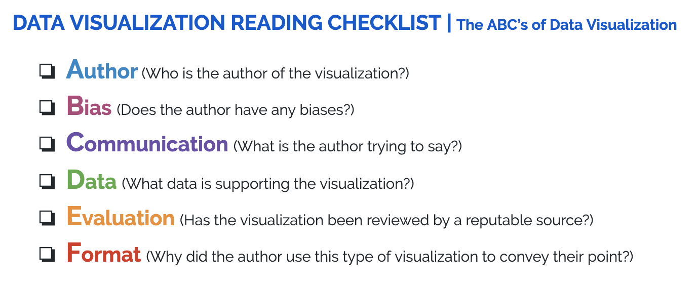

.. Copyright (C)  Google, Runestone Interactive LLC
   This work is licensed under the Creative Commons Attribution-ShareAlike 4.0
   International License. To view a copy of this license, visit
   http://creativecommons.org/licenses/by-sa/4.0/.

Checklist for Reading Visualizations
====================================

What should I look for when reading a visualization?
----------------------------------------------------

When you find a visualization online, it is important to ensure that you
understand where the data is coming from and how this may affect how it is
presented. Being able to interpret visualizations is a fundamental skill in data
science. Like any form of media, a visualization has an author. As such, it has
potential biases, and can be interpreted in different ways.

Here is a checklist of important things to consider when reading a
visualization. More detailed descriptions of what to look for in a visualization
are listed below the checklist.

1.  Who is the **author** of the visualization?

    -   Is the author a single person, or is the author writing on behalf of an
        organization?
    -   Is the author an experienced statistician and/or writer?

2.  What **biases** might the author have?

    -   Especially if the visualization is on a media platform, it may have
        unconscious or conscious bias. This may include, but is not limited to:

        -   political bias
        -   racial bias
        -   product bias (i.e. if the author trying to promote/sell something)

3.  What point is the author trying to **communicate** with the visualization?

    -   A visualization is an author’s choice of medium to convey facts and/or
        opinions.
    -   What are these core facts and/or opinions?

4.  What **data** is backing the visualization?

    -   It is *crucial* to know what data is used to make the visualization. For
        example:

        -   **Location**: Is it global data, or is it a specific
            country/state/region?
        -   **Demographic**: Is it a subset of people, specified by something
            like (but not limited to) race/gender/age?
        -   **Sampling**: Does it include *all* of the people in a given
            population, or just a sample? Is the sample random? How was the
            sample chosen? (For example, if you were conducting a study of
            students at your college, your population of interest would be all
            students at the college, while a sample would be just the students
            in your dorm.)

5.  How rigorously has the visualization (or the article in which the
    visualization appears) been reviewed and **evaluated**?

    -   For example, if the visualization appears in *The New York Times* it has
        likely been thoroughly reviewed, whereas if the visualization is part of
        a personal blog it may not have been.

6.  Why has the author chosen this **format** of visualization?

    -   What format does the visualization use? Is it a table? Is it a pie
        chart?
    -   What does this type of visualization do to accentuate their point?

.. shortanswer:: visualization_checklist

   Find an example of a data visualization online. Follow the checklist above
   with your chosen visualization.

.. _creating_visualization_checklist:
