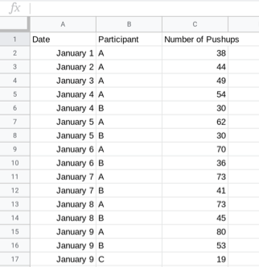
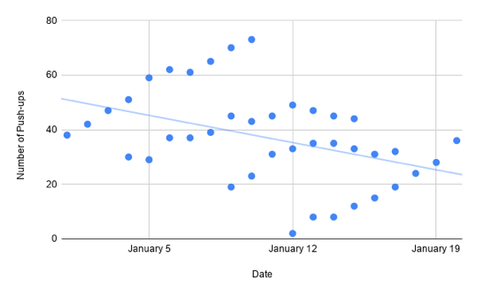
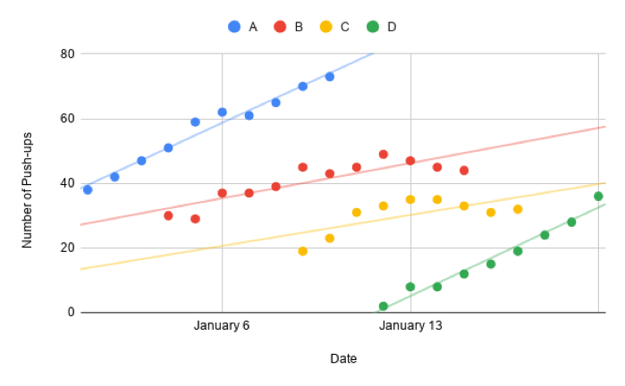
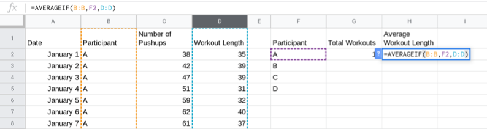

.. Copyright (C)  Google, Runestone Interactive LLC
   This work is licensed under the Creative Commons Attribution-ShareAlike 4.0
   International License. To view a copy of this license, visit
   http://creativecommons.org/licenses/by-sa/4.0/.

.. _filtering:

Filtering
=========

*(link to filtering section in Module A)* Often you may be interested in
just a specific subset of a dataset. For example, if you have population
data over the past ten years for each state, you may want to analyze
data only for Florida, or only for the year 2017. Recall that a filter
is a way of selecting a subset of rows based on a set of column
conditions. Filtering data helps identify the similarities and
differences between groups, and describe the relationships between
variables. Often, you can only see important differences or trends by
filtering.

For example, consider a `personal trainer who has implemented a new
strength training
regime
<https://drive.google.com/open?id=1kzEQ-JCgr0RLCb0ojl1HldF0irO_UzQO0PtxsjBRFtU>`__
to use with her clients. She wants to see if the new routine increases
the number of push-ups her clients can perform. It’s a great routine,
and her clients are working hard, so she expects a positive \_r \_value
showing that her clients can do more push-ups as they progress through
the regime.

Question: What type of variable is Participant?

::

   Answer - Categorical

Question: What type of variable is Number of Pushups?

::

   Answer - Quantitative

Question: What type of variable is Date?

::

   Answer - Quantitative

       Link back to discussion in module A. Because Date is being graphed on the x-axis, it is being treated as a quantity, not a category.

Question: Calculate the r value.

She is disappointed to find that the r value is negative. Looking at the
scatter plot, it looks like each individual has improved, but the
overall trend is negative. This is an example of `Simpson’s
paradox <https://en.wikipedia.org/wiki/Simpson%27s_paradox>`__, in which
every subset of a population shows the opposite effect to the population
itself. If the trainer could filter by participant, she could find the
correlation for each participant.

This graph shows that each participant has improved, and the correlation
coefficient for each individual would be positive.

You can also do filtering using *SUMIF*, *COUNTIF* and *AVERAGEIF*.
Suppose the same trainer has information about the length of each
strength training session with each client. She can use *AVERAGEIF* and
*COUNTIF* to construct a table showing the average length and total
number of workouts for each client.

Question: Complete the table for all participants. What is the average
workout length for participant B?
