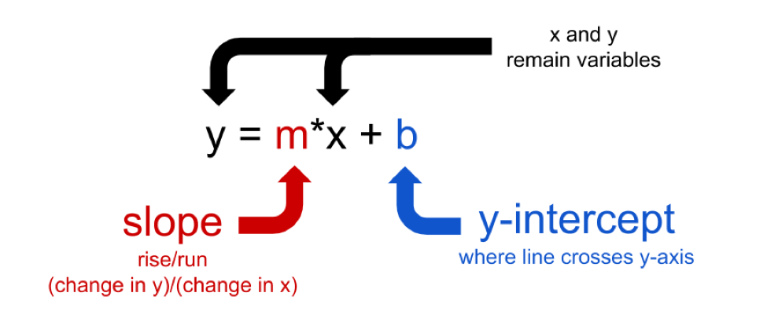
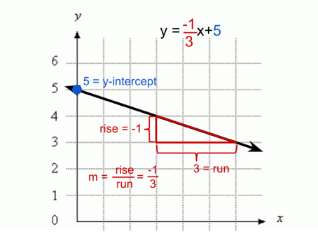
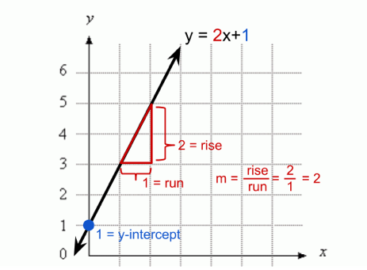

.. Copyright (C)  Google, Runestone Interactive LLC
   This work is licensed under the Creative Commons Attribution-ShareAlike 4.0
   International License. To view a copy of this license, visit
   http://creativecommons.org/licenses/by-sa/4.0/.

.. _equation_of_a_line_refresher:

Equation of a Line (Refresher) {#equation-of-a-line-refresher}
==============================================================

All line equations in this text will be presented in the form y = m*x +
b, where m is the slope and b is the y-intercept. The **y-intercept** is
the y-value at the point where the line crosses the y-axis. The
`slope <#interpreting-slope>`__ gives the steepness of the line, and can
be positive, negative, or zero.

Video on slope and intercept
