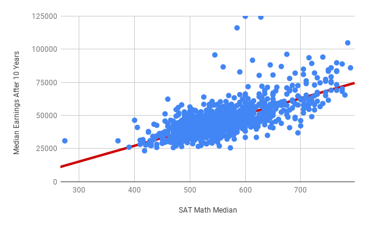
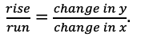
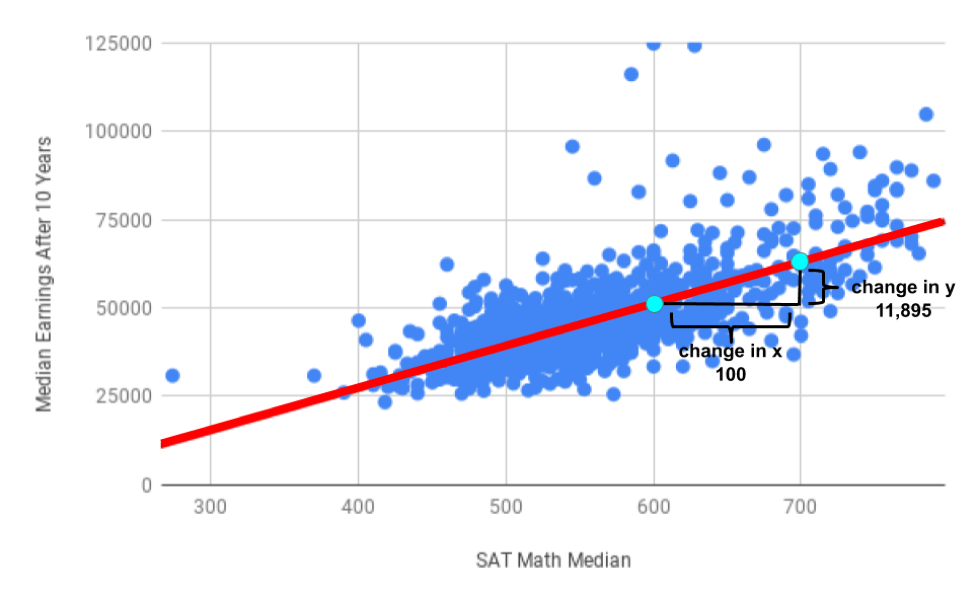
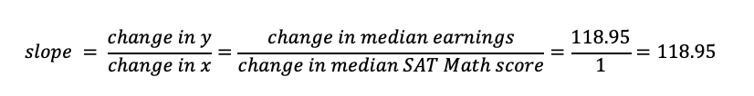
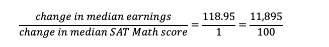
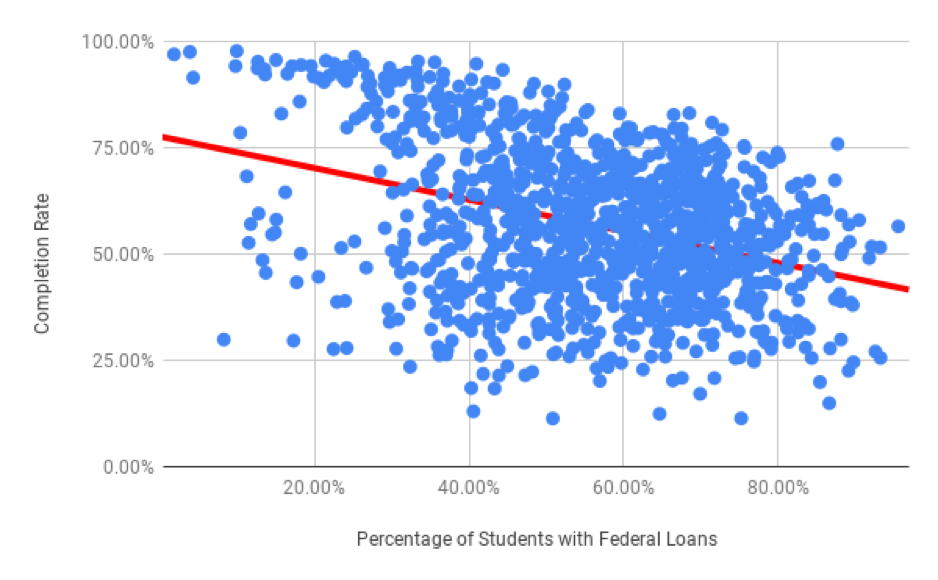
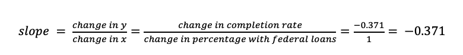
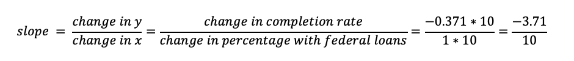
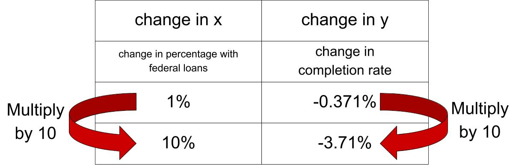

.. Copyright (C)  Google, Runestone Interactive LLC
   This work is licensed under the Creative Commons Attribution-ShareAlike 4.0
   International License. To view a copy of this license, visit
   http://creativecommons.org/licenses/by-sa/4.0/.

.. _interpreting_slope:

Interpreting Slope
==================

When interpreting the relationship between two variables, one of the key
concepts is interpreting slope. While the correlation coefficient tells you how
strong the relationship between two variables is, the slope tells you the
magnitude of that relationship. In other words, the correlation helps you answer
the question “If variable A changes, will variable B change?”, while the slope
helps you answer the question “If variable A changes, *how much* will variable B
change?”.

Suppose two schools are pretty similar in most regards, except that College X
has an average SAT math score that is 100 points higher than University Y.
Knowing the slope of the line of best fit in this case is useful to predict how
SAT score impacts other variables.

For example, below is a scatter plot with median SAT Math score as the
explanatory variable, and median earnings after graduation as the explained
variable.

First of all, the data exhibits a general upward trend: in general, schools with
higher median SAT Math scores are more likely to graduate students who earn
higher median income after 10 years. This is confirmed by the line of best fit,
which has a positive slope.

The equation of the line of best fit is y = 118.95 \* x - 20347.55. Or, to use
the names of the x and y variables, you can write an equation like the
following.

(Predicted Median Earnings) = 118.95 \* (SAT Math Median) - 20347.55

The number multiplied by the x-variable is the slope, in this case 118.95. The
constant at the end is the y-intercept, in this case -20347.55. These values
quantify how differences in one variable result in differences in the predicted
values of other variables.

The `slope of a straight line <https://en.wikipedia.org/wiki/Slope>`__ tells you
how much the y value changes when the x value is increased by 1. This is also
written as the ratio

From the equation above, because the slope is 118.95, when the median SAT math
score increases by 1, the median earnings increases by 118.95. In other words,
for each point increase in median SAT math score, the median earnings goes up
$118.95.

It’s often helpful to look at larger changes too, like on the illustrated graph
above.

Every 100 point increase in median SAT math score corresponds with a predicted
median earnings increase of $11,895. Another way to think about this is that if
the change in median earnings is $118.95 for a 1 point increase in the median
SAT Math score, and the trend is linear, the change in median earnings is
100 \* $118.95 (or $11,895) for a 100 point increase in the median SAT Math
score.

.. image:: figures/Slope_Changes_for_SAT_math.jpg

If College X had median SAT Math scores 100 points higher than University Y,
their graduates will make on average $11,895 more per year, after 10 years.

Example: SAT Scores and Loans
-----------------------------

Question: Find the difference in predicted median earnings between College A and
College B if the difference in their average math SAT scores is 150 points.

This dataset has many other variables, and many other relationships to examine.
For example, does the percentage of students with federal loans at a college
impact its completion rate? Suppose your friend has been accepted to College A
and College B, and is very determined to graduate within four years. However,
she has to take some student loans, and is trying to decide where to go. You
don’t know much about either school, but College A has 10% more students with
federal loans than College B. This scatter plot shows the percentage of students
receiving federal loans as the explanatory variable, and completion rate as the
explained variable.

.. mchoice:: completion_rate

   Using the scatter plot above, which school will have a lower completion rate?
   (Specifically, which school will have fewer students graduating within
   6 years?)

   - School A

     + Correct: Because the direction of the scatter plot is negative, the
       school with the higher percentage of students with federal loans will
       have a lower completion rate. So College A will have a lower percentage
       of students graduating within 6 years.

   - School B

     - Incorrect: Try again! Because the direction of the scatter plot is
       negative, the school with the higher percentage of students with federal
       loans will have a lower completion rate. So College A will have a lower
       percentage of students graduating within 6 years.

The slope of the line of best fit this time is negative. The slope of this line
is negative because the line moves down from left to right, just like the
scatter plot which has a negative direction. This means that in general, the
higher the federal loans taken out to go to a college, the lower the completion
rate.

The equation of the line of best fit is below.

(Predicted Completion Rate) = -0.371 \* (Percentage with Federal Loans) + 0.775

Therefore for every 1% increase in the percentage of students with federal
loans, the predicted completion rate drops by 0.37%. College A and B have a
difference of 10% in their federal loans percentage. To determine how much that
impacts the predicted completion rate, you can multiply the slope by 10.

Another way to think about this is that any change to x has to change y
proportionally. Therefore, if the change in x is multiplied by 10, the change in
y must also be multiplied by 10.

So College A and College B should differ in their completion rate by 3.71%. The
negative value indicates that as the x value increases by 10%, the y value
\_decreases*\* \**_by 3.71%.

However, that doesn’t mean that students who have federal loans graduate less
often than students who don’t! One issue is that this dataset is about schools,
not students. There are also many other factors at play. For example, a school’s
financial resources is certainly a lurking variable. Schools where students
don’t need federal loans often have large endowments and give loans or
scholarships directly to their students. These same schools may also have other
resources that contribute to increased graduation rates.

.. mchoice:: slope_line_of_best_fit

   Question: Which of the following is the correct interpretation of the slope
   of the line of best fit?

   (Predicted Median Debt of Graduates) = 0.209 \* (Average Net Tuition) + 19043

   - For every dollar that median debt increases by, average net tuition
     increases by .209 dollars.

     - Incorrect

   - For every dollar that average net tuition increases by, median debt
     increases by 20.9%.

     + Correct

   - For every dollar that median debt increases by, average net tuition
     increases by 20.9%.

     - Incorrect

   - For every dollar that average net tuition increases by, median debt
     increases by .209 dollars.

     + Correct
