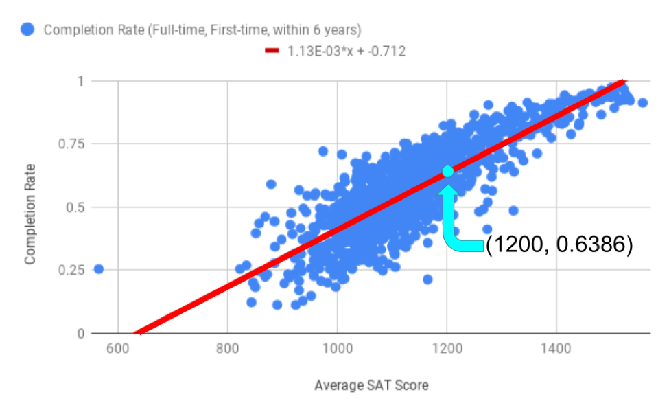

.. Copyright (C)  Google, Runestone Interactive LLC
   This work is licensed under the Creative Commons Attribution-ShareAlike 4.0
   International License. To view a copy of this license, visit
   http://creativecommons.org/licenses/by-sa/4.0/.

.. _making_predictions_with_the_regression_line:

Making Predictions with the Regression Line
===========================================

.. image:: figures/average_sat_score_completion_rate.png

Returning to the scatter plot showing average SAT score and completion
rate, the equation of the regression line is y = 0.0011*x - 0.7116. The
slope is 0.0011 and the y-intercept is -0.7116. Another way to write
this is to use the descriptions of the x and y variables.

(Predicted Completion Rate) = 0.0011 \* (Average SAT Score) - 0.7116

If you’re wondering why the equation in the graph above or in Sheets has
an *E* in it, that’s called scientific notation. You can read more about
scientific notation
`here <https://en.wikipedia.org/wiki/Scientific_notation>`__.

Suppose University X has an average SAT score of 1200 for incoming
freshmen. You could use the graph to estimate the completion rate at
University X, but depending on how carefully you read that graph, the
estimates could vary. A much more precise way of making that estimate is
to use the equation of the line. Because University X has an average SAT
score of 1200, you will replace that portion of the regression line
equation with the number 1200.

(Predicted Completion Rate) = 0.0011 \* (1200) - 0.7116 = 0.6386 (or
63.86%)

So, University X has a predicted completion rate of 63.86%. The point
(1200, .6386) is illustrated on the scatter plot below.

Question: Use the regression line to estimate the completion rate for a
school with an average SAT score of 1400.

You can use the same method to estimate the completion rate for a school
with an average SAT score of 600.

(Predicted Completion Rate) = 0.0011 \* (600) - 0.7116 = -0.0365 (or
-3.65%)

But a negative completion rate doesn’t make sense! A school can’t have a
graduation rate lower than 0%. The reason this doesn’t make sense is
because 600 is outside of the range of most of the data, and trying to
predict outside of that range is extrapolation. Because there is only
one school with an average SAT score that low, using this regression
line is not going to give a reliable (or even reasonable) prediction.
Finding regression lines and making predictions can be difficult with
such outliers.

What if, instead, you try to predict completion rate based on the
percentage of students receiving federal loans? As the correlation
between the percentage of students receiving federal loans and
completion rate is much smaller than the correlation between average SAT
score and completion rate, any predictions made using the correlation
between these variables will be less accurate. This is reflected in the
scatter plot as well, where the data points are much more spread out.
