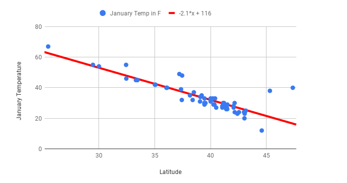
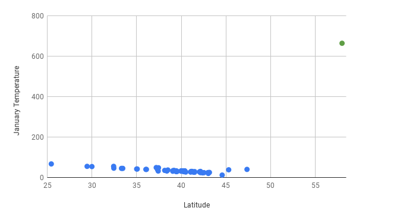
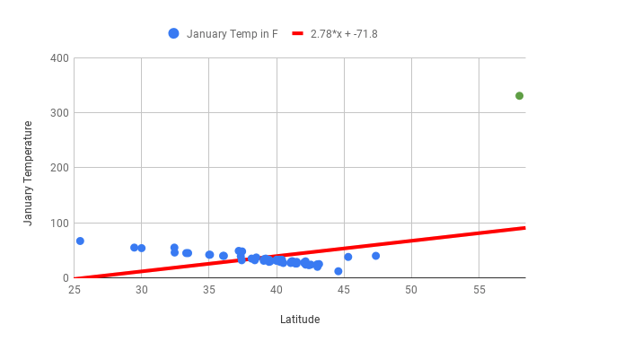
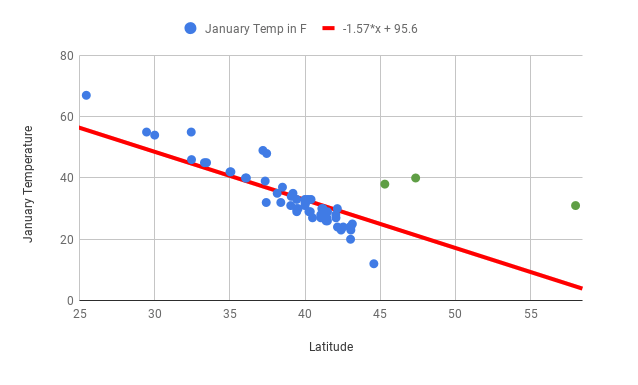

.. Copyright (C)  Google, Runestone Interactive LLC
   This work is licensed under the Creative Commons Attribution-ShareAlike 4.0
   International License. To view a copy of this license, visit
   http://creativecommons.org/licenses/by-sa/4.0/.

.. _outliers:

Outliers
========

As you saw in Module A, some statistics are very sensitive to extreme
values (LINK TO OUTLIERS SECTION). This is also true for lines of best
fit. You can see this very clearly by returning to the scatter plot of
mean January temperature and latitude for US cities.

Question: Fill in the blank by interpreting the slope: When the latitude
increases by 1, the predicted January temperature \__.

1. Drops by -2.1 degrees
2. Drops by 2.1 degrees
3. Drops by 116 degrees
4. Drops by 1 degree

This line fits the data well, and the correlation coefficient between
the two variables is -0.85, so any predictions are likely to be
reliable. But now, make this more complicated by adding a data point for
Juneau, Alaska, where the average January temperature is 31 degrees. For
the sake of fun, also suppose there was a data entry error and someone
entered 331, rather than 31.

One reason that it’s a really good idea to start with a scatter plot
when analyzing quantitative data is that it can help identify outliers.
If you find a data point like the one for Juneau in green above, it’s a
good idea to investigate. It’s reasonable to guess that there wouldn’t
be cities that are so unusual and so very far outside the line of best
fit. Unusual points like this should be investigated and checked if
possible.

When you calculate the line of best fit and include the outlier of
Juneau, the line of best fit is way off. The slope is now positive and
the correlation coefficient has gone from -0.85 to 0.43! Correlation
coefficients and lines of best fit are very sensitive to outliers. Now,
fix the Juneau data point.

Question: If Juneau, Portland, and Seattle are excluded (all cities with
fairly high January temperatures in the Northern region, indicated in
green on the scatter plot above) from the dataset, what do you think
will happen to the line of best fit and the correlation coefficient?

1. The line of best fit will have a steeper slope, and the correlation
   coefficient will be closer to 0.
2. The line of best fit will have a shallower slope, and the correlation
   coefficient will be closer to 0.
3. The line of best fit will have a steeper slope, and the correlation
   coefficient will be closer to -1.
4. The line of best fit will have a shallower slope, and the correlation
   coefficient will be closer to -1.

You’ve seen that the line of best fit is very useful for making
predictions and for understanding the relationship between two
variables. Here are some important considerations to keep in mind.

-  To ensure that your predictions are accurate, make sure you aren’t
   extrapolating. For example, if all of your cities have a latitude
   between 25 and 45 degrees, a prediction made about a city at 12
   degrees won’t be very accurate.
-  Be careful if your dataset contains outliers as lines of best fit are
   very sensitive to extreme values. Even one outlier can change the
   direction of the line of best fit and dramatically reduce the R2
   value. For example, if the January temperature for Boston is
   accidentally recorded as 678 degrees, the line of best fit won’t fit
   the rest of the data, and won’t be useful for making predictions.
-  Report relationships between variables without assigning causation.
   For example, you can’t state that increased latitude causes lower
   January temperature, but you can say that there is a strong
   relationship between latitude and temperature, and that greater
   latitudes are associated with lower January temperatures.
