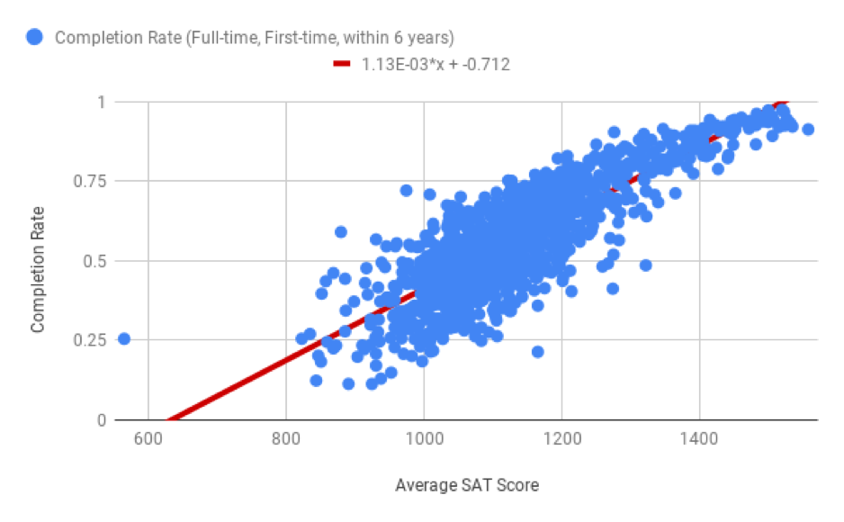

.. Copyright (C)  Google, Runestone Interactive LLC
   This work is licensed under the Creative Commons Attribution-ShareAlike 4.0
   International License. To view a copy of this license, visit
   http://creativecommons.org/licenses/by-sa/4.0/.

.. _regression_and_line_of_best_fit:

Regression and “Line of Best Fit”
=================================

The closer the coefficient of determination is to 1, and the closer the
points of the scatter plot are to a straight line, the more reliable
your predictions will be. A natural next question is: what does this
line mean?

This line is called the **line of best fit**, or a **regression line**.
After making a scatter plot, you can add a line of best fit by opening
the chart editor. Under “Series”, there is a checkbox to add a
trendline. You can change the color and thickness of the line, display
the R2 value, (this is the same coefficient of determination as
described `above <#correlation>`__), and display the equation of the
line.

|alt_text|

You can also find the slope and intercept of this line using the
*SLOPE()* and\_ INTERCEPT()\_ functions in Sheets.

[TO DO] Note: Video of finding regression line, slope and intercept

In this section, you’ll learn how to use the equation of the line of
best fit to make predictions and explain how changes in one variable may
impact the other. Here are some questions a line of best fit helps to
answer.

-  If a school has an average SAT score of 1200, what is its predicted
   completion rate?
-  If two schools have a difference of 100 points in average SAT score,
   will their graduates make different salaries after graduation? If so,
   by how much?
-  How does the percentage of students receiving federal loans impact
   completion rates?
