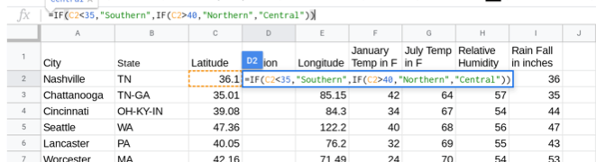
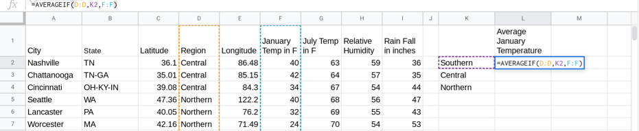
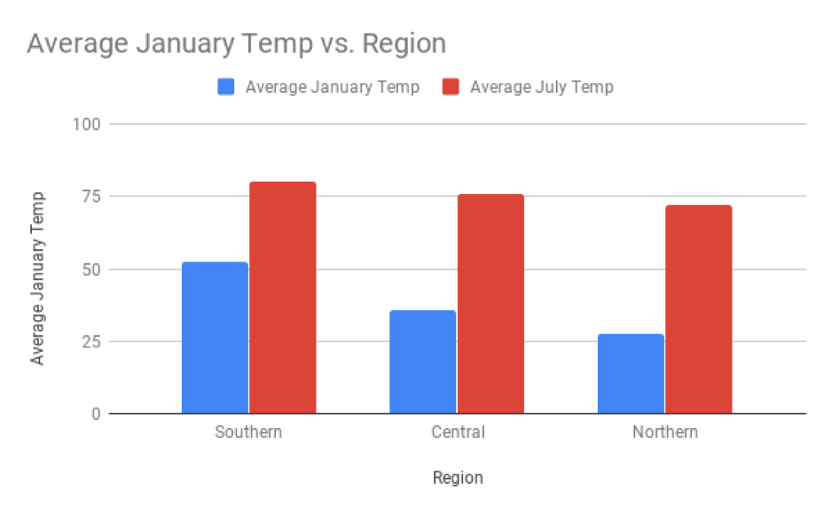

.. Copyright (C)  Google, Runestone Interactive LLC
   This work is licensed under the Creative Commons Attribution-ShareAlike 4.0
   International License. To view a copy of this license, visit
   http://creativecommons.org/licenses/by-sa/4.0/.

Introduction
============

You probably already know that a city’s latitude affects its
temperature: cities closer to the north and south pole are generally
pretty cold, while cities close to the equator are generally pretty
warm. Suppose you wanted to quantify this relationship in order to make
specific predictions. Instead of saying “cities are generally colder
closer to the north pole,'' you could say, “as latitude increases by 10
degrees, temperature decreases by 20 degrees”.

The `following
dataset
<https://drive.google.com/open?id=1Qhl09FAMxhHr9WVIKxfVK9UklvDVpiYMdgvKuaWZRa0>`__
contains `latitude,
longitude <https://en.wikipedia.org/wiki/Geographic_coordinate_system>`__,
and weather data for different cities in the USA. Using histograms to
plot latitudes and temperatures independently would be useful in order
to see the distribution of each variable alone, but would tell you
nothing about the overall relationship between latitude and temperature.

.. shortanswer:: scatter_intro_q1

   How would you investigate this relationship, with the tools we have?

One method could be to group the cities based on their latitude, and
then compare the mean temperature for each group. Comparing the means
for each group will quantify if and how much latitude impacts
temperature.

A latitude closer to 0 degrees means a city is closer to the equator,
and a latitude closer to 45 degrees means a city is closer to the poles.
For cities in the northern hemisphere, like those in the USA, smaller
latitudes indicate southern cities, and larger latitudes indicate
northern cities. `See here for a map of the USA with latitude and
longitude
lines.
<https://pasarelapr.com/images/map-of-usa-with-lines-of-latitude-and-longitude/map-of-usa-with-lines-of-latitude-and-longitude-2.jpg>`__
Most cities in the continental states are between 25 and 50 degrees, so
to group these, cities south of 35 degrees latitude will be labelled
“Southern”, cities north of 40 degrees latitude will be labelled
“Northern”, and those in the middle will be labelled “Central.” This
choice is somewhat arbitrary, but it breaks the cities into three fairly
even groups. Add a new column with these labels based on a formula.

Question: Predict which region will have the highest January
temperatures.

Question: Predict which region will have the lowest July temperatures.

You can use the *AVERAGEIF* function (from the section on grouping) to
find the mean temperature for a given month and region.

*NOTE: Link to Module A grouping.*

.. shortanswer:: scatter_intro_q2

   What was the mean January temperature for cities in the Central region?

.. shortanswer:: scatter_intro_q3

   What was the mean July temperature for cities in the Northern region?

.. shortanswer:: scatter_intro_q4

   Which region has the largest difference between its January mean temperature
   and its July mean temperature?

Functions like AVERAGEIF are a great way to calculate the mean for a
specific region and/or month. But what if you want to see, in one
visualization, the mean temperature for January and July across all
regions? To do this, you can use a bar chart.

.. shortanswer:: scatter_intro_q5

   Which month has a bigger regional difference in temperatures?

.. shortanswer:: scatter_intro_q6

   Dayton, Ohio and Memphis, Tennessee are both in the Central
   region, but Dayton has a latitude of 39.54 degrees, while Memphis has a
   latitude of 35.07 degrees. These cities were put in one category, even
   though they have very different latitudes. Using what you’ve learned,
   predict which of these cities (and why) will have a colder January
   temperature.
