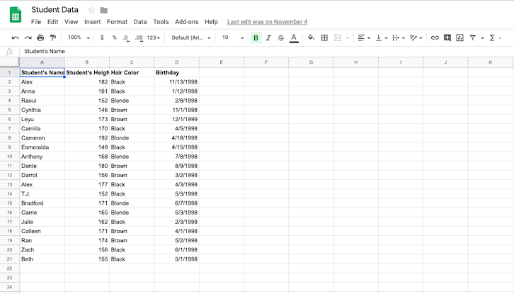

.. Copyright (C)  Google, Runestone Interactive LLC
   This work is licensed under the Creative Commons Attribution-ShareAlike 4.0
   International License. To view a copy of this license, visit
   http://creativecommons.org/licenses/by-sa/4.0/.

Introduction
============

Spreadsheets are a very powerful and widely-used tool. Spreadsheet softwares can
generate graphs, do calculations extremely quickly, and even predict the future
using statistics!
This section introduces you to the basics of spreadsheets, and walks through a
few illustrative examples.

There are multiple spreadsheet softwares, including Google Sheets, Apple
Numbers, Microsoft Excel, and more. While functionality may differ slightly
across platforms, the core concepts and syntaxes are the same. In this course,
whenever sheets are mentioned, it is in reference to Google Sheets, which is
pictured below with example student data.

