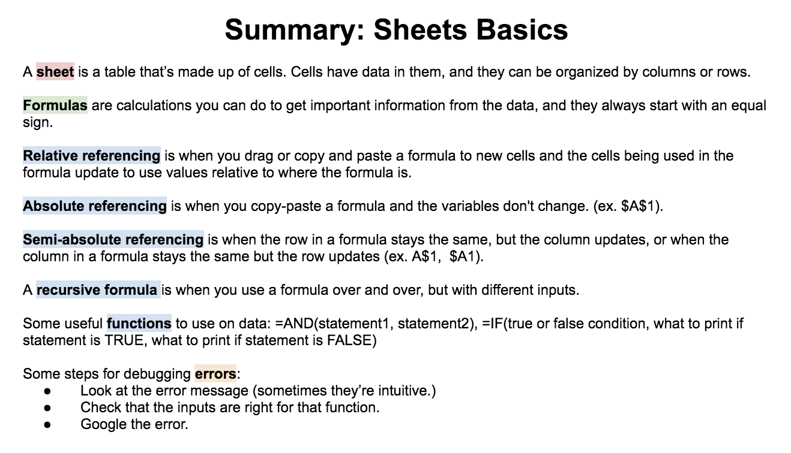

.. Copyright (C)  Google, Runestone Interactive LLC
   This work is licensed under the Creative Commons Attribution-ShareAlike 4.0
   International License. To view a copy of this license, visit
   http://creativecommons.org/licenses/by-sa/4.0/.

ing is when you drag or copy and paste a formula to new cells and the cells being used in the formula update to use values relative to where the formula is. Absolute referencing is when you copy-paste a formula and the variables don't change. (ex. $A$1). Semi-absolute referencing is when the row in a formula stays the same, but the column updates, or when the column in a formula stays the same but the row updates (ex. A$1, $A1). A recursive formula is when you use a formula over and over, but with different inputs. Some useful functions to use on data: =AND(statement1, statement2), =IF(true or false condition, what to print if statement is TRUE, what to print if statement is FALSE). Some stps for debugging errors: Look at the error message (sometimes they're intuitive). Check that the inputs are right for that function. Google the error.
