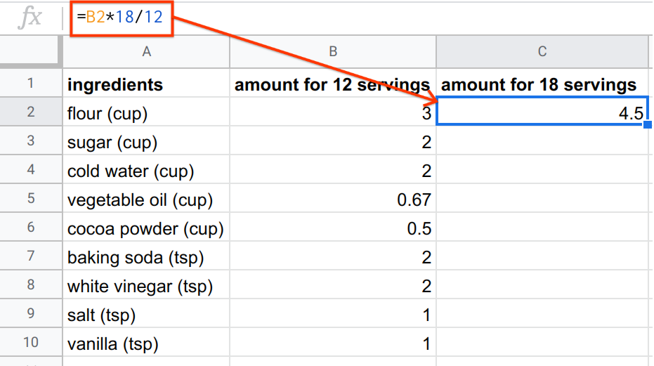
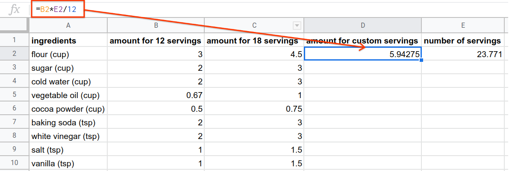
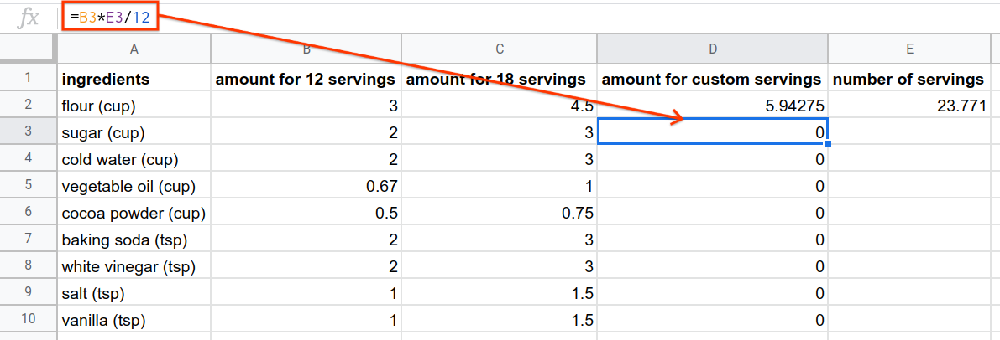
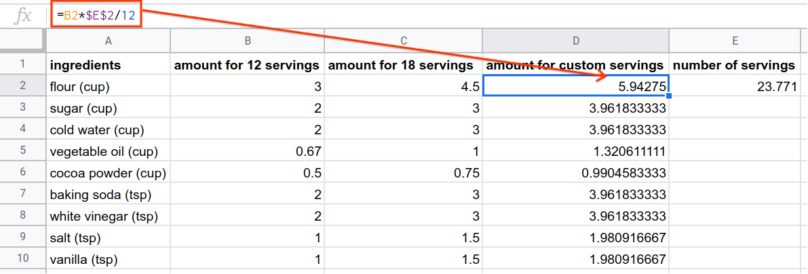

.. Copyright (C)  Google, Runestone Interactive LLC
   This work is licensed under the Creative Commons Attribution-ShareAlike 4.0
   International License. To view a copy of this license, visit
   http://creativecommons.org/licenses/by-sa/4.0/.

What Is A Formula?
==================

Formulas are a way of manipulating data in Sheets. A formula processes data in
the same way a calculator does, but in a more organized and useful way that
allows you to combine calculations.

All formulas start with the ``=`` character. This tells Sheets that this cell is
a formula, rather than raw data. What makes formulas so useful is that the input
to a formula can be new data (e.g. ``=1+1``), or existing data from cells (e.g.
``=A1+A2``), or a combination (e.g. ``=A1+1``). Below are some illustrative
examples of how formulas work.

.. spreadsheet:: formulas
   :colwidths: 300,300
   :coltitles: 'formula','result'

   "&#61;1+1",2
   "&#61;2^2",4
   "&#61;(1+1=3)",FALSE
   "&#61;CONCATENATE(""abc"", ""xyz"")",abcxyz
   "&#61;B2+B3",6
   "&#61;2^B3",16
   "&#61;-B6/10",-0.6

Note that if Sheets cannot parse or calculate your formula, you will see an
error. See :ref:`this section<errors>` for more on errors.

.. fillintheblank:: exponent_formula

   Write a formula to calculate :math:`2^{10}`. |blank|

   - :=2\^10: Correct
     :2\^10: Incorrect: Don't forget the ``=`` symbol.
     :x: Incorrect

.. fillintheblank:: multiplication_formula

   Use Sheets to calculate :math:`-1.23 * 9.87` to 2 decimal places. |blank|

   - :-12.14: Correct
     :x: Incorrect

Example: Chocolate Cake
-----------------------

Suppose you are going to a party, and you decide to bake a cake. Your favorite
is chocolate cake, so you decide to make `this “quick chocolate cake”`_. You
note that the recipe serves 12, so you ask the party hosts how many guests are
attending. They say they will need 18 servings.

Since you are now more familiar with Sheets, instead of manually calculating,
for each ingredient, how to alter this recipe for 18 people, you use a formula.
Sheets allows you to perform the same calculation for all ingredients, with one
formula.

First, you enter the recipe for 12 servings into a table. (Note that for the
ingredients with fractional amounts like 2/3 cup vegetable oil, you need to use
a formula, namely ``=2/3``).

.. spreadsheet:: chocolate_cake
   :colwidths: 300,300
   :coltitles: 'ingredient','amount for 12 servings'

   flour (cup),3
   sugar (cup),2
   cold water (cup),2
   vegetable oil (cup),0.67
   cocoa powder (cup),0.5
   baking soda (tsp),2
   white vinegar (tsp),2
   salt (tsp),1
   vanilla (tsp),1

Now, you know that for 18 people, you will need to scale up everything to 18.
You can do this by multiplying each ingredient by the scale factor of 18/12.
(You can think of this as dividing by 12 to get the amounts for 1 serving, then
multiplying by 18 to get the amounts for 18 servings.)

You can use column C to write a formula to get the amounts for 18 servings.
First, you need to write the formula for row 2, namely flour. The amount for 12
servings is in cell B2. You want to upsize this ingredient by a factor of 18/12,
so the formula is as follows.

.. code-block:: none

   =B2*18/12

.. https://screenshot.googleplex.com/WRcQNS1jEEQ

So for 18 servings, you need 4.5 cups of flour. Now, it’s as simple as
copy-pasting this same formula to the other rows. You can do this using in-built
copy-paste functionality, or you can drag down from the corner of the cell.

.. fillintheblank:: chocolate_cake_cocoa_powder_for_18_servings

   How many cups of cocoa powder do you need for 18 servings? |blank|

   - :0.75: Correct
     :x: Incorrect

The best thing about Sheets is that you could recreate this recipe no matter how
the numbers change. For example, suppose the hosts ask you to bring enough for
23.771 servings. (There are 24 people, but one person is on a diet, and has
asked for only 0.771 servings.) You can actually encode the number of servings
into the formula, so that the shopping list automatically updates whenever you
update the number of servings.

Use column D to show the amount required for the custom number of servings, and
use cell E2 to store the desired number of servings, as below.

.. https://screenshot.googleplex.com/8fAdyqz19P4

.. image:: figures/chocolate_cake_custom_servings.png
   :align: center

Now, you can write a formula in column D, similar to the formulas in column C,
except instead of **hardcoding** (entering a number manually) the number of
servings, use cell E2 to indicate the number of servings.

.. https://screenshot.googleplex.com/sOJe1zonsHk

.. shortanswer:: dragging_formula_down

   What do you think will happen if you drag this formula to the rows below?

As was done in column C to calculate the recipe amounts for 18 servings, try
dragging the formula in column D down to the rows below. You should observe that
in this case, copy-pasting the formula did not behave as you might have wanted
it to.

.. shortanswer:: why_dragging_formula_down_did_not_work

   Why do you think copy-pasting this formula produced all zeros?

The formula in cell D2 references cells B2 and E2. When you copy-paste this
formula to D3, Sheets assumes you want the formula to update to reference cells
B3 and E3.

.. https://screenshot.googleplex.com/fDO6Vri1O3V

This is called **relative referencing**, because cell referencing in the formula
is relative to where the formula is used. (So when it is used in D3, it
references B3 and E3.) If you want a cell reference to *not* update when the
formula is copy-pasted, you need to use **absolute referencing**.

Sheets assumes references are relative. To tell Sheets to reference a cell
absolutely, you need to use the ``$`` symbol.

Consider the cell A1 used in a formula:

-   If you use A1 in a formula, this is an implicit relative reference. Any cell
    you copy the formula in will reference a different cell.

-   If you use $A$1 in a formula, this is an absolute reference. Any cell you
    copy the formula in will still reference $A$1.

You might be wondering what happens if you only include one of the ``$`` symbols
when referencing A1. This is called semi-absolute referencing, and can be used
to keep the row or column as an absolute reference while using the other as a
relative reference. `You can learn more about cell referencing here.`_

As an example, suppose you have the following sheet.

.. spreadsheet:: absolute_vs_relative_referencing_sheet
   :colwidths: 200

   1
   2
   3
   4
   5
   6
   7
   8
   9
   10

.. TODO(https://github.com/RunestoneInteractive/RunestoneComponents/issues/901):
   Change question to allow students to do this within the webpage.

.. shortanswer:: absolute_vs_relative_referencing

   Copy this data to a spreadsheet, and in cell B1, enter the formula
   ``=A1*$A$2``. When you copy-paste this formula down, what numbers do you
   expect to see?

In this chocolate cake example, you want column B to be referenced relatively
(so when you copy-paste to rows below, it updates itself), but cell E2 to be
referenced absolutely. So, the formula for cell D3 should be as below.

.. code-block:: none

   =B2*$E$2/12

Copy-pasting this formula down for the other ingredients now works as intended.

.. https://screenshot.googleplex.com/XkSctAUZVNa

Now, if you update the number of servings you need in cell E2, the amounts for
the shopping list magically update themselves.

.. fillintheblank:: eggs_for_chocolate_cake

   If 9.87 servings are required, you will need |blank| teaspoons of vanilla.
   Use 2 decimal places in your answer.

   - :0.82: Correct
     :9.87: Incorrect: The original recipe made 12 servings, not 1.
     :x: Incorrect

Doing all of these steps manually, for each ingredient, would be challenging and
may result in miscalculations. Doing it in Sheets might take some getting used
to, but once you have the hang of using formulas, it makes calculations like
this extremely simple!

Example: The Fibonacci Sequence
-------------------------------

While it is sometimes useful to use formulas as a type of calculator, formulas
are most powerful when extending the same operation to multiple rows or columns.
To illustrate this, consider `the Fibonacci Sequence`_.

**The Fibonacci Sequence is a sequence of positive numbers where each number is
the sum of the previous two numbers in the sequence.** The sequence starts with
the numbers 0, 1, 1, 2, and goes on infinitely. The sequence looks like:

.. code-block:: none

   0, 1, 1, 2, 3, 5, 8, 13, 21, ...

.. fillintheblank:: fibonacci_next_numbers

   The next two numbers in the sequence are |blank| and |blank|.

   - :34: Correct
     :x: Incorrect

   - :55: Correct
     :x: Incorrect

The Fibonacci sequence has a very special and fundamental relationship with
nature and art. It can predict, for example, the `number of rabbits in a
population`_. Fibonacci numbers also appear in `flower and leaf growth`_. The
real-life examples of the Fibonacci sequence don’t stop there. As the numbers in
the Fibonacci sequence get larger and larger, the ratio between consecutive
numbers in the sequence gets closer and closer to the `golden ratio`_. This
number is prevalent in pure mathematics, physics, nature, sculpture,
architecture, and art (for example in the `Mona Lisa`_). `You can read more
about the golden ratio’s appearance in classical and modern art here.`_

Now, suppose you wanted to generate the 50th number of the Fibonacci sequence.
You could do this by hand with lots of mental arithmetic, but this would take a
long time and could lead to errors. You could use a calculator, but that would
still require you to type about 50 individual sums, which would take a long
time. Let’s instead look at how using Sheets can help you save time and prevent
mistakes.

In Sheets, the Fibonacci sequence can be generated with one simple formula that
you can then extend to get as many numbers in the sequence as you need.

1.  Start by manually entering the initial numbers of the sequence: 0, 1 in
    cells A1 and A2.
2.  The third number in the sequence is the sum of the previous two numbers, so
    enter the formula ``=A1+A2`` in cell A3.

3.  This formula in Sheets is ``=A1+A2``. Since each cell is referenced
    relatively, it actually means “add the two numbers above this cell”.
    Therefore, if you copy-paste this formula to the next cell A4, Sheets
    interprets this as the formula ``=A2+A3``.

4.  This can be extended to any number of cells. Drag the formula (or copy-paste
    it) to all cells in A up to A50, to show the 50th Fibonacci number.

So the 50th number in the Fibonacci sequence is 7,778,742,049! In this example,
each cell adds the two previous cells, which in turn is used to calculate the
next cell. This is a type of **recursive formula**, where the same formula is
being used over and over, but with different inputs.

.. TODO(raskutti): Embed screencast of entire process above.

Calculating this by hand or using a calculator would have taken way too much
time and brainpower. Sheets lets you spend your time and brainpower on more
important things!

.. fillintheblank:: fibonacci_75th_number

   What is the first digit of the 100th Fibonacci number? |blank|

   - :2: Correct
     :3: Incorrect: Remember 0 is the 1st Fibonacci number.
     :x: Incorrect

.. _what_is_a_formula_painters:

Example: Painters
-----------------

To further illustrate how formulas can automate data processing,
consider the painters dataset again. Don’t worry if this example seems a bit
daunting at first; it is designed to be challenging.

Suppose you’re interested in studying only the most prolific French painters,
specifically French painters who produced over 200 paintings in their lifetimes.
(Note that there are a few painters with multiple nationalities listed. For the
purposes of this example, consider “French” to mean only French listed as a
nationality.)

First, let’s create a column that shows whether the painter was “prolific” by
your definition. Each new formula should be in a new column. You can use column
I to write this formula. Remember that you only need to write a formula for one
row and it can be copy-pasted to the other rows, as was done in the Fibonacci
example.

Start with the first observation row, row 2. (Row 1 contains the column
headings.) The painter is Amedeo Modigliani. Column H contains the number of
paintings. So, to see if Amedeo Modigliani painted over 200 paintings, column I
should contain the following formula.

.. code-block:: none

   =H2>200

This formula evaluates to ``TRUE`` only if the value in H2 is greater than 200
and ``FALSE`` if it’s not. You can then drag down or copy-paste that formula to
the remaining rows.

Now, you can use column J to write a formula to show whether or not each painter
was French. Column E contains the nationality, so to see if Amedeo Modigliani is
French, column J should contain the following formula.

.. code-block:: none

   =E2=“French”

This formula might be a bit confusing due to the use of two ``=`` characters.
The first ``=`` is telling Sheets that this cell contains a formula. The second
``=`` is a comparison (just like ``<`` or ``>``), comparing cell E2 to the word
“French”.

Once you have your answer for Modigliani, you can copy-paste this formula for
the other painters as well.

Going back to our original question (which French painters painted over 200
paintings in their lifetimes?), we must have a final answer to satisfy both
conditions:

-   That the painter painted 200 paintings
-   That the painter was French

This means both column I and column J must be ``TRUE``. Rather than manually
checking each answer, which can lead to mistakes, especially when you are
working with hundreds of rows of data, you can use the ``AND`` function.

.. admonition:: **The**
   ``AND`` 
   **Function**

   The ``AND`` function returns ``TRUE`` if and only if each statement separated
   by a comma within its brackets are ``TRUE``. The syntax looks as below.

   .. code-block:: none

   =AND(statement1, statement2, ...)

In this case, ``AND`` is used to check that both I2 and J2 are ``TRUE``,
so the formula looks as below.

.. code-block:: none

   =AND(I2=TRUE, J2=TRUE)

As usual, once this formula has been written for Amedeo Modigliani, it can be
dragged or copy-pasted for the other 49 painters. This gives a ``TRUE`` or
``FALSE`` in column K for all painters as to whether the listed painter was
classified as a prolific French painter.

You might, however, find that column K is still a little hard to digest, and
doesn’t present you with a succinct list of the prolific French painters in this
dataset. Adding another formula in column L can help with that! In this column,
you can write a formula that prints the artist’s name if they are prolific and
French, and prints nothing if not. This can be done using the ``IF`` function.

.. admonition:: **The**
   ``IF`` 
   **Function**

   The ``IF`` function is used to show different results based on a condition.
   The syntax looks as below.

   .. code-block:: none

      =IF(condition that is true or false,
          what to print if statement is TRUE,
          what to print if statement is FALSE)

Since column K contains a condition that tells you whether the artist is
prolific and French, all you need to do is print the artist’s name (which
appears in column B) if ``TRUE``, and an empty cell if ``FALSE``. (The empty
cell actually contains the blank word “”.) So the formula in column L for the
first painter should look as follows.

.. code-block:: none

   =IF(K2, B2, “”)

You can then drag down this formula to show the name of all French painters who
painted over 200 paintings.

.. mchoice:: french_painters

   Who are the French painters who painted over 200 paintings?

   - Titian

     - Incorrect

   - Pierre-Auguste Renoir

     + Correct

   - Paul Gauguin

     + Correct

   - Diego Rivera

     - Incorrect

   - Claude Monet

     - Incorrect

   - Edgar Degas

     + Correct

Of course, instead of using four formulas to find these painters, you could do
this all in one formula, by wrapping each step into the next. However, when
first starting, it helps to isolate each step into its own formula.

.. TODO(raskutti): Embed screencast of the entire exercise above, then using
   only one formula.

.. shortanswer:: italian_painters

   Find all (exclusively) Italian painters who painted fewer than 400 paintings.

.. _this “quick chocolate cake”: https://www.bhg.com/recipe/chocolate-cakes/quick-chocolate-cake/
.. _You can learn more about cell referencing here.: https://edu.gcfglobal.org/en/googlespreadsheets/types-of-cell-references/1/
.. _the Fibonacci Sequence: https://en.wikipedia.org/wiki/Fibonacci_number
.. _number of rabbits in a population: https://science.howstuffworks.com/math-concepts/fibonacci-nature.htm
.. _flower and leaf growth: https://www.mathsisfun.com/numbers/nature-golden-ratio-fibonacci.html
.. _golden ratio: https://en.wikipedia.org/wiki/Golden_ratio#Relationship_to_Fibonacci_sequence
.. _Mona Lisa: https://thefibonaccisequence.weebly.com/mona-lisa.html
.. _You can read more about the golden ratio’s appearance in classical and modern art here.: https://news.artnet.com/art-world/golden-ratio-in-art-328435
