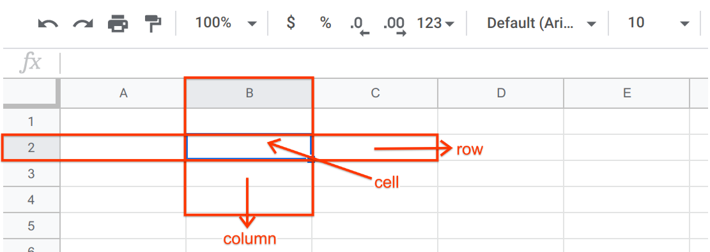
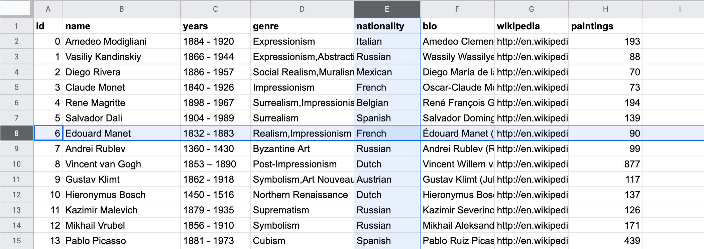

.. Copyright (C)  Google, Runestone Interactive LLC
   This work is licensed under the Creative Commons Attribution-ShareAlike 4.0
   International License. To view a copy of this license, visit
   http://creativecommons.org/licenses/by-sa/4.0/.

What Is A Sheet?
================

Fundamentally, a spreadsheet (also known as a sheet) is a table, or a matrix. It
is a 2-dimensional way of viewing **data** (any form of information used for
reference or analysis), through rows and columns. Spreadsheets are used to
store, manipulate, and analyze data. You can create a spreadsheet using Google
Sheets, which is simply referred to as Sheets throughout this textbook. Sheets
is often used to store **datasets**, which are related sets of different data
points. Below is the key terminology you need to know when using Sheets.

.. admonition:: Basic Definitions

   -   **Cell**: A cell is the smallest unit in a sheet. Each cell can contain
       any form of data.
   -   **Column**: A column is a vertical group of cells, defined in Sheets with
       a *letter*.
   -   **Row**: A row is a horizontal group of cells, defined in Sheets with a
       *number*.
   -   **Sheet**: A sheet is a singular page in a Sheets document. A sheet
       contains its own table. You can create as many sheets within one document
       as as you like.

Note that a cell is usually defined by a letter and a number (in that order, by
convention): the letter of the column and the number of the row. In the image
below, **the highlighted cell is C4, meaning the column is C, and the row is
4**. The current sheet is called sheet1.

Example: Painters
-----------------

The definitions above might be a bit abstract. Sheets makes a lot more sense
when there is data, so here is an example. In `this dataset`_, there is
information about 50 of the most prolific painters of all time.

In general:

-   **Each row is an observation of the data.** In this example, each row is a
    painter. For example, row 8 (where id = 6) tells you about Edouard Manet. If
    you were to add a new painter to this dataset, you would add a new row. You
    can add a new row by clicking "Insert" in the menu bar, and selecting either
    "Row Above" or "Row Below."
-   **Each column is an attribute of the data.** In this example, each column
    tells you something about the painter (e.g. “name”, “years”). For example,
    column E tells you about a painter’s nationality. If you were to add a new
    attribute to this dataset (e.g. the number of children they had), you would
    add a new column. You can add a new column by clicking "Insert" in the menu
    bar, and selecting either "Column Above" or "Column Below."
-   **Each cell is an attribute of an observation.** In this example, each cell
    tells you something specific about a given painter. For example, cell E8
    tells you that Edouard Manet was French. If you have new information for an
    existing artist and attribute (e.g. you found out that Salvador Dali was
    French, not Spanish), you would update a cell.

Use `this dataset`_ to answer the following questions.

.. mchoice:: picasso_nationality

   What nationality was Pablo Picasso?

   - French

     - Incorrect

   - Belgian

     - Incorrect

   - Spanish

     + Correct

   - Italian

     - Incorrect

.. fillintheblank:: da_vinci_death

   In what year did Leonardo da Vinci die? |blank|

   - :1519: Correct
     :x: Incorrect

.. fillintheblank:: andy_warhol_genre_change

   If you wanted to change the genre of Andy Warhol, what cell would you have to
   alter? |blank|

   - :D47: Correct
     :x: Incorrect: Don’t get the row number mixed up with the value in the “id”
         column.

.. _this dataset: https://docs.google.com/spreadsheets/d/17bkoB97dUdR0MBuaBXsWLR0VjkEYhJydXJUYV0tcWjw/edit#gid=2146787371
