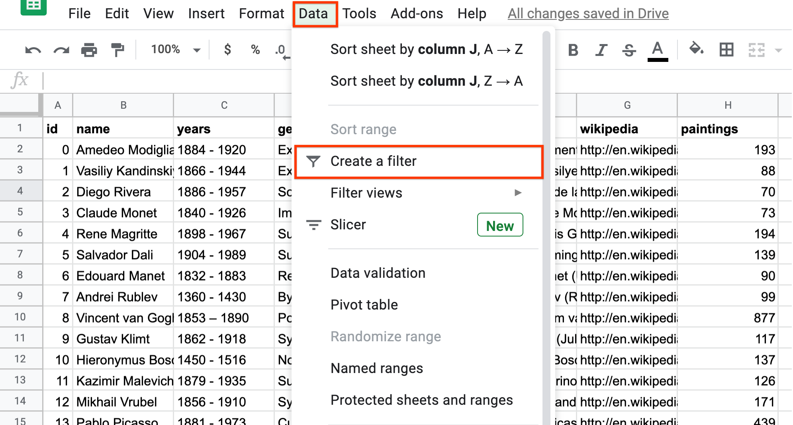
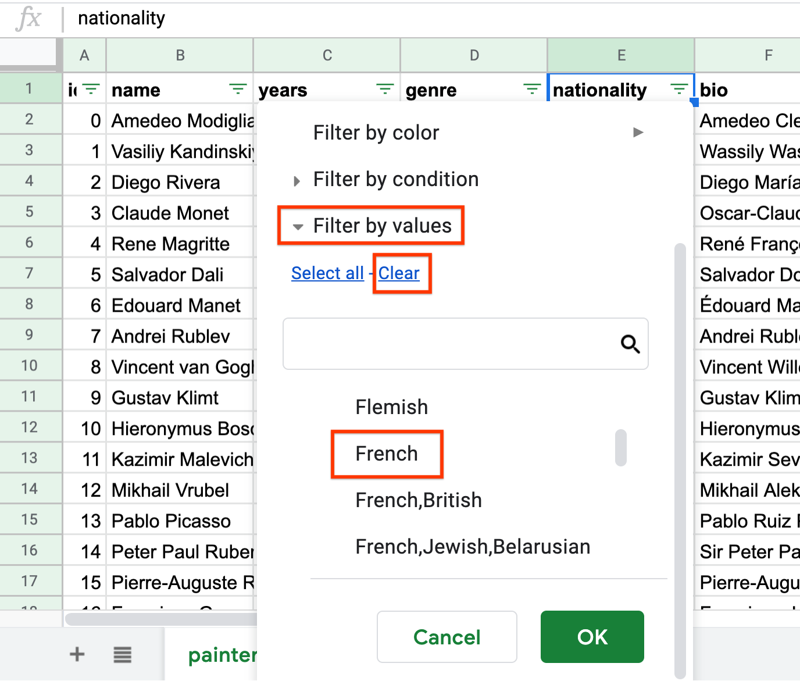
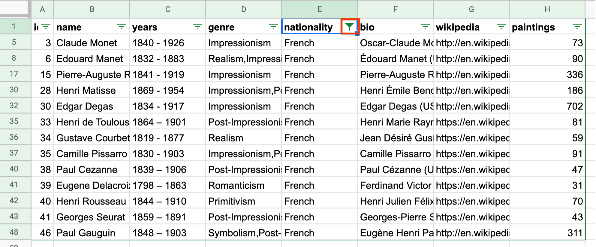
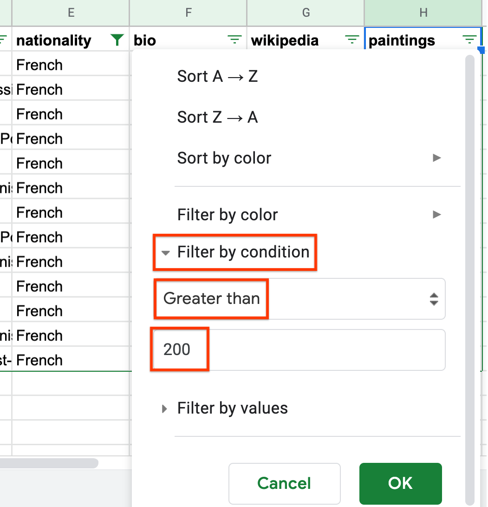
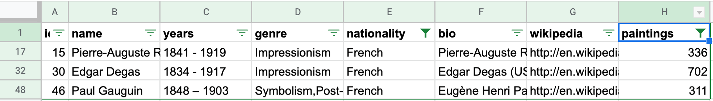
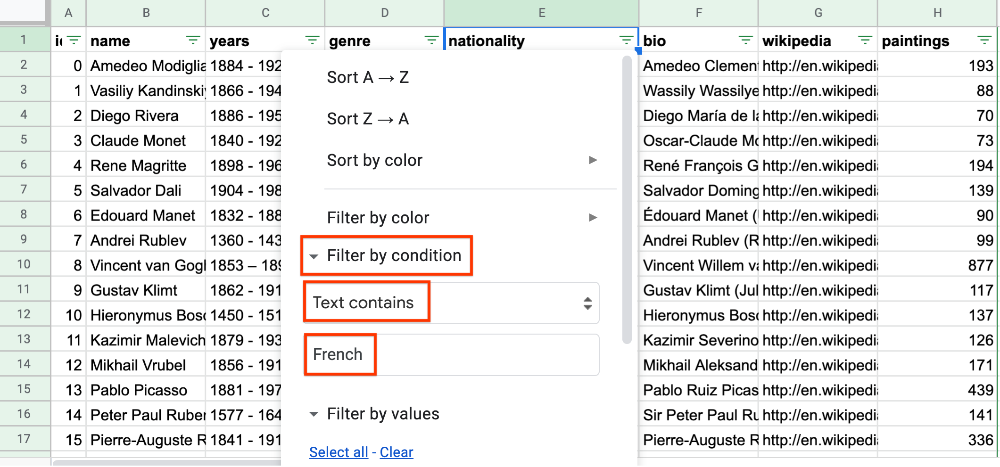

Filtering Data
==============

Sometimes, you want to look at an entire dataset. But at other times, you may
also be interested in just a specific subset of a dataset. For example, if you
have data on all of the USA, you may want to do data analysis on a specific
state only.

.. admonition:: Filters in Sheets

   **A filter is a way of selecting a subset of rows based on a set of column
   conditions.** A “column condition” is a statement on the value in a column.

For example, if column A contains two-letter state codes of the USA, and you
wanted to subset the dataset to only rows corresponding to California, the
condition on that column would be ``“=CA”``.

In Sheets, you can create a filter by clicking “Data > Create a filter”. This
creates a filter, assuming row 1 contains column headers, for each column in the
dataset. (Note that there is also a `FILTER function`_ in Sheets that you can
use in formulas. This is discouraged, since using the formula is less intuitive
than using the filter itself, and as such this section does not cover it.)

.. _filtering_data_painters:

Example: Painters
-----------------

A few chapters ago in :ref:`this example<what_is_a_formula_painters>`, you used
formulas to filter a dataset of painters down to show only French painters who
had painted over 200 paintings. For simplicity, that example assumed that a
painter was French if French was listed as their only nationality. This example
illustrates how to recreate that solution using filters, and also extends the
example to include French painters who also have other nationalities listed.

.. TODO(raskutti): Embed
   https://docs.google.com/spreadsheets/d/1KsjcplW-ooOEfrYsCRT5lJ4W9LVIzxXPU5V_9F7JE1w/edit#gid=0

The first step is to add a filter to this dataset, by navigating to “Data >
Create a filter”. Make sure that your cursor is clicked anywhere around the data
that is to be filtered. In this example, it is anywhere in the range A1:H51.

.. https://screenshot.googleplex.com/cjxxxDAaJV8

You should now see that each column, in row 1, has a filter icon. Now, you can
use this filter to filter down to rows where the nationality is French. First,
click on the nationality filter icon. In this case, you are filtering by a value
(an exact nationality). Pressing “Clear” removes all selections. You can then
select “French”, either by scrolling through the values, or by typing “French”.

.. https://screenshot.googleplex.com/8ospuxkfvzG

When you click “OK”, the result will be only French painters, and the
nationality filter icon is now filled, rather than empty.

.. https://screenshot.googleplex.com/wFYYf2FACqB

Now you can do the same for values of paintings greater than 200. In this case,
you are filtering by a condition, the condition that the number of paintings is
greater than 200. This is different than filtering by a value, for example, if
you were filtering for when number of paintings is *equal to* 200.

So within the filter box, you should select “Filter by condition”, scroll to
“Greater than”, and type 200. This creates a filter conditioning on the number
of paintings being greater than 200.

.. https://screenshot.googleplex.com/DtiDPZKsMKN

Once this is done, the green filter icon should be filled, and you should see
only three rows left. Specifically, the same three painters found using formulas
in the previous example: Renoir, Degas, and Gauguin.

.. https://screenshot.googleplex.com/3e5BfB4k9vX

.. mchoice:: italian_painters_with_less_than_100_paintings

   Filter this dataset to find all Italian (exclusively Italian) painters who
   painted fewer than 100 paintings.

   - Raphael

     - Incorrect

   - Caravaggio

     + Correct

   - Michelangelo

     + Correct

   - Eugene Delacroix

     - Incorrect

Filters make this kind of exercise significantly easier. What was previously a
complicated formula is now just two simple filters. Moreover, filters allow you
to be more specific with your conditions. Suppose, instead of looking at
painters who only have French nationality, you now want to look at painters for
whom at least one of their nationalities is French. (For example, this includes
Alfred Sisley, whose nationalities are French and British.)

Since this filter is not based on an exact equality, you need to use a “Filter
by condition”. You can change the filter applied to the “nationality” column,
from a “Filter on values” to a “Filter on condition”. You can scroll to “Text
contains”, then type the word “French”.

.. https://screenshot.googleplex.com/FeBwGZsztoe

.. fillintheblank:: french_impressionist_painters

   Find the only two painters associated with any form of Impressionism
   (including Post-Impressionism), but who do not have French listed as a
   nationality. (Write the full names as spelled in the sheet. Use the order of
   the ID in the sheet.) (Hint: Use “Text (does not) contain(s)” under “Filter
   by condition”.) |blank| and |blank|

   - :Rene Magritte: Correct
     :Vincent van Gogh: Remember to list the artists in the right order.
     :x: Incorrect

   - :Vincent van Gogh: Correct
     :Rene Magritte: Remember to list the artists in the right order.
     :x: Incorrect

.. _FILTER function: https://support.google.com/docs/answer/3093197?hl=en
