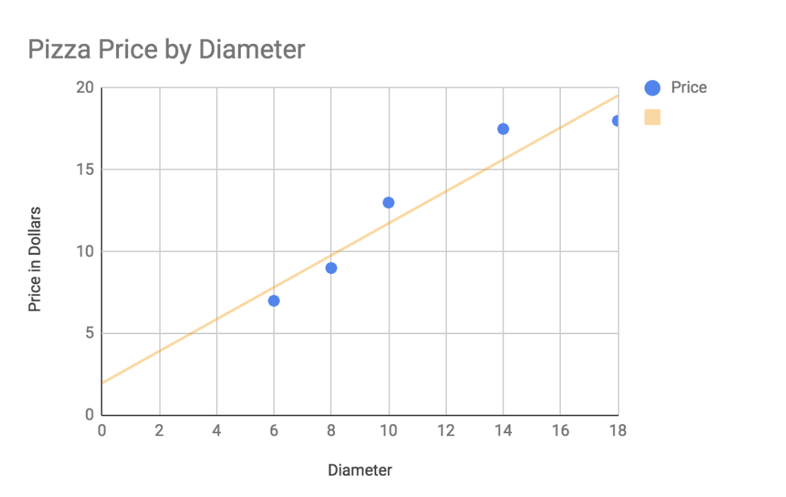

..  Copyright (C)  Google, Runestone Interactive LLC
    This work is licensed under the Creative Commons Attribution-ShareAlike 4.0 International License. To view a copy of this license, visit http://creativecommons.org/licenses/by-sa/4.0/.

Predicting Pizza Prices - Linear Regression
===========================================

Linear regression is probably one of the most widely used algorithms in data science, and many other sciences.  One of the best things about linear regression is that it allows us to learn from things that we know or use observations and measurements of things we know to make predictions about new things.  These predictions might be about the likelihood of a person buying a product online or the chance that someone will default on their loan payments.  To start we are going to use an even simpler example predicting the price of pizza based on its diameter.

I have made an extensive study of the pizza places in my neighborhood and here is a table of observations of pizza diameters and their price.

======== =====
Diameter Price
======== =====
6        7
8        9
10       13
14       17.5
18       18
======== =====

Your first task is to put the data into a spreadsheet and make a scatter plot of the diameter versus the price.  What you can see pretty easily from this graph is that as the diameter of the pizza goes up, so does the price.

If you were to draw a straight line through the points that came as close as possible to all of them, it would look like this:

The orange line called the trend-line or the regression line is our best guess at a line that describes the data.  This is important because we can come up with an equation for the line that will allow us to predict the y value (price) for any given x value (diameter).  Linear regression is all about finding the best equation for the line.

How do we do that?  There are actually several different ways we can come up with the equation for the line.  We will look at two different solutions, one is a closed form equation that will work for any problem like this in just two dimensions.  The second is a solution that will allow us to generalize the idea of a best fit line to many dimensions!

Recall the equation for a line that you learned in algebra:  :math:`y = mx + b`  What we need to do is to determine values for m and b.   One way we can do that is to simply guess! And keep refining our guesses until we get to a point where we are not really getting any better.  You may think this sounds kind of stupid, but it is actually a pretty fundamental part of many machine learning algorithms.

You may also be wondering how we decide what it means to "get better"?  In the case of our pizza problem we have some data to work with, and so for a given guess for m and b we can compare the calculated y (price) against the known value of y and measure our error.  For example:  Suppose we guess that b = 5 and that m = .8 for a diameter of 10 we get y = .7 x 10 + 5 or 12.  Checking against our table the value should be 13 so our error is our known value minus our predicted value 13-12 or 1.  If we try the same thing for a diameter of 8 we get y = .7 x 8 + 5 or 10.6  The error here is 9 - 10.6 or -1.6.

Add a column to the spreadsheet that contains the predicted price for the pizza using the diameter as the x value and using a slope of .7 and intercept of 5.

Now plot the original set of data along with the this new table of data.  Make the original one color and your calculated table another color.  Experiment with some different guesses for the slope and intercept to see how it works.

Next lets add another column to the table where we include the error. Now we have our 'predicted values' and a bunch of error measurements.  One common way we combine these error measurements together is to compute the Mean Squared Error (MSE)  This is easy to compute because all we have to do is square each of our errors, add them up and then divide by the number of error terms we have.  Why do we square them first?  Well, did you notice that in our example one of the errors was positive and one was negative, but when we add together both positive and negative numbers they tend to cancel each other out making our final mean value smaller.  So we square them to be sure they are all positive.  We call this calculation of the MSE an **objective function**. In many machine learning algorithms our goal is to minimize the objective function.  That is what we want to do here, we want to find the value for m and b that minimizes the error.

Add two cells to your spreadsheet where you can try different values for the slope and intercept.  Also update the column where you compute a value for the price to use the values from these cells rather than the hardcoded values os .7 and 5.

.. fillintheblank:: pizza_solver_1

   Using a slope of 2.5 and an intercept of 0.5 what is the MSE?

   - :288.2: Is the correct answer
     :1441: Is the sum of squared errors
     :3.17: Oops it looks like you are still using 0.7 and 5 as your slope and intercept.
     :x: Double check your formulas and data.

Now lets make use of the Solver functionality to search for and find the best values for the slope and intercept.  Make sure that you have the Frontline Systems Solver add-on installed for Google Sheets. If you haven't used solver before you may want to take a look at :ref:`h2b207b587f1f7c6d7e167056a1f7c7f`.  Setting up solver for this problem doesn't even have any constraints.  What we want to do is minimize the MSE value, by changing the values for slope and intercept.  Note that because we are squaring the errors this is a non-linear problem and will require the Standard LSGRG Nonlinear solver.  Now set up the solver and run it for the pizza problem.

.. fillintheblank:: pizza_solver_2

   Fill in the values Solver found for the slope: |blank| and intercept |blank|

   - :0.976.*: Is the correct answer
     :1.965.*: Is the intercept not the slope
     :0: It is likely you are trying to use a linear solver instead of the LSGRG
     :x: Check your settings and try running solver again.

   - :1.96.*|1.97: Is the correct answer
     :0.976.*: Is the slope to the intercept
     :0: It is likely you are using the wrong solver.
     :x: Check your settings and try running solver again

If you are having any trouble, your setup should look like this.

.. figure:: Figures/Solver_screen.png

    Setting up Solver to find the slope and intercept

Closed form Solution
--------------------

The closed form solution to this problem is known to many science students.

slope = :math:`\frac{\sum{(x_i-\bar{x})(y_i - \bar{y})}}{\sum{(x_i - \bar{x})^2}}`

intercept = :math:`\bar{y} - slope \cdot \bar{x}`

Lets use the closed form solution to calculate values for the slope and intercept.  To do this you will need to calculate a value for :math:`\bar{x}` and :math:`\bar{y}` that is the average value for both x and y.  You can add two columns to do the calculation of :math:`y_i - \bar{y}` and :math:`x_i - \bar{x}`

.. fillintheblank:: pizza_closed_1

   What values do you get for the slope |blank| and intercept?

   - :.98|.976.*: Is the correct answer
     :x: Check your formulas

   - :1.96.*|1.97: Is the correct answer
     :0.976.*: Is the slope to the intercept
     :x: Check your formulas

The Payoff - Supervised Learning
--------------------------------

The payoff from this exercise with Solver is that we have "learned" values for the slope and intercept that will allow us to predict the price of any pizza!  If your friend calls you up and says "I just ate a 7 inch pizza, guess how much it cost?" You can quickly do the math of 1.97 + 0.98 x 7 and guess $8.83!  Won't they be amazed!?

In the world of machine learning, using the sample data for pizza along with a solver like algorithm for finding the values for the slope and intercept are called **supervised learning.**  That is because we are using the known values for the prices of different pizzas along with their diameters to help correct our algorithm and come up with a value for the slope and intercept.  The values that the learns, are called our **model.**  This model is pretty simple because it just uses two numbers and the formula for a line.  But don't let the simplicity fool you, Regression is one of the most commonly used algorithms in a data scientists arsenal.

In the next section we'll make a fancier model that uses more data to do a better job of making predictions.  If you want to try your hand at writing your own learning algorithm you can do that in the optional section below.

A simple Machine Learning Approach (Optional)
---------------------------------------------

To do this we will follow these steps:

1. Pick a random value for m and b
2. Compute the MSE for all our known points
3. Repeat the following steps 1000 times
   1. Make m slightly bigger and recompute the MSE does that make it smaller?  If so then use this new value for m.  If it doesn't make MSE smaller than make m slightly smaller and see if that helps.
   1. Make b slightly bigger and recompute the MSE does that make it smaller?  If so then use this new value for b and go back to step 3a.  If not then try a slightly smaller b and see if that makes the MSE smaller if so keep this value for b and go back to step 3a.
4. After repeating the above enough times we will be very close to the best possible values for m and b.  We can now use these values to make predictions for other pizzas where we know the diameter but don't know the price.

Let's develop some intuition for this whole thing by writing a function and trying to minimize the error.

You will write three functions ``compute_y(x, m, b)``, ``compute_all_y(list_of_x)`` This shoudl use ``compute_y`` and ``compute_mse(list_of_known, list_of_predictions)``

.. activecode:: act_pizza_4

Next write a function that systematically tries different values for m and b in order to minimize the MSE.  Put this function in a loop for 1000 times and see what your value is for m and b at the end.

.. activecode:: act_pizza_5

Congratulations!  You have just written your first "machine learning" algorithm.  One fun thing you can do is to save the MSE at the end of each time through the loop then plot it.  You should see the error go down pretty quickly and then level off or go down very gradually.  Note that the error will ever go to 0 because the data isn't perfectly linear.  Nothing in the real world is!

At this point your algorithms ability to 'learn' is limited by how much you change the slope and intercept values each time through the loop.  At the beginning its good to change them by a lot but as you get closer to the best answer its better to tweak them by smaller and smaller amounts. Can you adjust your code above to do this?

For two dimensional data there is even a closed form solution to this problem that one could derive using a bit of calculus.  It is worthwhile to have the students do this to see that their solution is very very close to the solution you get from a simple formula that slope = covariance / variance and intercept = avg(y) - slope * avg(x).  Write a function that will calculate the slope and intercept using this method and compare the slope and intercept with your previous error.

.. activecode:: act_pizza_6

**Lesson Feedback**

.. poll:: LearningZone_10_6
    :option_1: Comfort Zone
    :option_2: Learning Zone
    :option_3: Panic Zone

    During this lesson I was primarily in my...

.. poll:: Time_10_6
    :option_1: Very little time
    :option_2: A reasonable amount of time
    :option_3: More time than is reasonable

    Completing this lesson took...

.. poll:: TaskValue_10_6
    :option_1: Don't seem worth learning
    :option_2: May be worth learning
    :option_3: Are definitely worth learning

    Based on my own interests and needs, the things taught in this lesson...

.. poll:: Expectancy_10_6
    :option_1: Definitely within reach
    :option_2: Within reach if I try my hardest
    :option_3: Out of reach no matter how hard I try

    For me to master the things taught in this lesson feels...

.. https://docs.google.com/spreadsheets/d/12_vrntk_SZq53b5w3-qxRzeJ7HoCQE6AQbXu3UeDfbY/edit?usp=sharing

