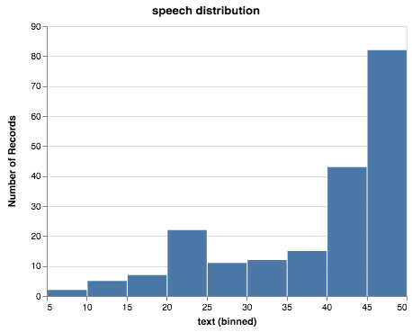
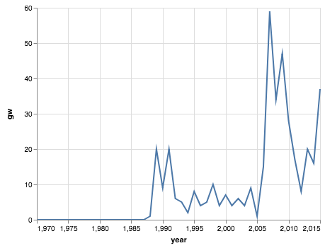
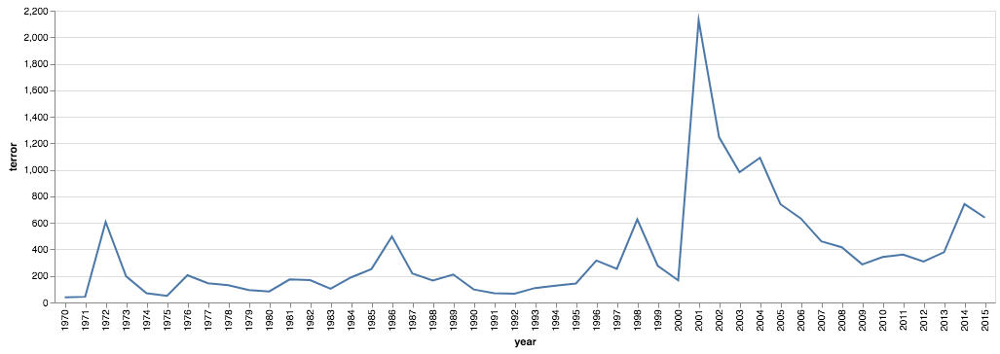

..  Copyright (C)  Google, Runestone Interactive LLC
    This work is licensed under the Creative Commons Attribution-ShareAlike 4.0 International License. To view a copy of this license, visit http://creativecommons.org/licenses/by-sa/4.0/.

UN General Debates
==================

.. raw:: html

    

In this chapter we are going to explore the text from many speeches over many years given by delegates to the United Nations General Assembly.  Every year since 1947, representatives of UN member states gather at the annual sessions of the United Nations General Assembly. The centrepiece of each session is the General Debate. This is a forum at which leaders and other senior officials deliver statements that present their government’s perspective on the major issues in world politics. (Jankin Mikhaylov, Slava; Baturo, Alexander; Dasandi, Niheer, 2017, "United Nations General Debate Corpus", https://doi.org/10.7910/DVN/0TJX8Y, Harvard Dataverse, V5) This diversity of text gives us a great opportunity for some deeper exploration of text.   You can download `un-general-debates.csv <../_static/un-general-debates.csv>`_ to get started.  It is 130MB so be prepared for a lot of words!  It is licensed CC0 which means it is a public domain data set.

Reading List
------------

-  Reshaping data with pandas `Nicely covered
   here <https://jakevdp.github.io/PythonDataScienceHandbook/>`__
-  `Word
   Clouds <https://www.datacamp.com/community/tutorials/wordcloud-python>`__
-  `Text complexity
   measures <http://www.erinhengel.com/software/textatistic/>`__
-  `Tidy Data in
   Python <http://www.jeannicholashould.com/tidy-data-in-python.html>`__
-  the original `Tidy Data
   paper <http://vita.had.co.nz/papers/tidy-data.pdf>`__ by Hadley
   Wickham

Exploratory Questions
---------------------

1. How many speeches were given each year?
2. Make a bar graph of the number of speeches each year
3. Which country and what year has given the longest speech (by number
   of words)
4. Which country has spoken the most times?
5. Which country has spoken the least times?
6. Make a graph to illustrate the distribution of the number of times
   each country has spoken
7. What were the 25 most commonly used words in the 1970 session?
8. What were the 25 most commonly used words in the 2015 session?

.. code:: python3

    %matplotlib inline
    import string
    import pandas as pd
    import matplotlib
    import matplotlib.pyplot as plt
    import psycopg2
    import textatistic
    import seaborn as sbn
    from altair import Chart, X, Y, Color, Scale
    import altair as alt
    from vega_datasets import data
    import requests
    from bs4 import BeautifulSoup
    import nltk
    from nltk.corpus import stopwords
    matplotlib.style.use('ggplot')

.. code:: python3

    undf = pd.read_csv('Data/un-general-debates.csv')

.. code:: python3

    len(undf)

.. parsed-literal::

    7507

.. code:: python3

    undf.sort_values('year', ascending=False).head()

.. raw:: html

    

    
    <table border="1" class="dataframe">
      <thead>
        <tr style="text-align: right;">
          <th></th>
          <th>session</th>
          <th>year</th>
          <th>country</th>
          <th>text</th>
        </tr>
      </thead>
      <tbody>
        <tr>
          <th>5543</th>
          <td>70</td>
          <td>2015</td>
          <td>KNA</td>
          <td>It is indeed an honour for me to address this ...</td>
        </tr>
        <tr>
          <th>5524</th>
          <td>70</td>
          <td>2015</td>
          <td>KOR</td>
          <td>I would first like to congratulate the United ...</td>
        </tr>
        <tr>
          <th>5522</th>
          <td>70</td>
          <td>2015</td>
          <td>ARE</td>
          <td>It is my pleasure to congratulate Mr. Mogens L...</td>
        </tr>
        <tr>
          <th>5521</th>
          <td>70</td>
          <td>2015</td>
          <td>BHS</td>
          <td>I bring you, Sir, and the Assembly warm frater...</td>
        </tr>
        <tr>
          <th>5520</th>
          <td>70</td>
          <td>2015</td>
          <td>ISL</td>
          <td>The world has changed enormously since the est...</td>
        </tr>
      </tbody>
    </table>
    

As you can see the data frame is relatively simple. It consists of a
session number, year, country code and text. Most of the text is hidden
because Pandas doesn’t want to make the notebook with unreadably long
text strings. In reality most of the texts are very lengthy! If you want
to see the entire string you can update Jupyter’s ``max_colwidth``
option to see it all. You’ll probably want to set it back because as you
can see in the following example looking at the entire thing is largely
useless.

.. code:: python3

    pd.set_option('display.max_colwidth', -1)
    print(undf[(undf.year == 1970) & (undf.country == 'USA')].text)
    pd.set_option('display.max_colwidth', 50)

.. rst-class:: longliteral

.. parsed-literal::

    161    1.\t It is my privilege to extend to you once again the warm
    congratulations of the United States delegation on your election to the
    Presidency of the twenty-fifth session of the General Assembly. Your country
    has few peers in the contributions it has made to the work of this
    Organization. Your father was a leader in the League of Nations, and now, in
    this session of the General Assembly, you are adding a new chapter in the
    family tradition. In the United Nations community we have long known you as
    an able spokesman of your country, as a participant in the life of the
    United Nations from its very beginning and an authority on the Charter, as a
    leading scholar and practitioner in international law, and as one whose
    personal outlook is strongly humanitarian and imbued with hope and
    determination for a better future. We are indeed fortunate to have you to
    lead us in this session devoted to the strengthening and improvement of the
    United Nations.\n2.\tDuring this session we shall commemorate with fitting
    ceremony one of the most creative and hopeful events of this century, the
    founding of the United Nations twenty-five years ago. It is right that this
    commemoration should be held. It is far more important, however, that the
    nations gathered at this session should so act together as to strengthen the
    United Nations for the future, to ensure that we are closer to 'peace,
    justice and progress' five, ten and twenty- five years hence than we are
    today. The world is unlikely to care much what we say about the past. It
    will care a great deal what we do about the future.\n3.\tThe problems the
    world faces today are no less grave than those it faced twenty-five years
    ago. Indeed they are in many respects far graver. Unless and until the
    Members of the United Nations demonstrate their willingness to deal
    effectively with these problems, the confidence of the world's peoples in
    the United Nations will remain uncertain and precarious.\n4.\tIn the view of
    the United States, the most critical international problem today is the same
    as that which faced the founders of the United Nations: the need to build a
    reliable framework for peace and security among nations. As President Nixon
    said in this Assembly a year ago: '... there is no nobler destiny, nor any
    greater gift that one age could make to the ages that follow, than to forge
    the key to a lasting peace'. [1755th meeting, para. 45.]\n5.\tIn this
    conviction the United States has sought in the last two years to frame
    foreign policies which would help to make the international scene less
    destructively competitive, less strident, more cooperative and orderly. We
    have sought, in the spirit of the Charter, to pursue peaceful settlement of
    all conflicts and confrontations, and we have urged others to do
    likewise.\n6.\tThe most significant of these efforts has been the strategic
    arms limitation discussions between my country and the Soviet Union. If at
    last we can check the nuclear arms race, the world will have been helped to
    move away from its gravest danger and toward new and more rational
    relationships.\n7.\tThe United States also seeks, through a process of
    serious negotiation, to ease the tensions that arise from the division of
    Europe. We have welcomed the efforts of the Federal Republic of Germany to
    normalize relations with its eastern neighbors; we are seeking in fourPower
    talks to assure the security and wellbeing of the residents of Berlin; we
    have joined our NATO allies in proposing exploratory talks on the reduction
    of forces in central Europe. We hope these efforts will find the Soviet
    Union and its allies forthcoming.\n8.\tIn VietNam, over eighteen months ago,
    the United States reversed the trend in American involvement in the war. We
    began a steady, uninterrupted reduction in the number of our troops. We have
    made a negotiated peace our highest priority. Although North VietNam has as
    yet shown no serious intention to negotiate a solution under which the South
    VietNamese people can freely decide their own future, this remains our goal
    and we shall not be discouraged in seeking it.\nA/PV.1854\n9.\tMy Government
    has likewise sought ways to move toward a constructive relationship with
    mainland China. To this end, we have taken a number of unilateral steps to
    ease tensions. We are ready at any time to resume the talks in
    Warsaw.\n10.\tFinally, nowhere in the world today is there more urgent need
    to move from confrontation to negotiation than in the Middle East. The
    legacy of bitterness, hatred and suspicion there contains the seeds of even
    greater tragedy not only for the Middle East but for the world, unless there
    is early progress toward reconciliation and peace based on the legitimate
    interests of all the States and peoples of the region.\n11.\tAs the United
    Nations community well knows, the United States has made major diplomatic
    efforts in recent months and weeks to help bring about peace at long last in
    the Middle East. While recent developments in the area, including the tragic
    death of President Nasser, have cast a shadow over the high hopes of just a
    few weeks ago that a beginning toward that goal had been made, those hopes
    have not been extinguished. For the most part, the guns remain silent along
    the ceasefire lines. Security Council resolution 242 (1967) stands as a
    beacon pointing the way to peace, and the parties concerned, in accepting
    the United States initiative of June, have committed themselves to carry out
    that resolution in all its parts. Ambassador Jarring is ready to resume his
    mission whenever conditions permit. We earnestly hope that the parties
    themselves and all others concerned will now bend every effort to the task
    of building on the beginning that has already been made.\n12.\tThis will
    require above all serious steps to restore and strengthen confidence in the
    integrity of the ceasefire and military standstill agreement along the Suez
    Canal. It will also require, if negotiations are to move forward, a
    willingness by the parties to move from their maximum positions on the
    elements of a realistic and equitable peace settlement. In this spirit, my
    Government is prepared to contribute to renewed efforts toward peace in the
    Middle East.\n13.\tIn this anniversary year the United States, like many
    other Members, has given especially careful thought to means by which the
    United Nations can be better enabled to fulfill its purposes.\n14.\tMy
    delegation has listened, and will continue to listen attentively, to the
    suggestions of others in this regard. In the same spirit the United States
    will offer proposals, or support the proposals of others, with these
    objectives among others: first, to put United Nations peacekeeping
    operations on a firmer and more reliable basis; second, to make the United
    Nations more effective in the peaceful settlement of disputes; third, to
    promote new steps in the field of disarmament; fourth, to move closer by
    peaceful means to the goals of decolonization and human equality; fifth, to
    support the Second Development Decade; sixth, to help slow down too rapid
    rates of population growth; seventh, to promote the exploitation of the
    seabeds and outer space for human benefit; eighth, to organize common action
    within the United Nations to safeguard the global environment; ninth, to
    encourage young people from all parts of the world to devote themselves to
    international service; tenth, to improve the organization, administration
    and procedures of the United Nations.\n15.\tIf the twenty-fifth General
    Assembly were to move forward substantially in these directions, this
    session would indeed rank as one of the most fruitful in United Nations
    history.\n16.\tLet me now comment briefly on these points.\n17.\tWe shall
    all of us on this podium and in the First Committee have much to say during
    this session about strengthening international peace and security, and about
    the need to live up to the Charter. This is quite proper. However, what is
    needed most in this respect is not still more sweeping declarations that
    merely restate the purposes and principles of the Charter. What is needed is
    more effective United Nations action on the concrete issues before us, on
    the Middle East, on United Nations peacekeeping procedures, on means of
    pacific settlement. Until we demonstrate our willingness to take such
    effective action, world opinion will continue to be skeptical, no matter
    what ringing declarations we may make, as to whether the Members of the
    United Nations are really serious about strengthening international peace
    and security.\n18.\tI now come to a subject which should be at the very
    center of our concern if we wish in fact to strengthen peace and security
    through the United Nations. I speak of United Nations
    peacekeeping.\n19.\tBecause the world situation in the past twenty- five
    years developed differently from what the founders of the United Nations
    foresaw, it has not been found possible to create forces for the maintenance
    of international peace and security along the lines laid down in certain
    articles of Chapter VII. We would hope that at some point the provisions of
    the Charter designed for enforcement action can be implemented.\n20.\tIn the
    meantime, however, a modus vivendi has been built up, entirely consistent
    with the Charter, which has carried out significant and successful
    peacekeeping operations, sometimes with observers, sometimes with
    substantial forces, in the Middle East, in Kashmir, in the Congo, in Cyprus
    and elsewhere. Still it is all too clear that these ad hoc and improvised
    arrangements need major improvement in several respects if future
    peacekeeping is to be effective.\n21.\tThe Assembly's Special Committee on
    Peacekeeping Operations, under the able and patient leadership of Ambassador
    Cuevas Cancino of Mexico, has been laboring for nearly two years at the task
    of developing peacekeeping guidelines. During the past year the United
    States has put forward concrete proposals for new procedures that would meet
    the political concerns of all and yet allow United Nations forces to move
    rapidly to carry out decisions of the Security Council. But the broad
    agreement that all desire is still lacking.\n22.\tIt is high time however
    that the General Assembly, in this twenty-fifth anniversary year, demanded
    significant movement on this problem. It would be a mistake not to move at
    all until all are agreed to move all the way. There is strong reason and
    sufficient consensus for some forward movement at this Assembly. The United
    States will be prepared to join with others in concrete proposals to this
    effect.\n23.\tIn this connexion we welcome the statement made at Lusaka in
    the Declaration of the nonaligned countries concerning the United Nations,
    that measures should be taken at this session of the General Assembly to
    strengthen United Nations peacekeeping, and we look forward with interest to
    proposals that may be made by those present at that meeting.\n24.\tOf
    course, peacekeeping without peaceful settlement is only an expedient,
    necessary but incomplete and inconclusive. The most potent preventive of
    conflict is not machinery but the will of disputing parties to show
    restraint and a spirit of conciliation, and to persist in peaceful methods
    until settlement is reached. This is a solemn obligation of every United
    Nations Member under the Charter, and no nation deserves more honor than
    those who have lived up to it in spite of every obstacle.\n25.\tIn this past
    year such peaceful settlements, or major steps towards them, have been
    recorded in a number of situations which reflect great credit on the
    statesmanship of those involved. I have in mind, for example, the progress
    made, with the assistance of the Organization of American States, toward
    resolving the dispute between El Salvador and Honduras; and also the recent
    peaceful decision on the future of Bahrain, in which good offices provided
    by the Secretary General played a major role.\n26.\tAs these cases show,
    where the will to settle exists, effective machinery can do much to help.
    This is true of regional organizations, and it is no less true of the
    relevant organs of the United Nations, above all the Security
    Council.\n27.\tIn this connexion we have welcomed the Security Council's
    decision [see 1544th meeting] as proposed by Finland, to hold periodic
    high-level meetings under Article 28 of the Charter. My country looks
    forward to taking part in the first such meeting later this fall. We welcome
    likewise the valuable suggestion of Brazil committees of the Council,
    including the parties to a dispute, might be created to help settle
    particular disputes.\n28.\tTo the same end, the United States would favor
    the reactivation of certain machinery for peaceful settlement which has long
    been dormant. Many years ago the General Assembly created a Panel on Inquiry
    and Conciliation [resolution 268 (III)], and more recently a register of
    fact-finding experts. My Government will soon nominate qualified individuals
    for both of these bodies. We believe fact-finders should be available to\n1
    Third Conference of Heads of State or Government of Non Aligned Countries,
    held at Lusaka, Zambia, from 8 to 10 September 1970.\nthe SecretaryGeneral
    or other organs of the United Nations, or directly to Member States, to
    report on the facts of situations of international concern at the request or
    with the consent of one or more of the parties.\n29.\tFinally, it is most
    important that we rejuvenate and strengthen the highest organ of judicial
    settlement, the International Court of Justice. The United States recently
    joined with others in the Security Council in referring to the Court for its
    advisory opinion certain aspects of the Namibia situation. We have also
    joined with others in submitting to this General Assembly an agenda item
    calling for a review of the role of the Court. We hope this review will
    suggest ways to enable the Court to make a more substantial contribution to
    the establishment of the rule of law among nations.\n30.\tThe world has
    witnessed in recent weeks shocking examples of the consequences of failure
    to abide by this rule of law examples which have been alluded to by numerous
    previous speakers on this podium. Hundreds of innocent individuals engaged
    in peaceful international travel have been brutally seized as hostages in a
    conflict in which they were in no way involved. Not only their safety and
    convenience have been placed in jeopardy but their very lives. As President
    Nixon pointed out in this forum a year ago, this issue 'involves the
    interests of. . . every air passenger and the integrity of that structure of
    order upon which a world community depends' [1755th meeting, para.
    74].\n31.\tThat this view is widely shared is evident from the almost
    universal condemnation of these most recent acts by Governments the world
    over and by the resolution on this matter adopted unanimously by the
    Security Council [286 (1970)]. But condemnation is not enough. It is time to
    act. The Tokyo Convention, providing for the prompt return of hijacked
    aircraft passengers and crew, requires the broadest international support.
    The same is true of the International Civil Aviation Organization's draft
    multilateral convention for the extradition and punishment of hijackers. In
    addition, the United States has submitted new proposals to the ICAO, for
    which I urge your most earnest consideration and support.\n32.\tThe General
    Assembly's extensive annual debates and resolutions on many aspects of arms
    control and disarmament have long played, and continue to play, an important
    part in international negotiations on this most critical of all our
    problems. I need only mention the partial nuclear test-ban Treaty,  the
    outer space Treaty [resolution 2222 (XXI)] and the Treaty on the
    NonProliferation of Nuclear Weapons [resolution 2373 (XXII)]. The
    disarmament conference at Geneva has this year registered significant
    progress by achieving wide consensus on a draft treaty to prohibit the
    emplacement of weapons of mass destruction on a vast area of the earth's
    surface the seabed beneath the oceans.  We hope this draft treaty will be
    supported by the General Assembly at this session and opened for signature
    shortly thereafter.\n33.\tI can assure the Assembly that the United States
    Government is unceasingly aware of the worldwide concern and need for an end
    to the arms race and the perilous burden of armaments in all its forms, and
    that we shall do whatever one negotiating partner can do to bring about new
    agreements on new steps toward the ultimate goal of general and complete
    disarmament.\n34.\tPermit me to say a word about a matter of quite different
    but equally wide concern that of human rights throughout the world.\n35.\tIn
    addition to the basic responsibility of Governments to maintain human rights
    for all their citizens, the United Nations under the Charter has a clear
    responsibility in this regard. To strengthen the implementation of that
    responsibility my Government hopes the General Assembly at this session will
    create a new post, that of High Commissioner for Human Rights, to advise
    United Nations organs in this field and to assist States, at their request,
    with human rights problems. This proposal has been thoroughly studied and
    fully justified. It deserves a high priority at the twenty-fifth session of
    the General Assembly.\n36.\tA particular issue of human rights that is of
    acute concern to my Government, among others, is the protection of the
    rights of prisoners of war. While these rights have long since been
    internationally guaranteed, they are in practice still denied to many
    prisoners of war, as American wives and families of such prisoners know to
    their great sorrow. The United States strongly hopes that this Assembly will
    press for worldwide observance of the Geneva Convention relative to the
    Treatment of Prisoners of War, verified by impartial inspection. It is
    intolerable that the tragedy of armed conflict should be compounded by
    additional inhumanities in violation of international norms.\n37.\tIn no
    field have the aims of the United Nations found more dramatic fulfilment
    during its first quarter of a century than in the field of decolonization.
    Before the Second World War a third of mankind lived in colonial
    dependencies. Today the proportion is less than 1 per cent. A revolution of
    independence has created some sixty new nations and has been the main factor
    in increasing the membership of the United Nations from 51 to
    126.\n38.\tHowever, the situation in much of southern Africa is still
    characterized by the denial of self-determination and of racial equality.
    The United Nations and its member States must continue to exert peaceful
    efforts to defend and advance these basic human rights of the peoples
    concerned. Their cause is just and must in time prevail.\n39.\tAgainst these
    evils the United States in recent months has taken further steps. We put
    into effect last May a new policy designed to discourage United States
    investment in, and trade with, Namibia so long as South Africa remains in
    unlawful occupation. We urge other Governments to join us in this policy. My
    Government continues strictly to observe resolutions in regard to sanctions
    against the illegal regime in Rhodesia and in regard to the sale of arms to
    South Africa. We have closed our consulate in Salisbury. We shall continue
    in every peaceful and practicable way to pursue the ends of justice,
    equality and self determination.\n40.\tHigh on the list of the United
    Nations contributions to human progress is its longstanding effort to assist
    in comprehensive global development. That effort is being continued and, we
    hope, improved and strengthened through the launching of the Second United
    Nations Development Decade.\n41.\tThe success of the Decade will depend most
    of all on the policies of Member States, both developed and developing. To
    bring all these policies into effective focus is the ambitious aim of the
    development strategy. The United States strongly supports the strategy which
    is before this Assembly [A 17982, para. 16] and intends to participate fully
    in this common enterprise.\n42.\tI wish to leave no doubt of the serious
    commitment of the United States to the Second Development Decade. President
    Nixon, in a series of policy decisions and especially in his recent
    announcement on the new focus of United States economic assistance, has made
    clear our intention:\n(a)\tTo reverse the downward trend in United States
    development assistance;\n(b)\tTo increase substantially United States
    contributions to multilateral development institutions including the World
    Bank, the International Development Association, the regional development
    banks and the United Nations Development program so that, as the
    capabilities of these institutions increase, we may be able to channel
    through them most of our official development assistance;\n(c)\tFurther to
    encourage the efforts of donor nations to 'untie' their bilateral aid to
    developing countries from the obligation to import products of the donor
    country;\n(<d) To bring United States science and technology more
    effectively to bear on the problems of development, and for this purpose to
    create a new United States International Development Institute;\n(<?) To
    take new steps to stimulate American private investment in developing
    countries within the framework of the developing countries'
    plans.\n43.\tThese approaches are already reflected in the new policies my
    country has announced toward Latin America and Africa, which stress
    continued assistance, greater multilateral participation, and increased
    trade and investment.\n44.\tFinally, bearing in mind the crucial connexion
    between trade and development, the United States is pressing for a
    liberalized system of generalized tariff preferences for products of
    developing countries, with preferential access to the American market, and
    we are urging that the developing countries receive similar access to the
    markets of all developed countries.\n45.\tI wish to add a particular comment
    on the role of the United Nations Development program. This program, in
    cooperation with the specialized agencies, has done important pioneering
    work in development assistance. Its machinery, however, was built for a
    smaller program and must be reorganized to meet its growing
    responsibilities. With the aid of last year's excellent 'capacity study' ,
    the program is now preparing to put the necessary reforms into effect. In
    planning our future contributions to this important program we in the United
    States will give major weight to the progress actually achieved m
    undertaking these reforms.\n46.\tIn recent years people all over the world
    have suddenly awakened to the inexorable and tragic fact that excessive
    population growth can, if continued much longer, frustrate all our hopes for
    peace, justice and progress. There can be no progress for the majority of
    mankind if population growth outstrips all available means of development.
    There can be no justice for the majority of mankind where population expands
    faster than production and social services. There can be no peace for the
    majority of mankind where progress and justice are unattainable because of
    unrestrained population growth.\n47.\tThis is not a problem confined to
    either developed or developing countries. In my own country, although our
    growth rate has recently slowed to about 1 per cent a year, we have adopted
    as a national goal the availability within five years of family planning
    services to every citizen.\n48.\tClearly, the need is equally urgent in many
    nations striving for development whose annual population growth in some
    cases approaches 4 per cent which means a doubling of the number of people
    in less than twenty- years. The care and feeding of such enormous numbers of
    dependent children, their upbringing in conditions compatible with human
    dignity, could constitute such a burden as to nullify progress in economic
    development and to cause living standards to remain at past low levels or
    even to fall lower.\n49.\tThe United States is convinced that the vigorous
    pursuit of family planning policies is an indispensable element in the
    strategy of development. In this conviction we have pledged this year $7.5
    million to the recently established United Nations Fund for Population
    Activities, whose services to requesting Governments are rapidly
    growing.\n50.\tIn the context of development I wish also to emphasize the
    enormous potential of the world's deep seabeds, whose exploitation is just
    now beginning to come within the reach of our technology.\n51.\tLast May
    President Nixon, in a farreaching announcement concerning the oceans,
    proposed that an international regime be established by treaty for the
    exploitation of seabed resources beyond the depth of 200 meters. He further
    proposed that this regime 'should provide for the collection of substantial
    mineral royalties to be used for international community purposes,
    particularly economic assistance to developing countries'. Early in August
    the United States circulated in the United Nations seabed Committee  a draft
    convention [A18021, annex V], embodying these and other important proposals
    in the President's announcement.\n52.\tThese proposals, if carried out, will
    amount to a new departure in the history of nations. Never in history has
    the exploitation of resources of such great potential value been placed
    under the supervision and regulation of an effective international
    authority. Never in history has assurance been offered that the
    international community could have a substantial, independent source of
    revenue to be equitably divided to serve the interests of mankind as a
    whole.\n53.\tThe United States hopes that the twenty-fifth session of the
    General Assembly will advance this important enterprise so that a sound and
    workable international seabed regime, backed up by effective machinery, can
    come into being as soon as possible. To this end it is important that States
    refrain from making further claims to jurisdiction over the seabeds or over
    the waters of the oceans. We believe that a conference on subjects related
    to the law of the sea, including seabeds, should be called as soon as
    practicable and that preparatory steps should be initiated by this session
    of the General Assembly.\n54.\tI come now to an issue of critical and
    rapidly growing importance the protection of the human environment.
    Development and protection of the environment are not mutually
    contradictory; indeed, they must go hand in hand if the world is to be a fit
    place in which to live. The United Nations is in a key position to foster
    the necessary cooperation so that the needs of the environment, as well as
    those of development, receive the energetic attention they
    require.\n55.\tAlready the plans for the United Nations Conference on the
    Human Environment in 1972 have begun to take shape and have helped to focus
    the attention of United Nations Member Governments on this worldwide
    challenge; but we should not wait for the Stockholm Conference before
    launching necessary initiatives.\n56.\tTherefore the United States urges
    that all of us here, representing both developed and developing countries,
    work together to enable the United Nations to take the following steps.
    Firstly, it should identify those environmental problems, especially those
    pollutants in the atmosphere and the oceans, which are or may be dangerous
    on a global scale. Second, it should make plans for a coordinated world
    monitoring network to keep track of these environmental dangers. This
    network should build on existing programs, particularly those of the
    agencies of the United Nations family, and should use the most advanced data
    processing and satellite technology, such as the earth resource survey
    satellites which my country has been developing. Third, it should collect
    and analyze the suggestions of governments concerning environmental
    guidelines for States, both developed and developing, as well as for
    international institutions engaged in development programs. Fourth, it
    should explore the possibility of establishing international air and water
    quality standards. The United States hopes the Assembly at this session will
    act to advance those important objectives.\n51. A newly acute problem which
    threatens a growing number of societies is the epidemic spread of addiction
    to dangerous drugs, especially among young people. This phenomenon has
    mushroomed in a very few years, not only in my own country but in a number
    of others, both developed and developing. It creates untold misery,
    violence, lawlessness and economic and human loss.This menace must be
    stopped. To do so it will be necessary to reinforce existing international
    agreements and to strengthen the longstanding and excellent work of agencies
    in this field, especially those of the United Nations. We are glad to note
    that the Commission on Narcotic Drugs is meeting now to deal with the whole
    range of problems involved, from the poppy field through the international
    syndicate to the needle in the vein. My Government hopes that an adequate
    action program will emerge from this process and will command the energetic
    support of the community of nations. The United States has already offered,
    subject to Congressional approval, a contribution of $2 million to such a
    program.\n58.\tFinally, it is important that we make better use of the
    talents of young people in international service, especially the service of
    the United Nations. Many delegations to this session, including that of the
    United States, contain youthful members as suggested by the General Assembly
    a year ago. That is entirely fitting, because the fate of the United Nations
    and indeed of world peace will soon be in their hands.\n59.\tWith that in
    mind President Nixon, in his address to this Assembly a year ago [1755th
    meeting], pledged the enthusiastic support of the United States for Iran's
    proposal to establish an international volunteer service corps [see 1695th
    meeting, para. 75], to work in the cause of development and to be recruited
    on an individual basis from the people, principally young people, of many
    countries. We hope that proposal will be given final approval in the current
    session. We hope also that the United Nations will seek new ways to
    encourage able young people to find careers in its Secretariat and those of
    the other agencies of the United Nations family.\n60.\tIn these remarks I
    have discussed only a few of the major tasks facing the United Nations in
    the years ahead. Even those, however, are enough tc make it obvious that, if
    we indeed address ourselves to such tasks, the effectiveness of this
    Organization will be tested more severely than ever. To meet this test we
    shall have to be far more attentive than has been our habit to many matters
    of structure, organization and procedure. For example, I would mention the
    following.\n61.\tIn considering applications for membership by very small
    States, we must make sure that they are not only willing but also, as the
    Charter stipulates, able to carry out the Charter's obligations. As the
    SecretaryGeneral has for years pointed out, many Territories now moving
    towards independence are too small, either in population or in resources or
    both, to carry out the minimum obligations which membership requires. Yet
    these very small entities need more than most the assistance that the United
    Nations system can provide. Where the burden of membership would be
    excessive, we should provide a form of association with the United Nations
    which would enable such States to enjoy the benefits without the burdens of
    the system.\n62.\tThe persistence of the United Nations financial deficit
    undermines confidence in the Organization, threatens its capabilities in
    many fields and casts a cloud over its future. The United States welcomes
    the SecretaryGeneral's recent call for 'a concerted effort to restore the
    financial solvency of the Organization'. We hope that he will himself take a
    lead in such an effort, in which we shall certainly play our part.\n63.\tIn
    the annual choice of non-permanent members of the Security Council, it would
    be well that, as the Charter requires, due regard be specially paid, in the
    first instance, to the prospective member's contribution to the maintenance
    of international peace and security, rather than merely to rotation among
    the members of geographic groups.\n64.\tThe primary consideration in
    selecting individuals for posts in the Secretariat, above all for senior
    posts, should be fully to meet the Charter's 'paramount consideration'
    namely 'the highest standards of efficiency, competence, and
    integrity'.\n65.\tWe must at long last take decisive steps to streamline the
    excessively time-consuming organization and procedures of the General
    Assembly, as Canada has wisely proposed, or else we shall either 'drown in a
    sea of words' or suffocate under an avalanche of paper.\n66.\tWe must take
    more effective measures to ensure that the entire United Nations system is
    so organized and managed that it responds efficiently to the directives of
    its governing organs and to the priority needs of the world. That will
    require much better administrative and budgetary coordination and control
    than we have yet achieved.\n67.\tThe United States offers these suggestions
    in the spirit of the twenty-fifth anniversary session, which we understand
    to be a spirit of sober determination to make this Organization more
    effective, to make its future more responsive than its past to the
    imperative needs of men, women and children everywhere. Many other
    delegations have offered or will offer their proposals in the same spirit.
    The test of our seriousness and our success will be how much of this agenda
    of objectives we can begin to carry out.\n68.\tWe are assembled from the
    four corners of the earth. The interests of the Governments we speak for
    often seem to be and sometimes are in contradiction. But by our presence
    here, by our commitment to the United Nations and its Charter, we have
    acknowledged that we also have interests in common, interests in peace,
    justice and progress, interests in the continued habitability of our planet,
    common interests which we are at last beginning to recognize are inescapable
    and overriding.\n69.\tThe question now is, do we have the wit not only to
    perceive these common interests in some vague rhetorical way, but also to
    act upon them together realistically and decisively even at the cost
    sometimes of older and narrower interests? If we do not do so, history may
    sweep aside not only this Organization but also the nations that compose
    it.\n70.\tThe SecretaryGeneral has said that we may have only ten years left
    to cope effectively with the problems of our times before they become so
    staggering as to be beyond our capacities. As we enter the Disarmament
    Decade and the Second Development Decade, let us keep that warning foremost
    in our minds and let us be determined to act together to avert
    catastrophe.\n\n\n\n\n Name: text, dtype: object

The number of speeches each year will require us to use our new tool of
grouping data. This is the split-apply-combine pattern that you may have
learned about previously, but it is so commonly used in data science that
Pandas makes it convenient for us.

.. code:: python3

    by_year = undf.groupby('year', as_index=False)['text'].count()
    by_year.head()

.. raw:: html

    

    
    <table border="1" class="dataframe">
      <thead>
        <tr style="text-align: right;">
          <th></th>
          <th>year</th>
          <th>text</th>
        </tr>
      </thead>
      <tbody>
        <tr>
          <th>0</th>
          <td>1970</td>
          <td>70</td>
        </tr>
        <tr>
          <th>1</th>
          <td>1971</td>
          <td>116</td>
        </tr>
        <tr>
          <th>2</th>
          <td>1972</td>
          <td>125</td>
        </tr>
        <tr>
          <th>3</th>
          <td>1973</td>
          <td>120</td>
        </tr>
        <tr>
          <th>4</th>
          <td>1974</td>
          <td>129</td>
        </tr>
      </tbody>
    </table>
    

.. code:: python3

    alt.Chart(by_year).mark_bar().encode(x='year:N',y='text')

.. image:: UNGeneralDebates_files/UNGeneralDebates_11_0.png

.. code:: python3

    by_country = undf.groupby('country',as_index=False)['text'].count()
    by_country.head()

.. raw:: html

    

    
    <table border="1" class="dataframe">
      <thead>
        <tr style="text-align: right;">
          <th></th>
          <th>country</th>
          <th>text</th>
        </tr>
      </thead>
      <tbody>
        <tr>
          <th>0</th>
          <td>AFG</td>
          <td>45</td>
        </tr>
        <tr>
          <th>1</th>
          <td>AGO</td>
          <td>38</td>
        </tr>
        <tr>
          <th>2</th>
          <td>ALB</td>
          <td>46</td>
        </tr>
        <tr>
          <th>3</th>
          <td>AND</td>
          <td>22</td>
        </tr>
        <tr>
          <th>4</th>
          <td>ARE</td>
          <td>44</td>
        </tr>
      </tbody>
    </table>
    

.. code:: python3

    alt.Chart(by_country,title='speech distribution').mark_bar().encode(x=alt.X('text',bin=True),y='count()')

.. code:: python3

    by_country.loc[by_country.text.idxmax()]

.. parsed-literal::

    country    ALB
    text        46
    Name: 2, dtype: object

.. code:: python3

    by_country.loc[by_country.text.idxmin()]

.. parsed-literal::

    country    EU
    text        5
    Name: 58, dtype: object

Those answers are not very satisfactory as we can only guess as to which
country ALB or EU might be. Somewhat distressingly we see that in one
case the three digit code is used and in another a two digit code. We
will want to augment this data using our world factbook data or the data
we scraped. I have a complete table ready for you to load so you don’t
have to scrape it again.

.. code:: python3

    c_codes = pd.read_csv('Data/country_codes.csv')
    c_codes.head()

.. rst-class:: parsederror

.. raw:: html

    <pre class="parsederror longliteral">
      ---------------------------------------------------------------------------
      UnicodeDecodeError                        Traceback (most recent call last)
      pandas/_libs/parsers.pyx in pandas._libs.parsers.TextReader._convert_tokens()

      pandas/_libs/parsers.pyx in pandas._libs.parsers.TextReader._convert_with_dtype()

      pandas/_libs/parsers.pyx in pandas._libs.parsers.TextReader._string_convert()

      pandas/_libs/parsers.pyx in pandas._libs.parsers._string_box_utf8()

      UnicodeDecodeError: 'utf-8' codec can't decode byte 0xc5 in position 0: invalid continuation byte

      During handling of the above exception, another exception occurred:

      UnicodeDecodeError                        Traceback (most recent call last)
      <ipython-input-13-6d8e500fc112> in <module>
      ----> 1 c_codes = pd.read_csv('../Data/country_codes.csv')
            2 c_codes.head()

      ~/anaconda3/lib/python3.7/site-packages/pandas/io/parsers.py in parser_f(filepath_or_buffer, sep, delimiter, header, names, index_col, usecols, squeeze, prefix, mangle_dupe_cols, dtype, engine, converters, true_values, false_values, skipinitialspace, skiprows, skipfooter, nrows, na_values, keep_default_na, na_filter, verbose, skip_blank_lines, parse_dates, infer_datetime_format, keep_date_col, date_parser, dayfirst, iterator, chunksize, compression, thousands, decimal, lineterminator, quotechar, quoting, doublequote, escapechar, comment, encoding, dialect, tupleize_cols, error_bad_lines, warn_bad_lines, delim_whitespace, low_memory, memory_map, float_precision)
          700                     skip_blank_lines=skip_blank_lines)
          701
      --> 702         return _read(filepath_or_buffer, kwds)
          703
          704     parser_f.__name__ = name

      ~/anaconda3/lib/python3.7/site-packages/pandas/io/parsers.py in _read(filepath_or_buffer, kwds)
          433
          434     try:
      --> 435         data = parser.read(nrows)
          436     finally:
          437         parser.close()

      ~/anaconda3/lib/python3.7/site-packages/pandas/io/parsers.py in read(self, nrows)
        1137     def read(self, nrows=None):
        1138         nrows = _validate_integer('nrows', nrows)
      -> 1139         ret = self._engine.read(nrows)
        1140
        1141         # May alter columns / col_dict

      ~/anaconda3/lib/python3.7/site-packages/pandas/io/parsers.py in read(self, nrows)
        1993     def read(self, nrows=None):
        1994         try:
      -> 1995             data = self._reader.read(nrows)
        1996         except StopIteration:
        1997             if self._first_chunk:

      pandas/_libs/parsers.pyx in pandas._libs.parsers.TextReader.read()

      pandas/_libs/parsers.pyx in pandas._libs.parsers.TextReader._read_low_memory()

      pandas/_libs/parsers.pyx in pandas._libs.parsers.TextReader._read_rows()

      pandas/_libs/parsers.pyx in pandas._libs.parsers.TextReader._convert_column_data()

      pandas/_libs/parsers.pyx in pandas._libs.parsers.TextReader._convert_tokens()

      pandas/_libs/parsers.pyx in pandas._libs.parsers.TextReader._convert_with_dtype()

      pandas/_libs/parsers.pyx in pandas._libs.parsers.TextReader._string_convert()

      pandas/_libs/parsers.pyx in pandas._libs.parsers._string_box_utf8()

      UnicodeDecodeError: 'utf-8' codec can't decode byte 0xc5 in position 0: invalid continuation byte
      </pre>

OH NO What the heck!!
---------------------

Unicode errors can be a huge pain, but are a fact of life for anyone
dealing with data from multiple sources. In this case we can use the
unix file command to get a bit more information:

::

   $ file -I country_codes.csv
   country_codes.csv: text/plain; charset=iso-8859-1

The important part of the result of that command is that it tells us that the character set is `iso-8859-1` This piece of information is important because it tells Python how to interpret the 8 bits as a character we would recognize. For example, lets take the familiar copyright © symbol.  This symbol is stored in the computer's memory as 10101001.  Aren't you glad you don't have to remember that?  When Python goes to display a character for us it has to know how that information is **encoded**,  that is how should Python interpret those bits.  There are several common encodings used today:

* ASCII - American Standard Code for Information Interchange - This is one of the oldest encodings, and has been in use for years, its major limitation is that it can only encode 256 characters. And in fact Python only interprets 0-127 as proper ASCII. This was fine for American English, in the early days of computing but it does not work in the world today with many languages and many more emojis.

* 'utf-8' This is probably the most common encoding in use today. It can efficiently encode over 4 billion characters.  Some with just 8 bits and others with up to 32 bits.

* 'iso-8859-1' also called 'latin-1' This encoding takes full advantage of all 8 bits.  of the ascii character set.

So, lets try a little experiment.  We can represent 169 as 10101001 or as the hexadecimal value a9, which is easier to work with in Python.

.. code:: python3

    b'\xa9'.decode('utf8')

.. parsed-literal::

    ---------------------------------------------------------------------------
    UnicodeDecodeError                        Traceback (most recent call last)
    <ipython-input-14-4c06286911b5> in <module>
    ----> 1 b'\xa9'.decode('utf8')

    UnicodeDecodeError: 'utf-8' codec can't decode byte 0xa9 in position 0: invalid start byte

Aha!  That error message looks familiar.  And you will run into this many times when working with data from the internet.

Lets give ASCII a try:

.. code:: python3

    b'\xa9'.decode('ascii')

.. parsed-literal::

    ---------------------------------------------------------------------------
    UnicodeDecodeError                        Traceback (most recent call last)
    <ipython-input-15-1ee5bf3d809c> in <module>
    ----> 1 b'\xa9'.decode('ascii')

    UnicodeDecodeError: 'ascii' codec can't decode byte 0xa9 in position 0: ordinal not in range(128)

See the message not in range(128), yes 169 is definitely not in range(128)

.. code:: python3

    b'\xa9'.decode('iso-8859-1')

.. parsed-literal::

    '©'

Success!!

.. code:: python3

    topics = [' nuclear', ' weapons', ' nuclear weapons', ' chemical weapons',
              ' biological weapons', ' mass destruction', ' peace', ' war',
              ' nuclear war', ' civil war', ' terror', ' genocide', ' holocaust',
              ' water', ' famine', ' disease', ' hiv', ' aids', ' malaria', ' cancer',
              ' poverty', ' human rights', ' abortion', ' refugee', ' immigration',
              ' equality', ' democracy', ' freedom', ' sovereignty', ' dictator',
              ' totalitarian', ' vote', ' energy', ' oil',  ' coal',  ' income',
              ' economy', ' growth', ' inflation', ' interest rate', ' security',
              ' cyber', ' trade', ' inequality', ' pollution', ' global warming',
              ' hunger', ' education', ' health', ' sanitation', ' infrastructure',
              ' virus', ' regulation', ' food', ' nutrition', ' transportation',
              ' violence', ' agriculture', ' diplomatic', ' drugs', ' obesity',
              ' islam', ' housing', ' sustainable', 'nuclear energy']

.. code:: python3

    undf.head()

.. raw:: html

    

    
    <table border="1" class="dataframe">
      <thead>
        <tr style="text-align: right;">
          <th></th>
          <th>session</th>
          <th>year</th>
          <th>code_3</th>
          <th>text</th>
        </tr>
      </thead>
      <tbody>
        <tr>
          <th>0</th>
          <td>44</td>
          <td>1989</td>
          <td>MDV</td>
          <td>It is indeed a pleasure for me and the member...</td>
        </tr>
        <tr>
          <th>1</th>
          <td>44</td>
          <td>1989</td>
          <td>FIN</td>
          <td>\nMay I begin by congratulating you. Sir, on ...</td>
        </tr>
        <tr>
          <th>2</th>
          <td>44</td>
          <td>1989</td>
          <td>NER</td>
          <td>\nMr. President, it is a particular pleasure ...</td>
        </tr>
        <tr>
          <th>3</th>
          <td>44</td>
          <td>1989</td>
          <td>URY</td>
          <td>\nDuring the debate at the fortieth session o...</td>
        </tr>
        <tr>
          <th>4</th>
          <td>44</td>
          <td>1989</td>
          <td>ZWE</td>
          <td>I should like at the outset to express my del...</td>
        </tr>
      </tbody>
    </table>
    

.. code:: python3

    year_summ = undf.groupby('year', as_index=False)['text'].sum()

.. code:: python3

    year_summ.head()

.. raw:: html

    

    
    <table border="1" class="dataframe">
      <thead>
        <tr style="text-align: right;">
          <th></th>
          <th>year</th>
          <th>text</th>
        </tr>
      </thead>
      <tbody>
        <tr>
          <th>0</th>
          <td>1970</td>
          <td>126.\t In this anniversary year the General As...</td>
        </tr>
        <tr>
          <th>1</th>
          <td>1971</td>
          <td>83.\t Mr. President, the first words of my del...</td>
        </tr>
        <tr>
          <th>2</th>
          <td>1972</td>
          <td>Since the twenty-sixth session of the General ...</td>
        </tr>
        <tr>
          <th>3</th>
          <td>1973</td>
          <td>1.\tIt is a great pleasure for me to congratu...</td>
        </tr>
        <tr>
          <th>4</th>
          <td>1974</td>
          <td>Mr. President, first I should like to extend m...</td>
        </tr>
      </tbody>
    </table>
    

.. code:: python3

    year_summ['gw'] = year_summ.text.str.count('global warming')
    year_summ['cc'] = year_summ.text.str.count('climate change')
    year_summ

.. raw:: html

    

    
    <table border="1" class="dataframe">
      <thead>
        <tr style="text-align: right;">
          <th></th>
          <th>year</th>
          <th>text</th>
          <th>gw</th>
          <th>cc</th>
        </tr>
      </thead>
      <tbody>
        <tr>
          <th>0</th>
          <td>1970</td>
          <td>126.\t In this anniversary year the General As...</td>
          <td>0</td>
          <td>0</td>
        </tr>
        <tr>
          <th>1</th>
          <td>1971</td>
          <td>83.\t Mr. President, the first words of my del...</td>
          <td>0</td>
          <td>0</td>
        </tr>
        <tr>
          <th>2</th>
          <td>1972</td>
          <td>Since the twenty-sixth session of the General ...</td>
          <td>0</td>
          <td>0</td>
        </tr>
        <tr>
          <th>3</th>
          <td>1973</td>
          <td>1.\tIt is a great pleasure for me to congratu...</td>
          <td>0</td>
          <td>1</td>
        </tr>
        <tr>
          <th>4</th>
          <td>1974</td>
          <td>Mr. President, first I should like to extend m...</td>
          <td>0</td>
          <td>0</td>
        </tr>
        <tr>
          <th>5</th>
          <td>1975</td>
          <td>104.\t Mr. President, on behalf of the delegat...</td>
          <td>0</td>
          <td>0</td>
        </tr>
        <tr>
          <th>6</th>
          <td>1976</td>
          <td>Allow me first to say how pleased I am to see ...</td>
          <td>0</td>
          <td>0</td>
        </tr>
        <tr>
          <th>7</th>
          <td>1977</td>
          <td> \n1.\t'O praise the Lord, all ye nations: pr...</td>
          <td>0</td>
          <td>0</td>
        </tr>
        <tr>
          <th>8</th>
          <td>1978</td>
          <td>210.\tI am particularly happy to be able in m...</td>
          <td>0</td>
          <td>0</td>
        </tr>
        <tr>
          <th>9</th>
          <td>1979</td>
          <td>My delegation is pleased to convey to the rep...</td>
          <td>0</td>
          <td>0</td>
        </tr>
        <tr>
          <th>10</th>
          <td>1980</td>
          <td>I should like first of all to extend to Ambas...</td>
          <td>0</td>
          <td>0</td>
        </tr>
        <tr>
          <th>11</th>
          <td>1981</td>
          <td>\n73.\t Mr. President, the Republic of Iraq an...</td>
          <td>0</td>
          <td>0</td>
        </tr>
        <tr>
          <th>12</th>
          <td>1982</td>
          <td>First of all I wish to convey my warm \ncongra...</td>
          <td>0</td>
          <td>0</td>
        </tr>
        <tr>
          <th>13</th>
          <td>1983</td>
          <td>1.\t It is my pleasure to address, in the nam...</td>
          <td>0</td>
          <td>0</td>
        </tr>
        <tr>
          <th>14</th>
          <td>1984</td>
          <td>I have the honour to convey to the President ...</td>
          <td>0</td>
          <td>1</td>
        </tr>
        <tr>
          <th>15</th>
          <td>1985</td>
          <td>I wish to convey to you, Sir, the felicitation...</td>
          <td>0</td>
          <td>0</td>
        </tr>
        <tr>
          <th>16</th>
          <td>1986</td>
          <td>Allow me first, Sir, to congratulate you on y...</td>
          <td>0</td>
          <td>0</td>
        </tr>
        <tr>
          <th>17</th>
          <td>1987</td>
          <td>\nAllow me at the outset. Sic, to convey to y...</td>
          <td>0</td>
          <td>0</td>
        </tr>
        <tr>
          <th>18</th>
          <td>1988</td>
          <td>\nI ask the President to accept our congratul...</td>
          <td>1</td>
          <td>1</td>
        </tr>
        <tr>
          <th>19</th>
          <td>1989</td>
          <td>It is indeed a pleasure for me and the member...</td>
          <td>20</td>
          <td>18</td>
        </tr>
        <tr>
          <th>20</th>
          <td>1990</td>
          <td>Mr. President, allow me to congratulate you o...</td>
          <td>9</td>
          <td>12</td>
        </tr>
        <tr>
          <th>21</th>
          <td>1991</td>
          <td>On behalf of my delegation and on my own beha...</td>
          <td>20</td>
          <td>30</td>
        </tr>
        <tr>
          <th>22</th>
          <td>1992</td>
          <td>I shall read out the following statement\non b...</td>
          <td>6</td>
          <td>15</td>
        </tr>
        <tr>
          <th>23</th>
          <td>1993</td>
          <td>Allow me to congratulate you sincerely, Sir,\n...</td>
          <td>5</td>
          <td>14</td>
        </tr>
        <tr>
          <th>24</th>
          <td>1994</td>
          <td>On behalf of the Namibian\ndelegation, I wish ...</td>
          <td>2</td>
          <td>9</td>
        </tr>
        <tr>
          <th>25</th>
          <td>1995</td>
          <td>Allow me at the outset, on behalf of the\ndele...</td>
          <td>8</td>
          <td>12</td>
        </tr>
        <tr>
          <th>26</th>
          <td>1996</td>
          <td>The delegation of the Republic of the Congo\n...</td>
          <td>4</td>
          <td>16</td>
        </tr>
        <tr>
          <th>27</th>
          <td>1997</td>
          <td>I wish to congratulate the President on his\n...</td>
          <td>5</td>
          <td>14</td>
        </tr>
        <tr>
          <th>28</th>
          <td>1998</td>
          <td>The General Assembly has\nunanimously chosen M...</td>
          <td>10</td>
          <td>23</td>
        </tr>
        <tr>
          <th>29</th>
          <td>1999</td>
          <td>Today, we look ahead to the\nnew millennium. A...</td>
          <td>4</td>
          <td>31</td>
        </tr>
        <tr>
          <th>30</th>
          <td>2000</td>
          <td>I join my colleagues in\ncongratulating the Pr...</td>
          <td>7</td>
          <td>15</td>
        </tr>
        <tr>
          <th>31</th>
          <td>2001</td>
          <td>On\nbehalf of the Comorian delegation, which ...</td>
          <td>4</td>
          <td>30</td>
        </tr>
        <tr>
          <th>32</th>
          <td>2002</td>
          <td>Allow me\nto begin my statement by expressing...</td>
          <td>6</td>
          <td>25</td>
        </tr>
        <tr>
          <th>33</th>
          <td>2003</td>
          <td>The people of Tuvalu,\non whose behalf I have...</td>
          <td>4</td>
          <td>25</td>
        </tr>
        <tr>
          <th>34</th>
          <td>2004</td>
          <td>The United Nations\nfaces unprecedented challe...</td>
          <td>9</td>
          <td>42</td>
        </tr>
        <tr>
          <th>35</th>
          <td>2005</td>
          <td>Sixty years ago at San Francisco, the United\n...</td>
          <td>1</td>
          <td>46</td>
        </tr>
        <tr>
          <th>36</th>
          <td>2006</td>
          <td>In 2006, several important anniversaries coinc...</td>
          <td>15</td>
          <td>54</td>
        </tr>
        <tr>
          <th>37</th>
          <td>2007</td>
          <td>It is a  pleasure, Sir, to congratulate you on...</td>
          <td>59</td>
          <td>472</td>
        </tr>
        <tr>
          <th>38</th>
          <td>2008</td>
          <td>It is an \nhonour for me to represent my count...</td>
          <td>34</td>
          <td>353</td>
        </tr>
        <tr>
          <th>39</th>
          <td>2009</td>
          <td>I begin by joining others \nin congratulating ...</td>
          <td>47</td>
          <td>485</td>
        </tr>
        <tr>
          <th>40</th>
          <td>2010</td>
          <td>It is a privilege and a \ngreat honour for me ...</td>
          <td>28</td>
          <td>368</td>
        </tr>
        <tr>
          <th>41</th>
          <td>2011</td>
          <td>\nAllow me, first of all, to warmly congratula...</td>
          <td>17</td>
          <td>287</td>
        </tr>
        <tr>
          <th>42</th>
          <td>2012</td>
          <td>First, I would like\nto express my sincere ap...</td>
          <td>8</td>
          <td>185</td>
        </tr>
        <tr>
          <th>43</th>
          <td>2013</td>
          <td>Allow me at the outset, on \nbehalf of the Pre...</td>
          <td>20</td>
          <td>200</td>
        </tr>
        <tr>
          <th>44</th>
          <td>2014</td>
          <td>I congratulate Mr. Sam \nKutesa on his assumpt...</td>
          <td>16</td>
          <td>307</td>
        </tr>
        <tr>
          <th>45</th>
          <td>2015</td>
          <td>The Head of State of the Transition, Her Excel...</td>
          <td>37</td>
          <td>382</td>
        </tr>
      </tbody>
    </table>
    

.. code:: python3

    alt.Chart(year_summ[['year', 'gw', 'cc']]).mark_line().encode(x='year',y='gw')

.. code:: python3

    alt.Chart(year_summ[['year', 'gw', 'cc']].melt(id_vars='year', value_vars=['cc','gw'])
             ).mark_line().encode(x='year:O',y='value', color='variable')

.. image:: UNGeneralDebates_files/UNGeneralDebates_70_0.png

Fascinating! Until the late 80’s neither global warming or climate
change and were mentioned with relatively close to the same frequency
until 2006 when climate change became a huge topic. This raises all
kinds of interesting questions. Which countries were talking about these
topics and when? This is exactly the kind of thing that happens in data
science. One question or the visualization of one or more items often
leads to further and even more interesting questions.

.. code:: python3

    year_summ['pollution'] = year_summ.text.str.count('pollution')

.. code:: python3

    year_summ['terror'] = year_summ.text.str.count('terror')

.. code:: python3

    alt.Chart(year_summ[['year','terror']]).mark_line().encode(x='year:O', y='terror')

.. code:: python3

    import numpy as np
    nrows, ncols = 100000, 100
    rng = np.random.RandomState(43)
    df1, df2, df3, df4 = (pd.DataFrame(rng.rand(nrows,ncols)) for i in range(4))

.. code:: python3

    %timeit df1 + df2 + df3 + df4

.. parsed-literal::

    84.9 ms ± 1.02 ms per loop (mean ± std. dev. of 7 runs, 10 loops each)

.. code:: python3

    %timeit pd.eval('df1 + df2 + df3 + df4')

.. parsed-literal::

    38.7 ms ± 1.16 ms per loop (mean ± std. dev. of 7 runs, 10 loops each)

.. code:: python3

    undf['text_len'] = undf.text.map(lambda x : len(x.split()))

.. code:: python3

    undf.head()

.. raw:: html

    

    
    <table border="1" class="dataframe">
      <thead>
        <tr style="text-align: right;">
          <th></th>
          <th>session</th>
          <th>year</th>
          <th>code_3</th>
          <th>text</th>
          <th>text_len</th>
        </tr>
      </thead>
      <tbody>
        <tr>
          <th>0</th>
          <td>44</td>
          <td>1989</td>
          <td>MDV</td>
          <td>It is indeed a pleasure for me and the member...</td>
          <td>3011</td>
        </tr>
        <tr>
          <th>1</th>
          <td>44</td>
          <td>1989</td>
          <td>FIN</td>
          <td>\nMay I begin by congratulating you. Sir, on ...</td>
          <td>2727</td>
        </tr>
        <tr>
          <th>2</th>
          <td>44</td>
          <td>1989</td>
          <td>NER</td>
          <td>\nMr. President, it is a particular pleasure ...</td>
          <td>4860</td>
        </tr>
        <tr>
          <th>3</th>
          <td>44</td>
          <td>1989</td>
          <td>URY</td>
          <td>\nDuring the debate at the fortieth session o...</td>
          <td>2711</td>
        </tr>
        <tr>
          <th>4</th>
          <td>44</td>
          <td>1989</td>
          <td>ZWE</td>
          <td>I should like at the outset to express my del...</td>
          <td>4551</td>
        </tr>
      </tbody>
    </table>
    

.. code:: python3

    undf.groupby('code_3', as_index=False)['text_len'].mean().head()

.. raw:: html

    

    
    <table border="1" class="dataframe">
      <thead>
        <tr style="text-align: right;">
          <th></th>
          <th>code_3</th>
          <th>text_len</th>
        </tr>
      </thead>
      <tbody>
        <tr>
          <th>0</th>
          <td>AFG</td>
          <td>3014.444444</td>
        </tr>
        <tr>
          <th>1</th>
          <td>AGO</td>
          <td>2645.315789</td>
        </tr>
        <tr>
          <th>2</th>
          <td>ALB</td>
          <td>3482.369565</td>
        </tr>
        <tr>
          <th>3</th>
          <td>AND</td>
          <td>2153.045455</td>
        </tr>
        <tr>
          <th>4</th>
          <td>ARE</td>
          <td>2313.500000</td>
        </tr>
      </tbody>
    </table>
    

.. code:: python3

    alt.Chart(undf.groupby('code_3', as_index=False)['text_len'].mean()).mark_bar().encode(
    alt.X('text_len', bin=True), y='count()')

.. image:: UNGeneralDebates_files/UNGeneralDebates_81_0.png

.. code:: python3

    undf.groupby('code_3', as_index=False)['text_len'].mean().sort_values('text_len').head()

.. raw:: html

    

    
    <table border="1" class="dataframe">
      <thead>
        <tr style="text-align: right;">
          <th></th>
          <th>code_3</th>
          <th>text_len</th>
        </tr>
      </thead>
      <tbody>
        <tr>
          <th>25</th>
          <td>BRN</td>
          <td>1146.870968</td>
        </tr>
        <tr>
          <th>186</th>
          <td>UZB</td>
          <td>1484.700000</td>
        </tr>
        <tr>
          <th>176</th>
          <td>TON</td>
          <td>1496.466667</td>
        </tr>
        <tr>
          <th>141</th>
          <td>PLW</td>
          <td>1517.944444</td>
        </tr>
        <tr>
          <th>103</th>
          <td>LIE</td>
          <td>1538.115385</td>
        </tr>
      </tbody>
    </table>
    

.. code:: python3

    undf.groupby('code_3', as_index=False)['text_len'].mean().sort_values('text_len').tail()

.. raw:: html

    

    
    <table border="1" class="dataframe">
      <thead>
        <tr style="text-align: right;">
          <th></th>
          <th>code_3</th>
          <th>text_len</th>
        </tr>
      </thead>
      <tbody>
        <tr>
          <th>53</th>
          <td>EGY</td>
          <td>3981.590909</td>
        </tr>
        <tr>
          <th>101</th>
          <td>LBY</td>
          <td>4074.477273</td>
        </tr>
        <tr>
          <th>42</th>
          <td>CUB</td>
          <td>4100.217391</td>
        </tr>
        <tr>
          <th>81</th>
          <td>IRL</td>
          <td>4284.466667</td>
        </tr>
        <tr>
          <th>150</th>
          <td>RUS</td>
          <td>4400.666667</td>
        </tr>
      </tbody>
    </table>
    

**Lesson Feedback**

.. poll:: LearningZone_8_1
    :option_1: Comfort Zone
    :option_2: Learning Zone
    :option_3: Panic Zone

    During this lesson I was primarily in my...

.. poll:: Time_8_1
    :option_1: Very little time
    :option_2: A reasonable amount of time
    :option_3: More time than is reasonable

    Completing this lesson took...

.. poll:: TaskValue_8_1
    :option_1: Don't seem worth learning
    :option_2: May be worth learning
    :option_3: Are definitely worth learning

    Based on my own interests and needs, the things taught in this lesson...

.. poll:: Expectancy_8_1
    :option_1: Definitely within reach
    :option_2: Within reach if I try my hardest
    :option_3: Out of reach no matter how hard I try

    For me to master the things taught in this lesson feels...
