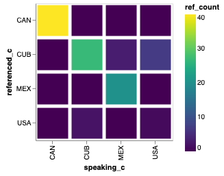
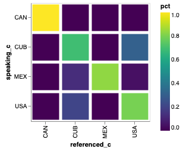
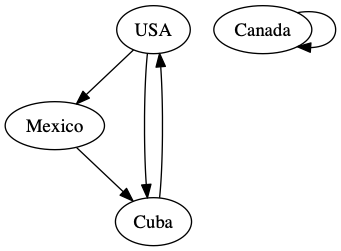
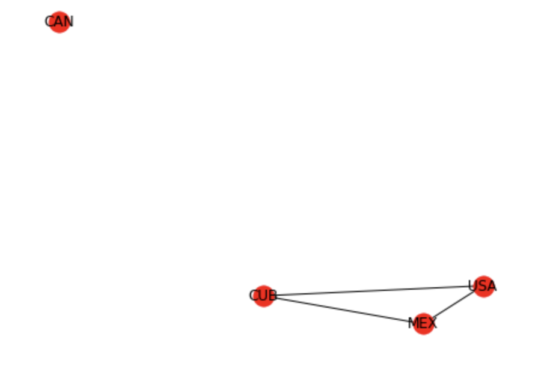

..  Copyright (C)  Google, Runestone Interactive LLC
    This work is licensed under the Creative Commons Attribution-ShareAlike 4.0 International License. To view a copy of this license, visit http://creativecommons.org/licenses/by-sa/4.0/.

Graphing Relationships between Countries
========================================

One thing that we might expect to come out of a bunch of people at the United Nations making speeches is that one country might mention another country.  This probably happens quite frequently in fact.  What we are interested in this section is how we might visualize the relationship of one country talking about another country.  We will do this in two ways, first as a "heatmap" and second as a graph.

Preparing the Data
------------------

Both of these visualization will rely on us processing the data in the speeches to create pairs of countries that have mentioned the other in a speech.  In fact what we are going for will be a table that looks like this:

.. csv-table::

    speaking_c, referenced_c, ref_count
    USA, CAN, 1234
    USA, KOR, 987

The columns are

* speaking_c - the country doing the speaking
* referenced_c - the country that is referenced
* ref_count - the number of times reference is made over all speeches.

When we are all done we will put them together into a matrix that will have the country codes as the rows and the columns and the cells will contain the count of the number of references.

This project might sounds a bit ambitious to tackle all at once, so its probably a good idea to limit the number of countries and the number of years to something more manageable, and more importantly something we can check by hand.  So, lets limit our countries to the United States, Canada, Cuba, and Mexico for the years 2014 and 2015.  The three letter country codes we are after are USA, CAN, CUB, and MEX.

Next we'll want to combine all of the speeches made by each country into one long string, you can do this and arrange it so that the index of the resulting series is the three letter country code.

.. fillintheblank:: un_fb_len1

   What is the length of the resulting string for  MEX?

   - :19202: Is the correct answer
     :2: There are two rows from MEX, you need to combine the text into a single row.
     :9154: That is the length of the first row for MEX, combine them.
     :x: We often think about sum as an aggregate function for numbers, but it works equally well to concatenate text.

Of course countries do not refer to each other in speeches by their country codes, so you will want to add country name as a new column to the DataFrame, by now, you know of many sources for country codes so I'll leave that to you to choose whatever strategy you want to add country name.

At this point you should have a DataFrame that looks like this.

.. raw:: html

    <table border="1" class="dataframe">
        <thead>
            <tr style="text-align: right;">
            <th></th>
            <th>text</th>
            <th>country</th>
            </tr>
            <tr>
            <th>code</th>
            <th></th>
            <th></th>
            </tr>
        </thead>
        <tbody>
            <tr>
            <th>CAN</th>
            <td>It is both \nan honour and a pleasure for me t...</td>
            <td>Canada</td>
            </tr>
            <tr>
            <th>CUB</th>
            <td>We live in a globalized world that is moving t...</td>
            <td>Cuba</td>
            </tr>
            <tr>
            <th>MEX</th>
            <td>As \nPresident of Mexico, it is a high honour ...</td>
            <td>Mexico</td>
            </tr>
            <tr>
            <th>USA</th>
            <td>We come together at a \ncrossroads between war...</td>
            <td>United States of America</td>
            </tr>
        </tbody>
    </table>

You might think that counting the number of times Mexico refers to Cuba will be hard.  but it is actually a one line solution.    See if you can think of it before looking at the solution

.. reveal:: mex_to_cuba

    .. code:: python3

        test_cases.loc['MEX'].text.count('Cuba')

What about counting the number of times that ALL the countries mention Cuba?  Your first thought might be to write a for loop, but you don't need to do that.  Remember the ``str`` object that we can use with a Series.

The answer should look like this:

.. code:: python3

    code
    CAN     0
    CUB    27
    MEX     3
    USA     7
    Name: text, dtype: int64

This tells us that Canada did not mention Cuba at all in 2014 or 2015.  Cuba refers to itself 27 times, Mexico refers to Cuba 3 and the United States refers to Cuba 7 times.

This feels like we are almost there!  If we can convert the above result into a data frame and add CUB as the referenced_c column we could repeat this for each country and concatenate all of the small DataFrames together into one large DataFrame.  Hint use ``pd.concat``.  Contrary to my usual advice, I don't think you can do this without iterating over the rows of the data frame.  If you can do it without a for loop please contact me!

Your initial result should look like this:

.. raw:: html

    <table border="1" class="dataframe">
    <thead>
        <tr style="text-align: right;">
        <th></th>
        <th>text</th>
        <th>referenced_c</th>
        </tr>
        <tr>
        <th>code</th>
        <th></th>
        <th></th>
        </tr>
    </thead>
    <tbody>
        <tr>
        <th>CAN</th>
        <td>40</td>
        <td>CAN</td>
        </tr>
        <tr>
        <th>CUB</th>
        <td>0</td>
        <td>CAN</td>
        </tr>
        <tr>
        <th>MEX</th>
        <td>0</td>
        <td>CAN</td>
        </tr>
        <tr>
        <th>USA</th>
        <td>0</td>
        <td>CAN</td>
        </tr>
        <tr>
        <th>CAN</th>
        <td>0</td>
        <td>CUB</td>
        </tr>
        <tr>
        <th>CUB</th>
        <td>27</td>
        <td>CUB</td>
        </tr>
        <tr>
        <th>MEX</th>
        <td>3</td>
        <td>CUB</td>
        </tr>
        <tr>
        <th>USA</th>
        <td>7</td>
        <td>CUB</td>
        </tr>
        <tr>
        <th>CAN</th>
        <td>0</td>
        <td>MEX</td>
        </tr>
        <tr>
        <th>CUB</th>
        <td>0</td>
        <td>MEX</td>
        </tr>
        <tr>
        <th>MEX</th>
        <td>20</td>
        <td>MEX</td>
        </tr>
        <tr>
        <th>USA</th>
        <td>0</td>
        <td>MEX</td>
        </tr>
        <tr>
        <th>CAN</th>
        <td>0</td>
        <td>USA</td>
        </tr>
        <tr>
        <th>CUB</th>
        <td>2</td>
        <td>USA</td>
        </tr>
        <tr>
        <th>MEX</th>
        <td>0</td>
        <td>USA</td>
        </tr>
        <tr>
        <th>USA</th>
        <td>1</td>
        <td>USA</td>
        </tr>
    </tbody>
    </table>

.. reveal:: narrow_sol
    :instructoronly:

    Here's the nicest solution for this I can think of:

    .. code:: python3

        dfl = []
        for row in test_cases.itertuples():
            dfl.append(pd.DataFrame(test_cases.text.str.count(row.country)))
            dfl[-1]['referenced_c'] = row.Index

Admittedly, this table is a bit hard to read in this format.  Its much easier to read if we use our pivoting skills to make a table like this:

.. raw:: html

    <table border="1" class="dataframe">
    <thead>
        <tr style="text-align: right;">
        <th>referenced_c</th>
        <th>CAN</th>
        <th>CUB</th>
        <th>MEX</th>
        <th>USA</th>
        </tr>
        <tr>
        <th>speaking_c</th>
        <th></th>
        <th></th>
        <th></th>
        <th></th>
        </tr>
    </thead>
    <tbody>
        <tr>
        <th>CAN</th>
        <td>40</td>
        <td>0</td>
        <td>0</td>
        <td>0</td>
        </tr>
        <tr>
        <th>CUB</th>
        <td>0</td>
        <td>27</td>
        <td>0</td>
        <td>2</td>
        </tr>
        <tr>
        <th>MEX</th>
        <td>0</td>
        <td>3</td>
        <td>20</td>
        <td>0</td>
        </tr>
        <tr>
        <th>USA</th>
        <td>0</td>
        <td>7</td>
        <td>0</td>
        <td>1</td>
        </tr>
    </tbody>
    </table>

**Challenge**  Another way to go about this is to start by creating a DataFrame that looks like this:

.. raw:: html

    

    <table border="1" class="dataframe">
    <thead>
        <tr style="text-align: right;">
        <th>code_3</th>
        <th>CAN</th>
        <th>CUB</th>
        <th>MEX</th>
        <th>USA</th>
        </tr>
        <tr>
        <th>code_3</th>
        <th></th>
        <th></th>
        <th></th>
        <th></th>
        </tr>
    </thead>
    <tbody>
        <tr>
        <th>CAN</th>
        <td>40</td>
        <td>0</td>
        <td>0</td>
        <td>0</td>
        </tr>
        <tr>
        <th>CUB</th>
        <td>0</td>
        <td>27</td>
        <td>3</td>
        <td>7</td>
        </tr>
        <tr>
        <th>MEX</th>
        <td>0</td>
        <td>0</td>
        <td>20</td>
        <td>0</td>
        </tr>
        <tr>
        <th>USA</th>
        <td>0</td>
        <td>2</td>
        <td>0</td>
        <td>1</td>
        </tr>
    </tbody>
    </table>
    

You will notice that this is flipped from our original, but we can easily fix that later.   The challenge is to see if you can do it with just three lines of code.

**Check your understanding**

.. fillintheblank:: un_fb_count2

   If we consider all of the years starting with 2000 and after how many times does Mexico refer to Canada?

   - :3: Is the correct answer
     :1: Is the number of times Canada refers to Mexico
     :x: This should be the same steps as you followed before, but starting with a larger number of years.

Visualizing the Relationships with a Heatmap
--------------------------------------------

We will now look at a way to get a better visual representation of the table we have built, first using a **heatmap** and then using a **graph.**

The result we are after for our 2014, 2015 dataset looks like this:

With the narrow representation of the data it is easy to have Altair make a heat map using using a mark_bar and encoding y axis as the speaking_c, the x axis as the referenced_c and the color as ref_count.

.. code:: python3

    alt.Chart(narrow_test, height=200, width=200).mark_rect().encode(
        x='speaking_c:O',
        y='referenced_c:O',
        color='ref_count:Q'
    )

The graph immediately makes visible that very few countries seem to reference the United States.  This seems a bit strange...

.. shortanswer:: un_sa_explainusa

    Can you explain why the United States has so few references?  Is it a bug in our code?  Is there something else going on?  How can we fix it?

Another issue that the graph brings up is the problem with using the raw counts.  Some countries are quite wordy and others are less so, it would be better to keep track of the percentages. That is of all the countries referenced Mexico references itself 87% of the time and Cuba 13% of the time.

Lets iterate on this analysis and see what we learn.

1.  Update the country name for the USA to be United States instead of United States of America.
2.  Make the values for each country percentage based.

.. fillintheblank:: un_fb_usacount

   With the above changes in place, how many times does Cuba refer to the United States? |blank|  What percentage is that?

   - :12: Is the correct answer
     :0: Is the answer for 'United States of America'
     :x: Double check to make sure you

   - :(0.307|.307|0.31|.31): Is correct
     :0: Is not correct
     :x: Create a new column for the percentage value using the ``apply`` method.

Your new heatmap should look like this:

Now try to make your heatmap for these countries across all years, then move on to making a heatmap for all countries across all years!

.. fillintheblank:: un_bg_numwords

   The problem with "United States of America"  may be a general problem with other country names as well.  How many country names are three words long or longer?

   - :24: Is the correct answer
     :23: You may be missing the United States of America?
     :x: Hint: You will want to use ``str.split`` to create a list of words for each country name.

If you inspect the data you will see that many of the problem country names follow a pattern of ``name (something something in parens)``  You can fix a bunch of these by replacing the name that has the parens with just the name.  The ``str.extract`` function will be really useful to solve this.

In the end, to make a graph of all of the countries is a little overwhelming.  So you may want to narrow it down to a group of 12 or so related countries just to get something a little more interesting.  For example use one of our earlier datasets to get all of the three letter country codes for countries in the same region.

You should also take a moment to step back and reflect on how we have built this in an incremental fashion, but how it continues to work at full scale.  That is a very satisfying part of programming and data analysis!  You have to enjoy your victories while you can.

Visualizing the Relationships with a Graph
------------------------------------------

The good news is that we have already done most of the hard work in the last section!  This section will be all about how we can visualize that work in a different way.  In this visualization we are going to represent each country by a circle, and when one country talks about another we'll represent that by a line between the two circles representing each country.  Our small example would look like this:

The arrows on the graph indicate which country is referencing which other country.  Formally, we call the ovals with the country names **nodes**, and the arrows connecting them **edges**.  One of the most common ways that computer scientists and mathematicians represent a graph is called an adjacency matrix.  Don't worry, you have already built an adjacency matrix!

.. raw:: html

    <table border="1" class="dataframe">
    <thead>
        <tr style="text-align: right;">
        <th>referenced_c</th>
        <th>CAN</th>
        <th>CUB</th>
        <th>MEX</th>
        <th>USA</th>
        </tr>
        <tr>
        <th>speaking_c</th>
        <th></th>
        <th></th>
        <th></th>
        <th></th>
        </tr>
    </thead>
    <tbody>
        <tr>
        <th>CAN</th>
        <td>40</td>
        <td>0</td>
        <td>0</td>
        <td>0</td>
        </tr>
        <tr>
        <th>CUB</th>
        <td>0</td>
        <td>27</td>
        <td>0</td>
        <td>2</td>
        </tr>
        <tr>
        <th>MEX</th>
        <td>0</td>
        <td>3</td>
        <td>20</td>
        <td>0</td>
        </tr>
        <tr>
        <th>USA</th>
        <td>0</td>
        <td>7</td>
        <td>0</td>
        <td>1</td>
        </tr>
    </tbody>
    </table>

In an adjacency matrix the cells indicate if there is an edge from the row node to the column node.  The values in the cells are often used to represent a weight or cost to go from one node to the other.  A 0 in the cell indicates that there is not a relationship.

A second common way to represent a graph is through an **edge list** and our narrow representation that we built originally for this project fits that description perfectly. Even the names we chose for the columns (speaking_c, referenced_c) suggest a graph like relationship.

There are two graph packages we can use, ``networkx`` and ``graphviz``.  Its not clear that one is the clear winner, each have some strengths and weaknesses and in fact they can be used together to some extent.  I personally like graphviz a little better since the file format is easy to edit and understand and I think it draws prettier graphs out of the box.  The graph above was drawn using graphviz.  You will need to install both networkx and graphviz on your computer.

Both packages are well documented:

* `Graphviz <https://graphviz.readthedocs.io/en/stable/index.html>`_
* `Overview of NetworkX <https://networkx.github.io/documentation/stable/>`_

Lets look at some example code that shows how easy it was to build the graph above.

.. code:: python3

    from graphviz import Digraph
    g = Digraph()
    g.edge('USA', 'Mexico')
    g.edge('Mexico', 'Cuba')
    g.edge('Cuba', 'USA')
    g.edge('USA', 'Cuba')
    g.edge('Canada', 'Canada')
    g

Using networkx we can build the graph directly from the DataFrame, but the graph produced is not very aesthetically pleasing.

.. code:: python3

    g = nx.from_pandas_edgelist(narrow_test[narrow_test.ref_count > 0],
                            'speaking_c',
                            'referenced_c',
                            edge_attr='ref_count',
                           create_using=nx.DiGraph)
    pos = graphvix_layout(g)
    nx.draw(g, pos)
    nx.draw_networkx_labels(g, pos)

The above produces the rather unattractive graph:

Its missing the arrows, and the text doesn't fit, and the bright red is a bit alarming for no good reason.  Not to mention that the layout is not very easy to understand.
We can immediately do much better by saving the graph we created with networkx as a dot file and then reading it back again and letting graphviz render the graph for us!

.. code:: python3

    from networkx.drawing.nx_agraph import write_dot
    from graphviz import Source

    write_dot(g, 'mydots.dot')
    s = Source.from_file('mydots.dot')
    s

Which produces the much nicer looking:

.. image:: Figures/mydots.dot.png

As with many tools its easy to get to the 80% done in a pretty quick way, but if you want to make a presentation worthy graph that last 20% can take some work.  If we want to clean up the labels on the nodes to use the real names of the countries and add labels to the edges we'll have to combine what we have learned from the above examples and add our edges to a graphviz graph manually.

Pick a sub region to focus on and build a graph where you label the edges with the fraction of times mentioned, using the real name of the country as the title of each node.

Projects for Further Exploration
--------------------------------

* Graph visualizations also lend themselves to literature.  Check out this visualization of the interactions between the characters in the `Lord of the Rings <http://lotrproject.com/statistics/books/cooccurrences>`_. You could make a similar visualization of a book.  `Project Gutenberg <https://www.gutenberg.org/>`_ offers over 58,000 books that you are free to use for nearly any purpose.

* Since graphing each country of the world individually is a bit difficult, build a heatmap or graph of how the countries within each subregion reference each other.  There are about 22 sub regions in the `country_codes <../_static/country_codes.csv>`_ data file.  Which is quite manageable.

* Find or create a group of topics and build a heatmap or a graph to visualize which countries or regions are most interested in those topics.  Where we are defining interest to be somehow related to the number of times those topics come up in their UN speeches.

* **Challenge** A `chord diagram <https://python-graph-gallery.com/chord-diagram/>`_ is another great way to visualize relationships.  Create a chord diagram to visualize the relationships between countries.

**Lesson Feedback**

.. poll:: LearningZone_8_5
    :option_1: Comfort Zone
    :option_2: Learning Zone
    :option_3: Panic Zone

    During this lesson I was primarily in my...

.. poll:: Time_8_5
    :option_1: Very little time
    :option_2: A reasonable amount of time
    :option_3: More time than is reasonable

    Completing this lesson took...

.. poll:: TaskValue_8_5
    :option_1: Don't seem worth learning
    :option_2: May be worth learning
    :option_3: Are definitely worth learning

    Based on my own interests and needs, the things taught in this lesson...

.. poll:: Expectancy_8_5
    :option_1: Definitely within reach
    :option_2: Within reach if I try my hardest
    :option_3: Out of reach no matter how hard I try

    For me to master the things taught in this lesson feels...

