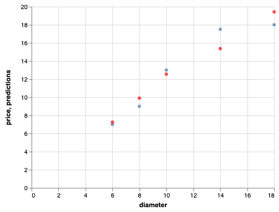

.. Copyright (C)  Google, Runestone Interactive LLC
   This work is licensed under the Creative Commons Attribution-ShareAlike 4.0
   International License. To view a copy of this license, visit
   http://creativecommons.org/licenses/by-sa/4.0/.

Improving our Pizza Price Predictions
=====================================

In the last section, we made a simple model that allows us to predict the price
of pizza based on its size. However, we know that there are many other factors,
we will call them **features**, that go into the price of a pizza. In this
section, we will investigate how we can improve our model by adding a feature
corresponding to the number of toppings. The theory here is that with more
information we should be able to do a better job of making predictions. Now this
little step makes the math a LOT more complicated, and it's a lot harder to
visualize what we are doing when we get past 3 dimensions! Fortunately we can
ignore the complicated math and let Solver do the heavy lifting. It turns out
that it is not a big leap to go from one feature to several when using solver.

Our goal for solver is the same as it was before: we want to minimize the sum of
squared errors. But we need to reframe the problem just slightly when we move
past a single feature. Instead of finding the slope of a line, we need to find
coefficients for each of our features. If you want to impress your friends and
family, you could say that we are finding the coefficients that describe a
hyperplane in n-dimensional space, where n is the number of features we have to
work with. For the pizza problem, we might imagine that the kind of crust could
be a third feature, and maybe the kind of sauce could be a fourth, etc. We will
keep it simple for now and just add the number of toppings as that is all we
need to do to see how we move from a single feature to any number of features.
In addition to the number of toppings, we will need to calculate one more
coefficient, which is akin to the y-intercept of the previous example. We will
call this term the bias term, and it is necessary to include otherwise our
hyperplane would always have to be centered at the origin - just like the best
fit line would always go through the origin without the y-intercept.

If you want to think of it in terms of an equation, like the equation of a line,
the equation would be
:math:`w_1 v_1 + w_2 v_2 + w_3 v_3 + ... w_i v_i  + w_b bias`. Most textbooks
will simplify this equation by making the bias values :math:`w_0 v_0` which will
make the equation :math:`w_0 v_0 + w_2 v_2 + w_3 v_3 + ... w_i v_i`. The
math:`w_i` terms are the coefficients that our algorithm (or Solver) will find
for us, and the :math:`v_i` terms are all of our observed values for the
features.

To make this a bit easier to follow, we will rearrange our spreadsheet a bit as
shown in the screenshot below. The area with the green background is for the
coefficients for our features. We will let Solver figure out what values should
go in there in order to minimize the MSE with the yellow background.

.. figure:: Figures/multi_solver.png

Computing the prediction for each row could be quite error prone as there are a
lot of cells to get right. The prediction for E3 could be calculated by the
formula ``A$2*A3+B$2*B3+C$2*C3``. You can see that this would get pretty
tiresome if you had 20 features. It is better to use ``SUMPRODUCT`` function
which does the same thing ``SUMPRODUCT(A$2:C$2,A3:C3)``. You will notice that we
fill the bias column with 1 as a placeholder for our coefficient to multiply.

You now have everything you need to set up and run Solver to create our new and
improved model.

.. fillintheblank:: multi_pizza_1

   What is the MSE for the new model? |blank|

   - :1.53.*: Is the correct answer, and an improvement over 1.75!
     :185.85: Is the MSE when the coefficients are all 0. Thats not quite right.
     :x: catchall feedback

.. fillintheblank:: multi_pizza_2

   The coefficient for pizza_diameter is |blank|, for num_toppings is |blank|,
   and for bias is |blank|.

   - :1.01.*: Is the correct answer
     :x: Not quite. Keep trying

   - :-0.617.*|-0.62.*: Is the correct answer
     :x: Not quite. Keep trying

   - :2.41.*: Is the correct answer
     :x: Not quite. Keep trying

Hopefully this little excursion back to spreadsheets has helped you develop some
intuition for how regression works and what is being computed. Before we return
to the bike rental problem, let's see how we can duplicate our efforts on
predicting Pizza prices in Python using Pandas and Scikit-Learn.

Introducing Scikit-Learn
------------------------

Scikit-Learn is a really powerful Python package for doing all kinds of machine
learning tasks. It has a consistent API so once you have learned one kind of
model with Scikit-Learn you will be able to apply that to many different machine
learning algorithms.

We will first create an empty model, then we will **fit** the model to our data.
Some people also refer to this as training the model. It is essentially what we
did when we pressed the Solve button on Solver. Finally, we can use the model to
**predict** values using the model.

Create a new notebook and let's give this a try.

First, import pandas, sklearn, and altair.

.. code:: python3

    import pandas as pd
    from sklearn.linear_model import LinearRegression, LogisticRegression
    from sklearn.metrics import mean_squared_error
    from altair import Chart, X, Y

.. code:: python3

    pdf = pd.read_csv('../Data/pizza.csv')
    pdf

.. raw:: html

    <table border="1" class="dataframe">
    <thead>
        <tr style="text-align: right;">
        <th></th>
        <th>diameter</th>
        <th>toppings</th>
        <th>price</th>
        <th>predictions</th>
        </tr>
    </thead>
    <tbody>
        <tr>
        <th>0</th>
        <td>6</td>
        <td>2</td>
        <td>7.0</td>
        <td>7.259036</td>
        </tr>
        <tr>
        <th>1</th>
        <td>8</td>
        <td>1</td>
        <td>9.0</td>
        <td>9.903614</td>
        </tr>
        <tr>
        <th>2</th>
        <td>10</td>
        <td>0</td>
        <td>13.0</td>
        <td>12.548193</td>
        </tr>
        <tr>
        <th>3</th>
        <td>14</td>
        <td>2</td>
        <td>17.5</td>
        <td>15.367470</td>
        </tr>
        <tr>
        <th>4</th>
        <td>18</td>
        <td>2</td>
        <td>18.0</td>
        <td>19.421687</td>
        </tr>
    </tbody>
    </table>

.. code:: python3

    model = LinearRegression()
    model.fit(pdf[['diameter','toppings']], pdf.price)

The fit method takes two parameters:

1. The features that we use to build the model
2. The known quantity that we are trying to fit the model against

Now, using the diameter and toppings make predictions about what the price will
be.

.. code:: python3

    model.predict(pdf[['diameter','toppings']])

.. parsed-literal::

    array([ 7.25903614,  9.90361446, 12.54819277, 15.36746988, 19.42168675])

If you look at those predictions, you will see they are identical to the
predictions we got from the spreadsheet!

.. parsed-literal::

    7.259036145
    9.903614458
    12.54819277
    15.36746988
    19.42168675

We can also use the ``mean_squared_error`` function supplied by sklearn to check
the mean squared error of our predictions. This function takes two parameters
the "true" values, in our case, the known price, and the predicted values.

.. code:: python3

    mean_squared_error(pdf.price, model.predict(pdf[['diameter', 'toppings']]))

.. parsed-literal::

    1.5313253012048187

We can also add the predictions to our dataframe so that we can graph the actual
values and predicted values together.

.. code:: python3

    pdf['predictions'] = model.predict(pdf[['diameter', 'toppings']])
    Chart(pdf).mark_circle().encode(x='diameter', y='price') + \
    Chart(pdf).mark_circle(color='red').encode(x='diameter', y='predictions')

Practice
--------

Build another model using only the diameter and plot the predictions from that
model along with the actual values and the predicted values from using both.
Hint: sklearn expects to have the data it uses to build the model in a certain
format. By default a single series gets converted into an array that looks like
this: ``array([ 6,  8, 10, 14, 18])`` but sklearn wants it to look as below.

.. parsed-literal::

    array([[ 6],
        [ 8],
        [10],
        [14],
        [18]])

The error message you likely got tells you how to reshape the data. You can use
``pdf.diameter.values.reshape(-1,1)`` to get the diameter into the correct
shape.

.. fillintheblank:: sklearn_pizza_top

   Build a third model using only the number of toppings. What is the mean
   squared error of this model? |blank|

   - :18.58.*: Is the correct answer
     :x: Keep on trying

**Lesson Feedback**

.. poll:: LearningZone_10_7
    :option_1: Comfort Zone
    :option_2: Learning Zone
    :option_3: Panic Zone

    During this lesson I was primarily in my...

.. poll:: Time_10_7
    :option_1: Very little time
    :option_2: A reasonable amount of time
    :option_3: More time than is reasonable

    Completing this lesson took...

.. poll:: TaskValue_10_7
    :option_1: Don't seem worth learning
    :option_2: May be worth learning
    :option_3: Are definitely worth learning

    Based on my own interests and needs, the things taught in this lesson...

.. poll:: Expectancy_10_7
    :option_1: Definitely within reach
    :option_2: Within reach if I try my hardest
    :option_3: Out of reach no matter how hard I try

    For me to master the things taught in this lesson feels...