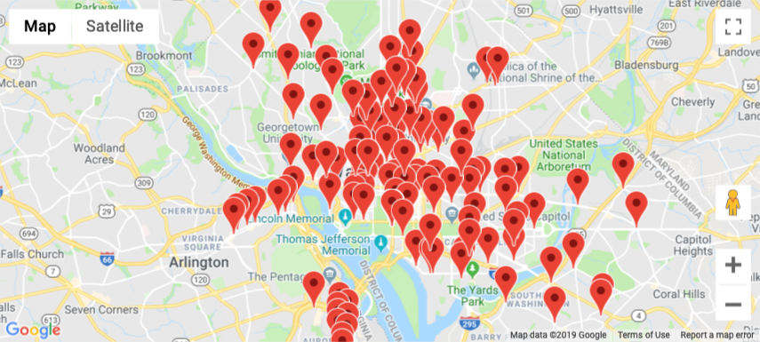

Getting SQL Data into a DataFrame
=================================

Running the kind of queries we did in the last few sections is great for exploring and getting to know the data.  It is also useful if you just need a one time quick answer.   But more often than not what you want to do is to get the data from a database into a DataFrame so that you can visualize it, combine it with other data, or do further analysis.  For this exercise our goal is to create a Google Map with a marker for all of the stations in the database.

Pandas provides us with a great way to use our SQL knowledge to create create a DataFrame with the results.  The ``pd.read_sql``  allows us to pass in a SQL query as a string, along with a URL to connect to the database, and will return a DataFrame.  Let's try that on our bikeshare_stations table now.

.. code:: python3

    import pandas as pd
    stations = pd.read_sql_query("""select * from bikeshare_stations where latitude is not NULL""",'sqlite:///bikeshare.db')
    stations.head()

.. raw:: html

    <table border="1" class="dataframe">
    <thead>
        <tr style="text-align: right;">
        <th></th>
        <th>index</th>
        <th>station_id</th>
        <th>name</th>
        <th>status</th>
        <th>latitude</th>
        <th>longitude</th>
        </tr>
    </thead>
    <tbody>
        <tr>
        <th>0</th>
        <td>0</td>
        <td>31620</td>
        <td>5th &amp; F St NW</td>
        <td>open</td>
        <td>38.897637</td>
        <td>-77.018126</td>
        </tr>
        <tr>
        <th>1</th>
        <td>1</td>
        <td>31105</td>
        <td>14th &amp; Harvard St NW</td>
        <td>open</td>
        <td>38.926638</td>
        <td>-77.032126</td>
        </tr>
        <tr>
        <th>2</th>
        <td>2</td>
        <td>31400</td>
        <td>Georgia &amp; New Hampshire Ave NW</td>
        <td>closed</td>
        <td>38.935638</td>
        <td>-77.024126</td>
        </tr>
        <tr>
        <th>3</th>
        <td>3</td>
        <td>31111</td>
        <td>10th &amp; U St NW</td>
        <td>open</td>
        <td>38.917638</td>
        <td>-77.025126</td>
        </tr>
        <tr>
        <th>4</th>
        <td>4</td>
        <td>31104</td>
        <td>Adams Mill &amp; Columbia Rd NW</td>
        <td>open</td>
        <td>38.922638</td>
        <td>-77.042126</td>
        </tr>
    </tbody>
    </table>

We can use any SQL query we want and pandas is 'smart' enough to look at the results and create columns that match the columns in the database.  If we know we are going to have columns containing dates its a good idea to use the ``parse_dates`` parameter when we call ``read_sql_query`` This will ensure that our date columns are of the correct type without us having to convert them later.

Create a DataFrame of the first 10 rides from the trip_data table sorted by start_date.  Then add a column called ``calc_duration`` where you calculate the duration of the ride by subtracting the start date from the end date.

.. fillintheblank:: bikes_dur_type

   What is the type of the ``calc_duration`` field that you just computed?

   - :.*imedelta.*: Is the correct answer
     :datetime64: is the type for start_date and end_date but not for this column.
     :x: Make sure that you use the parse_dates parameter when you read the DataFrame

.. fillintheblank:: bikes_duration_readsql

   Paste the value for the first row here: |blank| and the last row here |blank|

   - :00\:59\:08: Is the correct answer
     :3548: is the answer in seconds, calculate a new field
     :x: Keep working

   - :00.07.22: Is the correct answer
     :442: is the answer in seconds, calculate a new field
     :x: Keep working

Mapping Bike Stations
---------------------

Now lets have some fun.  We are going to map the location of all of the bike stations on a google map!  Later you can explore all kinds of ways to visualize rides and ride frequencies routes between starting and ending point and many more things.

To map our stations we will use the ``gmaps`` module.  You will need to ``conda install gmaps`` to install this.  You will also need to install the `jupyter-gmaps extension <https://github.com/pbugnion/gmaps#installing-jupyter-gmaps-for-jupyterlab>`_ for Jupyterlab.  When you have followed the directions there you will need to use the exentions manager to install the ``jupyter-gmaps`` extension. The instructions give you a link to the directions on how you can get your own API key to use the Google maps in a notebook.  Your instructor may also be able to provide you with an API key as well.  This is probably the hardest part!

Lets proceed under the assumption that you have all of the prerequisites installed and working.  Our next task is to create a list of all the latitude and longitude values for each of the bikeshare stations.  The challenge here is that the Google Maps interface wants to get a list of that looks like this:  ``[(lat1, long1), (lat2, long2), ...]`` that means we need to combine the two columns from the DataFrame into a list of tuples.  You could, of course, do this with a for loop, iterating over all the rows and making a tuple, but there is a much easier way.

Suppose we have two lists:

.. code:: python3

    list1 = ['a', 'b', 'c']
    list2 = [1, 2, 3]

We want to combine these into ``[('a', 1), ('b', 2), ('c', 3)]`` We can do that using Python's ``zip`` function like ``zip(list1, list2)``.  The zip function takes any number of iterable objects and "zips" them together taking the first element from each and making a tuple, then the second element of each etc.  If we expand our example

.. code:: python3

    list1 = ['a', 'b', 'c']
    list2 = [1, 2, 3]
    str1 = "XYZ"

Then ``list(zip(list1, list2, str1))`` returns ``[('a', 1, 'X'), ('b', 2, 'Y'), ('c', 3, 'Z')]``  But, what is the deal with wrapping ``zip`` with ``list``?  Well, ``zip`` does not actually return a list, zip returns an iterator that in most circumstances behaves just like a list, except when you want to see a small example.

The good news is that Series are also iterables so we can pass a series to the zip function and it will work great.

.. code:: python3

    import gmaps
    gmaps.configure(api_key='YOUR KEY HERE')

This gets everything set up to use ``gmaps``.  Now lets use the stations DataFrame we created earlier to make our first map.

.. code:: python3

    locations = list(zip(stations.latitude, stations.longitude))
    dc_center = (38.9072, -77.0369)
    fig = gmaps.figure(center=dc_center, zoom_level=12)

    marker_layer = gmaps.marker_layer(locations)
    fig.add_layer(marker_layer)
    fig

Practice and Further Exploration
--------------------------------

1.  The map seems a little busy with all those markers.  Redo the map so that it only shows the 20 busiest stations.  That is the 20 stations with the highest starting counts.

2.  It would also be interesting to add the 20 stations with the largest ending counts.  Can you add those in a different color?

3. Investigate the interface to see if there is a way for you to color code the markers based on the number of rides originating from that station.  Show the 50 most popular stations using five different colors. 1 color for the top 10 another for the next 10 and so on.

4. Bikeshare datasets are available for many cities.  Most of them come a similar format to this one.  Find some bikeshare data for a city close to you or for your favorite city and see if you can reproduce this map.  Hint, if your data does not come with latitude and longitude then investigate the ``geopy`` package, you can use your Google API or a free service like GeocodeFarm to use the address of the station to get the latitude and longitude.

5.  Here a real **challenge** for you, pick a station and then follow the rentals, but only map the stations where a bike ends up back at your original starting point.  In other words for the bikes that started at station A, go to station B, then D then pause for a while then on to station X and finally back to A.  Others may take a different route.    If you can do this you can investigate the layer that lets you add a route to the map!  Then you can show the probably routes that the various bikes took to make their way back to the starting point.  You may want to limit the time on this to one day or a week.

6. **Research Challenge** The ``gmaps`` interface allows you to add a heatmap layer.  This sounds like it could a very interesting way to overlay the popularity of different stations and routes on the map.  Investigate this layer and what the data should look like, then see if you can find a way to get the data into the appropriate form to make a heatmap.

