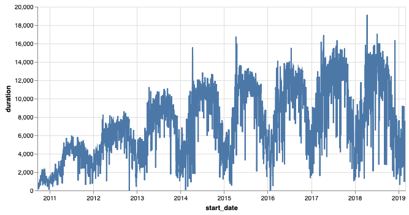
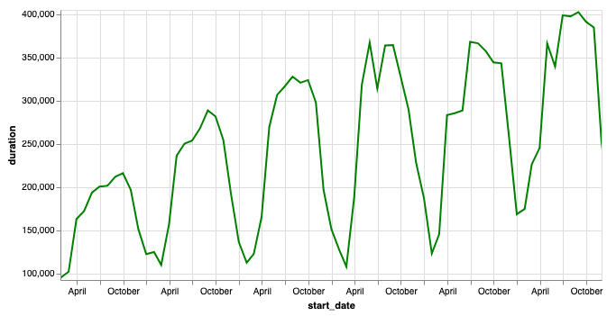

.. Copyright (C)  Google, Runestone Interactive LLC
   This work is licensed under the Creative Commons Attribution-ShareAlike 4.0
   International License. To view a copy of this license, visit
   http://creativecommons.org/licenses/by-sa/4.0/.

Visualizing Bike Share Data as a Time Series
============================================

In addition to visualizing the bike share data on a map, we can also think about
the popularity of bike share usage over time.

- Is it growing in popularity?
- Are there times of the year when bike sharing is more popular?
- Are there days of the week that are more popular for bike sharing?

We have access to data from September 2010 to the time of writing this chapter
(March 2019). Let's first look at how Pandas makes it possible for us to easily
work with data that contains timestamps. For this first part, we'll use all the
data we have available but this contains 22,969,237 bike trips, which is too
much to store in a SQLLite database. You are welcome to construct your own
database from the
`zip files <https://s3.amazonaws.com/capitalbikeshare-data/index.html>`_ or from
some other bike share dataset if you wish. At the end of this section, you will
see one way to combine all of the bikeshare data into a giant dataframe.

Let's dive in and take a look at a graph of daily bike rentals.

    Daily bike rentals for all days from Sept. 2010 through Feb. 2019.

Creating this graph is very easy if we use the Pandas ``resample`` method, which
works with timestamp data. This is a much nicer way to work with time series
data than breaking the date into columns for year, month, day, hour, minute,
etc. then using the ``groupby`` method on a list of columns. The ``resample``
method allows us to calculate lots of summary information on many interesting
time scales. For example, we could look at rentals by hour, but as you can see,
that is so dense that its pretty useless.

.. figure:: Figures/hourly_rentals_all.png

    Hourly bike rentals for all days from Sept. 2010 through Feb. 2019.

The ``resample`` method takes several parameters, but the important one is the
one that specifies how you want it to resample. There are several options, and
here are the most common choices.

========= ============
Parameter Description
========= ============
B         Business day
D         Calendar day
W         Weekly
M         Month end
Q         Quarter end
A         Year end
H         Hourly
T         Minutely
S         Secondly
========= ============

The python code required to draw the daily graph is as follows.

.. code:: python3

    resamp = trip_data.set_index('start_date')
    resamp = resamp.resample('D').count()
    resamp = resamp.reset_index()
    Chart(resamp, width=600).mark_line().encode(
        x='start_date', y='duration').interactive()

First, we create a new DataFrame using the start_date as the index. This makes
it easier for us to work with the ``resample`` method and prepare for graphing.
Next, we call ``resamp.resample('D').count()``. The ``'D'`` parameter indicates
that we want to aggregate all of the rides for the day together and count the
number of rides each each day. In addition you can use ``mean``, ``min``,
``max``, ``median``, and ``sum`` just like you have with ``groupby``.

.. fillintheblank:: ts_bike_num

   Using the data in the ``bikeshare.db``, create a dataframe and resample it to
   see how many rides occurred on June 9 2011. |blank|

   - :3889: Is the correct answer
     :x: Hint: The index is a date, you can use ``.loc`` with a date in most reasonable date formats ('2011-06-09' will definitely work)

In order to graph the data with Altair, we need to make the index into a normal
column again. We reset the index and then draw the chart. The choice of
``y='duration'`` is arbitrary.

.. raw:: html

    <table border="1" class="dataframe">
    <thead>
        <tr style="text-align: right;">
        <th></th>
        <th>start_date</th>
        <th>duration</th>
        <th>end_date</th>
        <th>start_station</th>
        <th>end_station</th>
        <th>bike_number</th>
        <th>member_type</th>
        </tr>
    </thead>
    <tbody>
        <tr>
        <th>0</th>
        <td>2010-09-20</td>
        <td>212</td>
        <td>212</td>
        <td>212</td>
        <td>212</td>
        <td>212</td>
        <td>212</td>
        </tr>
        <tr>
        <th>1</th>
        <td>2010-09-21</td>
        <td>324</td>
        <td>324</td>
        <td>324</td>
        <td>324</td>
        <td>324</td>
        <td>324</td>
        </tr>
        <tr>
        <th>2</th>
        <td>2010-09-22</td>
        <td>377</td>
        <td>377</td>
        <td>377</td>
        <td>377</td>
        <td>377</td>
        <td>377</td>
        </tr>
        <tr>
        <th>3</th>
        <td>2010-09-23</td>
        <td>373</td>
        <td>373</td>
        <td>373</td>
        <td>373</td>
        <td>373</td>
        <td>373</td>
        </tr>
        <tr>
        <th>4</th>
        <td>2010-09-24</td>
        <td>362</td>
        <td>362</td>
        <td>362</td>
        <td>362</td>
        <td>362</td>
        <td>362</td>
        </tr>
    </tbody>
    </table>

Experiment with some resampling and graphing of the data. Try to graph by
business day and week, instead of day, to get an idea.

.. fillintheblank:: ts_bw_weekly

   For the week ending June 12 2011 how many rentals were there? |blank|

   - :31371|: Is the correct answer
     :31367: Is close but you may be indexing by ``start_date``
     :x: The date used as the index is the ending date

.. fillintheblank:: ts_bw_mean_dur

   For the week ending June 12, 2011 what was the mean duration of all rides?
   |blank|

   - :1223\..*: Is the correct answer
     :x: You can use ``mean`` instead of count with resample

Graph the mean ride length on a daily scale. Do you notice any trends in terms
of days that have longer or shorter rides? Make a graph that overlays all days
of the week with just the business days.

.. reveal:: ts_rev_1
    :instructoronly:

    If you zoom in on the spikes and consult a calendar, you will see that it
    looks like Sunday is a winner for longer bike rides.

    .. code:: python3

        resamp = trip_data[trip_data.start_date < '2012-01-01'].set_index('start_date')
        resamp = resamp.resample('D').mean()
        resamp = resamp.reset_index()
        d = Chart(resamp, width=600).mark_line().encode(
            x='start_date',y='duration').interactive()
        resamp = trip_data[trip_data.start_date < '2012-01-01'].set_index('start_date')
        resamp = resamp.resample('B').mean()
        resamp = resamp.reset_index()
        b = Chart(resamp, width=600).mark_line(color='red').encode(
            x='start_date',y='duration').interactive()
        d+b

Indexing with a DatetimeIndex
-----------------------------

Using a timestamp as an index gives you some additional power. For example, you
can use the index to select a year: ``resamp['2010']`` will return all rows for
the year 2010, while ``resamp['2010-10']`` will return all the rows for the
month of October in 2010. This gives you incredible power and flexibility for
working with date-indexed data.

Next Step: Predicting Rentals
-----------------------------

Let's take another look at the graph of bike rentals.

    Daily bike rentals for all days from Sept. 2010 through Feb. 2019.

This graph indicates there is an overall upward trend in bike rentals in the DC
area. Although it looks like it might be starting to level off in the 2017-2018
time frame. Within that overall trend of growth, we can see that there are
seasonal variations as well as daily variations.

    Seasonal variation in bike rentals

A time series graph like this is actually very similar to a graph of airline
travel, stock prices, and others. In the next few sections, we are going to try
to develop a model that will allow us to predict the number of bike rentals on a
particular day. There are many ways that we can do this, but one of the most
common models to start with for making predictions is "linear regression". But
first, let's take a break for some pizza.

Working with ZIP Files (Optional)
---------------------------------

In many cases, large data files are available in compressed format. Usually this
is either ZIP or gzip format. Python allows us to work with the ZIP files
directly so we don't have to manually uncompress and recompress the files just
to save disk space. This example shows you how to create a DataFrame of all the
bike share data, using the assumption that you have downloaded all the files you
need into a folder, and have no other files in that folder.

.. code:: python3

    from zipfile import ZipFile
    import os

    bdfs = []
    zipfiles = os.listdir('../Data/bikeshare')
    for f in zipfiles:
        with ZipFile(f'../Data/bikeshare/{f}') as myzip:
            for zf in myzip.namelist():
                print(zf)
                if zf[-3:] == 'csv' and not zf[:2] == '__':
                    with myzip.open(zf) as ridedata:
                        t = pd.read_csv(ridedata,
                                        parse_dates=['Start date', 'End date'])
                        t.columns = list(cmap.values())
                        t = t.drop(['start_location', 'end_location'], axis=1)
                        bdfs.append(t)

    trip_data = pd.concat(bdfs)

The ``os.listdir`` call on line 5 looks at the directory and returns a list
containing all the filenames of files there. The ``with ZipFile...`` line opens
the ``.zip`` file as an object that you can manipulate. In particular, we would
like to be able to find out all the files that have been compressed and stored
in our zip, and we would like to be able to open them just like any other file.
Except that when we use ``myzip.open`` on line 12, Python will automatically
uncompress the file for us. The rest of lines simply use ``pd.read_csv`` to read
in the uncompressed data, create a DataFrame, and store that DataFrame in a list
for us to use when we use ``pd.concat`` to concatenate all of the DataFrames
into a single large DataFrame.

**Lesson Feedback**

.. poll:: LearningZone_10_5
    :option_1: Comfort Zone
    :option_2: Learning Zone
    :option_3: Panic Zone

    During this lesson I was primarily in my...

.. poll:: Time_10_5
    :option_1: Very little time
    :option_2: A reasonable amount of time
    :option_3: More time than is reasonable

    Completing this lesson took...

.. poll:: TaskValue_10_5
    :option_1: Don't seem worth learning
    :option_2: May be worth learning
    :option_3: Are definitely worth learning

    Based on my own interests and needs, the things taught in this lesson...

.. poll:: Expectancy_10_5
    :option_1: Definitely within reach
    :option_2: Within reach if I try my hardest
    :option_3: Out of reach no matter how hard I try

    For me to master the things taught in this lesson feels...