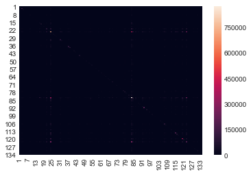
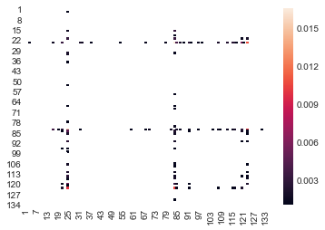

.. Copyright (C)  Google, Runestone Interactive LLC
   This work is licensed under the Creative Commons Attribution-ShareAlike 4.0
   International License. To view a copy of this license, visit
   http://creativecommons.org/licenses/by-sa/4.0/.

Visualizing Grocery Data
========================

You can get some inspiration from https://python-graph-gallery.com/.

-  How can we show top combinations of two things?

-  Visualize the flow from department to department or from aisle to aisle.

To accomplish this, you will have to dig into some new packages that we have not
used so far. But this is all part of the process.

We need to create square adjacency matrix: Aisle to Aisle. We'll use this to
build our chord diagram and other graph like visualizations.

1. Merge the order_product data frame with the aisle data frame so we have the
   aisle number for each product. (We can drop the aisle name to save memory.)
2. Iterate over each order.
3. Order the order by add_to_cart_order.
4. Increase the count in from aisle (row) to to aisle (column); this is a
   directed graph.

.. code:: python3

   aisle_mat = pd.DataFrame(0, index=range(1, 135), columns=range(1, 135))
   flowdf = op.merge(products, on='product_id').merge(adf, on='aisle_id')

.. code:: python3

   %%time

   tco = flowdf.groupby('order_id')

   for order in tco.groups.keys():
       contents = tco.get_group(order).sort_values('add_to_cart_order')
       rowit = contents.iterrows()
       start_aisle = next(rowit)[1]['aisle_id']

       for ix, row in rowit:
           #print(start_aisle, row['aisle_id'])
           try:
               aisle_mat.loc[start_aisle][row['aisle_id']] += 1
           except:
               print("bad index", start_aisle, row['aisle_id'],
                     type(start_aisle), type(row['aisle_id']))
           start_aisle = row['aisle_id']

.. parsed-literal::

   CPU times: user 3h 4min 26s, sys: 2min 7s, total: 3h 6min 34s
   Wall time: 3h 11min 18s

.. code:: python3

   aisle_mat.to_csv('aisle_mat.csv')

   for ix, row in contents.iterrows():
       print(row['product_id'], row['aisle_id'])

.. code:: python3

   x = contents.iterrows()
   next(x)[1]['aisle_id']

   for i, j in x:
       print(j['product_id'])

   sbn.heatmap(aisle_mat)

.. parsed-literal::

   <matplotlib.axes._subplots.AxesSubplot at 0x22a687e48>

Looks like a lot of small values. Let's make a histogram of the whole thing and
see.

.. code:: python3

   for i in range(1,135):
       aisle_mat.loc[i][i] = 0

   x = aisle_mat.values.flatten()
   sall = aisle_mat.values.sum()
   y = aisle_mat.applymap(lambda x: x/sall)
   z = y.applymap(lambda x: x if x > 0.001 else np.nan)

   sbn.heatmap(z)

.. parsed-literal::

   <matplotlib.axes._subplots.AxesSubplot at 0x386ea27f0>

.. code:: python3

   aisle_mat = pd.read_csv('aisle_mat.csv',index_col='aid')
   aisle_mat.head()

.. raw:: html

    

    
    <table border="1" class="dataframe">
      <thead>
        <tr style="text-align: right;">
          <th></th>
          <th>1</th>
          <th>2</th>
          <th>3</th>
          <th>4</th>
          <th>5</th>
          <th>6</th>
          <th>7</th>
          <th>8</th>
          <th>9</th>
          <th>10</th>
          <th>...</th>
          <th>125</th>
          <th>126</th>
          <th>127</th>
          <th>128</th>
          <th>129</th>
          <th>130</th>
          <th>131</th>
          <th>132</th>
          <th>133</th>
          <th>134</th>
        </tr>
        <tr>
          <th>aid</th>
          <th></th>
          <th></th>
          <th></th>
          <th></th>
          <th></th>
          <th></th>
          <th></th>
          <th></th>
          <th></th>
          <th></th>
          <th></th>
          <th></th>
          <th></th>
          <th></th>
          <th></th>
          <th></th>
          <th></th>
          <th></th>
          <th></th>
          <th></th>
          <th></th>
        </tr>
      </thead>
      <tbody>
        <tr>
          <th>1</th>
          <td>5151</td>
          <td>177</td>
          <td>621</td>
          <td>362</td>
          <td>83</td>
          <td>74</td>
          <td>56</td>
          <td>152</td>
          <td>336</td>
          <td>8</td>
          <td>...</td>
          <td>54</td>
          <td>20</td>
          <td>30</td>
          <td>401</td>
          <td>388</td>
          <td>205</td>
          <td>344</td>
          <td>8</td>
          <td>19</td>
          <td>12</td>
        </tr>
        <tr>
          <th>2</th>
          <td>216</td>
          <td>2692</td>
          <td>464</td>
          <td>387</td>
          <td>168</td>
          <td>62</td>
          <td>152</td>
          <td>88</td>
          <td>882</td>
          <td>20</td>
          <td>...</td>
          <td>34</td>
          <td>30</td>
          <td>52</td>
          <td>602</td>
          <td>322</td>
          <td>218</td>
          <td>933</td>
          <td>8</td>
          <td>21</td>
          <td>19</td>
        </tr>
        <tr>
          <th>3</th>
          <td>632</td>
          <td>417</td>
          <td>126287</td>
          <td>1871</td>
          <td>311</td>
          <td>322</td>
          <td>247</td>
          <td>380</td>
          <td>1455</td>
          <td>47</td>
          <td>...</td>
          <td>1152</td>
          <td>128</td>
          <td>299</td>
          <td>1509</td>
          <td>1849</td>
          <td>2106</td>
          <td>1800</td>
          <td>48</td>
          <td>158</td>
          <td>33</td>
        </tr>
        <tr>
          <th>4</th>
          <td>356</td>
          <td>405</td>
          <td>1844</td>
          <td>20762</td>
          <td>717</td>
          <td>192</td>
          <td>186</td>
          <td>165</td>
          <td>2519</td>
          <td>49</td>
          <td>...</td>
          <td>255</td>
          <td>122</td>
          <td>268</td>
          <td>1234</td>
          <td>2176</td>
          <td>1176</td>
          <td>3130</td>
          <td>32</td>
          <td>110</td>
          <td>27</td>
        </tr>
        <tr>
          <th>5</th>
          <td>90</td>
          <td>169</td>
          <td>266</td>
          <td>681</td>
          <td>2325</td>
          <td>57</td>
          <td>110</td>
          <td>47</td>
          <td>673</td>
          <td>44</td>
          <td>...</td>
          <td>31</td>
          <td>42</td>
          <td>104</td>
          <td>639</td>
          <td>539</td>
          <td>245</td>
          <td>744</td>
          <td>5</td>
          <td>27</td>
          <td>8</td>
        </tr>
      </tbody>
    </table>
    
5 rows × 134 columns

    

.. code:: python3

   aisle_mat['total'] = aisle_mat.apply(lambda x : x.sum(), axis=1)

.. code:: python3

   aisle_mat.sort_values('total', ascending=False, inplace=True)
   aisle_mat.head()

.. raw:: html

    

    
    <table border="1" class="dataframe">
      <thead>
        <tr style="text-align: right;">
          <th></th>
          <th>1</th>
          <th>2</th>
          <th>3</th>
          <th>4</th>
          <th>5</th>
          <th>6</th>
          <th>7</th>
          <th>8</th>
          <th>9</th>
          <th>10</th>
          <th>...</th>
          <th>126</th>
          <th>127</th>
          <th>128</th>
          <th>129</th>
          <th>130</th>
          <th>131</th>
          <th>132</th>
          <th>133</th>
          <th>134</th>
          <th>total</th>
        </tr>
        <tr>
          <th>aid</th>
          <th></th>
          <th></th>
          <th></th>
          <th></th>
          <th></th>
          <th></th>
          <th></th>
          <th></th>
          <th></th>
          <th></th>
          <th></th>
          <th></th>
          <th></th>
          <th></th>
          <th></th>
          <th></th>
          <th></th>
          <th></th>
          <th></th>
          <th></th>
          <th></th>
        </tr>
      </thead>
      <tbody>
        <tr>
          <th>24</th>
          <td>6545</td>
          <td>6616</td>
          <td>33754</td>
          <td>12545</td>
          <td>3020</td>
          <td>2600</td>
          <td>2829</td>
          <td>2646</td>
          <td>13162</td>
          <td>443</td>
          <td>...</td>
          <td>709</td>
          <td>1248</td>
          <td>16043</td>
          <td>13076</td>
          <td>13474</td>
          <td>16945</td>
          <td>228</td>
          <td>910</td>
          <td>372</td>
          <td>3324654</td>
        </tr>
        <tr>
          <th>83</th>
          <td>4473</td>
          <td>8381</td>
          <td>17158</td>
          <td>11751</td>
          <td>6362</td>
          <td>2133</td>
          <td>3818</td>
          <td>1698</td>
          <td>20901</td>
          <td>615</td>
          <td>...</td>
          <td>693</td>
          <td>981</td>
          <td>17890</td>
          <td>12322</td>
          <td>10233</td>
          <td>25437</td>
          <td>219</td>
          <td>676</td>
          <td>294</td>
          <td>3143603</td>
        </tr>
        <tr>
          <th>123</th>
          <td>4134</td>
          <td>4197</td>
          <td>13228</td>
          <td>6850</td>
          <td>2397</td>
          <td>1204</td>
          <td>1747</td>
          <td>1198</td>
          <td>9405</td>
          <td>292</td>
          <td>...</td>
          <td>454</td>
          <td>764</td>
          <td>8630</td>
          <td>7515</td>
          <td>6414</td>
          <td>11072</td>
          <td>173</td>
          <td>461</td>
          <td>163</td>
          <td>1600584</td>
        </tr>
        <tr>
          <th>120</th>
          <td>2354</td>
          <td>2498</td>
          <td>16219</td>
          <td>5950</td>
          <td>1080</td>
          <td>1072</td>
          <td>801</td>
          <td>937</td>
          <td>5231</td>
          <td>99</td>
          <td>...</td>
          <td>306</td>
          <td>668</td>
          <td>5669</td>
          <td>5561</td>
          <td>5921</td>
          <td>6478</td>
          <td>106</td>
          <td>307</td>
          <td>78</td>
          <td>1354392</td>
        </tr>
        <tr>
          <th>21</th>
          <td>1760</td>
          <td>6626</td>
          <td>8445</td>
          <td>6728</td>
          <td>2257</td>
          <td>640</td>
          <td>1038</td>
          <td>700</td>
          <td>10388</td>
          <td>268</td>
          <td>...</td>
          <td>296</td>
          <td>659</td>
          <td>9307</td>
          <td>6071</td>
          <td>3891</td>
          <td>10790</td>
          <td>100</td>
          <td>312</td>
          <td>153</td>
          <td>888985</td>
        </tr>
      </tbody>
    </table>
    
5 rows × 135 columns

    

.. code:: python3

   row_order = aisle_mat.index
   row_order = row_order.tolist()
   aisle_mat.index

.. parsed-literal::

   Int64Index([ 24,  83, 123, 120,  21,  84, 115, 107,  91, 112,
               ...
               118, 134,  55, 109,  10,  44, 102,  82, 132, 113],
              dtype='int64', name='aid', length=134)

.. code:: python3

   aisle_map = pd.merge(aisle_mat, adf, left_index=True, right_on='aisle_id')['aisle']
   aisle_map.values.tolist()[:10]

.. parsed-literal::

   ['fresh fruits',
    'fresh vegetables',
    'packaged vegetables fruits',
    'yogurt',
    'packaged cheese',
    'milk',
    'water seltzer sparkling water',
    'chips pretzels',
    'soy lactosefree',
    'bread']

.. code:: python3

   am = aisle_mat.values.tolist()[:20][:20]
   for i in range(len(am)):
       am[i][i] = 0.0

   pickle.dump(am,file=open('am.pkl', 'wb'))

   depts = pd.read_csv('ecomm/departments.csv')
   depts

.. raw:: html

    

    
    <table border="1" class="dataframe">
      <thead>
        <tr style="text-align: right;">
          <th></th>
          <th>department_id</th>
          <th>department</th>
        </tr>
      </thead>
      <tbody>
        <tr>
          <th>0</th>
          <td>1</td>
          <td>frozen</td>
        </tr>
        <tr>
          <th>1</th>
          <td>2</td>
          <td>other</td>
        </tr>
        <tr>
          <th>2</th>
          <td>3</td>
          <td>bakery</td>
        </tr>
        <tr>
          <th>3</th>
          <td>4</td>
          <td>produce</td>
        </tr>
        <tr>
          <th>4</th>
          <td>5</td>
          <td>alcohol</td>
        </tr>
        <tr>
          <th>5</th>
          <td>6</td>
          <td>international</td>
        </tr>
        <tr>
          <th>6</th>
          <td>7</td>
          <td>beverages</td>
        </tr>
        <tr>
          <th>7</th>
          <td>8</td>
          <td>pets</td>
        </tr>
        <tr>
          <th>8</th>
          <td>9</td>
          <td>dry goods pasta</td>
        </tr>
        <tr>
          <th>9</th>
          <td>10</td>
          <td>bulk</td>
        </tr>
        <tr>
          <th>10</th>
          <td>11</td>
          <td>personal care</td>
        </tr>
        <tr>
          <th>11</th>
          <td>12</td>
          <td>meat seafood</td>
        </tr>
        <tr>
          <th>12</th>
          <td>13</td>
          <td>pantry</td>
        </tr>
        <tr>
          <th>13</th>
          <td>14</td>
          <td>breakfast</td>
        </tr>
        <tr>
          <th>14</th>
          <td>15</td>
          <td>canned goods</td>
        </tr>
        <tr>
          <th>15</th>
          <td>16</td>
          <td>dairy eggs</td>
        </tr>
        <tr>
          <th>16</th>
          <td>17</td>
          <td>household</td>
        </tr>
        <tr>
          <th>17</th>
          <td>18</td>
          <td>babies</td>
        </tr>
        <tr>
          <th>18</th>
          <td>19</td>
          <td>snacks</td>
        </tr>
        <tr>
          <th>19</th>
          <td>20</td>
          <td>deli</td>
        </tr>
        <tr>
          <th>20</th>
          <td>21</td>
          <td>missing</td>
        </tr>
      </tbody>
    </table>
    

**Lesson Feedback**

.. poll:: LearningZone_11_3
    :option_1: Comfort Zone
    :option_2: Learning Zone
    :option_3: Panic Zone

    During this lesson I was primarily in my...

.. poll:: Time_11_3
    :option_1: Very little time
    :option_2: A reasonable amount of time
    :option_3: More time than is reasonable

    Completing this lesson took...

.. poll:: TaskValue_11_3
    :option_1: Don't seem worth learning
    :option_2: May be worth learning
    :option_3: Are definitely worth learning

    Based on my own interests and needs, the things taught in this lesson...

.. poll:: Expectancy_11_3
    :option_1: Definitely within reach
    :option_2: Within reach if I try my hardest
    :option_3: Out of reach no matter how hard I try

    For me to master the things taught in this lesson feels...