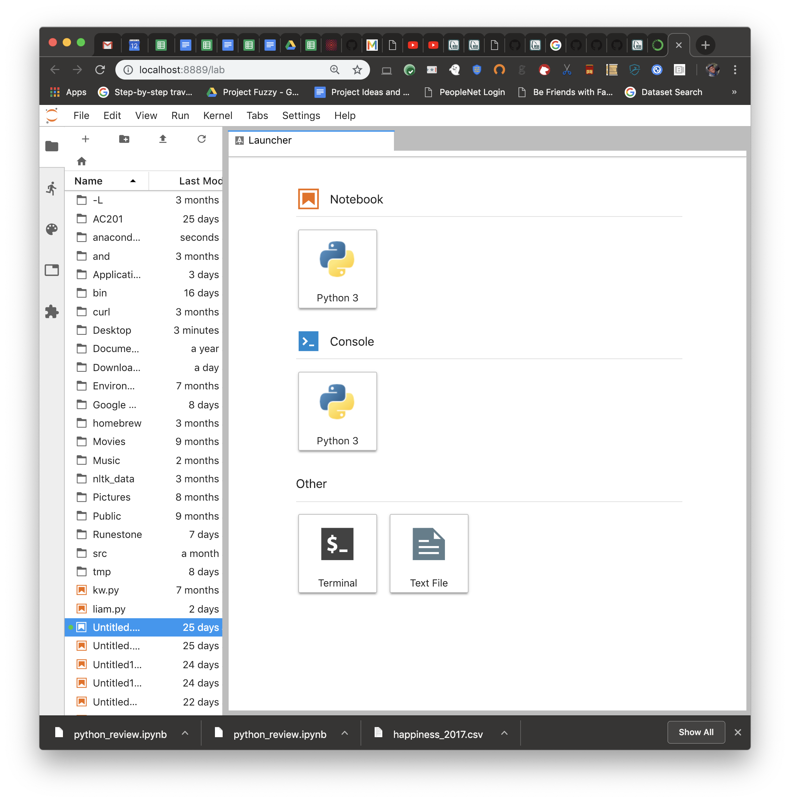

.. Copyright (C)  Google, Runestone Interactive LLC
   This work is licensed under the Creative Commons Attribution-ShareAlike 4.0
   International License. To view a copy of this license, visit
   http://creativecommons.org/licenses/by-sa/4.0/.

Installing Anaconda
===================

We will be using the Anaconda distribution of Python in this class. It is a
very complete installation of Python, and nearly all of the packages you will
need for many years of data science productivity are included in the
initial installation.

The good people who created Anaconda have also provided a very nice set of
instructors to help you install it for the first time. There are instructions
for Windows, macOS, and Linux. The
`installation guide <https://conda.io/docs/user-guide/install/index.html#>`_ is
also part of a larger set of documentation that you may find useful. Make sure
you follow the instructions for a Regular Installation of Anaconda, and that you
install the Python 3.x version (3.7 at the time of this writing). Do not install
miniconda or do a silent installation.

Starting Jupyter Lab
====================

Once you have completed the installation, you should launch Anaconda Navigator.
You will find Anaconda Navigator in the anaconda3 folder.

.. figure:: Figures/navigator.png

From the Anaconda Navigator Window, you can Launch JupyterLab. This may take a
few seconds, but it will start up and open a browser window for you. From here,
you can create a new Notebook to start working in by clicking on the Python 3
icon under Notebook.

You are now ready to continue on the the Python Review on the next page.