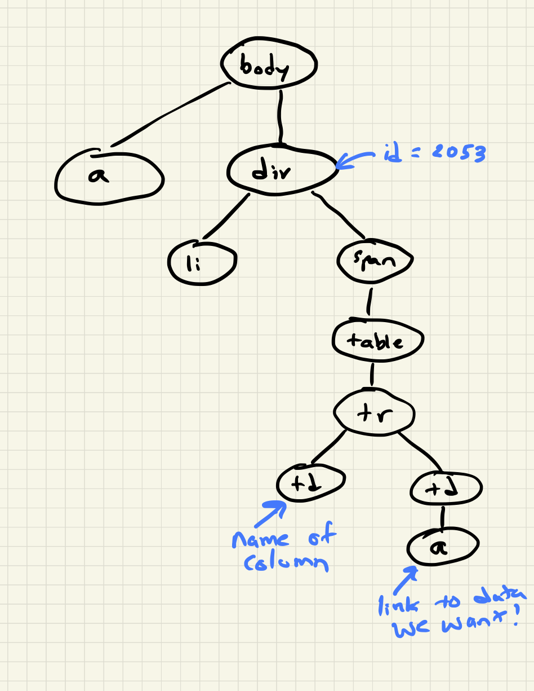

.. Copyright (C)  Google, Runestone Interactive LLC
   This work is licensed under the Creative Commons Attribution-ShareAlike 4.0
   International License. To view a copy of this license, visit
   http://creativecommons.org/licenses/by-sa/4.0/.

.. _screenscrape:

Challenge: Screen Scraping the CIA
==================================

The country data that we have been using was compiled and turned into a CSV file
in 2006. Much of that data comes from the CIA World Factbook (not Facebook, as
autocorrect so often thinks). However, the CIA does not provide the factbook in
the form of a nice and convenient CSV file, so we need to convert the data from
its human-readable format (as a webpage) to a Pandas friendly format, a CSV
file.

The goal of this exercise is to create an up-to-date version of our country data
(at least up to 2017, as this is being written). This will be challenging and
fun as each column of the data is on its own page. But you can do it, and you
will see how powerful you can be when you have the right tools!

**Think Generally!** At the end of this we would like to be able to scrape the
CIA data for **any** year not just 2017, so keep that in mind.

You can download each year of the factbook going back to the year 2000
`from the CIA <https://www.cia.gov/library/publications/download/>`_. Start with
the year 2017. The nice thing about this is that you can unzip the file on your
local computer but still use ``requests``.

The challenge of this project is that each variable is on its own page. So, we
are going to have to combine many pages into a single coherent data frame. Then,
when we have gathered all of the columns, we can pull them together into one
nice data frame and we'll learn how to save that to a CSV file.

Again, think generally. If you design a good function for finding and scraping
one piece of information, make it work for all pieces of information, and at the
end you will have a minimal amount of code that does a LOT of work.

Lets take a look at the file structure of the downloaded data from 2017.

.. code:: python3

   ls factbook/2017

.. parsed-literal::

   appendix/          fonts/             index.html         rankorder/
   css/               geos/              js/                scripts/
   docs/              graphics/          print/             styles/
   fields/            images/            print_Contact.pdf  wfbExt/

The folder that may jump out at you is called ``fields``, so lets look at that
in more detail.

.. code:: python3

   import os
   files = os.listdir('factbook/2017/fields')
   print(sorted(files)[:10])

.. parsed-literal::

   ['2001.html', '2002.html', '2003.html', '2004.html', '2006.html', '2007.html', '2008.html', '2010.html', '2011.html', '2012.html']

Getting a List of All Fields
----------------------------

That may not look terribly useful, but each of the numbered files contains one
field that we can add to our data frame. Examine one of them closely, and see if
you can figure out a good marker we can use to find the field contained in each.

In fact, now that you are investigating and if you stop and think for a minute,
you may conclude that there must be some kind of nice human-readable table of
contents. In fact, there is. Take a look at the file ``notesanddefs.html``

In the spirit of starting small and working our way up to a larger project,
let's write some code to scrape all of the fields and the file they are in from
the ``notesanddefs.html`` file.

The webpage for that file looks like this.

.. figure:: Figures/factbook_notes.png

   Part of the Definitions and Notes page for the World Factbook 2017.

There are a couple of important things on this page that we will want to get:
the feature name (like Administrative divisions or Airports) and the link to the
page that has all of the data for this feature for each country.

When we **screen scrape** a webpage, we take advantage of the fact that we can
get that webpage using the ``requests`` module we learned about in the previous
chapter, and treat the web page as a simple text file. Let's look at part of the
text for this page.

.. parsed-literal:: html

		
			

				<li style="list-style-type: none; line-height: 20px; padding-bottom: 3px;" >
				
					<table width="100%" border="0" cellpadding="0" cellspacing="0" >
						<tr>
							<td style="width: 90%;" >Airports</td>
               <td align="right" valign="middle">

										

							</td>
						</tr>
					</table>
				
				

				

					This entry gives the total number of airports or airfields recognizable from the air. The runway(s) may be paved (concrete or asphalt surfaces) or unpaved (grass, earth, sand, or gravel surfaces) and may include closed or abandoned installations.  Airports or airfields that are no longer recognizable (overgrown, no facilities, etc.) are not included. Note that not all airports have accommodations for refueling, maintenance, or air traffic control.

			

		</li>
		

If you have not seen HTML before, this may look a bit confusing. One of the
skills you will develop as a data scientist is learning what to focus on and
what to ignore. This takes practice and experience, so don't be frustrated if it
seems a bit overwhelming at the beginning.

The two things to focus on here are:

* ``<td style="width: 90%;" >Airports</td><td align="right" valign="middle">``
* ````

The ``<td>`` is a tag that defines a cell in a table. The page you see in the
figure is composed of many small tables, each table has one row and two columns.
The first column contains the feature we are interested in and the second
contains the icon. This would not be considered as good page design by many web
developers today, but you have to learn to work with what you've got. The icon
is embedded in an ``<a>`` tag. This is the tag that is used to link one web page
to another. You click on things defined by ``<a>`` tags all the time. The part
``href="../fields/2053.html#6"`` is a hyper-ref, that contains the URL of where
the link should take you. For example, `This Link <https://runestone.academy>`_
takes you to the Runestone homepage and looks like this in html
``<a href="https://runestone.academy">This Link</a>``.

The indentation of the above code not accidental; the indentation shows the
hierarchical structure of an HTML document. Blocks that are indented to the same
level are siblings, blocks that are nested inside other blocks have a
parent-child relationship. We can draw a diagram that illustrates these
relationships as follows.

So, what we need to do is look at the page as a whole and see if we can find a
pattern that will allow us to find the two items we are interested in. In newer
web pages, this can be a bit easier, as designers will use classes and more
descriptive attributes to set off parts of the web page. But we can still
accomplish the goal.

In this case, if we look carefully, we see that the each table we want is
contained in a ``span``, and the span has the attribute ``class="category"``.

Now that we know the pattern we are looking for, the big question is how we go
about finding and working with each instance of what we are looking for in our
web page. We could just treat each page like a big long string and use Python's
string searching facilities. But, that would be *painful* for sure. Instead, we
will turn to another of Python's packages that will make the job fun and very
manageable. That package is called
`BeautifulSoup <https://www.crummy.com/software/BeautifulSoup/bs4/doc/>`_. The
name "Beautiful Soup" comes from *Alice in Wonderland*; it is the title of a
song sung by the Mock Turtle. (Yes, its turtles everywhere!) Using
BeautifulSoup, we can get the web page into a form that we can use some real
power search tools.

First, let's import the module, and read the entire webpage as a string.

.. code:: python3

   from bs4 import BeautifulSoup
   page = open('../Data/factbook/2017/docs/notesanddefs.html').read()
   page[:200]

.. parsed-literal::

   '<!doctype html>\n<!--[if lt IE 7]> <html class="no-js lt-ie9 lt-ie8 lt-ie7" lang="en"> <![endif]-->\n<!--[if IE 7]>    <html class="no-js lt-ie9 lt-ie8" lang="en"> <![endif]-->\n<!--[if IE 8]>    <html c'

Now, let's have BeautifulSoup take control.

.. code:: python3

   page = BeautifulSoup(page)
   print(page.prettify()[:1000])

.. parsed-literal::

   <!DOCTYPE html>
   <!--[if lt IE 7]> <html class="no-js lt-ie9 lt-ie8 lt-ie7" lang="en"> <![endif]-->
   <!--[if IE 7]>    <html class="no-js lt-ie9 lt-ie8" lang="en"> <![endif]-->
   <!--[if IE 8]>    <html class="no-js lt-ie9" lang="en"> <![endif]-->
   <!--[if gt IE 8]><!-->
   <!--<![endif]-->
   <html class="no-js" lang="en">
    <!-- InstanceBegin template="/Templates/wfbext_template.dwt.cfm" codeOutsideHTMLIsLocked="false" -->
    <head>
     <meta charset="utf-8"/>
     <meta content="IE=edge,chrome=1" http-equiv="X-UA-Compatible"/>
     <!-- InstanceBeginEditable name="doctitle" -->
     <title>
      The World Factbook
     </title>
     <!-- InstanceEndEditable -->
     <meta content="" name="description"/>
     <meta content="width=device-width" name="viewport"/>
     <link href="../css/fullscreen-external.css" rel="stylesheet" type="text/css"/>
     
     <!--developers version - switch to specific production http://modernizr.com/download/-->
     <script src="../js/jquery-1.8.3.min.

So far, this doesn't seem like much help, but let's see how we can use the
search capabilities of BeautifulSoup to find all of the ``span`` tags with the
``class`` "category". To do this, we will use a search syntax that is commonly
used in the web development community. It is the same syntax that is used to
write the rules for the Cascading Style Sheets (CSS) that are used to make our
web pages look nice.

The search syntax allows us to:

* Search for all matching tags
* Search for all matching tags with a particular class
* Search for some tag that has the given id
* Search for all matching tags that are the children of some other tag
* Many other things of a similar essence

The search syntax is uses a couple of special characters to indicate
relationships or to identify classes and ids.

* ``.`` is used to specify a class, so ``.category`` finds all tags that have
  the attribute ``class=category``. ``tag.class`` makes that more specific and
  limits the results to just the particular tags that have that class. For
  example, ``span.category`` will only select span tags with ``class=category``.
* ``#`` is used to specify an id so ``div#2053`` would only match a div tag with
  id=2053. ``#2053`` would find any tag with id=2053. Note ids are meant to be
  unique within a web page so ``#2053`` should ony find a single tag.
* `` `` indicates parent-child relationship, so ``span table`` would find all of
  the table tags that are children of a span, and ``div span table`` would find
  all the tables that are children of a span that are children of a div.

You can definitely get more complicated than that, but knowing only those 3
concepts is a really good start. To make use of the search capability, we will
use the
`select <https://www.crummy.com/software/BeautifulSoup/bs4/doc/#css-selectors>`_
method of a BeautifulSoup object. In our case, we have created a BeautifulSoup
object called ``page``. ``select`` will always return a list, so you can iterate
over the list or index into the list. Let's try an example.

.. code:: python3

   links = page.select('a')
   print(len(links))
   links[-1]

.. parsed-literal::

   625
   <a class="go-top" href="#">GO TOP</a>

So, this tells us that there are 625 ``a`` tags on the page, and the last one
takes us to the top of the page.

.. fillintheblank:: fb_wfb_div_cout

   How many ``div`` tags are on the page? |blank|

   - :793: Is the correct answer
     :x: Use the select method to find only a div tag

.. fillintheblank:: fb_wfb_tagtype

   What kind of tag is the last tag to have the class of "cfclose"? |blank|

   - :button: Is correct
     :x: Hint: There are three items with class="cfclose", all are the same tag

Now, let's put this all together and see if we can make a list of the columns
and the paths to the files that contain the data. We will do this by creating a
list of all of the ``span`` tags with the class category. As we iterate over
each of them, we can use ``select`` to find the ``td`` tags inside the span.
There should be two of them in each. The first will give us the name of the
column and the second will have the path to the file contained in the ``href``
attribute.

Starting small, let's print the column names.

.. code:: python3

   cols = page.select("span.category")
   for col in cols:
       cells = col.select('td')
       col_name = cells[0].text
       print(col_name)

.. parsed-literal::

   Administrative divisions
   Age structure
   Agriculture - products
   Airports
   Airports - with paved runways
   Airports - with unpaved runways
   Area
   Area - comparative
   Background
   Birth rate
   Broadcast media
   Budget

Next, let's expand on this example to get the path to the file.

.. code:: python3

   cols = page.select("span.category")
   for col in cols:
       cells = col.select('td')
       colname = cells[0].text
       links = cells[1].select('a')
       if len(links) > 0:
           fpath = links[0]['href']
           print(colname, fpath)

.. parsed-literal::

   Administrative divisions ../fields/2051.html#3
   Age structure ../fields/2010.html#4
   Agriculture - products ../fields/2052.html#5
   Airports ../fields/2053.html#6
   Airports - with paved runways ../fields/2030.html#7
   Airports - with unpaved runways ../fields/2031.html#8
   Area ../fields/2147.html#10
   Area - comparative ../fields/2023.html#11
   Background ../fields/2028.html#12
   Birth rate ../fields/2054.html#13
   Broadcast media ../fields/2213.html#14
   Budget ../fields/2056.html#15
   Budget surplus (+) or deficit (-) ../fields/2222.html#16

Success!

.. fillintheblank:: fb_wfb_

   What is the path and filename for the file containing the data for "Internet
   users"? |blank| Note the #xxx number that comes after ``.html`` is not part
   of the filename.

   - :../fields/2153.html: Is the correct answer
     :../fields/2153.html#126: No, #126 is not part of the filename
     :2153.html: Is only the filename
     :#126: Is not part of the filename

So, now we have the means to get the names and paths, so we can populate a
DataFrame with columns and data for each country. Your task is now to create a
DataFrame with as many of the same columns as you can from our
``world_countries.csv`` file. You'll have to do your own investigation into the
structure of the file to find a way to scrape the information.

Loading All the Data in Rough Form
----------------------------------

One more thing to note: you might assume that the country names will all be
consistent from field to field but that probably isn't the case. What is
consistent is the two-letter country code used in the URL to the detail
information about each country, as well as the id of the ``tr`` tag in the large
table that contains the data you want. So, what you are are going to have to do
is build a data structure for each field. You will want a name for the field,
then a dictionary that maps from the two-digit country code to the value of the
field.

.. code-block:: none

   all_data = {'field name' : {coutry_code : value} ...}

It may be that the data for the field and the country is more than we want, but
it will be easiest for now to just get the data in rough form, then we can clean
it up once we have it in a DataFrame.

There are 177 different fields in the 2017 data. Loading all of them would be a
huge amount of work, and more data than we need. Let's start with a list that is
close to our original data above.

-  Country - name
-  Code2
-  Code3
-  CodeNum
-  Population
-  Area
-  Coastline
-  Climate
-  Net migration
-  Birth rate
-  Death rate
-  Infant mortality rate
-  Literacy
-  GDP
-  Government type
-  Inflation rate
-  Health expenditures
-  GDP - composition, by sector of origin
-  Land use
-  Internet users

Feel free to add others if they interest you.

If you use the structure given above, you can just pass that to the DataFrame
constructor and you should have something that looks like this.

.. code:: python3

   pd.DataFrame(data).head()

.. raw:: html

    

    
    <table border="1" class="dataframe">
      <thead>
        <tr style="text-align: right;">
          <th></th>
          <th>Area</th>
          <th>Birth rate</th>
          <th>Climate</th>
          <th>Coastline</th>
          <th>Death rate</th>
          <th>GDP (purchasing power parity)</th>
          <th>GDP - composition, by sector of origin</th>
          <th>Government type</th>
          <th>Health expenditures</th>
          <th>Infant mortality rate</th>
          <th>Internet users</th>
          <th>Land use</th>
          <th>Literacy</th>
          <th>Population</th>
          <th>Country</th>
        </tr>
      </thead>
      <tbody>
        <tr>
          <th>aa</th>
          <td>total: 180 sq km\nland: 180 sq km\nwater: 0 sq km</td>
          <td>12.4 births/1,000 population (2017 est.)</td>
          <td>tropical marine; little seasonal temperature v...</td>
          <td>68.5 km</td>
          <td>8.4 deaths/1,000 population (2017 est.)</td>
          <td>$2.516 billion (2009 est.)\n$2.258 billion (20...</td>
          <td>agriculture: 0.4%\nindustry: 33.3%\nservices: ...</td>
          <td>parliamentary democracy (Legislature); part of...</td>
          <td>NaN</td>
          <td>total: 10.7 deaths/1,000 live births\nmale: 14...</td>
          <td>total: 106,309\npercent of population: 93.5% (...</td>
          <td>agricultural land: 11.1%\narable land 11.1%; p...</td>
          <td>definition: age 15 and over can read and write...</td>
          <td>115,120 (July 2017 est.)</td>
          <td>Aruba</td>
        </tr>
        <tr>
          <th>ac</th>
          <td>total: 442.6 sq km (Antigua 280 sq km; Barbuda...</td>
          <td>15.7 births/1,000 population (2017 est.)</td>
          <td>tropical maritime; little seasonal temperature...</td>
          <td>153 km</td>
          <td>5.7 deaths/1,000 population (2017 est.)</td>
          <td>$2.288 billion (2016 est.)\n$2.145 billion (20...</td>
          <td>agriculture: 2.3%\nindustry: 20.2%\nservices: ...</td>
          <td>parliamentary democracy (Parliament) under a c...</td>
          <td>5.5% of GDP (2014)</td>
          <td>total: 12.1 deaths/1,000 live births\nmale: 13...</td>
          <td>total: 60,000\npercent of population: 65.2% (J...</td>
          <td>agricultural land: 20.5%\narable land 9.1%; pe...</td>
          <td>definition: age 15 and over has completed five...</td>
          <td>94,731 (July 2017 est.)</td>
          <td>Antigua and Barbuda</td>
        </tr>
        <tr>
          <th>ae</th>
          <td>total: 83,600 sq km\nland: 83,600 sq km\nwater...</td>
          <td>15.1 births/1,000 population (2017 est.)</td>
          <td>desert; cooler in eastern mountains</td>
          <td>1,318 km</td>
          <td>1.9 deaths/1,000 population (2017 est.)</td>
          <td>$671.1 billion (2016 est.)\n$643.1 billion (20...</td>
          <td>agriculture: 0.8%\nindustry: 39.5%\nservices: ...</td>
          <td>federation of monarchies</td>
          <td>3.6% of GDP (2014)</td>
          <td>total: 10 deaths/1,000 live births\nmale: 11.6...</td>
          <td>total: 5,370,299\npercent of population: 90.6%...</td>
          <td>agricultural land: 4.6%\narable land 0.5%; per...</td>
          <td>definition: age 15 and over can read and write...</td>
          <td>6,072,475 (July 2017 est.)\nnote: the UN estim...</td>
          <td>United Arab Emirates</td>
        </tr>
        <tr>
          <th>af</th>
          <td>total: 652,230 sq km\nland: 652,230 sq km\nwat...</td>
          <td>37.9 births/1,000 population (2017 est.)</td>
          <td>arid to semiarid; cold winters and hot summers</td>
          <td>0 km (landlocked)</td>
          <td>13.4 deaths/1,000 population (2017 est.)</td>
          <td>$66.65 billion (2016 est.)\n$64.29 billion (20...</td>
          <td>agriculture: 22%\nindustry: 22%\nservices: 56%...</td>
          <td>presidential Islamic republic</td>
          <td>8.2% of GDP (2014)</td>
          <td>total: 110.6 deaths/1,000 live births\nmale: 1...</td>
          <td>total: 3,531,770\npercent of population: 10.6%...</td>
          <td>agricultural land: 58.07%\narable land 20.5%; ...</td>
          <td>definition: age 15 and over can read and write...</td>
          <td>34,124,811 (July 2017 est.)</td>
          <td>Afghanistan</td>
        </tr>
        <tr>
          <th>ag</th>
          <td>total: 2,381,741 sq km\nland: 2,381,741 sq km\...</td>
          <td>22.2 births/1,000 population (2017 est.)</td>
          <td>arid to semiarid; mild, wet winters with hot, ...</td>
          <td>998 km</td>
          <td>4.3 deaths/1,000 population (2017 est.)</td>
          <td>$609.6 billion (2016 est.)\n$582.7 billion (20...</td>
          <td>agriculture: 12.9%\nindustry: 36.2%\nservices:...</td>
          <td>presidential republic</td>
          <td>7.2% of GDP (2014)</td>
          <td>total: 19.6 deaths/1,000 live births\nmale: 21...</td>
          <td>total: 17,291,463\npercent of population: 42.9...</td>
          <td>agricultural land: 17.4%\narable land 18.02%; ...</td>
          <td>definition: age 15 and over can read and write...</td>
          <td>40,969,443 (July 2017 est.)</td>
          <td>Algeria</td>
        </tr>
      </tbody>
    </table>
    

So, we have made lot of progress but we still have a lot of cleanup to do! You
will have noticed that many of the fields that we wanted to be numeric are
definitely not. Many of them are in a more human-readable format than
computer-digestible. You should consult the documentation on the ``extract``
method in Pandas, as it will help you get want you want from the strings you
currently have.

Cleaning the Data
-----------------

With the data now in a DataFrame, we can begin the hard work of cleaning it up.
We can do this nicely and tackle one column at a time. This is a lot of string
processing and type conversion. A lot of this can be made easier by using
regular expression pattern matching, which is a very big skill to add to your
arsenal. If you haven't used them before or are out of practice, go through
`this tutorial <http://evc-cit.info/comsc020/python-regex-tutorial/>`_.

**Instructors Note:** This would work well as a class project, where each team
gets a column to transform. Everyone can then share their solution with everyone
else, or if you don’t have enough students, then each team can take one or more
columns.

.. fillintheblank:: fb_wfb_avg_im

   What is the average value for the column Infant mortality rate, to two
   significant digits? |blank|

   - :22.13: Is the correct answer
     :x: Check your answer again

Saving the Data
---------------

We can save the data using ``to_csv``.

Comparing Across the Years
--------------------------

If you try to repeat the exercise above for 2016, it works great! How about
2015? Earlier? How far back can you go before your code breaks?

What you will find when you go back illustrates one of the really ugly parts of
screen scraping, which is that you are at the mercy of the website designer. All
they have to do is make one little change to a CSS class or the id of an
element, and your whole strategy goes away.

If you or your classmates can scrape all 17 years of world factbook data, you
will really have achieved something special. (And, you will be destined for
internet fame if you make your notebooks public.) You will likely have noticed
that lots of people want this data in a more convenient format.

**Lesson Feedback**

.. poll:: LearningZone_6_4
    :option_1: Comfort Zone
    :option_2: Learning Zone
    :option_3: Panic Zone

    During this lesson I was primarily in my...

.. poll:: Time_6_4
    :option_1: Very little time
    :option_2: A reasonable amount of time
    :option_3: More time than is reasonable

    Completing this lesson took...

.. poll:: TaskValue_6_4
    :option_1: Don't seem worth learning
    :option_2: May be worth learning
    :option_3: Are definitely worth learning

    Based on my own interests and needs, the things taught in this lesson...

.. poll:: Expectancy_6_4
    :option_1: Definitely within reach
    :option_2: Within reach if I try my hardest
    :option_3: Out of reach no matter how hard I try

    For me to master the things taught in this lesson feels...