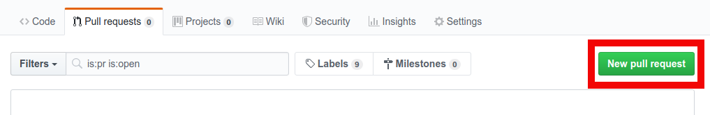
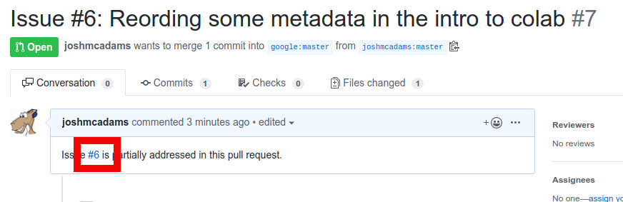
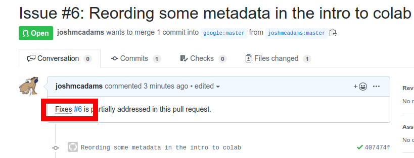
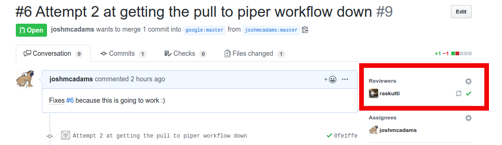

# Content Development In GitHub: Guide For Harvey Mudd Students

-   [What is this document?](#what-is-this-document)
-   [What is "restructured text" and Runestone?](#what-is-restructured-text-and-runestone)
-   [How do I convert material from Google Doc to restructured text?](#how-do-i-convert-material-from-google-doc-to-restructured text)
-   [How do I make suggestions and edits?](#how-do-i-make-suggestions-and-edits)
-   [What files should I review?](#what-files-should-i-review)

## What is this document?

This document serves as a guide for Harvey Mudd students to review, develop, and
contribute to AC1 and AC2 content through
[our GitHub repository](https://github.com/google/applied-machine-learning-intensive).
With any questions, do not hesitate to contact Kiran Raskutti
([kraskutti@google.com](mailto:kraskutti@google.com)) and Adrienne Posner
([adrienneposner@google.com](mailto:adrienneposner@google.com)).

## What is "restructured text" and Runestone?

All content is written in
[restructured text](https://en.wikipedia.org/wiki/ReStructuredText) (file
extension .rst), and designed to be compatible with the
[Runestone](https://runestone.academy/runestone/default/user/login?_next=/runestone/default/index)
interactive textbook format.

GitHub should automatically render all rst content so it is visible in plain
text (for example, see the
[Module A project](https://github.com/google/applied-machine-learning-intensive/blob/master/acs/ac1/_sources/projects/module_a.rst)).
While you can read files in plain text, if you need to edit files, you will need
to use restructured text. If you click "Raw" on the file’s page, you can see the
file as it was written in raw restructured text. This should help when you need
to edit files using restructured text.

Runestone has several interactive features that do not render properly in
GitHub. These appear in plain text, and look something like the below.

```
.. fillintheblank:: unique_identifier
   What is 1+1? |blank|

   - :2: Correct
     :x: Incorrect
```

While this looks strange in plain text, these are rendered as interactive
questions (the above is "fill in the blank", other examples are "multiple
choice" and "short answer") in a Runestone textbook. If you need to edit any of
these, you can use the
[Runestone directives documentation](https://runestone.academy/runestone/static/authorguide/directives.html)
to see how the code directives render in the textbook.

## How do I convert material from Google Doc to restructured text?

Content is usually first drafted in a Google Doc, then converted to restructured
text. There are many ways to convert a Google Doc to restructured text, but the
following procedure ensures that the final `rst` content is consistent with the
[style guide](https://github.com/google/applied-machine-learning-intensive/blob/master/acs/external_documentation/style_guide.md).
(Note that it is not necessary to use this procedure, as long as the final
content adheres to the style guide.)

1.  Convert the required section of the Google Doc to markdown using
    [this add-on](https://gsuite.google.com/marketplace/app/docs_to_markdown/700168918607).
1.  Use [pandoc](https://pandoc.org/try/) to convert the markdown to
    restructured text.
    1.  Paste the markdown text into the left box, and select `Markdown
        (GitHub-flavored)` as the language. Note that the pandoc Web UI can only
        convert a limited amount of text at a time, so make sure the text fits
        completely in the left box.
    1.  Select `reStructured Text` for the language of the right box, then click
        `Convert`.
1.  Format the `rst` output as per the style guide.
    1.  Make the text adhere to the
        [80 character line limit](https://github.com/google/applied-machine-learning-intensive/blob/master/acs/external_documentation/style_guide.md#line-length),
        and
        [formats the lists properly](https://github.com/google/applied-machine-learning-intensive/blob/master/acs/external_documentation/style_guide.md#lists).
1.  Copy this formatted text to the `.rst` file where it will be submitted.
1.  The last manual change you may need to make is to change the formatting of
    any inline monospace font. Google Docs does not have monospace font
    delimiters, so these need to be added manually in the `.rst` file.

    In restructured text, you can use double back-ticks to indicate inline
    monospace font.

    ```
    ``inline monospace font``
    ```

    Use this syntax wherever you need inline monospace font. You may need to
    readjust for the
    [line limit](https://github.com/google/applied-machine-learning-intensive/blob/master/acs/external_documentation/style_guide.md#line-length).

## How do I make suggestions and edits?

All code is in
[this private GitHub repository](https://github.com/google/applied-machine-learning-intensive).
If you do not have access to the repository, please alert the Google team. If
you are unfamiliar with GitHub, there are several online videos and guides.
([This introductory handbook](https://guides.github.com/introduction/git-handbook/)
is a good start.)

For every edit you would like to make to the content,
[file an issue](https://github.com/google/applied-machine-learning-intensive/issues)
in the Google-owned repository. That way, the team at Google can see what you
are working on.

You have read-only access to the
[Google repository](https://github.com/google/applied-machine-learning-intensive).
In order to make changes you will first need to first
[fork the repository](https://help.github.com/en/articles/fork-a-repo) into your
GitHub account. *Make sure that your forked repository is private.*

Before you can submit any changes back upstream to Google, please fill out a
[contributor license agreement](https://cla.developers.google.com/clas). This
agreement is necessary for us to accept contributions from individuals and
companies not employed by Google.

Once you have a set of changes committed to your fork, the code should be sent
to Google in the form of a
[pull request](https://github.com/google/applied-machine-learning-intensive/pulls).
This can be done in the GitHub web interface by pressing the "New Pull Request"
button in the "Pull requests" tab of your fork.

{style="display:block;margin:auto"}

Each pull request should be associated with at least one issue. Make sure to
keep pull requests specific. For example, a suitable pull request could be *"Fix
spelling mistakes in the Module A introduction"*, while *"Changes from Monday’s
work"* is not specific enough.

In order to associate a pull request with an issue simply put the octothorpe and
issue number in the description of your pull request.

{style="display:block;margin:auto"}

If your pull request closes the issue put the word "Fixes" before the issue
number.

{style="display:block;margin:auto"}

Every pull request to the Google-owned repository requires a review. In general,
you should include Kiran (GitHub ID [raskutti](https://github.com/raskutti)) and
Adrienne (GitHub ID [adrienneposner](https://github.com/adrienneposner)) as
reviewers for your pull requests. If you want to include a different member of
the Google team as a reviewer, feel free to add them as the reviewer for your
pull request.

{style="display:block;margin:auto"}

Within your fork(s), you can work to a schedule and review processes with which
you feel comfortable. Whenever you feel your work is ready for a review and to
be merged into the Google-owned repository, remember to create a pull request to
master that is tied to an issue. Google will aim to respond to all pull requests
within one working day.

The master repository will be updated frequently. It is important that you keep
your fork(s) up to date to avoid having to resolve difficult conflicts. To do
this, first
[create a remote upstream for your fork](https://help.github.com/en/articles/configuring-a-remote-for-a-fork)
one time.

```
 $ git remote add upstream git@github.com:google/applied-machine-learning-intensive.git
```

You can now
[sync the fork with upstream](https://help.github.com/en/articles/syncing-a-fork)
as desired.

```
$ git fetch upstream
$ git checkout master
$ git merge upstream/master
```

We advise that you sync at least once a week from upstream, to avoid difficult
merge conflicts.

## What files should I review?

All files for review are under the
[acs/ac1/_sources](https://github.com/google/applied-machine-learning-intensive/tree/master/acs/ac1/_sources)
folder. **The GitHub repository also contains AC2 content, but you can ignore
this folder at this stage. **GitHub lists files and folders in alphabetical
order, but this is not the ordering that will be used for the textbook.

**<span style="text-decoration:underline;">Below is the ordering of files as
they should be read and reviewed, and as they will appear in the
textbook. Files and folders marked with an asterisk are not yet ready for
review. As new content is added/edited, this list will be updated.</span>**

1.  [preface.rst](https://github.com/google/applied-machine-learning-intensive/blob/master/acs/ac1/_sources/preface.rst)
1.  [Introduction To Visualizations (folder)](https://github.com/google/applied-machine-learning-intensive/tree/master/acs/ac1/_sources/introduction_to_visualizations)
    1.  [introduction.rst](https://github.com/google/applied-machine-learning-intensive/blob/master/acs/ac1/_sources/introduction_to_visualizations/introduction.rst)
    1.  [example_visualizations.rst](https://github.com/google/applied-machine-learning-intensive/blob/master/acs/ac1/_sources/introduction_to_visualizations/example_visualizations.rst)
    1.  [visualization_checklists.rst](https://github.com/google/applied-machine-learning-intensive/blob/master/acs/ac1/_sources/introduction_to_visualizations/visualization_checklists.rst)
    1.  [histograms_and_bar_charts.rst](https://github.com/google/applied-machine-learning-intensive/blob/master/acs/ac1/_sources/introduction_to_visualizations/histograms_and_bar_charts.rst)
1.  [Sheets Basics (folder)](https://github.com/google/applied-machine-learning-intensive/tree/master/acs/ac1/_sources/sheets_basics)
    1.  [introduction.rst](https://github.com/google/applied-machine-learning-intensive/tree/master/acs/ac1/_sources/sheets_basics/introduction.rst)
    1.  [what_is_a_sheet.rst](https://github.com/google/applied-machine-learning-intensive/tree/master/acs/ac1/_sources/sheets_basics/what_is_a_sheet.rst)
    1.  [what_is_a_formula.rst](https://github.com/google/applied-machine-learning-intensive/tree/master/acs/ac1/_sources/sheets_basics/what_is_a_formula.rst)
    1.  [errors.rst](https://github.com/google/applied-machine-learning-intensive/tree/master/acs/ac1/_sources/sheets_basics/errors.rst)
1.  [Ba](https://github.com/google/applied-machine-learning-intensive/tree/master/acs/ac1/_sources/basic_descriptive_statistics)
1.  [sic Descriptive Statistics (folder)](https://github.com/google/applied-machine-learning-intensive/tree/master/acs/ac1/_sources/basic_descriptive_statistics)
    1.  [introduction.rst](https://github.com/google/applied-machine-learning-intensive/tree/master/acs/ac1/_sources/basic_descriptive_statistics/introduction.rst)
    1.  [what_is_a_statistic.rst](https://github.com/google/applied-machine-learning-intensive/tree/master/acs/ac1/_sources/basic_descriptive_statistics/what_is_a_statistic.rst)
    1.  [variables.rst](https://github.com/google/applied-machine-learning-intensive/tree/master/acs/ac1/_sources/basic_descriptive_statistics/variables.rst)
    1.  [count_and_sum.rst](https://github.com/google/applied-machine-learning-intensive/tree/master/acs/ac1/_sources/basic_descriptive_statistics/count_and_sum.rst)
    1.  [minimum_and_maximum.rst](https://github.com/google/applied-machine-learning-intensive/tree/master/acs/ac1/_sources/basic_descriptive_statistics/minimum_and_maximum.rst)
    1.  [measures_of_center.rst](https://github.com/google/applied-machine-learning-intensive/tree/master/acs/ac1/_sources/basic_descriptive_statistics/measures_of_center.rst)
    1.  [outliers_and_skew.rst](https://github.com/google/applied-machine-learning-intensive/tree/master/acs/ac1/_sources/basic_descriptive_statistics/outliers_and_skew.rst)
    1.  [measures_of_spread.rst](https://github.com/google/applied-machine-learning-intensive/tree/master/acs/ac1/_sources/basic_descriptive_statistics/measures_of_spread.rst)
1.  [Filtering and Grouping (folder)](https://github.com/google/applied-machine-learning-intensive/tree/master/acs/ac1/_sources/filtering_and_grouping)
    1.  [filtering_data.rst](https://github.com/google/applied-machine-learning-intensive/tree/master/acs/ac1/_sources/filtering_and_grouping/filtering_data.rst)
    1.  [grouping_data.rst](https://github.com/google/applied-machine-learning-intensive/tree/master/acs/ac1/_sources/filtering_and_grouping/grouping_data.rst)
1.  [SQL (folder)](https://github.com/google/applied-machine-learning-intensive/tree/master/acs/ac1/_sources/sql)
    1.  [selecting.rst](https://github.com/google/applied-machine-learning-intensive/blob/master/acs/ac1/_sources/sql/selecting.rst)
    1.  [filtering.rst](https://github.com/google/applied-machine-learning-intensive/blob/master/acs/ac1/_sources/sql/filtering.rst)
    1.  [sorting.rst](https://github.com/google/applied-machine-learning-intensive/blob/master/acs/ac1/_sources/sql/sorting.rst)
    1.  [aggregating.rst](https://github.com/google/applied-machine-learning-intensive/blob/master/acs/ac1/_sources/sql/aggregating.rst)
    1.  [ifs_and_cases.rst](https://github.com/google/applied-machine-learning-intensive/blob/master/acs/ac1/_sources/sql/ifs_and_cases.rst)
    1.  [joining.rst](https://github.com/google/applied-machine-learning-intensive/blob/master/acs/ac1/_sources/sql/joining.rst)
1.  [Projects (folder)](https://github.com/google/applied-machine-learning-intensive/tree/master/acs/ac1/_sources/projects)
    [This folder contains the projects for AC1.]
    1.  [module_a.rst](https://github.com/google/applied-machine-learning-intensive/blob/master/acs/ac1/_sources/projects/module_a.rst)
    1.  [module_b.rst](https://github.com/google/applied-machine-learning-intensive/blob/master/acs/ac1/_sources/projects/module_b.rst)
    1.  [module_c.rst](https://github.com/google/applied-machine-learning-intensive/blob/master/acs/ac1/_sources/projects/module_c.rst)
