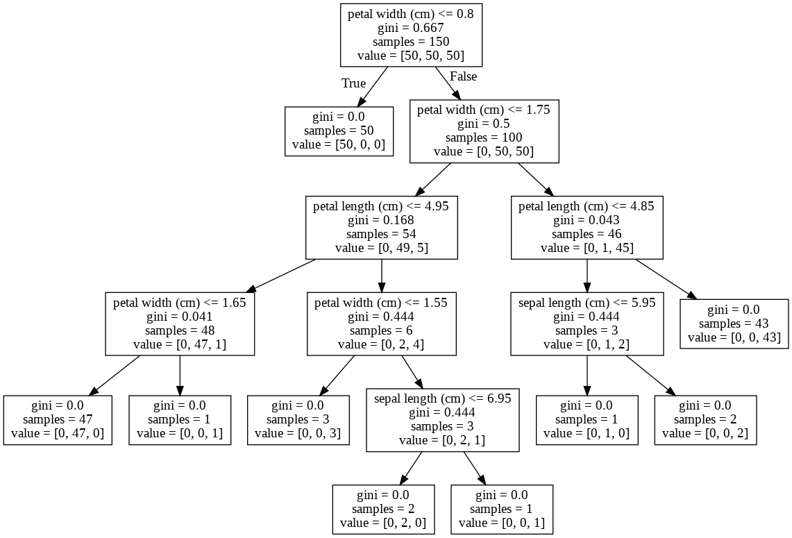

# Random Forests

<!--
In this unit we are going to talk about random forests. Random forests build upon a concept that we
have already learned, decision trees, so let's take a moment to remind ourselves about decision
trees.
-->

---

# Decision Trees

<!--
Before we talk about Random Forests we should take some time to review what we have already learned
about Decision Trees.

Image Details:
* [tree.png](https://pixabay.com/vectors/tree-silhouette-winter-plant-3979965/): Pixabay License
-->

---

# Decision Trees

<!--

Let's start by taking a look at a decision tree. This particular example is a tree predicting iris
species from the popular iris dataset.

Decision trees have a single root node and a variable depth number of intermediate nodes, ending in
many leaf nodes. A decision is made by comparing the one of your features to some derived value at
the node and then following a path based on the comparison. The leaf node that you arrive at is your
"decision".

Image Details:
* tree.png: Copyright Google
-->

---

# Decision Trees

## Decision support tools

* Typically binary
* Mostly for classification
* No confidence values provided
* No need to scale/normalize data

<!--
A few other highlights that we have already learned about decision trees:

Typically decision trees have two paths that can be taken at any node (binary tree).

Decision trees are most often used for classification purposes. They can be used for regression, but
are not a great fit.

Unlike other classification algorithms, decision trees don't provide a list of labels and the a
numeric confidence in the applicability of each label. Instead you receive a single final decision.

Decision trees are not sensitive to features having different ranges of values. Most machine
learning algorithms benefit from scaling and/or normalizing data, but decision trees are an
exception.
-->

---

# Building Decision Trees

Gini

* Impurity

{.column}

Entropy

* Information Gain

<!--
Also remember that when building decision trees we must choose what factor to base our splits on. We
can use the Gini algorithm to minimize impurity or entropy to maximize information gain. We
discussed this in our unit about decision trees.
-->

---

# Random Forests

<!--
Let's now move to random forests. The word "forest" is very appropriate. A decision tree is a single
set of comparisons that are made to come to a single classification decision. A random forest is a
collection of two or more decision trees built with your training data. Each tree is consulted when
a prediction is being made. The majority classification across all trees is the final classification
decision made by the random forest.

Image Details:
* [forest.png](https://pixabay.com/vectors/deciduous-trees-forest-trees-154168/): Pixabay License
-->

---

# Ensemble Learning {.big}

<!--
This is our first foray into "ensemble learning". Ensemble learning is a technique in which multiple
learners are trained on the training data and their results are aggregated in some way. This
aggregation is typically majority vote, mode, for classification and mean or median for regression.
-->

---

# Bootstrapping {.big}

<!--
You might be asking how training multiple trees with the same dataset would be much better than
simply training on tree. Typically, you don't actually train every tree in a random forest with the
same full dataset. Instead, each tree is trained with a sample of the data from the dataset. This
sampling is called bootstrapping.

For each tree in the forest a random set of data is chosen for training. The samples can overlap.
This is considered sampling "with replacement".

You can also choose to train every tree with the entire dataset. In this case you get variation in
trees based on their random starting points.
-->

---

# Bootstrap Aggregation (Bagging) {.big}

<!--
A specific form of bootstrapping that you'll hear about in machine learning circles is "bootstrap
aggregation". This term is often shortened to "bagging".

Bagging is a form of bootstrapping that creates multiple full-sized copies of your training dataset
with slightly different data.

Let's give an example. Say you have a dataset with 1000 items in it and you want a random forest
with 5 trees in it. If you bag the data, 5 datasets of size 1000 will be created by randomly
sampling your original dataset with replacement. Since we replace items in the original dataset
there will likely be duplicates in each generated dataset. This allows each tree to have a slightly
different view of the data.

Note that after the datasets are made, trees can be built and used in parallel.
-->

---

# Boosting {.big}

<!--
While we are on the topic of ensemble learning techniques, we'll take a moment to talk about another
popular technique, boosting. Boosting is a technique of training a model, determining which types of
predictions it performed poorly on, and then training a subsequent model to focus more on the
predictions that the model before it got wrong.

You can think of it as an assembly line where each worker has a specialty.

The downside of boosting is that it has to be done sequentially.
-->

---

# Random Forests in scikit-learn

* [RandomForestClassifier](https://scikit-learn.org/stable/modules/generated/sklearn.ensemble.RandomForestClassifier.html)
* [RandomForestRegressor](https://scikit-learn.org/stable/modules/generated/sklearn.ensemble.RandomForestRegressor.html)

<!--
scikit-learn provides a couple of random forest implementations, one for classification and one
for regression. The two implementations share many hyperparameters, but not all. We'll spend the
next few slides highlighting some of the hyperparameters.
-->

---

# Hyperparameter: n_estimators

* How many trees are in the forest?
* Space and time complexity vs. bias and variance

<!--
One of the most useful hyperparameters is `n_estimators`. This parameter sets the number of trees
that will be in the forest. As you increase the number of trees you should expect for the bias in
your model to be reduced. This comes at the cost of more resources being needed for training.

If you are training in parallel, then you'll have as many copies of your dataset as you do trees. If
you are training serially, then the time to train will increase linearly with the number of trees.

Can more trees ever be a bad thing?

Probably not, though there will be diminishing returns as the number of trees grows too much.

How to you choose the best number?

Experimentation. Play with different settings and compare training time and model scores until you
find a value that seems to be fast and "good" enough for your use case.
-->

---

# Hyperparameter: criterion

* How do you measure the quality of a node split?
* Regression: Error
 * Mean Squared Error
 * Mean Absolute Error
* Classification: Homogeneity
 * Gini: Impurity
 * Entropy: Information Gain

<!--
Another parameter that is shared, but different, across implementation is `criterion`. This is the
measure that will be used to determine the quality of a split decision at a given node.

For regression the options are mean squared error, MSE, or mean absolute error, MAE. Remember from
our model quality discussions that MSE penalizes outliers much more than MAE.

For classification we can choose to either use Gini, which is an impurity measurement, or Entropy,
which is a measure of information gain. Both of these are measures of set homogeneity.
-->

---

# Hyperparameter: max_depth

* How deep is your tree?

<!--
By default every decision tree in the random forest will split until every leaf node is as pure as
it can be. This can lead to overfitting. You can try to prevent this by setting a max depth on the
tree.

Can you think of how this parameter might be harmful?

What if the tree isn't well balanced and you end up with larger sets of data on one branch of the
tree. If you put an artificial depth cap one the overpopulated branch might not have very pure
leaves.

Let's look at another hyperparameter that can help prevent overfitting without having to worry
about balance.
-->

---

# Hyperparameter: min_samples_(split|leaf)

* How many samples must be in a node to split?
* How many samples are required in a leaf?

<!--
These two hyperparameters are very related. The first asks how many samples are required in a node
for you to be able to split it. Any value greater than one is allowed, with the default being two.

The next hyperparameter, min_samples_leaf, tells us the minimum number of samples needed to form a
leaf node. The default is one, which is very specific.

You should be able to see how these are related, and how they can cancel each other out. If I say
that `min_samples_leaf` is two instead of one, then I've effectively set `min_samples_split` to at
least four because I need four samples in a parent node to make two leaf nodes each with two
samples.

The nice thing about these hyperparameters are that they work well with unbalanced trees, unlike
`max_depth`.

How do you pick a value for these parameters? Trial and error, like most hyperparameters.
-->

---

# Hyperparameter: max_features

* How many features can be used when making a split decision?

<!--
By default a decision tree in a random forest will attempt to use all features in determining the
best split for a node. If you have a lot of features this might be computationally expensive or
even lead to some overfitting. You can limit the number of features used in any decision so that
only the most significant features are used at each node.
-->

---

# Hyperparameters

* Many more exist.
* Can differ between classifiers and regressors.
* Apply to all trees in the forest.
* Experiment to tune.

<!--
We've just sampled a small sample of hyperparameters that are available for random forests. Many
more exist. Note that there are some differences in what parameters you can tweak between regressors
and classifiers. Also, any parameters you set apply to all trees in a forest. And finally, the best
way to find the best parameters is to experiment with many different options and find which perform
best for your data.
!-->
