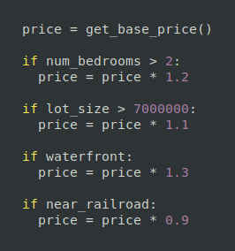

# Applied Machine Learning Intensive

<!--

Welcome to the Applied Machine Learning Intensive. In this course we will explore the concept of
machine learning and perform machine learning a wide variety of tasks. We are glad that you are
here and excited to explore this space with you.

-->

---

# Meet Your Instructors

<!--

First, let's take a moment to meet your instructional staff.

*Add slides and/or introduce any instructors and teachers assistants.*

-->

---

# Prerequisites

* Basic Python programming
* Basic matrix math
* Exposure to statistics and probability

<!--

We hope to keep the prerequisites small for this course. For the most part we'll teach you
everything that you need to know from the ground up. There are a few things that we do hope you
already have exposure to that we've listed on this slide.

If you don't know (or remember these), don't panic. We have labs for all of the prerequisites.

For Python programming, we really only expect you to know the basics of the core language. It would
be good if you know `if`, `else`, `for`, `while`, the built in data types, and how to create your
own functions. If you know list expansions and lambdas, even better! Also, if you already know
another programming language, but not Python, that is probably fine too. Python is really easy to
learn, especially when you already have programming experience.

This is an applied course, but we will do a little math along the way.

For matrix math it would be nice if you knew how to add, subtract, and multiply matrices.
Understanding dot products and transpositions would be helpful too.

For statistics a probability, we only lightly touch these concepts in the course. You should
understand concepts like mean and median. We will touch a little on probabilistic concepts too. We
won't however, get deep into t-tests and p-values.

-->

---

# Applied {.big}

*put to practical use as opposed to being theoretical*

<!--

Let's touch a bit more on what we'll actually be covering in this course by looking at the name of
the course.

The first word is 'Applied', which means that we are going to put something to practical use. We
aren't going to be creating new algorithms and methods for machine learning. Instead we are going
to take well-known models and apply them to different data sets in order to get some practical
outcome.

* source: https://www.lexico.com/en/definition/applied

-->

---

# Machine Learning {.big}

<!--

What are we going to apply? We are going to apply machine learning techniques to data.

But what does this mean? What is machine learning?

*Prompt students to give their definitions of machine learning.*

-->

---

# Machine Learning

Algorithms learning from examples

<!--

Machine learning is all about algorithms learning from examples.

What does that mean? And how is it different from standard programming?

*Prompt the students to explain what 'learning from examples' means and how it is different from
traditional programming?*

-->

---

# Example: Home Prices

<!--

Let's go through a quick example of how traditional programming and machine learning are different.

Imagine that you have been asked to create a home price predictor to help home sellers determine the
amount that they should sell their homes for. How would a traditional program be created to do this?

Image Details:
* [home-for-sale.jpg](https://www.pexels.com/photo/white-and-brown-concrete-bungalow-under-clear-blue-sky-210617/): Pexels License

-->

---

# Example: Home Prices - Traditional Programming

<!--

With a traditional programming solution programmers will do research, talk to subject matter
experts, and come up with an algorithm for determining how to price a home. They might make
adjustments for the number of bedrooms, lot size, and other features like the proximity to water
or to train tracks.

*Prompt the students to call out other features that might determine the price of a home. There
should be quite a few features called out. Make sure that at least 10 are mentioned.*

That was quite a list of attributes that might affect the price of a home. I'm sure that you know
of even more that weren't mentioned. The list is huge and is really becomes difficult to maintain.
It is fragile and is easily affected by the biases of the programmers, the amount of research work
done on the subject, and the number of conditionals that the programmers can maintain.

Image Details:
* [home-price-traditional.png](https://www.google.com): Copyright Google

-->