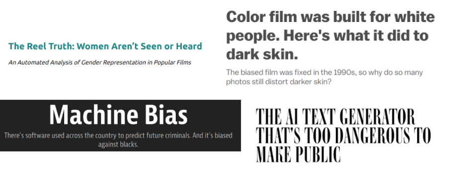

# Machine Learning Fairness

---

# Read & Discuss

<!--
*Open up the ML fairness topic with engaging examples from various domains, showing the impact of bias on 
end users. There are four potential articles in the facilitator guide. Choose your favorite three and have
students count off 1, 2, 3. Assign each group an article to read.

Articles:
https://seejane.org/wp-content/uploads/gdiq-reel-truth-women-arent-seen-or-heard-automated-analysis.pdf
http://www.openculture.com/2018/07/color-film-was-designed-to-take-pictures-of-white-people-not-people-of-color.html
https://www.propublica.org/article/machine-bias-risk-assessments-in-criminal-sentencing
https://www.wired.com/story/ai-text-generator-too-dangerous-to-make-public/

After everyone has finished reading (~10 mins), gather in mixed clusters of three (one student from each
article) to explain the main takeaway of your article to others in the class. What bias was uncovered
and how would you describe its impact on people? What do you find interesting about this article?*

Concepts:
 * fairness
-->

---

# Types of Bias

* Reporting
* Automation
* Selection (coverage, non-response, sampling)
* Group attribution (in-group, out-group)
* Implicit (confirmation, experimenters)

<!--
Biases can be found throughout the design and development of ML systems. Stay in same groups of three; do a
two-part activity to identify different types of bias. 

Part one asks them to use cards to match nine descriptive examples with nine different types of bias (bias card
matching). For part two, ask them to think-pair-share or volunteer answers: share what instances of these bias types they’ve
encountered in their own experience.

If you have a concrete example of bias in ML systems from your own experience, share how it was detected
and handled. 
-->

---

# Ethical Storyboarding

* What ML fairness risks exist?
* How would a “fair” model behave?
* How can we mitigate risks?
  * model
  * dataset
  * context
 
<!--
It’s important to remember ML algorithms and systems are built, trained, and evaluated by people, and they are affected by human cognitive limitations and biases. To create systems that work for everyone, we have to intentionally work to mitigate those issues. It’s also important to note that fairness is subjective. Not all biases should be approached the same way. 

In same groups of three, have students work on Ethical Storyboarding activity for some ML example (chosen from the bias cards or other). Discuss what ML Fairness risks might exist for their specific product, and what research/feedback mechanisms could help mitigate those issues.

After ~25 minutes, debrief the class all together.
ASK:
* What do they perceive as main takeaways from this exercise?
* What does this mean to them, for their role as up-and-coming professionals in Machine Learning?
* What are questions they still have?
-->
