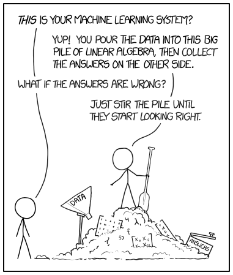

# Problem Framing

<!--
Before we can dive into building an ML model, we need understand the problem at hands.  In turns, it will help us determine if using ML is the right approach, and how to frame it in a way that ML model can bring insights toward solving the problem.

Background content for the slides:
https://developers.google.com/machine-learning/amli-content/what-is-ml/is-ml-right-for-you
https://developers.google.com/machine-learning/amli-content/problem-framing/good
-->

---

# Is ML Right for You?

<!--
Machine learning is not magic, and ML is not a good fit for all problems.  The principles underlying machine learning are not new but are possible today because of the amount of available public data and processing power.

In the next few minutes, we’ll discuss the attributes of problems that will make a good ML problem and how to frame the problem.
-->

--- 

## ML Is a Tool

<!--
ML is one of the newer problem solving tool that is now available in your toolbox.  The natural tendency is to try to use it to solve all the problems you encountered.  When you have a hammer, everything looks like a nail…

You’ll want to use the right tool out of your toolbox that are best at solving the problem at hands.  Next, let’s try to understand what is the benefits and drawbacks of using ML.

-->

## ML Benefits and Drawbacks

* Makes predictions
* Based on previous data (labeled or not)

**Good**

* Robust to changes unforeseen details
* Handles highly complex tasks very well
* "One size fits all" algorithm

.

{.column}

**Bad**

* Hard to debug, no insight into how model works
* Takes a lot of energy
* Takes a lot of time
* Energy and time cost money

.

<!--
What does ML do? What are its benefits? What are its drawbacks?
Key points:
Makes predictions
Based on previous data (labeled or not)
Good: robust to changes and unforeseen details
Good: handles highly complex tasks very well
Good: “one size fits all” algorithm
Bad: hard to debug, no insight into how model works (can be biased)
Bad: takes a lot of energy (think coffee pots, or how fast tensorflow drains your laptop battery)
Bad: takes a lot of time
Bad: energy and time cost money
-->

---

## What Kind of Tool?

<!--

-->

---

## What Other Tools Do We Have?

<!--
Look at definition, brainstorm other ways to accomplish goals
-->

---

Traditional Software Engineering

  * Requirements --> Workable Design

Machine Learning

  * Experiments --> Workable Model

<!--
From https://developers.google.com/machine-learning/amli-content/problem-framing/intro: 
In traditional software engineering, you can reason from requirements to a workable design, but with machine learning, it is necessary to experiment to find a workable model.
Many machine learning systems produce models that encode knowledge and intelligence by interpreting signals differently than humans do. A neural network might interpret a word via an embedding, so "tree" is understood as something like, "[0.37, 0.24, 0.2]," a list of coordinates, like latitude and longitude, and "car" as "[0.1, 0.78, 0.9]."
The neural network might use these representations to do accurate translations or sentiment analysis, but a human looking at the embeddings would find them very hard to interpret. This can make machine learning systems difficult, but not impossible, for humans to understand and evaluate.
-->

---

## Shifting Your Mindset

"Machine Learning changes the way you think about a problem. The focus shifts from a mathematical science to a natural science, running experiments and using statistics, not logic, to analyze its results.”
-Peter Norvig

<!--
Peter Norvig - Google Research Director
Quote source: https://developers.google.com/machine-learning/amli-content/problem-framing/intro
-->

---

# Comfort With Uncertainty

<!--
https://developers.google.com/machine-learning/amli-content/problem-framing/ml-mindset
-->

---

## Scientific Method

1.  Set a research goal
1.  Make a hypothesis
1.  Collect data
1.  Test hypothesis
1.  Analyze results
1.  Reach a conclusion
1.  Refine and repeat

<!--
https://developers.google.com/machine-learning/amli-content/problem-framing/ml-mindset
-->

---

## Traits of Good ML Problems

* Clear problem statement, before we look at data!
* Lots and lots of data
* Predictions, rather than decisions
* Tolerance for inaccurate output

<!--
https://developers.google.com/machine-learning/amli-content/problem-framing/good
-->

---

## Framing a Problem

* Start clearly and simply
* What is your ideal outcome?
* Success and failure metrics
* Other failure scenarios

<!--
https://developers.google.com/machine-learning/amli-content/problem-framing/framing

Patents: "We want to know how many patents exist across important domains such as self-driving cars and mobile advertising."
Hiring: "We want to catch competitive engineers' resumes that resume screeners mistakenly missed or rejected."
Tech support: "We need to reduce the load on technical support by increasing the usage of self-help articles."
-->

---

# Keep It Simple!

(like, in ML, and in engineering, and in general)

<!--
Use examples: 
You can use this if Kevin O’Malley gives guest lecture. His research team made advanced signal processing to identify song, other university team blew them away with simple string searches
-->

---

## Good Questions

* What is the goal?
* Do you have enough data?
* How will you measure success?
* What is the cost vs. reward?

---

## Properties of Good Output

* Connected to your ideal outcome
* Can you obtain outputs to train with?
* Batch or real-time output usage?
* Highlights flaws in original problem statement
* Predicts the correct result more often than equivalent heuristics
