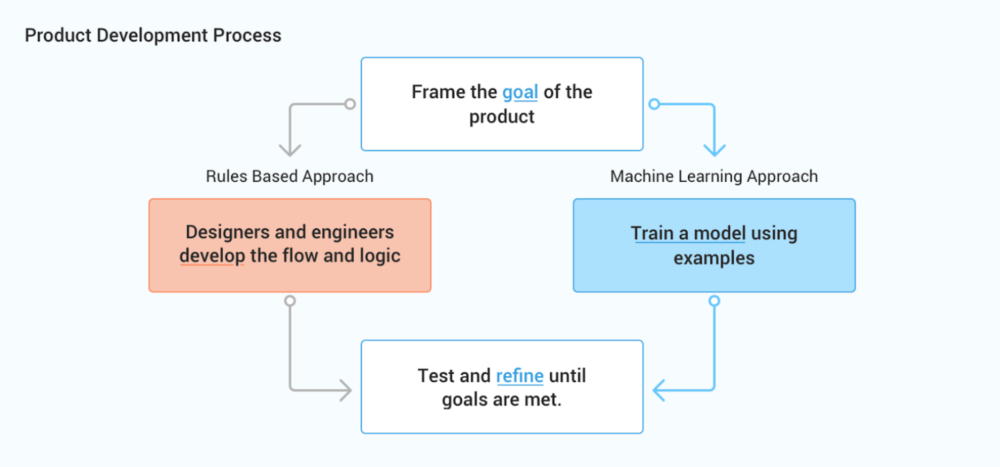
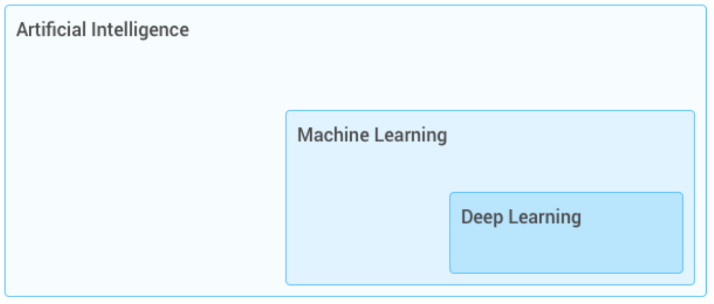

---

## Learning from Examples

<!--
Machine learning uses examples to identify patterns and make predictions on new examples. 

Imagine if you brought a young child to the zoo, and upon arriving at the lion exhibit, the child pointed at a lion and said, “It’s a kitty!”

Image Details:
* [toddler.jpg](https://pixabay.com/photos/african-child-black-child-child-2578559/): Pixabay License
-->

---

## Learning from Examples

<!--
Would you be surprised? Maybe the child has not seen a lion before, but does have a kitten at home, so they said the closest thing they could think of.

Image Details:
* [kitten.jpg](https://unsplash.com/photos/2Nca6Aum17o): Usplash License
-->

---

## Learning from Examples

<!--
You inform the child this animal is a lion and continue your day at the zoo.

Image Details:
* [lion.jpg](https://www.pexels.com/photo/lion-sleeping-beside-rock-1187987/): Pexels License
-->

---

## Learning from Examples

<!--
Later, you arrive at the tiger cage and the child now says, “It’s a lion!” (perhaps they now think all big cats are lions…) You might clarify for the child that tigers have stripes, while lions don’t.

We expect children to learn from their surroundings, and when they get something wrong, we provide feedback to help them improve. The child's understanding of cats, lions, and tigers improves with feedback.

Similarly, machine learning makes predictions based on feedback while learning from examples.

Image Details:
* [tiger.jpg](https://pixabay.com/photos/animal-tiger-big-cat-safari-1868911/): Pixabay License
-->

---

# Learning from Examples

<!--
A machine learning algorithm might have a hard time determining whether this is a kitten or a lion. But then again, so might the child from the zoo.

Image Details:
* [kitten-lion.png](https://en.wikipedia.org/wiki/Comment_(computer_programming)#Tags): TODO
-->

---

# Options

**Rules-based**

* Humans develop the logic flow
* If/then/else rules
* One-off exceptions
* Limited to human reasoning
* Exposes bias of the implementor

.

{.column}

**Machine Learning**

* Model trained with data
* Emergent patterns in the data
* Experiments and refinements in training and models
* Limited by training data
* Exposes bias of the training data

.

<!--
Before machine learning, many problems used a “rules-based approach”, which makes predictions based on a list of rules. In some situations it’s useful to have this human input, but it’s challenging to maintain as new rules are needed for each change in user needs or ecosystem.

Consider the problem of deciding whether an animal picture is a lion. A rules based approach might check for various things: whether the animal has 2 ears, whiskers, walks on 4 legs, and is large. But what if you forget to include a rule for no stripes? What if the picture is of a lion cub, which isn’t large?

A machine learning approach would be able to look through a large number of examples to find the patterns of what a lion looks like without being explicitly told. ML systems are easier to update as user needs and the ecosystem changes. Some more advantages and disadvantages of both approaches are shown here.
-->

---

<!--
Machine learning is an iterative process that requires large amounts of data to learn useful, generalizable patterns. 

Your first step in approaching a problem should always be to define a clear, user-focused goal. Then, decide whether to take a rules-based or machine learning approach based on how the advantages of each fit to your goal (generally, if you have a large amount of diverse data, machine learning is the way to go). 

No matter your approach, you’ll then need to test and refine your system until goals are met.

Image Details:
* [product-development-process.png](http://google.com): Copyright Google
-->

---

# Terminology

<!--
There are many key terms you’ll encounter in this class, and in your machine learning work. Here’s an overview of some of the most important terms.
-->

---

# Artificial Intelligence{.big}

<!--
What is artificial intelligence?
-->

---

machines that appear intelligent based on the tasks they perform

<!--
You might think of crazy robots like in “Ex Machina”, or chatbots like Google Home, but AI is a very broad field. In fact, machine learning is actually a specific field of AI.
-->

---

# Machine Learning{.big}

<!--
What is machine learning then?
-->

---

a specific field of AI where a system learns to find patterns in examples in order to make predictions

<!--
Machine learning is a strategy through which AI can appear “intelligent” when performing tasks
-->

--- 

# Deep Learning {.big}

<!--
“Deep learning” is a term that has become more and more widely used in recent years, due to the increasing availability of data.
-->

---

a machine learning approach that breaks a problem down into many pieces so it can learn more from the training data

<!--
Deep learning is a specific type of machine learning approach that gets its name from the large number of layers often used to build a neural network. Because these models are so complex, different layers can often learn different insights about the problem.

For example, a neural network classifying images of animals could have a layer that examines the colors in the image and another that looks for shapes. The insights from layers like these can be combined to identify, for example, whether an image shows a lion or a tiger.
-->

---

<!--
Sometimes these terms are used interchangeably, but that’s not quite correct. Deep learning is a specific technique in machine learning, which is a subfield in AI.

Image Details:
* [deep-learning-hierarchy.png](https://google.com): Copyright Google
-->

---

# Features {.big}

<!--
Now let’s dive deeper into what goes into a machine learning system.
-->

---

information drawn from examples which distinguish one example from another are the features in a machine learning system

<!--
For example, if we were trying to decide whether an image was of a lion or a tiger, useful features could be whether an animal has a mane or stripes. 

Some machine learning approaches (like deep learning) can automatically detect important features. But very often, you’ll need to define what features to include based on your specific goal.
-->

---

Video recommendation?

<!--
Say your goal is to give good video recommendations to viewers. What features / distinguishing information might be useful?

ex:
video topic
number of views
creator of video
-->

---

Price of a house?

<!--
What if your goal is to predict the price of a house?

ex:
location
# bedrooms
size of property
-->

---

Which ad to display?

<!--
What if you’re predicting which ad to display to someone using google search?

ex:
user’s query
type of device
time of day
-->

---

# Model {.big}

<!--
These features are used in a model to make predictions.
-->

---

a mathematical way the patterns and insights that a machine learning system learns from examples and is used to make predictions

<!-- A model specifies how your machine learning system will actually learn patterns and insights. The model will then make predictions based on what it learned. Different models perform better on different problems. We’ll discuss several common types of models in a later lecture.
-->

---

# Training {.big}

<!--
Teaching a model the difference between a lion photo and a tiger photo requires training data. Training data is a large set of examples related to the problem you are trying to solve. The model will make predictions based on the patterns found in the training data.

In one type of machine learning, known as supervised learning, the examples are labeled. For example, the title of an image could be "Lion" or "Not a Lion." The model could use these titles as feedback, learning better how to classify images.

Especially with more data, models can become so complex that the details of how the model makes its predictions are difficult to understand. It’s important to continually evaluate and try to understand the output of your models. 
-->

---

# Testing {.big}

<!--
Machine learning makes predictions on new data based on previous examples (training data). If your lion-detecting model adequately distinguishes lions from tigers, the model is performing successfully. If not, you can experiment with additional training data or other approaches to improve the results.

The data you use for testing should be representative of your problem and goal. Then your performance on the testing dataset should give you an idea of how your model will perform on totally new, real data.
-->

---

# Overfitting {.big}

<!--
It’s important to always have a separate training dataset and testing dataset. If you observe high performance on the training data but lower performance on the separate testing data, it’s a sign of overfitting. Overfitting occurs when a model conforms too much to its training data and cannot generalize to make predictions about new data. For example, if none of the tigers in the training data have white fur, the model could assume all tigers have orange fur.

Just like the child from the zoo, a machine learning model will do the best it can with the information it has. Overfitting can be mitigated by looking for blind spots and bias in data and processes. It might also be a sign that you need more training data. We’ll have a deeper discussion of how to improve performance of machine learning models, including reducing overfitting, later in the class.
-->
