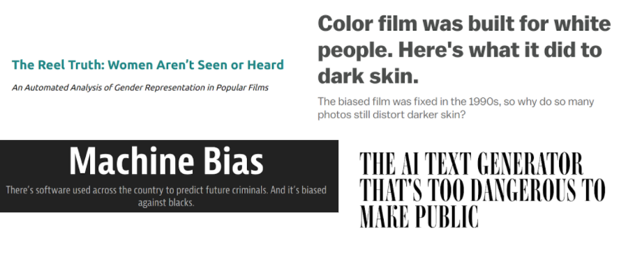

# Machine Learning Fairness

---

# Read & Discuss

<!--
Open up the ML Fairness topic with engaging examples from various domains, showing the impact of bias on end users. There are 4 potential articles in the facilitator guide -- choose your favorite 3 and have students count off 1/2/3. Assign each group an article to read.

After everyone has finished reading (~10 mins), gather in mixed clusters of 3 (one student from each article) to explain the main takeaway of your article to others in your group. What bias was uncovered and how would you describe its impact on people? What do you find interesting about this article?
-->

---

# Types of Bias

* Reporting
* Automation
* Selection (Coverage, Non-response, Sampling)
* Group Attribution (In-group, Out-group)
* Implicit (Confirmation, Experimenters)

<!--
Biases can be found throughout the design and development of ML systems. Stay in same groups of 3; do a 2-part activity to identify different types of bias. 

Part 1 asks them to use cards to match 9 descriptive examples with 9 different types of bias (Bias Card Matching). For Part 2, ask them to pair-share or volunteer-share what instances of these bias types they’ve encountered in their own experience.

If you have a concrete example of bias in ML systems from your own experience, share how it was detected and handled. 
-->

---

# Ethical Storyboarding

* What ML Fairness risks exist?
* How would a “fair” model behave?
* How can we mitigate risks?
  * Model
  * Dataset
  * Context
 
 <!--
It’s important to always remember that ML algorithms and systems are built, trained, and evaluated by people, and are affected by human cognitive limitations and biases. To create systems that work for everyone, we have to intentionally work to mitigate those issues. It’s also important to note that fairness is *subjective* -- not all biases should be approached the same way. 

In same groups of 3, have students work on Ethical Storyboarding activity for some ML example (chosen from the bias cards or other). Discuss what ML Fairness risks might exist for their specific product, and what research/feedback mechanisms could help mitigate those issues.

After ~25 minutes, debrief the class all together.
ASK:
* What do they perceive as main takeaways from this exercise?
* What does this mean to them, for their role as up-and-coming professionals in Machine Learning?
* What are questions they still have?
-->
