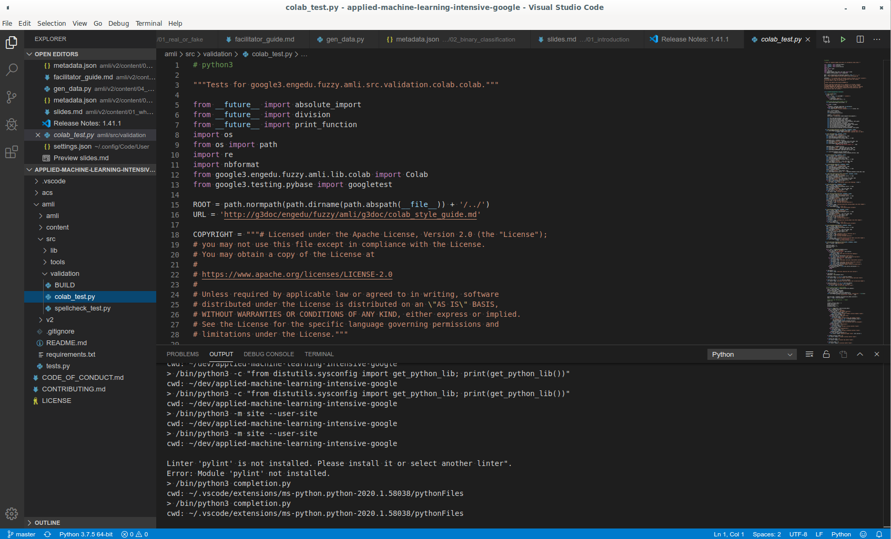
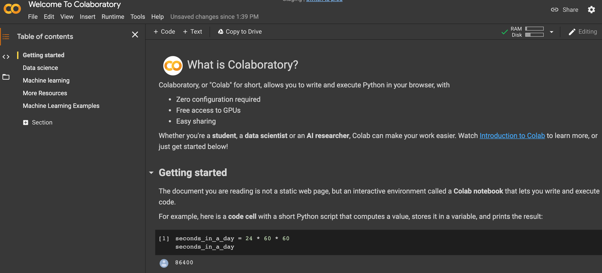
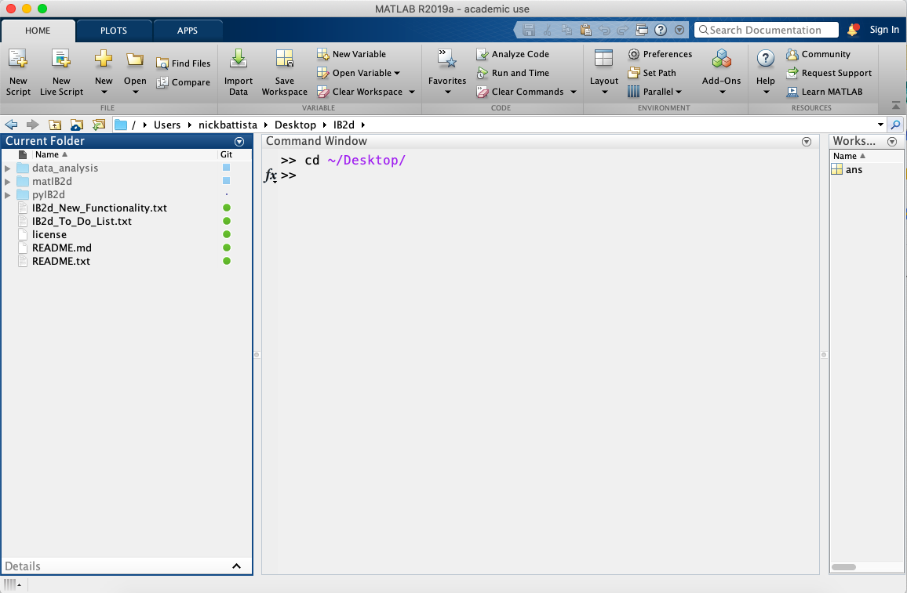

# Introduction to Colab

<!--

We have talked about machine learning and data science in the abstract. Now it
is time to actually start applying our skills. To do this, we will need some
sort of development environment. There are a plethora of options in this space.

-->

---

# Traditional Development Environments

<!--

Many data scientists choose to use a traditional development environment for
their work. These editors range in complexity from a text editor like Notepad on
Windows through large integrated development environments such PyCharm.

With these environments it is often necessary to install extra software to
support your data science work.

You will likely find that data scientists with a background in traditional
programming are comfortable in these environments since they have likely already
had experience with them.

These development environments are also useful for developing code supported by
unit tests and code that will be packaged and deployed on server systems.

Source: Google Copyright

-->

--

# Notebooks

 #TODO

<!--

Notebooks are another option that you will see regularly. They are also the
primary coding environment for this course.

Currently when someone mentions a data science notebook, they are typically
referring to a Jupyter Notebook.

Jupyter Notebooks combine code, output, and supporting documentation in a single
structured document. The document can be executed, modified, and iterated on.

Though you'll see many Jupyter notebooks that contain Python code, they aren't
limited to Python. Jupyter supports many different 'kernels' that allow users a
wide variety of choice in what languages and libraries they use.

Source: Google Copyright

-->

# Other Options

 #TODO

<!--

The choice of development environments isn't a binary choice between notebooks
and traditional development environments. There is a wide spectrum of tools
available, some that blur the lines between traditional environments and
notebooks.

MATLAB is one of these tools. I can very much be used as a traditional
development environment where you write code and then deploy that code. However,
it also supports a notebook mode which has a much more Jupyter-like feel.

It is important to be aware that not all data scientists develop in the same
type of environment. Personal preference, costs, corporate standards, and more
go into the decision for someone to choose a specific environment.

The environment might even change over the course of a project. A data scientist
might explore and build a small model using a notebook. Later, once they model
is designed, they might then switch over to a more traditional environment to
create a deployable package.

Source Google Copyright

-->
