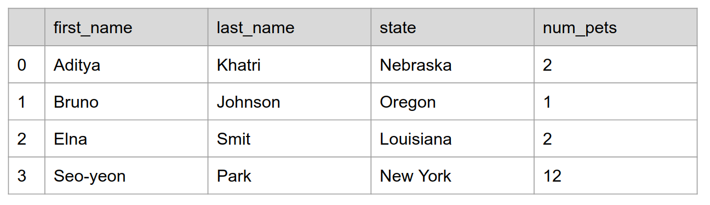
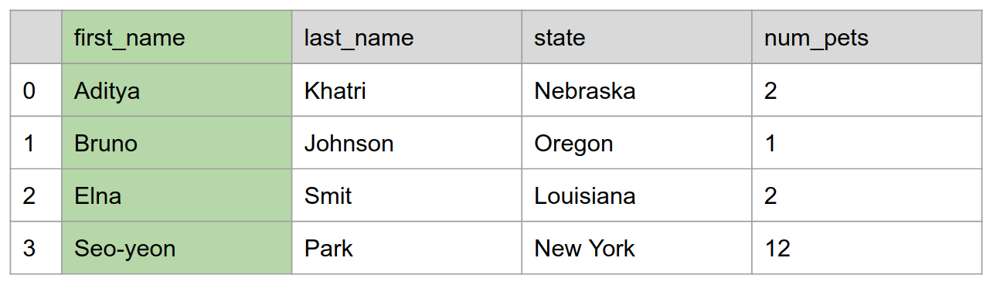
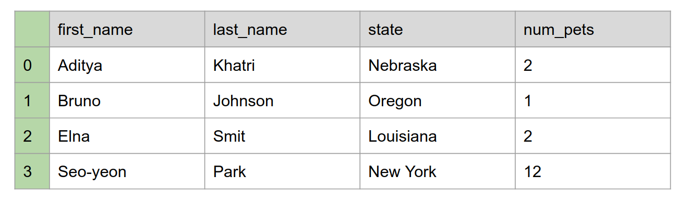
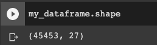
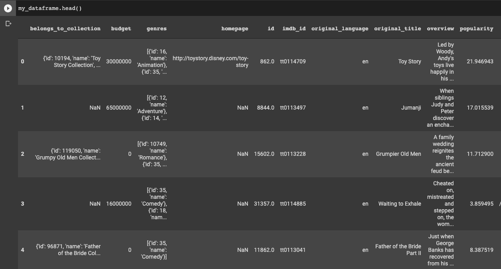
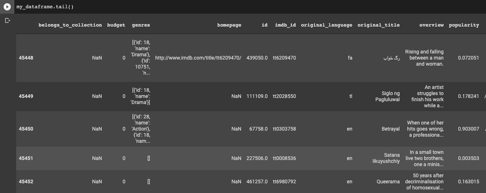
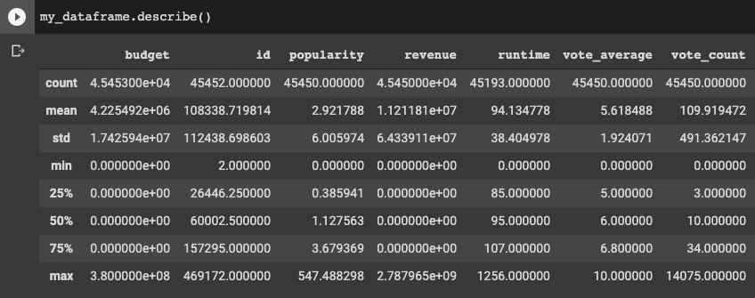
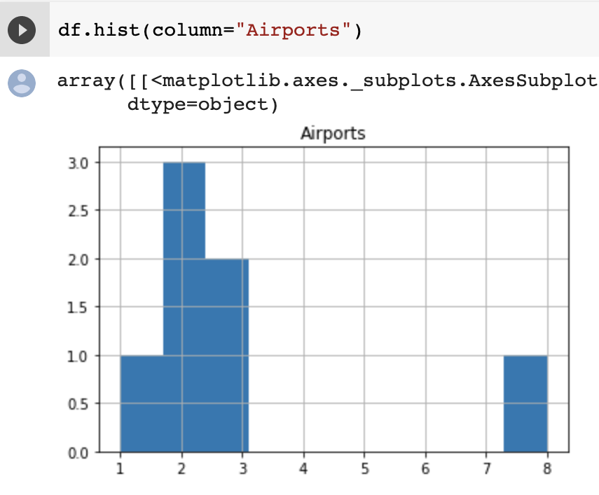

# Introduction to Pandas

---

# Pandas?


<!--

These animals are adorable but we are going to talk to about a Python library called Pandas which is a popular tool for handling and analyzing input data.

Source: https://pixabay.com/photos/panda-giant-panda-bear-red-panda-317980/ (Pixabay License)

-->

---

# What is Pandas?

* Open source data analysis tool for Python programming language
* In use in a wide variety of academic and commercial domains, including Finance, Neuroscience, Economics, Statistics, Advertising, and more

<!--

Python is a popular language for working on files and data munging, but to do more data analysis and modeling you may feel tempted to switch to a more domain specific language like R.

Pandas provides data structures and tools that are similar to R and help with data analysis.  Hence by combining Python and Pandas, you will be able to carry out the entire data analysis workflow using Python.

-->

---

# Pandas Data Structures: DataFrames

DataFrames are set up like tables, with columns, headers, and rows of data.



<!--

Motivation: 
Giving a visual for DataFrames so students who are visual learners can interact intuitively with the structure.

For the class:
* The DataFrame is Pandas' data structure. It is very much like a table with one or more columns - which means it works well with the CSV data file format.
  * Looks like a table which consists of rows and columns
  * The first row contains column headers

Source: Google Copyright

-->

---

# Pandas Data Structures: Series

One column of a DataFrame is called a “Series”



<!--

Motivation: 
* Continuing to give visuals to help out students.

For the class:
* Pandas Series is 1-dimensional and contains a homogeneously-typed array
* So, in summary, a DataFrame contains 1 or more Series

Source: Google Copyright

-->

---

# Pandas Data Structures: Index

The primary column of the dataframe, without a title, is the “Index”



<!--

Motivation: 
* Continuing to give visuals to help out students.

For the class:
* Lastly, the first column is an index column. In this case it’s numeric values, but it can be non-numeric as you’ll see as you dig deeper into Pandas usage.

Source: Google Copyright

-->

---

# Using Pandas

```python
import pandas as pd
```

<!--

Pandas isn't a core part of Python. To use it you'll need to import it. You could do this by simply
writing `import pandas`. In practice however, you'll see `import pandas as pd`. This isn't a
requirement, but it is a convention that you'll see in quite a bit of code that uses Pandas and
in documentation and on help sites. Aliasing `pandas` as `pd` will make it easier to utilize these
resources.

If you are using Colab, you can import Pandas without needing to install it. If you are using Jupyter or scripting in a text editor, you may need to download and update the Pandas library (i.e. pip install pandas -- if you are using pip). See the documentation at: https://pandas.pydata.org/pandas-docs/stable/

-->

---

# Creating Pandas Data Structures: Series


When coding, we can make a `Series` in the following way:

```python
flavors = pd.Series(
    ['Mint', 'Raspberry', 'Orange', 'Coffee']
)
```

<!--

Here, we create a Series indexed by 0, 1, 2, 3. It is one column called "flavors" with entries ['Mint', 'Raspberry', 'Orange', 'Coffee']

-->

---

# Creating Pandas Data Structures: Combining Series

Multiple Series can be combined into a Dataframe:

```python
flavors = pd.Series([
    'Mint', 'Raspberry', 'Orange', 'Coffee'])
num_in_stock = pd.Series(['14', '13', '20', '7'])

pd.DataFrame({ 'Truffle': flavors, 'Number': num_in_stock })
```

<!--
In this code, we first create two series, flavors and num_in_stock. Then, we make a DataFrame, giving each series a title (“Truffle” and “Number”).

-->

---

# Creating Pandas Data Structures: Reading a .csv

```python
my_dataframe = pd.read_csv("city_populations.csv")
```


<!--

This method reads in a file in the format “csv”, meaning that the data in the file is separated by commas.

A CSV is a file type, meaning “comma separated values”. Essentially, it signifies that the data has commas between each value to signify where one entry ends and the next begins.

The first argument is a string and can either be the name of a local file (as shown) or the url of a file on the internet.

-->

---

# Exploring `Series` and `DataFrame`

Pandas has some methods to get basic information about both `Series` and `DataFrame` objects:

* `shape()`
* `head()`
* `tail`
* `describe()`
* `hist()`

<!--

We’ll go through each of these methods in turn. Each of these methods works with both Series and DataFrame objects. None of them modify the data, but rather they let us view the data in a few different ways so we can get a sense of what we’re looking at.

-->

---

# Exploring `Series` and `DataFrame`: `shape`

Prints out `(number of rows, number of columns)`

```python
my_dataframe.shape()
```

{.column}

 

<!--

shape() prints (number of rows, number of columns)

Source: Google Copyright

-->

---

# Exploring `Series` and `DataFrame`: `head`

Prints out the first few rows of the DataFrame

```python
my_dataframe.head()
```

{.column}

 

<!--

head() prints the full contents of the first 5 rows.

Source: Google Copyright

-->

---

# Exploring `Series` and `DataFrame`: `tail`

Prints out the last few rows of the DataFrame

```python
my_dataframe.tail()
```

{.column}



<!--

tail() prints the full contents of the last 5 rows.

Source: Google Copyright

-->

---

# Exploring `Series` and `DataFrame`: `describe`

Gives statistics about all of the **numerical** data in the DataFrame

```python
my_dataframe.describe()
```

{.column}

 

<!--

describe() gives statistics such as mean and median about numerical data.

Note that any columns without numerical data are not included.

Source: Google Copyright

-->


---

# Exploring `Series` and `DataFrame`: `histogram`

Makes a histogram of any **numerical** columns (calculates the frequency of each number)

```python
my_dataframe.hist()
```

{.column}

 

<!--

hist() visualizes the frequency of various results for one or more numerical columns.

Source: Google Copyright

-->

---

# Accessing Data: Column

```python
my_dataframe['Names']
```
Returns the series with the title ‘Names’ from the DataFrame

<!--

If you have a column called “Names”, this command will give you only the contents of that column.

-->

---

# Accessing Data: Column Entry

```python
my_dataframe['Names'][1]
```
Returns the first element of the series with the title ‘Names’

<!--

Since series can be indexed like arrays, this command will return a single element from the series.

-->

---

# Accessing Data: Slice

```python
my_dataframe[0:2]
```
Returns the first three rows of the DataFrame

<!--

Like python arrays again, you can specify a group of rows to be shown. In this case, the first three will be returned.

Note that even though the square bracket syntax is the same, this command returns row data rather than column data.

-->

---

# Accessing Data: iloc

If you want to access row(s) of data you can use `iloc`.

<!--

the iloc command takes an integer index and accesses the row located at that index.
df.iloc[0] returns the first row (i.e. the 0th indexed row) of df.

-->

---

# Accessing Data: loc

If you want to access specific rows and columns of data you can use `loc`.

<!--

The loc command is like a combination of column indexing and row indexing.
It allows you to access a group of rows *and* columns by label(s) or a boolean array.

-->

---

# Adding Series to a Dataframe

We can create a new series of the same length of an existing series by modifying all of the elements by a singular value and storing them in the dataframe under a new name.

```python
my_data['percent'] = my_data['proportion'] * 100
```

<!--

The series my_data[‘percent’], which is added to the my_data dataframe, will be equal to 100 times the series ‘proportion’.

This means for each row, the entry in the ‘percent’ column will be 100 times the entry in the ‘proportion’ column.

-->

---

# Adding Series to a Dataframe

We can also create a new series using two or more already defined series.

```python
my_data['density'] = my_data['atoms'] / my_data['volume']
```

<!--

In this case, one series is being divided by another.

For each row, the entry in the ‘density’ column is equal to the entry in the ‘atoms’ column divided by the entry in the ‘volume’ column.

-->

--- 

# Adding Series to a Dataframe

Finally, we can use the “apply” method to apply a function to every element of a series and create a new series of the same length.

```python
def my_function(price):
	if(price > 20):
		return True
	return False

my_data['is_expensive'] = my_data['prices'].apply(my_function)
```

<!--

My_function is a function that takes in a value and returns a value. In this case, we can imagine that my_function takes in an integer (the ‘price’) and returns a boolean value indicating whether or not the item is expensive.

-->
