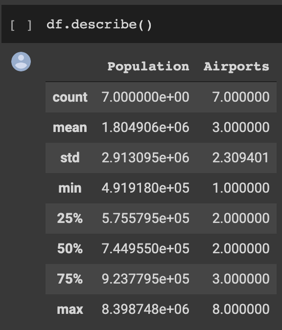
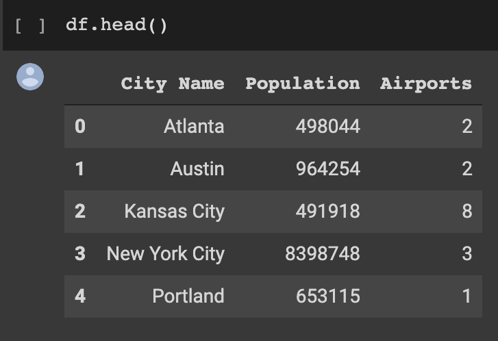
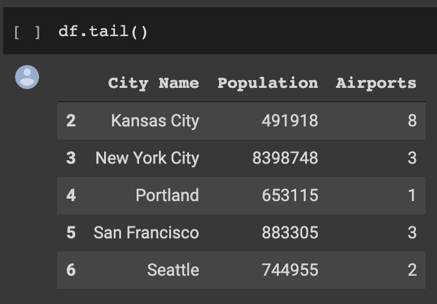

# Introduction to Pandas

---

# Pandas?


<!--

These animals are adorable but we are going to talk to about a Python library called Pandas which is a popular tool for handling and analyzing input data.

Source: https://pixabay.com/photos/panda-giant-panda-bear-red-panda-317980/

-->

---

# What is Pandas?

* Open source data analysis tool for Python programming language
* In use in a wide variety of academic and commercial domains, including Finance, Neuroscience, Economics, Statistics, Advertising, and more

<!--

Python is popular language for working on files and data munging, but to do more data analysis and modeling you may feel tempted to switch to a more domain specific language like R.

Pandas provides data structures and tools that are similar to R and help with data analysis.  Hence by combining Python and Pandas, you will be able to carry out the entire data analysis workflow using Python.

-->

---

# Why Pandas?

* Good for data manipulation
* As you might have noticed when making visualizations, while we were able to represent the data, we were not modifying it in any way.
  * Pandas offers us this capability

<!--

Motivation: 
Situating pandas within the rest of the course and contrasting it with previous work so they can see why it’s useful

For the class:
Sometimes the data we get is not in the right format for what we need, so Pandas can help us change that.

-->

---

# Pandas Data Structures: Dataframes

Dataframes are set up like tables, with columns, column headers, and rows of data.


<!--

Motivation: 
Giving a visual for the Dataframes so students who are visual learners can interact intuitively with the structure.

For the class:
* Pandas data structure is very much like a table with one or more columns - which means it works well with CSV type of data file format.
* Let’s start with a data structure: DataFrame
  * Looks like a table which consists of rows and columns
  * The first row contains column headers

Source: Google Copyright

-->

---

# Pandas Data Structures: Series

One column of a Dataframe is called a “Series”


<!--

Motivation: 
* Continuing to give visuals to help out students.

For the class:
* Pandas Series is 1-dimensional and contains homogeneously-typed array
* So, in summary a DataFrame contains 1 or more Series

Source: Google Copyright

-->

---

# Pandas Data Structures: Index

The primary column of the dataframe, without a title, is the “Index”


<!--

Motivation: 
* Continuing to give visuals to help out students.

For the class:
* Lastly, the first column is an index column and in this case it’s numeric values, but it can be non-numeric as you’ll see as you dig deeper into Pandas usage

Source: Google Copyright

-->

---

# Using Pandas

```python
import pandas as pd
```

<!--

Pandas isn't a core part of Python. To use it you'll need to import it. You could do this by simply
writing `import pandas`. In practice however, you'll see `import pandas as pd`. This isn't a
requirement, but it is a convention that you'll see in quite a bit of code that uses Pandas and
in documentation and on help sites. Aliasing `pandas` as `pd` will make it easier to utilize these
resources.

If you are using Colab, you can import Pandas without needing to install it. If you are using Jupyter or scripting in a texteditor, you may need to download and update the Pandas library (i.e. pip install pandas -- if you are using pip). See the documentation https://pandas.pydata.org/pandas-docs/stable/

-->

---

# Creating Pandas Data Structures: Series


When coding, we can make a `Series` in the following way:

```python
flavors = pd.Series(
    ['Mint', 'Raspberry', 'Orange', 'Coffee']
)
```

 #TODO 

<!--

Motivation: 
* Showing code on slide so students can ask questions before dealing with it on their own.

For the class:
* We created a Series indexed by 0, 1, 2, 3.

-->

---

# Creating Pandas Data Structures: Combining Series

Multiple Series can be combined into a Dataframe:

```python
flavors = pd.Series([
    'Mint', 'Raspberry', 'Orange', 'Coffee'])
num_in_stock = pd.Series(['14', '13', '20', '7'])

pd.DataFrame({ 'Truffle': flavors, 'Number': num_in_stock })
```

 #TODO 

<!--
Motivation: 
* Showing code on slide so students can ask questions before dealing with it on their own.

For the class:
* In this code, we are first making two series, flavors and num_in_stock.
* After that, we make a dataframe, giving each series a title (“Truffle” and “Number”).

This method reads in a file in the format “csv”, meaning that the data in the file is separated by commas.
A CSV is a file type, meaning “comma separated values”. Essentially, it signifies that the data has commas between each value to signify where one entry ends and the next begins.

The first argument is a string and can either be the name of a local file (as shown) or the url of a file on the internet.

The 'sep' field denotes what character (or characters) are used in the file to separate fields. For a csv, this will most likely be a comma.

-->

---

# Exploring `Series` and `DataFrame`

Pandas has some methods to get basic information about both `Series` and `DataFrame` objects:

* `describe()`
* `head()`
* `tail`
* `hist()`

<!--

Motivation: 
Showing code on slide so students can ask questions before dealing with it on their own.

For the class:
We’ll go through each of these methods in turn. None of them modify the data, but rather they let us view the data in a few different ways so we can get a sense of what we’re looking at.

-->

---

# Exploring `Series` and `DataFrame`: Describe

Gives statistics about all of the numerical data in the dataframe

```python
my_dataframe.describe()
```

 #TODO 

<!--

Motivation: 
Showing code on slide so students can ask questions before dealing with it on their own.

For the class:
* My_dataframe is a pandas dataframe.
* describe() gives statistics such as mean and median about numerical data

-->

---

# Exploring `Series` and `DataFrame`: Head

Prints out the first few rows of the dataframe

```python
my_dataframe.head()
```

 #TODO 

<!--

Motivation: 
Showing code on slide so students can ask questions before dealing with it on their own.

For the class:
* My_dataframe is a pandas dataframe.
* head() prints the full contents of the first 5 rows.

-->

---

# Exploring `Series` and `DataFrame`: Tail

Prints out the last few rows of the dataframe

```python
my_dataframe.tail()
```
 #TODO 

<!--

Motivation: 
Showing code on slide so students can ask questions before dealing with it on their own.

For the class:
* My_dataframe is a pandas dataframe.
* tail() prints the full contents of the last 5 rows.

-->

---

# Exploring `Series` and `DataFrame`: Histogram

Makes a histogram of any numerical data (calculates the frequency of each number)

```python
my_dataframe.hist()
```
 #TODO 

<!--

Motivation: 
Showing code on slide so students can ask questions before dealing with it on their own.

For the class:
* My_dataframe is a pandas dataframe.
* For example, if one column was the ages of participants in a study, the histogram would show how many participants were of each age. 

-->

---

# Accessing Data: Column

```python
my_dataframe['Names']
```
Returns the series with the title ‘Names’ from the dataframe

<!--
Motivation: 
Showing code on slide so students can ask questions before dealing with it on their own.

For the class:
* My_dataframe is still a pandas dataframe
* If you have a column called “Names”, this command will give you only the contents of that column.
-->

---

# Accessing Data: Column Entry

```python
my_dataframe['Names'][1]
```
Returns the first element of the series with the title ‘Names’

<!--
Motivation: 
Showing code on slide so students can ask questions before dealing with it on their own.

For the class:
* My_dataframe is still a pandas dataframe
* Since series can be indexed like arrays, this command will return a single element from the series.

-->

---

# Accessing Data: Slice

```python
my_dataframe[0:2]
```
Returns the first three rows of the dataframe

<!--
Motivation: 
Showing code on slide so students can ask questions before dealing with it on their own.

For the class:
* My_dataframe is still a pandas dataframe
* Like python arrays again, you can specify a group of rows to be shown. In this case, the first three will be returned.
* Note that even though the square bracket syntax is the same, this command returns row data rather than column data.

-->

---

# Accessing Data: iloc

If you want to access row(s) of data you can use `iloc`.

<!--

iloc is purely integer-location based indexing for selection by position. 

df.iloc[0] returns the first row (i.e. the 0th indexed row) of df.

https://pandas.pydata.org/pandas-docs/stable/reference/api/pandas.DataFrame.iloc.html

-->

---

# Accessing Data: loc

If you want to access specific rows and columns of data you can use `loc`.

<!--

loc can be used to access a group of rows and columns by label(s) or a boolean array.

https://pandas.pydata.org/pandas-docs/stable/reference/api/pandas.DataFrame.loc.html

TODO: describe loc. Be sure to mention that it directly access the data and doesn't make a copy of
it. This allows `loc` to be on the left-hand side of assignment.

-->

---

# Adding Series to a Dataframe

We can create a new series of the same length by modifying all of the elements by a singular value.

```python
my_data['percent'] = my_data['proportion'] * 100
```

<!--

Motivation: 
Showing code on slide so students can ask questions before dealing with it on their own.

For the class:
* My_data is a dataframe
* The series my_data[‘percent’], which is added to the my_data dataframe, will be equal to 100 times the series ‘proportion’.
* This means for each row, the entry in the ‘percent’ column will be 100 times the entry in the ‘proportion’ column.

-->

---

# Adding Series to a Dataframe

We can also create a new series using two or more already defined series.

```python
my_data['density'] = my_data['atoms'] / my_data['volume']
```

<!--
Motivation: 
Showing code on slide so students can ask questions before dealing with it on their own.

For the class:
* My_data is a dataframe
* In this case, one series is being divided by another.
* For each row, the entry in the ‘density’ column is equal to the entry in the ‘atoms’ column divided by the entry in the ‘volume’ column.

-->

--- 

# Adding Series to a Dataframe

Finally, we can use the “apply” method to apply a function to every element of a series and create a new series of the same length.

```python
def my_function(price):
	if(price > 20):
		return True
	return False

my_data['is_expensive'] = 
my_data['prices'].apply(my_function)
```

<!--

-->
