# Intermediate Pandas

<!--
Welcome to 'Intermediate Pandas'. At this point in the course you should be
familiar with Pandas' Series and DataFrame objects. If these words are
unfamiliar to you, you probably want to go back and revisit the 'Introduction to
Pandas' unit.
-->

---

# Why more Pandas?

* Grouping
* Filtering
* Sorting
* ... and more!

<!--
You might be asking, "Why more Pandas? I'm ready to do some data science!".
Well, it turns out that quite a bit of the work in data science and machine
learning involves getting quality data ready to feed into our models. Pandas is
a toolkit that you'll regularly see used for this part of the data science
pipeline.

In this unit we will take a closer look at DataFrames. We will learn more ways
to explore the data in a DataFrame. This includes merging, grouping, filtering,
sorting, and more!
-->

---

# Shape

```python
print(df.shape) # (2452431, 8)
```

<!--
First, we will explore a few more ways to get data about a DataFrame. One of the
most basic is the `.shape` property of a DataFrame.


What is shape?

Shape is a property of a DataFrame that lets you know the number of rows and
columns in the DataFrame. You might remember that NumPy has a `.shape` attribute
on NumPy arrays. Pandas `.shape` has the same functionality. The primary
difference is that NumPy supports n-dimensional matrices where n can be greater
than two while Panda's DataFrame objects typically just have two dimensions:
rows and columns.
-->

---

# Columns

```python
print(df.columns) # Index(...)
```

<!--
DataFrames are typically thought of as tabular structures containing rows and
columns. Rows are often indexed by number (but not always) while columns
typically have meaningful names like 'Games Played' or 'Square Meters'.

Monotonically increasing numbers are easy enough to iterate over, but
arbitrarily-named columns are a different story.

Sometimes it is useful to know all of the names of the columns in a DataFrame.
To get this information you can use the `.columns` property of the DataFrame.
This returns an `Index` object that allows you to iterate over all of the column
names of the DataFrame in left-to-right order.

`Index` is a Pandas object, but it is also a Python iterable. This allows you to
loop over the columns names, extract them into a list, or perform any other
iterable operation supported by Python.
-->

---

# Missing Values

```python
df.isna()
```

<!--
It is common to find instances of missing data in datasets. Pandas provides the
`.isna()` utility to help you find missing data. `.isna()` examines the data in
a DataFrame and returns a DataFrame containing boolean values: True if the data
is missing and False if the data is present.

You can use this to find missing data that you can then act upon to clean your
dataset. At this point we won't worry about specific missing data mitigation
measures. Instead we'll address them in examples throughout the course.
-->

---

# Filtering

Selectively include or exclude specific rows or columns

<!--
Filtering is a powerful operation that allows us to selectively include or
exclude specific rows or columns.

Let's start by taking a look at row filtering.
-->

---

# Filtering: Rows

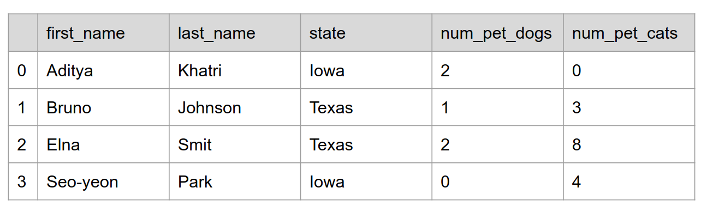

<!--
In this slide we see data from a DataFrame. The DataFrame has five columns
and four rows. Say that we would like to find people with more than two dogs.
How would we do that?
-->

---

# Filtering: Rows

```python
df[df[num_pet_dogs] > 1]
```

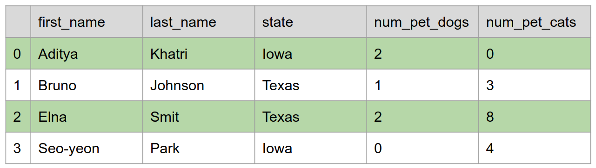

<!--
Here we have put the expression `df[num_pet_dogs] > 1` inside another selector
for `df`. The inner-expression creates a "boolean index" that is then used to
select only rows where the expression is true.
-->

---

# Filtering: Columns

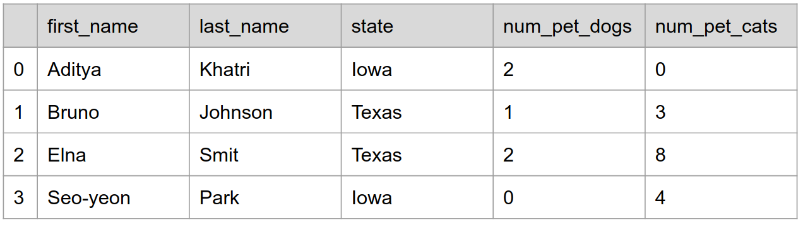

<!--
It is also possible to filter out columns of data. In the pictured DataFrame
there are pieces of personally identifiable information that could be used to
locate someone. If we wanted to make the data a little more anonymous we could
filter out the 'last_name' and 'state' columns.

How would we do that?
-->

---

# Filtering: Columns

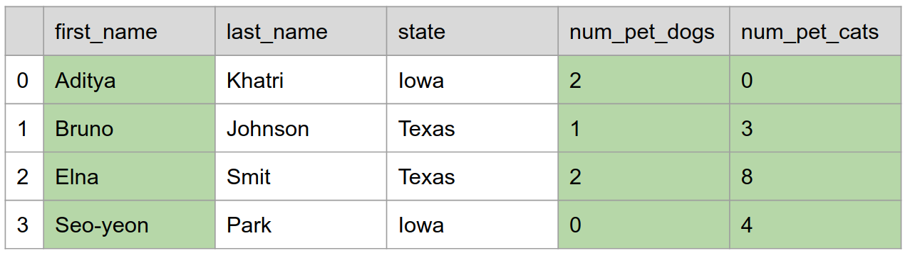

```python
df[[‘first_name’, ‘num_pet_dogs’, ‘num_pet_cats’]]
```
<!--
To filter by columns we can also use the DataFrame selector. Instead of passing
in a boolean index, we pass in a list of string that match the column names that
we want to keep.
-->

---

# Filtering: Logical Operators

Boolean Operator | Boolean Index Operator
-----------------|-----------------------
`and`            | &
`or`             | |
`not`            | ~

<!--
You are likely familiar with the boolean operators `and`, `or`, and `not` found
in standard Python. You can use the operators to make expressions like:

```python
price > 70 and weight < 5
```

You can do similar things with Pandas boolean indexes; however, you can't use
the standard `and`, `or`, and `not` operators. Instead you must use the more
terse `&`, `|`, and `~`.

You might recognize these as the bitwise boolean operators. Pandas has
overridden these operators to be logical boolean operators for boolean indexes.
-->

---

# Filtering: Logical Operators

```python
(df['Price'] > 70) & (df['Weight'] < 5)
```

<!--
Here you can see logical operators in action. We are looking at the 'Price'
column of a DataFrame object and creating a boolean index that is `True` when
the price is greater than 70. We are also creating a boolean index that is
`True` when the weight is less than 5. The `&` operator is then used to combine
these indexes into a single index.

You might notice that we put parenthesis around each boolean expression. This is
because the precedence for `&`, `|`, and `~` is higher than `>` and `<` so we
must add parenthesis to ensure that the `>` and `<` happen first.
-->

---

# Grouping

Condensing rows within a `DataFrame`

<!--
Often you can gather insights about the data in a `DataFrame` by condensing
many rows into one. This is called "grouping". Let's start by looking at an
example using renderings of tables.
-->

---

# Grouping

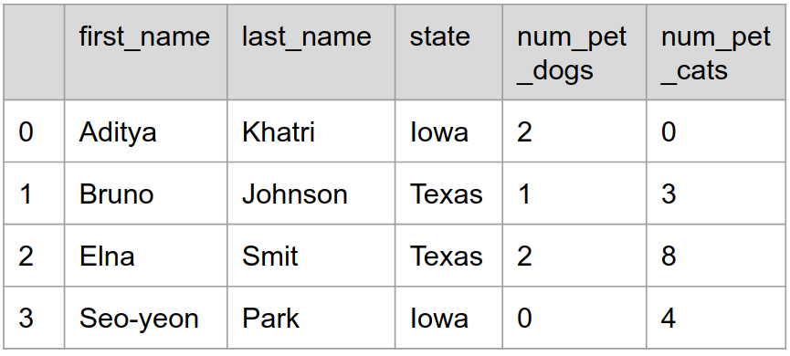

<!--
Here we have a `DataFrame` that contains pet owner data at an individual level.
Say we want to know which state has the most cats and dogs per pet owner? To do
that we can **group** our rows by state and find the mean count of cats and dogs
per owner per state.

How would we do that?
-->

---

# Grouping

```python
df.groupby(‘state’).mean()
```

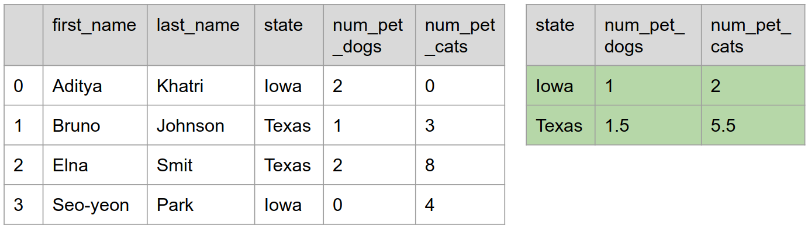

<!--
The `DataFrame` object has a method called `groupby()` that allows us to group
data by the column name or names passed to it. In this case we grouped by
'state' and then calculated the mean.

From the results we can see that Texas is the clear winner on 'pets per pet
owner'.

There are many other statistics that we can gather when grouping data in a
`DataFrame`. These include min, max, count, standard deviation, and more.
-->

---

# Grouping: Multiple Statistics

```python
df.groupby('Age').agg({
    'Height': 'mean',
    'Weight': ['max', 'min'],
})
```

<!--
In the example that we saw earlier we calculated the mean for every numeric
column in a `DataFrame`. Often you'll want different statistics for different
columns or even multiple statistics for some columns.

Here you can see that we are grouping by 'Age' and calculating different
statistics for the 'Height' and 'Weight' columns. We are doing this by passing a
dictionary of aggregation requests to the `agg()` function.
-->

---

# Merging

Combining two or more `DataFrame` objects

<!--
So far we have worked with individual `DataFrame` objects. Often the data that
we will work with will be stored in mulitple sources. In these cases it is often
useful to **merge** the data in order to process it.

In order to merge data a common **key** must exist between the `DataFrame`
objects to be merged. By default Pandas considers matching column names to be
matching keys.

Let's look at an example.
-->

---

# Merging

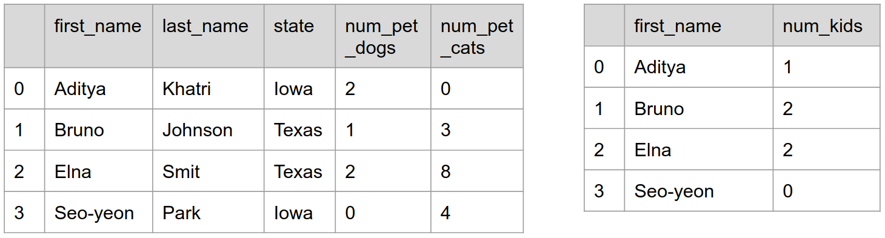

<!--
Here is an illustration of two `DataFrame` objects that we'd like to merge. One
contains the name, state, and pet data that we are familiar with. The other
contains first names and a count of the number of children that each person has.

You can see that 'first_name' is the common column between the two tables.

Let's see how Pandas would merge these tables.
-->

---

# Merging

```python
pd.merge(df1, df2)
```

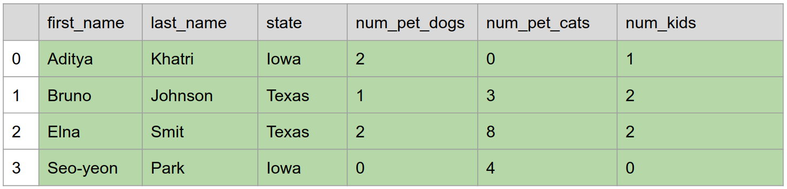

<!--
Here we can see the call to `merge()`. It accepts two `DataFrame` objects and
merges them on common column names. In this case, 'first_name'.
-->

---

# Merging

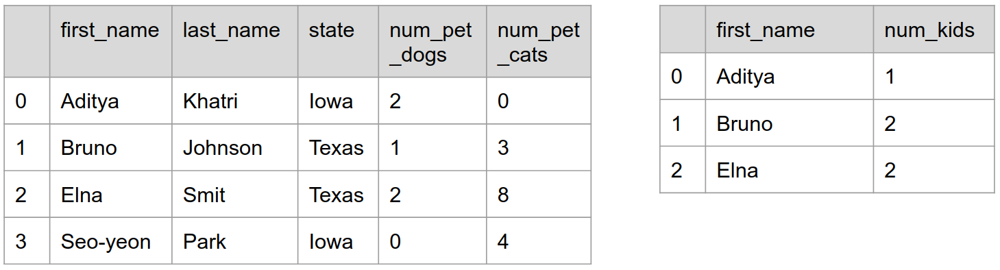

<!--
What about this case? We have four rows in one table and three in the other.
'Seo-yeon' is missing from the table that counts children. If you remember from
our prevous slide, Seo-yeon had a zero-count of children. It is common for rows
with zero values to be missing from tables.

Any guesses on what happens?
-->

---

# Merging

```python
pd.merge(df1, df2)
```

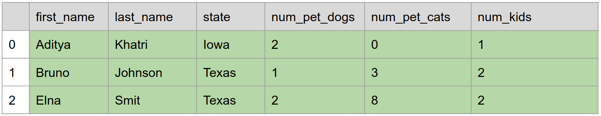

<!--
In this case we completely lost the record of Seo-yoen! Since Pandas couldn't
find a match it didn't include the datapoint.

This is standard join functionality. There are ways to get around this though.
-->

---

# Merging

```python
pd.merge(df1, df2, how='outer')
```

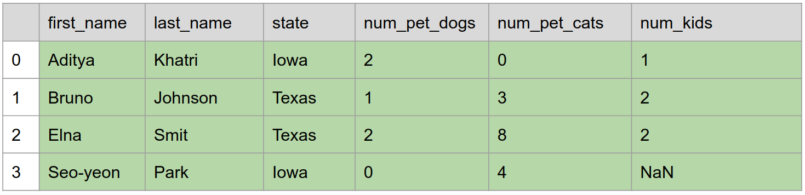

<!--
You can instruct Pandas to keep the data in one or both of the tables in a join.
This is called an outer join. There is a left-outer join that keeps unmatched
rows in the left table. There is a right-outer join that keeps unmatched rows in
the right table. And then there is the full outer join, which you see here, that
keeps unmatch rows found in both tables.

In any of the outer join cases, missing data is filled in with null values.
`NaN` for numbers. `None` for strings and other objects.
-->

---

# Sorting

Ordering the values in a `DataFrame`

<!--
Another way of modifying a `DataFrame` is to sort the data contained in it.
Sorting can be done in an ascending or descending manner. Sorting can be
performed on one or more columns.

Let's look at an example.
-->

---

# Sorting

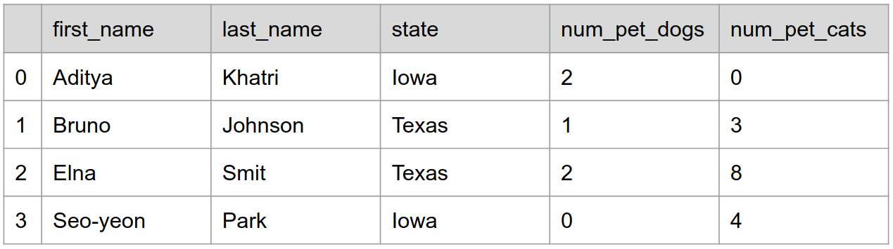

<!--
Again we have the name-state-pets table that we've seen in this presentation.
Let's say that we want to view that data sorted by the number of cats owned by
each person in ascending order.

How would we do that?
-->

---

# Sorting

```python
df.sort_values('num_pet_cats')
```

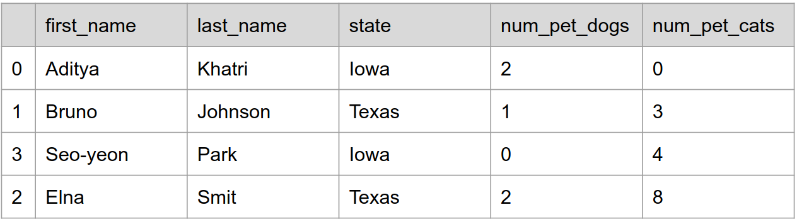

<!--
Here we can see the `sort_values()` method in use. We have asked to sort by the
'num_pet_cats' column. The default sort order is ascending.
-->

---

# Sorting: Multiple Columns

```python
df.sort_values(['num_pet_dogs', 'num_pet_cats'])
```

<!--
There are many other options for sorting. For instance, we can sort on multiple
columns as seen in this example. First the `DataFrame` will be sorted by the
number of pet dogs. The next level of sorting is by the number of pet cats.
-->

---

# Sorting: Modifying the `DataFrame`

```python
df = df.sort_values('num_pet_cats')

df.sort_values('num_pet_cats', inplace=True)
```

<!--
Also, sorting doesn't actually modify the `DataFrame`, but instead creates a
view into the `DataFrame`. If we actually want to modify the `DataFrame` we can
either assign the result of `sort_values()` back to the original `DataFrame` or
we can pass an `inplace=True` argument to `sort_values()`.
-->

---

# References vs Copies

```python
df = pd.DataFrame(...)
df2 = df # Reference
df2.sort_values('num_pet_cats', inplace=True)
```
<!--
When working with `DataFrame` objects it is often important to know when you are
working with a reference-to or copy-of the original `DataFrame`.

Take for instance this example. We create a new `DataFrame`, `df`, and then
store a reference to the orginal `DataFrame` in the variable `df2`. When we then
ask to sort `df2` and modify it in-place, we change the original `DataFrame`.
-->

---

# References vs Copies

```python
df = pd.DataFrame(...)
df2 = df.copy() # Copy
df2.sort_values('num_pet_cats', inplace=True)
```

<!--
If we want to leave the original `DataFrame` in-tact, we can make a copy of it
and then work with the copy. Be warned that this can be slow and
memory-intensive on large `DataFrame` objects.

Often you don't have to worry about if you are working with a reference or a
copy. Pandas strives to be efficient and will use references and views as much
as it can. Sometimes the abstractions break down and you need to know a little
more about what specific data you are working with.
-->
