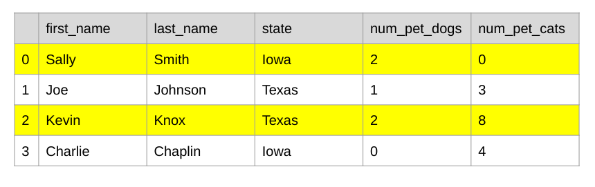
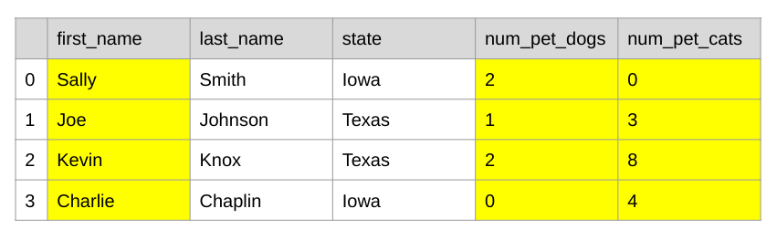
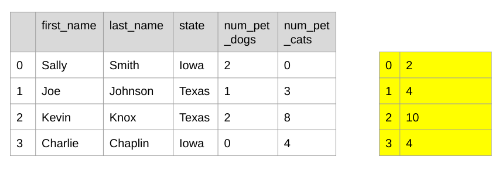
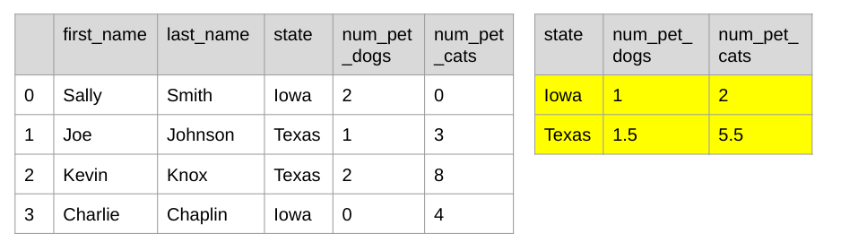
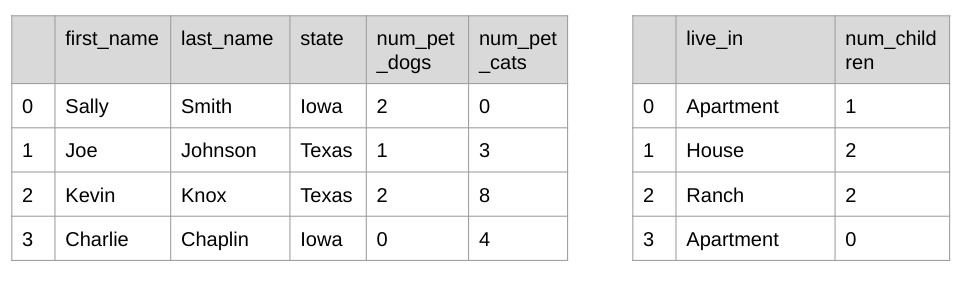
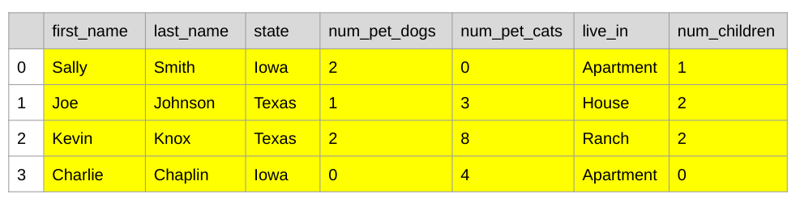

# Intermediate Pandas

---

# Manipulating Data

* Filtering
* Column Arithmetic
* Grouping
* Multiple DataFrame

<!--
* Now we are introduced to Pandas and familiar with reading data file, and working with DataFrame and Series.  Let’s discuss several Pandas features that are useful for manipulating data - which is a task you’ll be doing a lot of
* Filtering
  * Only include certain rows of data based on a conditional
  * Only include one or more columns.  
* Column Arithmetic
  * Great way to apply arithmetic to all values in particular column(s)
* Grouping
  * Grouping of rows for each values of a particular column
* Multiple DataFrame
  * At times we have data in multiple DataFrames, possibly from different datasets and we need to merge them before analyzing
-->

---

# Filtering: Row(s)

df[df.num_pet_dogs > 1]

<!--
An example of filtering rows with a conditional
In this case, filtering rows that have more than 1 pet dog
-->

---

# Filtering: Column(s)

df[[‘first_name’, ‘num_pet_dogs’, ‘num_pet_cats’]]

<!--
An example of filtering one or more columns in a DataFrame
Let’s say we don’t care about the column last_name or state, we could get a new DataFrame without the two columns
Tip: Notice the double square brackets for column filtering vs single square bracket for the row filtering
-->

---

# Column Arithmetic

df[‘num_pet_dogs’] + df[‘num_pet_cats’]

<!--
Column arithmetic allows arithmetic calculation on columns as if they are numbers
In this case, we are adding the number of pet dogs and number of pet cats to get the total number of pets for each rows
-->

---

# Grouping

df.groupby(‘state’).mean()

<!--
It is often useful to group data by a categorical value. For example, we might choose to group game console by makers, people data by gender or age, etc.
groupby() allows grouping of rows by the values of particular columns.  In this example:
* It’s grouping rows by the value of state column
* mean() is the combining function that is used.  The most common combining functions are sum, mean, and count.
* The values of num_pet_dogs and num_pet_cats are averaged for each state value
* Notice that non-numeric columns like first_name and last_name were dropped from the output
-->

---

# Merging

pd.merge(df1, df2, on=’key’)

---

# Merging

pd.merge(df1, df2, on=’key’)

---

# Your Turn

[Intermediate Pandas](https://colab.sandbox.google.com/drive/16hNv-i7DA-Z527Wr1bYx-HBng27H6HrS) {.big}
